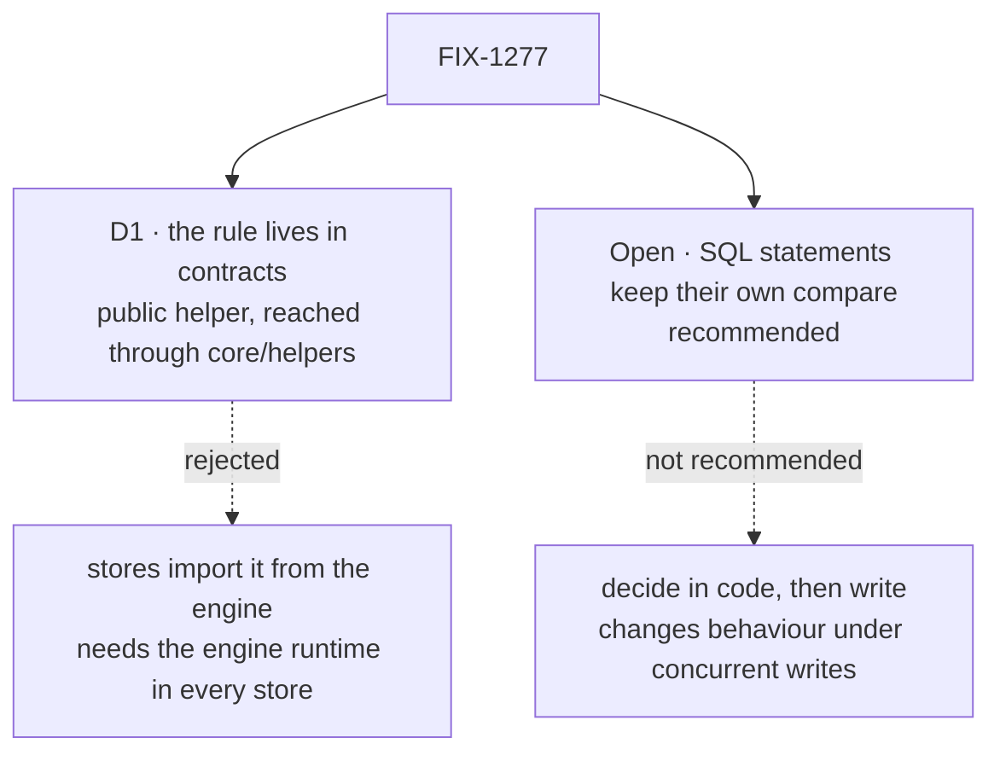

# FIX-1277 · Decisions

[Spec](SPEC.md) · **Decisions** · [Rules](BUSINESS-RULES.md) · [Plan](PLAN.md) · [Docs](DOCS.md)

What was considered, what was chosen, and what each choice locks in. One decision and one open
question are the sign-off surface.

## The tree

Solid edges are what you're signing. Dashed edges lost, and the label says why.

## D1 · The rule moves to `@flow-state-dev/contracts` and becomes a public helper there

| | |
|---|---|
| **Instead of** | Letting the two SQL stores import it from `@flow-state-dev/engine` at runtime |
| **Because** | The engine route loads the whole engine runtime into every store for four small functions. For `store-sqlite` it is also against a rule: the package-boundary check lets it import the engine for types only. `store-postgres` has no entry in that check yet and already value-imports the engine once (its in-memory trace store), so there the bar is intent, not a rule; FIX-1278 is adding the entry. Contracts is already under every store through core, has no dependencies, and the rule needs none (tenet 2: sharpen what exists, add nothing beside it) |
| **Locks in** | The rule is public API of a published package. Changing what it accepts becomes a contracts release, and an outside adapter that imported it gets the change on upgrade. `cloneValue` becomes a contracts export too; it is already public through `core/helpers`, so no new surface. The architect's fence for this desk leaned this way; this card records the call |

It comes down to what a store has to load: the engine route pulls its whole runtime into every store.

**What would change my mind:** the rule needing something contracts can't depend on, such as a
core type. It doesn't today. The one helper it uses, the deep copy, imports nothing and moves
with it ([Decided, not asked](#decided-not-asked)).

## Open · Should the SQL write statements keep their own compare?

**Keep the SQL compare, or move every decision into code?** · *recommended: keep it*

**In plain terms:** the Postgres and SQLite stores check the version and write the row in one
database statement. That is what makes the check safe when two writers race. Taking the check
out of the statement means reading the row, locking it, deciding in code, then writing. That
changes how a store behaves under concurrent writes, not only where the rule is written.

**The trade-off:** keeping it leaves one second copy, the compare inside each SQL statement.
Moving it removes that copy, but every SQL write then takes a lock and a transaction, and every
way of plugging in a connection must support them, including the raw connection a user can pass
the Postgres store today. Anyone running Postgres or SQLite under load would feel it.

**My recommendation:** keep it, and ship the smaller goal. The brief is behaviour-preserving, and
this is a behaviour change with its own cost to measure. The shared suite runs every case against
both SQL stores, so a drifted compare fails in CI for any case it covers.

**What would change my mind:** wanting a lock-based write path on its own merits, say for a
database with no conditional write. Then it is its own issue with its own concurrency spec.

**If I'm wrong:** the SQL compare drifts in a case the suite doesn't cover, and one store
resurrects a deleted resource or accepts a stale write: the bug class this issue exists to
prevent, confined to the compare.

![Open question: should the SQL write statements keep their own compare? Recommended: keep the compare in the statement. The other option: read, lock, decide in code, then write. It comes down to behaviour under concurrent writes: unchanged with the recommendation, changed with the other. The price is where drift can hide: the recommendation leaves the SQL compare as a second statement of the rule. Locks in the SQL compare as a restatement kept honest by the shared suite. Flips if a lock-based write path is wanted on its own merits](figures/open-sql-compare.svg)

It comes down to concurrent writes: moving the compare changes how every SQL write behaves.

## Decided, not asked

- **Which semantics win: none had to.** The [census](poc/copy-census/check.mjs) finds every
  copy identical. The one difference, the engine deep-copying a conflict's value, becomes what
  every store does. Nothing observable changes: the SQL stores build a conflict from a row parsed
  for that one query, so a copy of it is indistinguishable from the original.
- **The conflict report moves too**, not only the three guards the issue names: it restates the
  same "a deleted row reports no value" rule.
- **The deep copy moves with the builder.** `cloneValue` imports nothing, so it follows
  `deepEqual`, `mapLimit` and the string-case helpers from core into contracts, leaving a
  re-export shim in `core/helpers`. The builder copies, and the engine keeps no wrapper around it.
  The SQL stores pay one small clone on an already-failed write. (Round 1 of review: the earlier
  draft kept the copy in the engine on the belief that the helper couldn't move. It can.)
- **The in-code compare (`checkWriteVersion`) stays in the engine.** It has one copy already.
- **The version type moves with the rule**; the engine re-exports it and the row and conflict
  types under their current names.
- **Stores import through `@flow-state-dev/core/helpers`**, the path other contracts helpers
  take. No package gains a dependency.
- **One `patch` changeset** for contracts and core: a published package gains exports.

## Considered and dropped

| Alternative | Why not |
|---|---|
| Keep the three copies; rely on the conformance suite | The status quo. The suite catches only the cases it lists, and every edit still needs remembering three times |
| A new shared package for store helpers | A new package for four functions, when a zero-dependency layer already sits under every store |
| Generate the SQL compare from the shared rule | The two stores' SQL dialects and parameter styles differ, and SQL in contracts breaks what contracts is for. It would make the compare harder to read, not safer |

## Settled

- **The three copies have not drifted.** **CONFIRMED** by
  [`poc/copy-census/check.mjs`](poc/copy-census/check.mjs) on `origin/main` at `67a3bb9b3`: three
  defining files, all four roles identical after stripping comments; its control (a planted copy
  and a one-character drift) reports both.

## How it got here

- **Draft** — framed as removing duplication without changing behaviour; the rule moves to
  contracts and every store calls it; the compare inside the SQL statements stays, and whether it
  should is the one open question. One PR.
- **Review round 1** — the deep-copy helper turned out to have no imports, so it moves to
  contracts with the builder and the engine wrapper goes (the one change of approach). D1's
  reason corrected: the type-only rule binds `store-sqlite` only. The census is name-based, so its
  `--after` mode also probes for the guards' error text, and the Plan now says it complements the
  conformance suite rather than standing in for it. The open question is unchanged.
