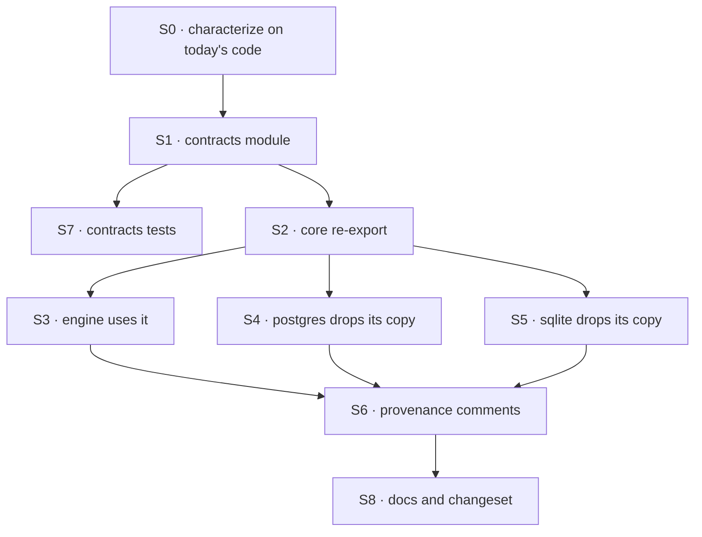

# FIX-1277 · Plan

[Spec](SPEC.md) · [Decisions](DECISIONS.md) · [Rules](BUSINESS-RULES.md) · **Plan** · [Docs](DOCS.md)

Written for the implementing agent. IDs cross-reference [BUSINESS-RULES.md](BUSINESS-RULES.md)
(BR-n) and [DECISIONS.md](DECISIONS.md) (D-n). Characterize first, then move: `tdd`'s red-green
loop, where the "red" is the census in `--after` mode and every behaviour test stays green
throughout. One PR.

## Surfaces

| ID | Package · role | Change | Rules |
|---|---|---|---|
| S0 | `engine` · resource-store conformance suite | **Add** a characterization case: every refused input on `set` and `delete` throws a `TypeError` whose message equals today's text exactly (not just `/expectedVersion/`). Land it green on the unmoved code first | BR-2 BR-3 |
| S1 | `contracts` · a new pure helper module beside `to-error`, and `cloneValue` moved in | The version type, a row type generic over its state, the conflict type, the numeric guard (module-private, as today), the `set` and `delete` guards, and the conflict builder **with** its deep copy. `cloneValue` moves from `core/helpers/clone.ts` unchanged, as `deepEqual` did. Both exported from the helpers barrel, not the root barrel (D1) | BR-1–BR-8 BR-10 |
| S2 | `core` · helpers | One-line re-export shims for the new module and for `clone.ts`, and the barrel entry, like `to-error` and `deep-equal` | BR-11 |
| S3 | `engine` · the resource-state predicate module | Keep `checkWriteVersion`; import the guards and the builder. No wrapper: the builder already copies. Re-export the moved types under their current names from the engine's store types and index | BR-6–BR-8 BR-12 |
| S4 | `store-postgres` · resource-state store | **Remove** the four local restatements; import from `core/helpers`. Its conflicts now carry a copy of a row parsed for that query, which no caller can tell apart. Rewrite the comments that justify the restatement (BP-034). SQL untouched | BR-9 BR-13 |
| S5 | `store-sqlite` · resource-state store | Same as S4 | BR-9 BR-13 |
| S6 | Provenance comments | The engine predicate header and `scope-write-predicate.ts`'s "mirrors how resource-state-predicate relates to its own two SQL copies" now describe one JS copy plus the SQL compare | — |
| S7 | `contracts` · tests | Unit tests for the guards and builder, moved or copied from the engine's predicate tests | BR-1–BR-7 |
| S8 | Docs · release | [DOCS.md](DOCS.md) operations; one `patch` changeset for `contracts` and `core` | — |

## Sequence

## Checks

| ID | Runs after | Passes when |
|---|---|---|
| V0 | S0 | The new case passes on all four stores **before** S1. Then change one message in one SQL copy locally and watch it fail on that store only; revert |
| V1 | S7 | Contracts unit tests pass |
| V2 | S3–S5 | `pnpm --filter @flow-state-dev/engine --filter @flow-state-dev/store-postgres --filter @flow-state-dev/store-sqlite test`: the full conformance suite, V0's case included, green on all four |
| V3 | S5 | `node specs/issues/FIX-1277/poc/copy-census/check.mjs --after` PASSES. It FAILS on `main` (three defining files): that is the control, and the PR shows both. V3 is **structural**: it finds definitions by name, plus the guards' error text (which the guardrails pin byte for byte, so a renamed copy of a guard still carries it). It does not prove the moved bodies behave the same or that the SQL compare matches; V0, V2 and V6 do. It complements them and replaces none |
| V4 | S2 | `node scripts/validate-package-boundaries.mjs` and `contracts-zero-dep.spec.ts` pass (BR-10 BR-11). The validator has no `store-postgres` entry until FIX-1278 lands, so for Postgres this is vacuous before then |
| V5 | S3 | `pnpm typecheck`; a scratch import of the three engine types still compiles (BR-12) |
| V6 | S5 | `git diff origin/main -- packages/store-postgres/src packages/store-sqlite/src \| grep -E '^[-+].*\b(SELECT\|INSERT\|UPDATE\|DELETE\|WHERE)\b'` prints nothing (BR-13) |

Second path (BP-035): V0 covers the early-answer delete paths (key never existed, already
deleted), which is where a guard moved behind the version check would silently stop running.

## Pinned names

| Where | Name | Why pinned |
|---|---|---|
| Guards and builder | `assertSetExpectedVersion`, `assertDeleteExpectedVersion`, `resourceStateConflict` | The names the issue and the census use; the census's `--after` mode looks for them |
| Import path in the stores | `@flow-state-dev/core/helpers` | D1; the existing path for contracts helpers |

The module's file name, and the generic row type's name, are yours.

## Guardrails

| Rule | Because |
|---|---|
| Characterize before moving (S0 before S1) | A refactor's evidence is a test that was green on the old code; one written after the move describes the new code |
| Error class and message text unchanged, byte for byte | A caller may match on them. Behaviour-preserving means exactly that |
| No SQL line changes | The open question decides that separately; a "small tidy" of a `WHERE` clause is the one change here that can lose a write |
| The guard still runs before `delete`'s early answers | That ordering is what keeps `-1` from ever reaching the SQL stores' "any" marker (BR-4 BR-5) |
| Contracts imports nothing, and gains nothing beyond the rule and the moved `cloneValue` | Zero dependencies and a lean home are what contracts is for; `cloneValue` is moved, not written (tenet 2) |

## Docs

Publish [DOCS.md](DOCS.md)'s one README operation with S8. No site page changes.

## Sketch

None: the change is a move along an existing path.

**POC:** [`poc/copy-census/`](poc/copy-census/check.mjs) re-derives the factual base: it scans
every source file under `packages/*/src` for a definition of the guards or the conflict report
(totality), and compares the copies' bodies. It showed three defining files and no drift; the
premise held. Its `--control` run plants an unlisted copy and a one-character drift and reports
both. Its `--after` mode is V3.

## At implement time

- **FIX-1278** is adding `store-postgres` to the package-boundary validator, with an explained
  allowance for the engine value import `store-postgres` already has (its in-memory trace store).
  It implements first. Check its rule for `store-postgres` before S4: a value import of
  `core/helpers` must be allowed, as it is for `store-sqlite`, and this change adds no engine
  value import for that allowance to cover.
- **FIX-1428**'s merged spec puts its shared helper in `contracts/helpers` with a `core/helpers`
  re-export. This change follows the same placement.
- Re-run the census without `--after` on fresh `main` before starting. A new copy since
  `67a3bb9b3` shows up as an unlisted definition.

## Follow-ups

- **Unfiled:** the scope-store side (`checkScopeWriteVersion` and the stores' delta guard) has the
  same shape. The issue names it a follow-up. Not filed from this spec's sessions (no Linear
  writes); the coordinator owes filing it before this spec merges, so it does not stay a note.

## Notes from review

Recorded verbatim for the implementer to weigh against real code. Not folded into the design.

- **jhoffner review, finding 4** (review round 1): "Since a new contracts module is being created
  anyway, ask the implementer to name it by the concept (write-version rule) rather than
  "resource-state", and put `ExpectedVersion` there, so the scope-side can join it without a
  rename."
- **jhoffner review, finding 5** (review round 1): "The guard's doc comment in contracts should
  say that two SQL stores depend on its refusal of `-1`, otherwise the "edit one place"
  promise quietly breaks the SQL side. Conformance covers it (BR-5), so this is a comment, not a
  design change."
- **Cursor review, point 3** (review round 1): "Eight plan surfaces, three SVGs, and mermaid in
  DECISIONS all say the same thing for a ~4-function move. Fine for sign-off; the implementer can
  treat S6/S8 and the figures as foldable. The pinned commit in DECISIONS "Settled" will
  stale — PLAN already says re-run on fresh `main` before S1; that's enough."
