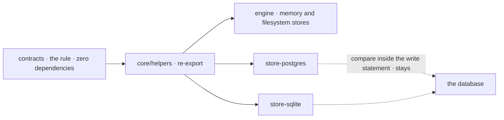

# FIX-1277 · Resource-store version-check predicate is reimplemented in three packages

**Spec** · [Decisions](DECISIONS.md) · [Rules](BUSINESS-RULES.md) · [Plan](PLAN.md) · [Docs](DOCS.md)

Improvement (behaviour-preserving refactor) · `contracts` + `core` + `engine` + `store-postgres` + `store-sqlite` · small · 1 PR · no epic (surfaced by [FIX-1157](https://linear.app/fixpoint-labs/issue/FIX-1157)'s review)

## Four people, before and after

| Someone who… | Today | After |
|---|---|---|
| **changes the rule for which resource writes a store accepts** | Edits three copies of it, in three packages, from memory | Edits one. Every store picks it up |
| **edits one copy and forgets the others** | Nothing fails at build. The shared test suite catches it only if one of its cases happens to cover the change | There is no second copy to forget. A check fails if one reappears |
| **runs an app on memory, filesystem, Postgres or SQLite storage** | A bad version is refused with a `TypeError`; a lost race returns a conflict | Exactly the same, down to the error text |
| **writes their own store adapter** | Copies the rule out of the engine's source | Imports it from the shared helpers |

The rule decides whether a write may land: does the key exist, is it a deleted-but-remembered
row, does the version match. It is what stops a deleted resource coming back. Today the SQL
adapters can't import it, so they restate it, and three copies agree only because someone kept
them in step. The [census](poc/copy-census/check.mjs) shows they still agree today.

## The goal, and how we'll know it's met

**The version-check rule outside the database statements has exactly one implementation, and
every store (memory, filesystem, Postgres, SQLite) calls it with no change anyone can observe.**

| Is it the right goal? | |
|---|---|
| **The real need** | "exactly one implementation that every adapter calls, with no adapter restating the logic in its own language (including SQL)" ([FIX-1277](https://linear.app/fixpoint-labs/issue/FIX-1277)) |
| **Smaller, and shipping** | Everything except the compare *inside* each SQL write statement. That compare has to stay in the statement to stay atomic, so it stays a restatement, pinned by the shared suite. This is [the open question](DECISIONS.md#open), and it is the hardest sign-off line |
| **Smaller, and rejected** | Keep the copies and lean on the shared suite. The suite only catches the cases it lists, and every edit still needs remembering three times |
| **Bigger, and not this issue's** | The same duplication on the scope-store side. The issue names it a follow-up |
| **Not done if** | An in-code copy survives in any package · an error's class or text changes on any store · `@flow-state-dev/engine` stops exporting the row, conflict or version types · the suite is green but never ran against Postgres or SQLite |

**What ships:** one in-code implementation of the guards and the conflict report. The compare
inside each SQL write statement is not part of it and stays as it is.

**No goal check applies:** this is a behaviour-preserving refactor, so there is no new outcome
for a goal check to observe. Three things prove it instead. The resource-store conformance suite
passes on all four stores before and after. A new characterization case pins the error class and
exact text for every refused version on all four, and it passes on `main` *before* the move. The
[census](poc/copy-census/check.mjs) passes in `--after` mode, and it fails on today's `main`
(three defining files). That failure is the control. The census finds copies by name and by the
guards' error text, so it proves structure, not behaviour; the suite proves behaviour.

## What changes


Read the columns. The three copies on the left become the one box in contracts on the right. The
SQL compare, bottom right, is the one piece that stays put.

Nothing a flow author writes changes. An author of a custom adapter can now write:

```diff
- // copied from the engine's resource-state-predicate, keep in step
- const assertSetExpectedVersion = (v) => { /* … */ };
+ import { assertSetExpectedVersion, resourceStateConflict } from "@flow-state-dev/core/helpers";
```

## How the stores reach it



Contracts already sits under every store, through core. The stores reach it by the same path
they use for other shared helpers, so no package gains a dependency.

## What stays as it is

- **Every write's outcome.** Same accepts, same conflicts, same errors and messages. No drift was
  found, so no copy's meaning had to win over another's.
- **The SQL statements.** Not one line of SQL changes.
- **The engine's public types.** `ExpectedVersion`, `ResourceStateRow` and
  `ResourceStateConflict` still import from `@flow-state-dev/engine`.
- **The scope stores' own version rule.** Out of scope; a follow-up.

## Sign off

**[The goal](#the-goal-and-how-well-know-its-met), at the smaller size:** one implementation of
the rule everywhere except inside the SQL write statements. If wrong: the SQL compare can still
drift, and only a conformance case that covers the change will catch it.

1. **[D1](DECISIONS.md#d1) · The rule moves to `@flow-state-dev/contracts`, the zero-dependency
   layer, and becomes a public helper there.** If wrong: changing the rule becomes a release of a
   published package, and outside adapters may already depend on it.

**Open: one** — [should the SQL write statements keep their own compare?](DECISIONS.md#open) I
recommend yes. The full reasoning and what lost: [DECISIONS.md](DECISIONS.md). The cases:
[BUSINESS-RULES.md](BUSINESS-RULES.md).
