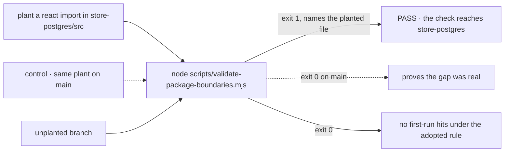

# FIX-1278 · Package-boundary validator does not cover store-postgres

**Spec** · [Decisions](DECISIONS.md) · [Rules](BUSINESS-RULES.md) · [Plan](PLAN.md) · [Docs](DOCS.md)

Improvement · tooling · `scripts/` plus source comments · tiny · 1 PR · no epic · sibling
of [FIX-1277](https://linear.app/fixpoint-labs/issue/FIX-1277) (independent, sequenced) ·
surfaced by [FIX-1157](https://linear.app/fixpoint-labs/issue/FIX-1157)

| Someone who… | Today | After |
|---|---|---|
| **adds a `@flow-state-dev/react` or `client` import to `store-postgres`** | `pnpm typecheck` passes and it ships | `pnpm typecheck` fails and names the file |
| **adds the same import to `store-sqlite`** | Fails, as it should | Unchanged |
| **creates an import cycle through `store-postgres` among packages the script checks** | Nothing reports it | The cycle check reports it. A cycle through a package the script doesn't list (`scheduled`, `vercel`) still goes unreported, as it does for `store-sqlite` |
| **reads the boundary script to learn what a store adapter may import** | Finds `store-sqlite`'s rule and nothing for Postgres | Finds both rules, and a comment saying why they differ on one point |
| **reads the code comments that say store adapters only type-import the engine** | Reads a claim that is false for Postgres and that nothing checks | Reads a claim that matches the script |
| **uses `store-postgres` at runtime** | Today's behaviour | Today's behaviour. No source line changes except comments |

## The goal, and how we'll know it's met

**A layering mistake in `store-postgres` fails `pnpm typecheck` exactly as the same mistake in
`store-sqlite` does. Where the two adapters' rules differ, the script says so and gives the
reason.**

- **The real need**, in the issue's words: "An asymmetric guard means one adapter is checked
  and the other is trusted, with nothing marking which is which." The outcome it asks for is
  parity, "or the asymmetry is explained, if there turns out to be a real reason for it."
- **Smaller, and rejected:** add `store-postgres` to the package list only. Every forbidden
  import would then crash the script on a missing rule instead of reporting it.
- **Not done if:** the script passes because it never reads `store-postgres` (the silent
  no-op a mistyped package key produces), or because the rule allows everything.



The check plants a bad import and watches the validator reject it, so a rule that never runs
cannot pass. On `main` the same plant passes, which is the gap. Commands:
[PLAN.md → Checks](PLAN.md#checks).

## What we found on first run

Mirroring `store-sqlite`'s rule word for word gives **two hits**. Both come from the one clause
that differs in practice: `store-sqlite` may only *type*-import the engine.

| File | What it value-imports from `@flow-state-dev/engine` |
|---|---|
| `store-postgres/src/index.ts` | `createInMemoryTraceStore`: Postgres has no trace store of its own |
| `store-postgres/src/request-store.ts` | Eight live-tail helpers, including `StoreSubscriptionError`, which it throws to callers |

These aren't accidents. `store-postgres` has always depended on engine runtime code. Making it
type-only would mean copying a whole trace store and the live-tail helpers into the package.
It would also change behaviour: the error callers catch would stop being an engine
`StoreSubscriptionError`. That is out of this issue's scope, and it runs against FIX-1277,
which is removing copies like these. So the spec takes the issue's second branch. Postgres
gets its own rule, which allows engine runtime imports, and the script explains the difference
([D1](DECISIONS.md#d1)). Under that rule the first run is clean. No source file needs to move.

## What changes

```diff
 // scripts/validate-package-boundaries.mjs
-const packages = [..., "store-sqlite", "orchestration", ...];
+const packages = [..., "store-sqlite", "store-postgres", "orchestration", ...];

   contracts: {
-    deny: new Set([..., "cli", "store-sqlite"])
+    deny: new Set([..., "cli", "store-sqlite", "store-postgres"])
   },
+  // Same layer as store-sqlite, minus one constraint: store-postgres value-imports
+  // engine runtime (its trace store and live-tail helpers). <why, one or two lines>
+  "store-postgres": {
+    allow: new Set(["contracts", "core", "engine"]),
+    typeOnly: new Set([]),
+    deny: new Set(["client", "react"])
+  },
```

Every comment that says Postgres can't import the engine stops saying so. There are eight
([PLAN → S2](PLAN.md#surface) lists them). Comments about SQLite alone stay as they are.

## What stays as it is

Every runtime line in `store-postgres`, `store-sqlite`'s rule, and the rest of the script.
The script still ignores `@flow-state-dev/scheduled` for both adapters, since `scheduled` isn't
in its package list. For the same reason the cycle check can't see a cycle that passes through
`scheduled` or `vercel`. `store-postgres` imports `scheduled`, so a `scheduled` → `store-postgres`
import would be a real cycle that nothing reports. That's parity, and widening the list is
outside this issue. FIX-1277's
predicate work also stays out.

## Sign off

**The goal, at that size.** If wrong: we certify parity when you wanted Postgres held to the
stricter SQLite rule. That is a separate refactor with a behaviour change ([D1](DECISIONS.md#d1)).

- **D1 · Postgres's rule allows engine runtime imports, and the script says why.** This is the
  one to weigh. If wrong: a runtime-coupling change in Postgres goes unflagged while the same
  change in SQLite fails.

**Open: none.** The engineering calls are in [DECISIONS.md](DECISIONS.md#engineering-calls).
