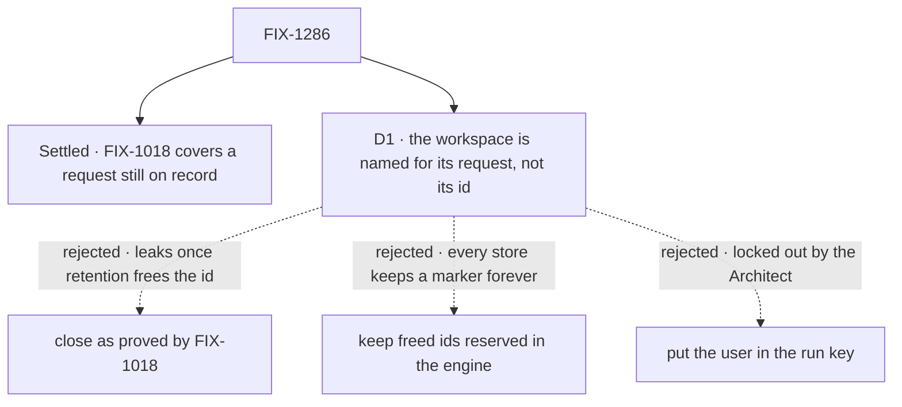

# FIX-1286 · Decisions

[Spec](SPEC.md) · **Decisions** · [Rules](BUSINESS-RULES.md) · [Plan](PLAN.md) · [Docs](DOCS.md) · [Evolution](EVOLUTION.md)

One decision is the sign-off. It exists because the premise the epic and the Architect relied on
held for half the cases and not the other half, and the POC shows which.

## The tree

Solid edges are what you're signing. Dashed edges lost, and the label says why.

## D1 · A run workspace belongs to one request, not to its id: it is named for when its request began

| | |
|---|---|
| **Instead of** | Closing as proved by FIX-1018, with a test only (the Architect's call and the epic's [D3](../../epics/FIX-1635/DECISIONS.md#d3)) · or keeping an id reserved to its first owner after retention deletes its record, in the engine |
| **Because** | FIX-1018 binds an id to the owner of the record that holds it. Retention deletes records; the workspace directory outlives them. The [POC](PLAN.md#sketch-and-poc) ran it over HTTP: with the record gone, Bob ran under Alice's id and read her file. The request's start time is already the engine's test for "the same request" (`isSameRequest`), it is written once when a request is first recorded, and every block in one request shares it (tenet 2: sharpen the key, add no concept) |
| **Locks in** | A request handle that says when its request began, public from this release. Every run-scoped workspace directory is renamed once on upgrade, so a request in flight at deploy loses its scratch files. Anything later keyed on a request id owes the same rule, or reopens this hole: a guardrail, not a mechanism |

It comes down to an id retention freed: FIX-1018 alone hands Bob Alice's files.

**What would change my mind:** the engine starting to reserve freed ids for its own reasons. Then
every request-keyed store is covered once, and the rename here buys nothing.

**If wrong:** one public field and a one-time rename we didn't need. The other way, a same-tenant
file leak ships in the release.

## Decided, not asked

- **The request's start time, not the user.** It keeps `run` meaning one request, and it also
  closes a user's own reuse of a freed id, which the model is already told cannot happen.
- **The rule lives once, in the workspace package's scope identity**, which both the bash tool
  and projections read. The tool gains no request logic of its own.
- **Leftover directories are not deleted.** Unreachable is enough for ER-4; deleting another
  request's files at acquire is a destructive path with no second benefit. Disk cleanup is a
  follow-up.
- **The tool-result cache's `run` scope needs nothing.** Its store lives on the request handle
  in memory and dies with the execution.
- **An absent start time is its own key component**, never an empty string, so a context
  without one can't meet a context with one.
- **The HTTP case asks both legs**, live and evicted, in the shared suite, as Bob.

## Considered and dropped

| Alternative | Why not |
|---|---|
| Close as proved by FIX-1018 | The POC's evicted run leaks. ER-4 says never |
| Reserve freed ids in the engine | Covers every request-keyed store at once, and is the substrate answer. It needs a marker per deleted request in every store adapter, kept forever, hidden from listings, and a memory store still loses it on restart while the directory stays on disk. A store-wide change inside a hard-gates epic (ER-15) |
| Put the user in the run key | The Architect locked it out: it redefines `run`. It also leaves a user's own freed id carrying old files over |
| Delete the directory when the request finishes | Cleanup runs only where the app wires it, and a crash skips it. The directory is still there for the next caller |
| Document request ids as secrets | The epic already rejected it: ids leak in headers, URLs and logs |

## Settled

- **FIX-1018 alone keeps two users apart while the first request is on record** —
  **CONFIRMED** over HTTP on FIX-1018's head `71f036a03`: Bob got `req_ec1922…` and an empty
  workspace. ([POC](poc/workspace-outlives-record/README.md))
- **FIX-1018 alone keeps them apart after retention deletes the record** — **REFUTED** on the
  same head: Bob ran under Alice's id and printed her note; his replay carried none of her
  items. D1 exists because of this.

## How it got here

- **Draft** — framed as ER-4 on top of FIX-1018's binding; a POC confirmed the binding for live
  records and refuted it for deleted ones; the run workspace is named for its request's start.
  One PR.

**Open: none.**
