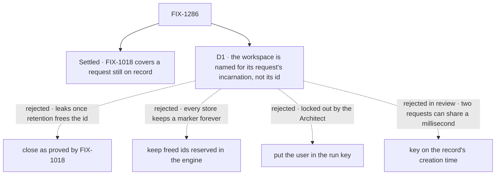

# FIX-1286 · Decisions

[Spec](SPEC.md) · **Decisions** · [Rules](BUSINESS-RULES.md) · [Plan](PLAN.md) · [Docs](DOCS.md) · [Evolution](EVOLUTION.md)

One decision is the sign-off. It exists because the premise the epic and the Architect relied on
held for half the cases and not the other half, and the POC shows which.

## The tree

Solid edges are what you're signing. Dashed edges lost, and the label says why.

## D1 · A run workspace belongs to one request, not to its id: it is named for its request's incarnation

| | |
|---|---|
| **Instead of** | Closing as proved by FIX-1018, with a test only (the Architect's call and the epic's [D3](../../epics/FIX-1635/DECISIONS.md#d3)) · or keeping an id reserved to its first owner after retention deletes its record, in the engine |
| **Because** | FIX-1018 binds an id to the owner of the record that holds it. Retention deletes records; the workspace directory outlives them. The [POC](PLAN.md#sketch-and-poc) ran it over HTTP: with the record gone, Bob ran under Alice's id and read her file. A request's incarnation, a random token stamped once when its record is first created, tells two requests under one id apart where no timestamp can, and every block in one request shares it (tenet 2: sharpen the key, add no concept) |
| **Locks in** | A request handle that exposes its incarnation, public from this release. Every run-scoped workspace directory is renamed once on upgrade, so a request in flight at deploy loses its scratch files. Anything later keyed on a request id owes the same rule, or reopens this hole: a guardrail, not a mechanism |

It comes down to an id retention freed: FIX-1018 alone hands Bob Alice's files.

**What would change my mind:** the engine starting to reserve freed ids for its own reasons. Then
every request-keyed store is covered once, and the rename here buys nothing.

**If wrong:** one public field and a one-time rename we didn't need. The other way, a same-tenant
file leak ships in the release.

## Decided, not asked

- **A random token, not the creation time.** `createdAt` has millisecond resolution; an id
  recreated within one millisecond would share a workspace. The token is stamped at the
  record's first creation and never rewritten.
- **Records written before the token existed** derive one from their `createdAt` (BP-030),
  under a prefix no stamped token uses, so a resume across the upgrade keeps its identity.
- **The field is public.** The workspace, bash tool and Claude Code packages each read the block
  context; a hidden property would be an undeclared contract between them, and an app keying
  its own state on a request id needs the same answer.
- **`isSameRequest` compares the token too**, when both records carry one, else `createdAt`: one
  notion of "the same request" across engine and workspace.
- **No user in the `run` key.** `run` keeps meaning one request, and a user's own freed id
  starts empty too.
- **The rule lives once, in the workspace scope identity.** The Claude Code mounts key on
  session, user and org collections and are unchanged.
- **Leftover directories are not deleted.** Unreachable is enough for ER-4; deleting another
  request's files at acquire is a destructive path with no second benefit.
- **An absent token is its own key component**, never an empty string.
- **The HTTP case asks both legs**, and the evicted leg deletes the record through real session
  retention over HTTP.

## Considered and dropped

| Alternative | Why not |
|---|---|
| Close as proved by FIX-1018 | The POC's evicted run leaks. ER-4 says never |
| Reserve freed ids in the engine | Covers every request-keyed store at once, and is the substrate answer. It needs a marker per deleted request in every store adapter, kept forever and hidden from listings, and a memory store still loses it on restart while the directory stays on disk. A store-wide change inside a hard-gates epic (ER-15) |
| Put the user in the run key | The Architect locked it out: it redefines `run`. It also leaves a user's own freed id carrying old files over |
| Key on the record's creation time | The first draft. Dropped in review round 1: two requests can share a millisecond |
| Delete the directory when the request finishes | Cleanup runs only where the app wires it, and a crash skips it |
| Document request ids as secrets | The epic already rejected it: ids leak in headers, URLs and logs |

## Settled

- **FIX-1018 alone keeps two users apart while the first request is on record** —
  **CONFIRMED** over HTTP on FIX-1018's head `71f036a03`: Bob got his own id and an empty
  workspace. ([POC](poc/workspace-outlives-record/README.md))
- **FIX-1018 alone keeps them apart after retention deletes the record** — **REFUTED** on the
  same head, re-run in round 1 with eviction polled rather than slept on: Bob ran under Alice's
  id and printed her note. D1 exists because of this.

## How it got here

- **Draft** — framed as ER-4 on top of FIX-1018's binding; a POC confirmed the binding for live
  records and refuted it for deleted ones; the run workspace is named for its request. One PR.
- **Review round 1** — D1's mechanism moved from the record's creation time to a random
  incarnation token, because a Codex review showed two requests can share a millisecond. The
  same-owner creation race became a required check, and the goal was pinned to the bash run
  workspace after checking every other request-keyed store.

**Open: none.**
