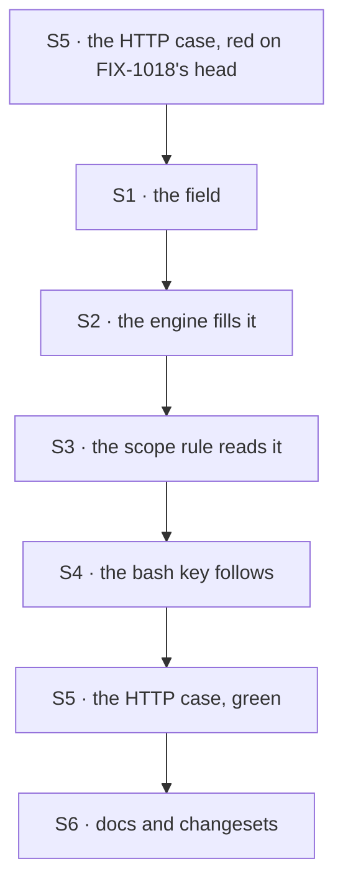

# FIX-1286 · Plan

[Spec](SPEC.md) · [Decisions](DECISIONS.md) · [Rules](BUSINESS-RULES.md) · **Plan** · [Docs](DOCS.md) · [Evolution](EVOLUTION.md)

Written for the implementing agent. IDs cross-reference [BUSINESS-RULES.md](BUSINESS-RULES.md)
(BR-n), [DECISIONS.md](DECISIONS.md) (D-n) and the epic's rules (ER-n). `tdd`. One PR, on top of
FIX-1018 (#2377) once it merges; do not start before.

## Surfaces

| ID | Package · role | Change | Rules |
|---|---|---|---|
| S1 | `core` · the request scope handle type | Add the request's start time, epoch ms, documented as "when this request was first recorded; one request, one value for its whole life" (D1) | BR-8 |
| S2 | `engine` · where the execution context builds the request handle | Fill S1 from the record the context claimed or adopted. Never from `Date.now()` at handle construction | BR-5 BR-8 BR-9 |
| S3 | `workspace` · scope identity (`principalFromContext`, the `request` branch of `scopeComponents`) | Read S1 into the scope principal; the `request` scope's components become tenant, id, start time. Absent is framed as absent (BR-12). Other scopes untouched | BR-2 BR-3 BR-6 BR-10 BR-11 BR-12 |
| S4 | `tools` · the bash tool's scope key | No logic change: it already derives the key and directory from S3. Update its `run` path comment and the doc'd layout | BR-2 BR-7 |
| S5 | `integration-tests` · the shared two-users-one-tenant suite | Add `@flow-state-dev/tools` as a dependency; add this issue's case: live and evicted legs, as Bob, over HTTP | BR-1 BR-2 BR-5 |
| S6 | Docs and changesets | Per [DOCS.md](DOCS.md). Changesets: `core` minor (the new field), `engine`, `workspace`, `tools` patch; the `tools` one names the one-time rename of run directories (BR-13) | BR-13 |

Nothing is removed. The run key's tenant and id components stay; D1 adds one.

## Sequence



Write the evicted leg first and watch it fail; the POC already shows the shape.

## Checks

| ID | Runs after | Passes when |
|---|---|---|
| V1 | S2 | Engine unit: the handle's start time equals the stored record's on a fresh request, on a retry of a record on file, on the queued path's adopted stub, and on a resume in a new context (BR-5, BR-8, BR-9). Two requests under one id, the first deleted in between, carry different values |
| V2 | S3 | Workspace unit: same tenant and id with two start times give two keys and two directories; the same start time gives one; absent never equals present (BR-3, BR-6, BR-12). `session`, `user`, `org` keys byte-identical to today (BR-11) |
| V3 | S4 | The existing `bash-workspace-scope` tests stay green, including siblings sharing and tenants separating (BR-7, BR-10) |
| V4 | S5 | [The goal](SPEC.md#the-goal-and-how-well-know-its-met): `run-workspace.test.ts` passes both legs. The evicted leg FAILED on FIX-1018's head and the live leg FAILED on `main` before FIX-1018; the PR names both commits (ER-16) |
| V5 | S6 | Docs build; the new field appears in the core type docs |

## Pinned names

| Where | Name | Why pinned |
|---|---|---|
| The request handle | `ctx.request.createdAt` | Public. Matches the record field it mirrors, which `isSameRequest` already treats as the request's identity |
| The HTTP case | `packages/integration-tests/src/two-users-one-tenant/run-workspace.test.ts` | The closure runs the suite by location (ER-19) |

Everything else is yours.

## Guardrails

| Rule | Because |
|---|---|
| The request-scope rule changes in one place, the workspace scope identity (tenet 5) | The bash key and projections both read it; a second derivation is how the tenant bug happened once already |
| The start time comes from the stored record, never a fresh clock read | A resume or a retry that re-stamps it opens a new, empty workspace mid-request |
| No user or org in the `run` key | The Architect's call on `run`'s meaning stands; D1 changes only what "one request" means once its id is freed |
| Nothing in the case imports `src`, a store or a workspace helper (ER-16, anti-game) | The closure runs it against installed tarballs |
| Anything newly keyed on a request id keys on the start time too | D1 closes this store, not the class. Say so in the field's doc comment |

## Docs

Reconcile and publish [DOCS.md](DOCS.md) after V4 passes. Two updates, no new page.

## Sketch and POC

```
workspace scope identity, request branch:
    components = [tenant, request id, request start time]   ← the whole change
    absent start time → an absent component, framed
engine, building the request handle:
    start time ← the record this context claimed or adopted
```

**POC:** [`poc/workspace-outlives-record/`](poc/workspace-outlives-record/README.md), on FIX-1018's
head `71f036a03`. Live leg: Bob got his own id and no file; the premise held. Evicted leg: Bob
ran under Alice's id and printed her note; the premise failed, and D1 follows from it.

## At implement time

- Rebase on `main` after #2377 merges and re-run the POC there first. If the evicted leg no
  longer leaks, stop and surface it: D1's reason is gone.
- FIX-1634 extends the queued path that writes the enqueue-time record. Its adoption must keep
  that record's start time; V1's queued-path check is where a clash would show.
- FIX-1018's same-owner race hand-off overwrites a record with the later writer's. Confirm which
  start time the winning context reads, and that both racers end in one directory.

## Follow-ups

- Run directories are never deleted. A sweep of unreachable ones is a follow-up, not ER-4.
- The trace store keys on the request id and has its own retention. Whether a freed id reaches
  another user's traces is FIX-1018's class; flag it there, not here.
