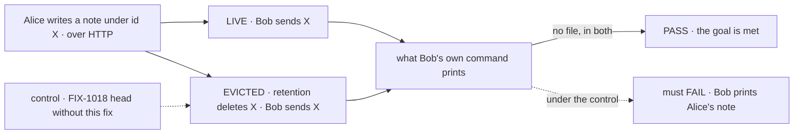

# FIX-1286 · A run-scoped workspace is keyed on a caller-supplied requestId with no authenticated principal, so two users in one tenant can share a sandbox

**Spec** · [Decisions](DECISIONS.md) · [Rules](BUSINESS-RULES.md) · [Plan](PLAN.md) · [Docs](DOCS.md) · [Evolution](EVOLUTION.md)

Improvement · `core` + `engine` + `workspace` + `tools` · small · 1 PR · epic
[FIX-1635](../../epics/FIX-1635/SPEC.md) · implements after
[FIX-1018](https://linear.app/fixpoint-labs/issue/FIX-1018) (#2377) merges

## Four people, before and after

| Someone who… | Today (with FIX-1018) | After |
|---|---|---|
| **reuses another user's request id while that request is on record** | Gets their own request and an empty workspace. FIX-1018 already delivers this | Unchanged, now proved by its own HTTP case |
| **reuses another user's request id after retention deleted that request** | Runs under that id and reads the first user's files: the record is gone, the workspace directory is not | Gets an empty workspace. A request id names one request, and that request is over |
| **reuses their own id after it was deleted** | Picks up the old request's leftover files | Starts empty. The tool already tells the model a `run` workspace "does not carry over to the next request" |
| **retries or resumes a request that is still on record** | The same workspace | The same workspace |

A run workspace is the bash tool's `scope: "run"` directory on the local provider: one per
request, shared by that request's blocks, meant to vanish from reach when it ends.

## The goal, and how we'll know it's met

**Two users in one tenant who send the same request id never reach each other's run workspace,
whether the first user's request is still on record or has already been deleted.**

| Is it the right goal? | |
|---|---|
| **The real need** | [ER-4](../../epics/FIX-1635/BUSINESS-RULES.md#what-a-team-gets-and-what-it-doesnt): "Two users in one tenant with the same request id never share a run-scoped workspace or its resources." The issue's own done-when asks for the same, proved by a test that fails if the binding is removed |
| **Smaller, and rejected** | "Close as proved by FIX-1018." The [POC](PLAN.md#sketch-and-poc) shows that holds only while the first request's record exists. Retention deletes records routinely, and then the id is anyone's |
| **Bigger, and not this issue's** | Every request-keyed store surviving its record (traces, anything future). One is found today, this one; the rule for the rest is a guardrail, not a sweep. Session-keyed sandboxes are FIX-1022's |
| **Not done if** | The case runs only while the record exists · it calls the workspace helpers instead of HTTP · it checks Alice's output instead of Bob's · the evicted case never failed on FIX-1018's head |



The check reads what Bob's command printed, tagged so Alice's own items can't pass for it. The
evicted leg must fail on FIX-1018's head, which the POC already recorded.

| How we verify | |
|---|---|
| **Goal check** | The two-users-one-tenant HTTP suite, this issue's case ([ER-16](../../epics/FIX-1635/BUSINESS-RULES.md#what-no-child-may-do)): `packages/integration-tests/src/two-users-one-tenant/run-workspace.test.ts` · no model · run by the implementer, then by the closure against installed tarballs |
| **Signal** | Bob's run prints `NO_FILE` in both legs, and Alice's note is intact afterwards |
| **Input** | Alice's id as her 202 hands it out. Deleting the record through retention, or by any other writer, must pass too |
| **Anti-game** | No store call, no workspace helper, no mocked context. A check on key strings passes while the directory still leaks |
| **Control that must fail** | The evicted leg on FIX-1018's head (recorded by the POC, commit `71f036a03`), and the live leg on `main` before FIX-1018 merges. The PR names both commits |

## What changes


Same id, two requests. The top row is today once Alice's record is gone; the bottom is the
workspace named for the request rather than for its id.

Nothing an app writes changes. One field becomes readable on the request handle:

```diff
  ctx.request.identity   // { type: "request", id, userId, orgId, tenantId }
+ ctx.request.createdAt  // when this request was first recorded; one request, one value
```

## What stays as it is

- FIX-1018's binding. This consumes it ([ER-3](../../epics/FIX-1635/BUSINESS-RULES.md#what-a-team-gets-and-what-it-doesnt)) and adds no second owner check.
- What `run` means: every block in one request shares one workspace, and a retry or a resume
  of a request still on record gets the same one. No user key.
- `session`, `user` and `org` workspaces, and every non-local provider, which are session-scoped.
- Retention. It still deletes records; nothing else learns about ids.

## Sign off

**[The goal](#the-goal-and-how-well-know-its-met), at that size:** both legs, over HTTP, as
the second user. If wrong: we close on a test that passes only while a record the app is free
to delete still exists.

1. **[D1](DECISIONS.md#d1) · A run workspace belongs to one request, not to its id: it is named
   for when its request began, so an id reused after its request is gone starts empty.** This
   reopens the Architect's "no bash-key change", on the POC's evidence. If wrong: one public
   field and a one-time rename of run directories we didn't need, or, the other way, a
   same-tenant file leak shipped in the release.

**Open: none.** D1 is the one to weigh. Reasoning and what lost: [DECISIONS.md](DECISIONS.md).
The cases: [BUSINESS-RULES.md](BUSINESS-RULES.md).
