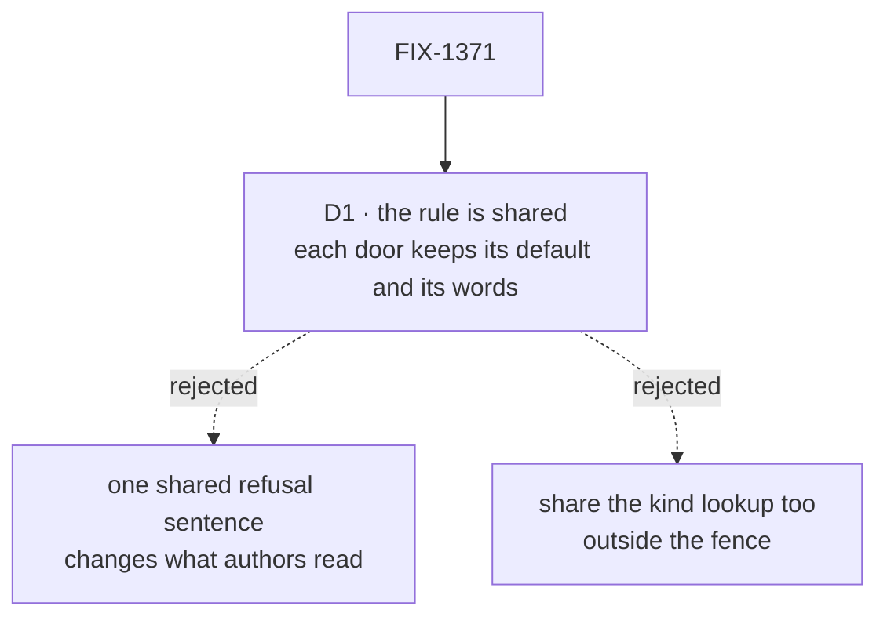

# FIX-1371 · Decisions

[Spec](SPEC.md) · **Decisions** · [Rules](BUSINESS-RULES.md) · [Plan](PLAN.md) · [Docs](DOCS.md)

What was considered, what was chosen, why, and what it locks in. One decision is the sign-off
surface. The rest was decided without asking and is recorded so nobody re-derives it.

## The tree

Solid edges are what you're signing. Dashed edges lost, and the label says why.

## D1 · The shared rule says which case a `flow:` is in; each door keeps its own default kind and its own refusal sentences

![D1, what the shared function returns. Chosen: the case, meaning a kind, blank, or not a string, and each door words the refusal. Instead of: a finished refusal sentence shared by both doors. It comes down to the first row, what an author reads. The chosen option leaves every message unchanged word for word. The shared sentence changes one door's message and so is a behaviour change. The price is the second row: two sets of sentences remain, and their wording can still differ, though the rule itself cannot. Locks in: the rule reports why it refused, not how to say it. Flips if: someone decides the doors should word this mistake the same way, which is its own issue.](figures/d1-own-words.svg)

It comes down to what an author reads: a shared sentence would change one door's message.

| | |
|---|---|
| **Instead of** | One refusal sentence both doors share, or a shared function that also takes each door's wording and the kind lookup |
| **Because** | The fence is no behaviour change, and the refusal sentences are behaviour: they are what an author reads, and the worker tests pin their content (`null`, `42`). The doors word the mistake differently today. The worker door says "blank" and "not a string" separately and quotes the value. The channel door says one thing for both. Sharing the *decision* and leaving the *words* where they are gives one convergence point for the rule (tenet 5) without touching any message |
| **Locks in** | The shared function returns the case (a kind, blank, or not a string, with the value), never a sentence. The wording can still differ between doors. The rule cannot |

**What would change my mind:** a decision that the two doors should word this mistake the
same way. That is a visible change and a product call, so it gets its own issue.

## Decided, not asked

- **The channel side's existing function stays, as a thin adapter.** It is the one entry
  point for three channel paths, and its doc promises the inventory writer the same answer
  the binder got. It keeps its signature and its sentence, supplies the channel default, and
  delegates the rule. Pointing all three paths at the raw rule would copy the channel default
  and sentence into three places.
- **The worker door calls the shared rule directly**, in place of its inline block, and keeps
  both of its sentences verbatim.
- **The rule lives in a small module of its own in `workforce`**, which neither door owns.
  Neither door imports the other's module. It is not exported from the package root.
- **The rule sees the key, not its value.** An own `flow` key holding `null` or `undefined`
  counts as present and is refused, as today. Only a missing key gets the default. The
  shared function's doc keeps the reasoning currently in the hire step's comment.
- **Characterize first.** The channel door's blank, `~` and non-string cases have no test
  today. They get one on `main` before anything moves, so the extraction has something that
  can go red.
- **No source-scan guard test.** The shared characterization table already turns red when
  either door's behaviour drifts, which is the thing that matters. A one-time grep in the plan
  confirms the copies are gone.
- **No changeset, no docs change.** Nothing a consumer can observe changes ([DOCS.md](DOCS.md)).

## Considered and dropped

| Alternative | Why not |
|---|---|
| Keep both copies and add a test that they agree | Two things to edit plus a third that must track them. Deleting one copy is less code |
| Put the rule in the hire module and import it from the channel side | The channel side would depend on the hire module for one function. A leaf module keeps both doors independent |
| Share the whole kind resolution: default, rule, lookup and messages | Pulls in the "kind was not passed" lookup, which the fence leaves out, and makes one function carry two doors' wording |

## How it got here

- **Draft** — framed as one rule written twice. It moves into one internal function that
  returns the case. The channel adapter and the hire step both call it, and each keeps its
  default and its sentences. The channel door gets characterized first. One PR in `workforce`.

**Open: none.**
