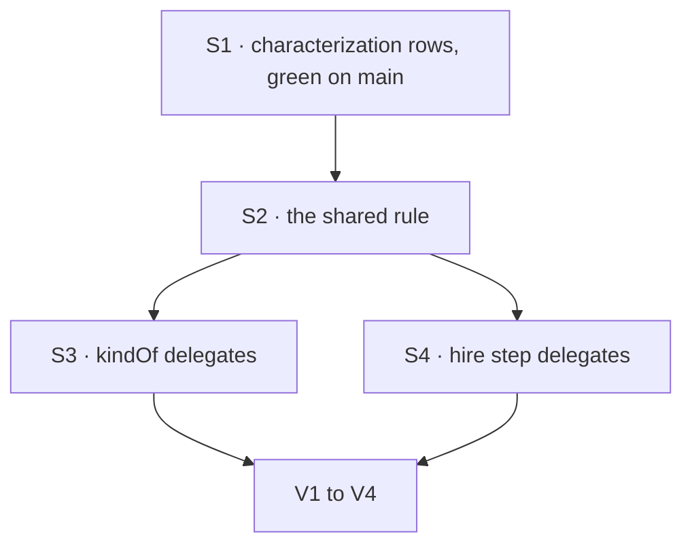

# FIX-1371 · Plan

[Spec](SPEC.md) · [Decisions](DECISIONS.md) · [Rules](BUSINESS-RULES.md) · **Plan** · [Docs](DOCS.md)

Written for the implementing agent. IDs cross-reference [BUSINESS-RULES.md](BUSINESS-RULES.md)
(BR-n) and [DECISIONS.md](DECISIONS.md) (D-n). A refactor: characterize, then extract. One PR.

## Surfaces

| ID | Package · role | Change | Rules |
|---|---|---|---|
| S1 | `workforce` · tests, both doors | **New** characterization rows over the one value table (absent, `""`, `"   "`, `null`, own key holding `undefined`, `42`, `{}`, a passed kind): through `hireWorkforce` in `hire.test.ts`, and through `channelInstances` plus `kindOf` directly in `channel-binder.test.ts`. Assert today's outcome and the sentence fragment each door emits | BR-1–BR-9 |
| S2 | `workforce` · new leaf module, the rule | **New.** One function: given a record's `declared` map and the door's default kind, return the case: a kind, blank, or not a string (with the value). No imports from either door. Not re-exported from the package root. Its doc carries the "only a missing key defaults" reasoning | BR-11 BR-12 |
| S3 | `workforce` · `channel/channel-binder.ts`, `kindOf` | Keep the signature, return shape and sentence. Body becomes S2 with `CHANNEL_KIND`, mapping both refusal cases to today's sentence | BR-6–BR-10 |
| S4 | `workforce` · `hire.ts`, the `flow:` block of `hireWorkforce` | **Remove** the inline presence, blank and non-string checks. Call S2 with `AGENT_KIND`, and map blank and not-a-string to today's two sentences, verbatim. Touch nothing outside that block | BR-1–BR-5 |
| S5 | `workforce` · `openChannels`, `inventory/open-inventory.ts` | No change: they call `kindOf` | BR-10 |

## Sequence



## Sketch

Pseudocode for the shape, not the code (see the review contract):

```
the rule(declared, defaultKind):
  no own "flow" key            -> kind: defaultKind
  value is a string, blank     -> refused: blank
  value is not a string        -> refused: not a string, value
  otherwise                    -> kind: the value, untrimmed

channel reader:  case -> kind | "declares a `flow:` that is not a kind name" (both refusals)
hire step:       case -> kind | today's blank sentence | today's not-a-string sentence(value)
```

## Checks

| ID | Runs after | Passes when |
|---|---|---|
| V0 | S1 | S1 passes on today's `main`, unchanged source. Record the output. These are characterization rows, so green before the change is the point |
| V1 | S4 | `pnpm --filter @flow-state-dev/workforce test` passes with **no existing assertion edited** and S1 still green |
| V2 | V1 | **Negative control.** In S2, make an own key holding `null` read as absent. The `null` rows fail on **both** doors: the worker row hires instead of refusing, and the channel row opens instead of refusing. Record it, then revert |
| V3 | V1 | `grep -rn 'hasOwn([^)]*"flow")' packages/workforce/src` prints one line, in S2. On `main` it prints two, `hire.ts` and `channel-binder.ts` |
| V4 | V1 | `pnpm --filter @flow-state-dev/workforce typecheck` passes |

## Pinned names

| Where | Name | Why pinned |
|---|---|---|
| `channel-binder.ts` | `kindOf`, its signature and return shape | Three channel paths and the inventory writer call it (D1) |
| Both doors | Every refusal sentence, word for word | The promise is no visible change. Tests match on their content |

Everything else is yours to name, including S2's module and function.

## Guardrails

| Rule | Because |
|---|---|
| No existing test assertion changes | An edited assertion means behaviour moved, and this issue promises it didn't |
| S1 lands green on `main` before S2 exists | A characterization row written after the change only describes the new code |
| Both doors reach S2; nothing else re-derives presence, blank or non-string (tenet 5) | A rule with one convergence point and a straggler is the drift this issue closes |
| Nothing in `hire.ts` outside the `flow:` block changes | The fence: "out = other hire.ts work" |
| The kind lookup and its "not passed" refusal stay in each door | Outside the fence, and each door's wording differs ([Follow-ups](#follow-ups)) |
| S2 imports neither door | Keeps the dependency one-way. The channel side must not depend on the hire module |

## Docs

None. [DOCS.md](DOCS.md) says why. No changeset: nothing a consumer observes changes.

## Counted facts, and how to re-derive them

No checker POC. The spec rests on one count, "the rule is written in exactly two places", and
V3 re-measures it. As of `67a3bb9b`, `grep -rn 'hasOwn([^)]*"flow")' packages/workforce/src`
prints `hire.ts:575` and `channel/channel-binder.ts:237`, and `kindOf` has three callers:
`channel-binder.ts` (twice, in `channelInstances`' validation and in `openChannels`) and
`inventory/open-inventory.ts`.

The value table's outcomes were measured on `67a3bb9b`, not read off the code. A throwaway
vitest (not committed) ran all seven non-kind values through `hireWorkforce`,
`channelInstances` and `kindOf`. Absent got `agent` and `channel`. Every other value was
refused. The worker door said "empty `flow:`" for `""` and `"   "`, and "`flow:` as <value>"
for `null`, `undefined`, `42` and `{}`. The channel door said "is not a kind name" for all six.
S1 turns that run into kept assertions.

## At implement time

- Blockers FIX-1311, FIX-1361 and FIX-1367 are all Done, so the collision that justified the
  duplicate is gone.
- FIX-977 (same desk) extracts catalog resolution in `workforce` and may touch `hire.ts`.
  Rebase and re-run V3 before opening the PR.

## Follow-ups

- The named-kind lookup (`hasOwn` on the kinds map, then a "not passed" refusal) is also
  written once per door. It has different wording and a different kind type on each side.
  Flag it for `improve-codebase-architecture` if it changes again.
- Whether both doors should word a bad `flow:` the same way is a product call (D1's *what
  would change my mind*). It needs its own issue.

## Notes from review

None yet.
