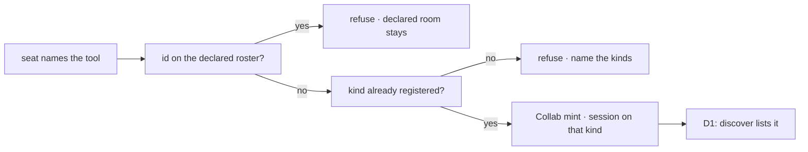

# FIX-1415 · Business rules

[Spec](SPEC.md) · [Decisions](DECISIONS.md) · **Rules** · [Plan](PLAN.md) · [Docs](DOCS.md) · [Evolution](EVOLUTION.md)

**Explore / not-ship.** These are the cases a ship ticket would have to prove. They are not acceptance for this PR. Verb names follow the [recommended cut](DECISIONS.md#verb-set), which is still open — a ratified rename changes the strings, not the cases. Each *proved by* is the check that ship would run.

## Who may administer a room

| # | When | Then | Proved by |
|---|---|---|---|
| BR-1 | A seat's `tools:` does not name the verbs | The model cannot call them. The capability being installed on the kind is not enough | Ship CI · seat with empty `tools:`, assert the tools are absent |
| BR-2 | A seat names the verbs and its kind installed the capability | The model can call them | Ship CI |
| BR-3 | A call arrives with an `orgId` in the tool input | **Refused.** The org comes from the verified principal. There is no org field on the input | Ship CI · strict schema |

## What create may name

| # | When | Then | Proved by |
|---|---|---|---|
| BR-4 | Create names a channel id that is not declared, and a kind the app registered | Collab's mint opens one session on that kind, at that id. The return is `{ channelId }`. The file tree is unchanged | Ship CI |
| BR-5 | Create omits `kind` | The session is the built-in `"channel"` kind | POC check 5 |
| BR-6 | Create names a kind the app did not register | Refused before anything is opened, naming the kinds it does carry | Ship CI |
| BR-7 | Create tries to define a new kind — source, a graph, a `system:` flag, an org | There is no field for that. Extra keys refuse | POC check 5 |
| BR-8 | Create names an id already on the declared roster | Refused. The declared room is left as it is | Ship CI |
| BR-9 | Create names an id this org already holds as a dynamic room | Refused. No session is overwritten | Ship CI · same id twice, same rule as a channel's session id |

## What delete and membership may touch

| # | When | Then | Proved by |
|---|---|---|---|
| BR-10 | Delete names a Collab-minted room | The session is gone. The id leaves the minted-room list. The inventory row stays | Ship CI |
| BR-11 | Delete, invite, or uninvite names a declared room | Refused, naming the room as declared. Members stay as they were at first open | POC check 4 is the binder fact; ship CI is the tool refusal |
| BR-12 | Uninvite removes the last member | The room stays open, with an empty member list. It is not a delete | Ship CI |
| BR-13 | A dynamic room sits unused | Nothing expires it. There is no TTL | Absence · no such timer, while [that wall](DECISIONS.md#recommended-still-open) stays on this pick |

## What the rest of the team sees

| # | When | Then | Proved by |
|---|---|---|---|
| BR-14 | [D1](DECISIONS.md#d1) ratified, and a create succeeded, and the inventory row was written | The same `discover` door that lists file-declared rooms lists this one | Ship CI · the POC's control inverted |
| BR-15 | [D1](DECISIONS.md#d1) declined | Docs say dynamic rooms are on Collab's list and not on `discover`. No kitchen-sink-only browse is added to paper over it | Docs review |
| BR-16 | A delete succeeded | Discover no longer lists the room, because it left the minted-room list. The inventory row is still there for a reader of the raw collection | Ship CI |

## What the tool does not do

| # | When | Then | Proved by |
|---|---|---|---|
| BR-17 | Create succeeds | No new flow kind is registered. Two rooms of one kind remain one instance | POC check 2 |
| BR-18 | A seat posts into the room | Post and fan-out behave as they do today. Admin did not become a way to assign work to the channel | Ship CI · an ordinary post still lands |
| BR-19 | Boards exist on the channel kind | Create does not attach a drain. A channel holds rows. A seat runs them | Absence · no board-wiring argument on create |

The first refusal is the lane. The kind check is why create cannot invent a flow. The last box is D1. The fence that is not on this diagram is BR-1: without the verbs in `tools:`, the model never reaches the first box.
