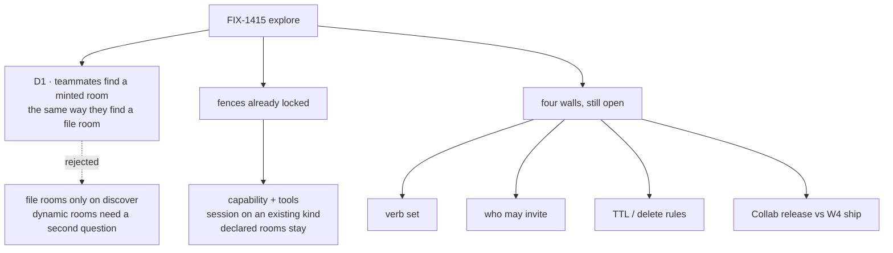

# FIX-1415 · Decisions

[Spec](SPEC.md) · **Decisions** · [Rules](BUSINESS-RULES.md) · [Plan](PLAN.md) · [Docs](DOCS.md) · [Evolution](EVOLUTION.md)

**Explore / not-ship. Needs ratify.** One card is the ratification surface. Everything under *Recommended, still open* is a pick, not a lock — including the four walls the issue left open. Architect fences already on the Linear issue are restated under *Fences, not asked* so they are not re-litigated as if they were new.

## The tree

Solid edges into D1 and the fences are what you're ratifying. The walls stay open. Dashed edges lost, and the label says why.

## D1 · After a seat opens a room that was never in a file, teammates find it the same way they find declared rooms

| | |
|---|---|
| **Instead of** | Leaving lookup as "files ∩ inventory", which is what ships today, so a Collab-minted room is invisible |
| **Because** | The lookup a Lab already uses projects a room only when **both** a declaration and an inventory row exist. A runtime room writes no file. The POC ran that join: an inventory row whose id is not in the declared roster is withheld. Teaching "open a room" while "what rooms are there?" stays blind is how a team invents a private list |
| **Locks in, if ratified** | A ship ticket must treat Collab's minted-room list as the declared half for a room that has no file, and must still require the inventory row. Delete takes the room off that list. The inventory row stays — that collection never deletes, and that contract is not this ticket's to reopen. Discover stops listing the room because the declared half no longer has it |

The inventory is append-only on purpose: a row means *was registered in this org*, not *still open*. That is why the minted-room list, not the inventory, is what delete removes. Joining (files ∪ minted rooms) against inventory is the smallest change that keeps both contracts. It is the same shape seat-hire recommended for a hired seat. It is not a merge of the tickets, and it is not a second discover door.

**What would change my mind:** a decision that dynamic rooms are private to the seat that opened them, and that Labs will ask Collab's room list directly. Then D1 is false, and we document two lookups. I would still write the inventory row, so a Lab that only reads inventory is not lying about the past. I would not change discover's declared half.

**What being wrong costs:** every path that opens a feature room mid-run plans against a ghost, or against a kitchen-sink-only browse — both are how a second registry starts.

## Fences, not asked

These are already locked on the issue. Restated so a reviewer does not "open" them.

- **Capability via `uses`, not Channel / ChannelAdmin / ChannelCollection / MessageBoard / TeamFlow as a type.** Door B: the **kind** installs; the **seat** selects presets and names tools. Seats never install.
- **Catalog tools, behind `tools:`.** Empty `tools:` stays empty. Not `controlTools` — those bypass the fence, which is how `discover` works and how room admin must not.
- **System versus dynamic.** A declared room (file or code, opened at boot) is undeletable from a seat. Create, delete, invite, and uninvite apply only to rooms Collab minted. The lane is where the room came from. A file cannot set it: `system:` is already refused, and the message says the path decides.
- **Create is a named session on a channel kind the app already registered.** The channel id is the session id. No hot-mint of a new flow kind. No second mega-registry. The inventory stays the lookup store it already is.
- **Do not bolt the verbs onto the declaration binder.** `openChannels` leaves a bound room's members as they were at first open. The POC ran that. Invite is a membership write on a dynamic session, not an edit to `CHANNEL.md`.
- **Seats do the admin. Channels hold the conversation.** No assignable-channel routing. No EM-as-a-special type. DevForce is a Lab on Workforce, and it is not a teach path yet.
- **Sibling of seat-hire, not a merge.** Not a W4 first-cut child. Not a Collab release reopen. Org from the principal, never from the tool input.

## Recommended, still open

Picks for Architect + Cycle Manager. Not locked by this explore. The issue listed these four walls and asked that they stay open.

### Exact verb set

**Pick:** `create`, `delete`, `invite`, `uninvite`. No expiry timer, no rename, no charter rewrite, no "remove the last member and the room vanishes."

Create mints. Delete removes. Invite and uninvite change the member list of a dynamic room. They share a grant and almost no mechanism with charter editing, which is why charter stays out of the first cut.

All four refuse an id that is on the declared roster, naming the room.

### Who may invite

**Pick:** a kind that installed the capability, and a seat that named the verbs in `tools:`. That is the whole grant. One grant covers create, delete, and membership. There is no invite-only role and no manager type.

A tighter "only these seat ids" list can wait until a Lab hits a seat that has the tool and should not.

### TTL and delete rules

**Pick:** no TTL. A dynamic room lasts until a seat deletes it. Delete removes the session and takes the id off the minted-room list. The inventory row stays. Uninvite of the last member leaves the room open and empty.

A declared room is not deleted, not expired, and not re-membered by the tool. Changing its membership stays a file edit plus a process that can open it fresh — which is the binder's existing rule, not a new one.

### Collab release versus W4 ship cut

**Pick:** this brief is the seat-facing shape. Ship waits until Collab has a dynamic mint to call. Do not reopen the Collab release to build rooms in full, and do not stuff the tools into W4's first cut. Do not teach the tools in kitchen-sink until that mint exists.

If Collab's mint is years out and a Lab needs the tool sooner, that is a new decision: a minimal minted-room list inside Workforce, still not a second inventory, still not a file. I would not take that cut in this explore. The fence says dynamic means Collab-minted.

## Considered and dropped

- **A Channel or ChannelAdmin type.** The noun is important and still not a type. Capability is the Door B shape we already have.
- **Putting the verbs on `createWorkforceCapability`.** That door is a control *because* composing it means "you may ask what is around you." Room admin is a grant a seat must name. Different fence, different factory. Same split seat-hire made for hire versus discover.
- **Teaching `CHANNEL.md` as the runtime mint.** Re-open does not update members. A seat editing a file would also be a deploy. Both are the hole this ticket exists to avoid.
- **Delete that also deletes the inventory row.** The row means *was registered*. Discover's liveness is the declared half, which D1 widens. Reopening "rows never close" is a different ticket.
- **Merging with seat-hire.** Same door shape. Different noun. A manager who can hire still cannot open a room, and the reverse.

## How it got here

Architect, 2026-09-16, re-homed 2026-09-19 as related-not-child of W4: shape a capability, keep the four walls open, do not ship from the explore. Declaration, the channel kind, and the inventory join already shipped. This explore is the seat-facing tool on that spine, sibling of the seat-hire brief. The POC did not change the design. It showed the lookup hole D1 is about, and it showed that invite cannot be a second open.
