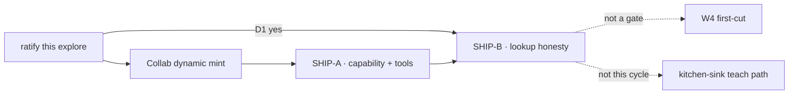

# FIX-1415 · Plan

[Spec](SPEC.md) · [Decisions](DECISIONS.md) · [Rules](BUSINESS-RULES.md) · **Plan** · [Docs](DOCS.md) · [Evolution](EVOLUTION.md)

**Explore / not-ship. Needs ratify.** There is no implementing agent for this PR. This page is the proposed ship-ticket split for Cycle Manager after ratification. Do not implement channel-admin from this document. Do not file the titles from this PR.

## POC

`specs/issues/FIX-1415/poc/channel-admin-compose/` — characterization of the current spine, plus a Door B sketch that is not imported by production.

```bash
pnpm exec tsx specs/issues/FIX-1415/poc/channel-admin-compose/check.mts
```

The question it answers: *does a room that was never declared already show up where Labs look, and can invite be a second open?* It showed neither. Seventeen assertions, including the controls. The sketch is catalog tools on a mint seam, not a new type. Nothing in the run moved the design.

Experimental evidence retained with the spec, not production code.

## Proposed ship tickets

Do **not** file these from this PR. Titles only, for Cycle Manager after ratification.

| # | Proposed title | What it is | Soft-after |
|---|---|---|---|
| SHIP-A | Channel-admin capability — catalog tools for dynamic rooms on the existing channel kind | `createChannelAdminCapability` in `@flow-state-dev/workforce`. Kind `uses` it. Seat names the verbs in `tools:`. Verbs call Collab's mint. Refuse declared ids. No new flow kind, no file write | Collab's dynamic-room mint ([FIX-1341](https://linear.app/fixpoint-labs/issue/FIX-1341)). Inventory lookup already exists ([FIX-1405](https://linear.app/fixpoint-labs/issue/FIX-1405)) |
| SHIP-B | A room with no file shows up on the same lookup teammates already use | Discover's declared half is files ∪ the minted-room list. The inventory row is still required. Delete takes the id off the minted list and leaves the inventory row | SHIP-A, and only if [D1](DECISIONS.md#d1) is ratified |



**Not proposed, on purpose**

- A kitchen-sink manager that opens a feature room — Lab pressure, not a Workforce teach path until the mint exists
- TTL / expiry
- Charter rewrite, rename, or "empty membership deletes the room" — the [verb-set wall](DECISIONS.md#verb-set) would have to move first
- Merge with [FIX-1480](https://linear.app/fixpoint-labs/issue/FIX-1480)
- Verbs on the [FIX-1352](https://linear.app/fixpoint-labs/issue/FIX-1352) declaration binder
- A W4 first-cut child
- A Collab release reopen as the ship vehicle
- A Channel type, a second registry, or a new flow kind from the tool

## Surfaces a ship would touch

Not this PR. Pins for whoever specs SHIP-A, after the walls are either kept or redirected.

| Pin | Why it is pinned |
|---|---|
| Factory name `createChannelAdminCapability` | Sibling of `createWorkforceCapability` and of the seat-hire factory. A second name on the discover function would mix a control door with a grant |
| Catalog `tools`, never `controlTools` | [FIX-1393](https://linear.app/fixpoint-labs/issue/FIX-1393). Room admin is a grant |
| Session on a registered channel kind, id = session id | [FIX-1311](https://linear.app/fixpoint-labs/issue/FIX-1311). Do not mint a kind |
| Declared ids refused by every verb | The lane. Origin, not a `system:` flag |
| Org from `ctx.org.identity.orgId`, never from tool input | [FIX-1442](https://linear.app/fixpoint-labs/issue/FIX-1442) · BP-031 |
| Return `{ channelId }` | The id is the session. A second address would invent one |
| Mint seam owned by Collab | This capability does not grow its own room store |

## Guardrails

- **Do not import the POC.** Retention is evidence, not a shortcut around `tdd`.
- **Do not add a Channel type or a second room collection.** Because the issue's invent-kills are the product.
- **Do not put the verbs on `createWorkforceCapability`.** Because that door is a control, and room admin must die when `tools:` is empty.
- **Do not teach the file convention as the runtime mint.** Because re-open does not change members, and the issue already killed that path.
- **Do not stuff this into W4 first-cut, and do not reopen Collab to ship the tools.** Because related-not-child and the park are already the sequencing.
- **Do not file Linear issues from the titles above** until Architect + Cycle Manager ratify.

## Checks a ship would run

The POC is characterization, not CI. Ship CI is where BR-1 through BR-19 become red/green. `tdd` on SHIP-A: a seat with empty `tools:` cannot create (red), then the capability plus a named tool makes it possible (green), then a declared id, an unknown kind, and an extra source field refuse.

## Notes from review

*(empty — explore has not been reviewed)*
