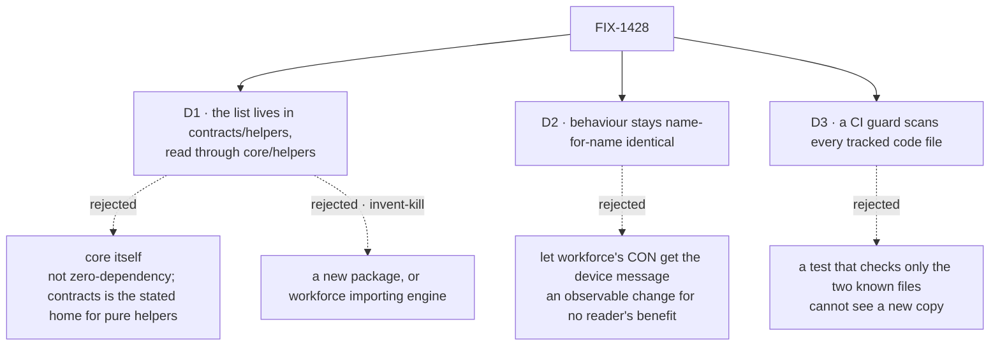

# FIX-1428 · Decisions

[Spec](SPEC.md) · **Decisions** · [Rules](BUSINESS-RULES.md) · [Plan](PLAN.md) · [Docs](DOCS.md)

The FSD Architect's fence on the issue sets the scope class: consolidate the reserved-name list
only; don't merge the two `validateSegment` functions; no `workforce → engine` import and no new
package. Where the list lives is delegated to the engineer. So this set has no business decision
to sign; the calls below are recorded so nobody re-derives them.

## The tree

## D1 · The list and its predicate live in `@flow-state-dev/contracts/helpers`, and consumers read it through `@flow-state-dev/core/helpers`

| | |
|---|---|
| **Instead of** | `core`, or a new package |
| **Because** | `contracts` is the zero-dependency layer every package may import (`scripts/validate-package-boundaries.mjs`), and its `helpers` subpath already holds pure platform-neutral helpers (`toError`, `deepEqual`, `mapLimit`) re-exported by `core/helpers`. No existing zero-dependency package owns path facts, which is the architect's condition for choosing it. `engine`, `workforce` and `claude-code` all import `core/helpers` already, so no `package.json` gains a dependency (tenet 2: refine an existing shelf, don't add one) |
| **Locks in** | A new public export on two published packages. Removing it later is a breaking change, so it ships documented and named for what it is: a Windows platform fact, not a domain contract |

The issue's worry, that `contracts` is "item taxonomy / block-instance-id", is answered by the
`helpers` subpath: it is already the shelf for pure facts that aren't domain contracts.

## D2 · Every name gets the same outcome and the same message it gets today

| | |
|---|---|
| **Instead of** | Accepting that `CON` in a workforce tree now reports "reserved device name" instead of "must be lowercase" |
| **Because** | The desk's rule for this refactor is behaviour-preserving. The engine list already folds case and the workforce list relies on its lowercase pattern; moving workforce's device check below the pattern check makes a case-folding predicate produce identical results in both. Both outcomes refuse the name, so nothing a user could build changes either way, but "identical" is cheaper to prove than "equivalent" |
| **Locks in** | The shared predicate is case-insensitive and whole-name. A future caller that wants extension-aware matching (`con.txt`) wraps it; it does not change it |

## D3 · A repository guard enforces one copy, by encoding, across every tracked code file

| | |
|---|---|
| **Instead of** | A unit test that asserts the two former call sites import the shared predicate |
| **Because** | The issue asks that *reintroducing* a copy fails. A check keyed to known files cannot see a new one; the census for this spec found a third copy nobody had listed. Matching by encoding (a templated `com${…}`/`lpt${…}` or a `com[1-9]`-style regex class anywhere; a quoted `"prn"` outside tests, where one hostile input is a case, not a list) caught all three copies in the repo and two planted ones ([POC](PLAN.md#sketch-and-poc)). Same shape as `scripts/validate-model-strings.mjs` |
| **Locks in** | One more CI step, with a stated gap: a test that spells the whole list as plain literals is not caught. A legitimate need to spell a device list elsewhere has to import the predicate or be allowlisted in the guard by path |

## Decided, not asked

- **The `claude-code` test's regex moves to the shared predicate.** It is a third copy that
  could drift; the fix is one import. Leaving it allowlisted would ship the goal with a known hole.
- **Engine keeps its private `isWindowsReservedName` name at the call sites** by importing the
  shared one. The engine export was internal (not on any package entry point), so deleting the
  local definition breaks no consumer.
- **The shared doc comment carries both packages' reasons**: whole-name match, why `COM0`/`LPT0`
  are excluded, and that Windows refuses the names with any extension (callers pass the basename).
- **No list widening.** Superscript `COM¹`–`COM³` and trailing-space forms are real Windows cases
  but would change behaviour; out of scope for a refactor.
- **A `patch` changeset for `contracts` and `core`**, because a published helpers subpath gains
  an export (BP-022).

## Considered and dropped

| Alternative | Why not |
|---|---|
| Merge the two `validateSegment` functions | Fenced out. They enforce different rules (the store escapes dots; the loader forbids them) and the survey the issue asks for is not this issue |
| Rename workforce's `validateSegment` so the two stop sharing a name | Real, and the issue flags it, but it is naming not the list. Follow-up in [PLAN](PLAN.md#follow-ups) |
| Export only the `Set`, let each caller do its own `.has` | Leaves case handling per-caller, which is one of the ways the copies already differ |
| Workforce imports `@flow-state-dev/contracts` directly | Works, but adds a `package.json` dependency nothing else needs; `core/helpers` is the established route |

## How it got here

- **Draft** — framed as a single-source refactor with a repository guard; found the `com0`
  drift already fixed on `main` and a third copy in a `claude-code` test; `contracts/helpers`
  chosen as the home, behaviour pinned name-for-name.

**Open: none.**
