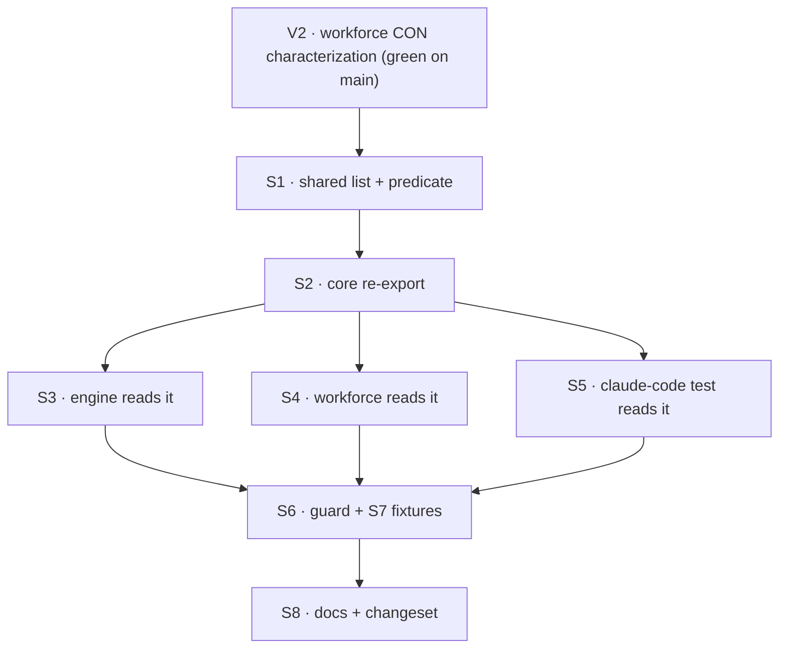

# FIX-1428 · Plan

[Spec](SPEC.md) · [Decisions](DECISIONS.md) · [Rules](BUSINESS-RULES.md) · **Plan** · [Docs](DOCS.md)

Written for the implementing agent. IDs cross-reference [BUSINESS-RULES.md](BUSINESS-RULES.md)
(BR-n) and [DECISIONS.md](DECISIONS.md) (D-n). `tdd`, characterization-first. One PR.

## Surfaces

| ID | Package · role | Change | Rules |
|---|---|---|---|
| S1 | `contracts` · `helpers` | Add the reserved-name module: the 22-name list (private) and a case-insensitive whole-name predicate (exported). Doc comment carries both packages' reasons: `COM0`/`LPT0` are not reserved, Windows refuses these with any extension so callers pass the basename. Export from the `helpers` barrel (D1) | BR-1 BR-2 BR-3 |
| S2 | `core` · `helpers` | Re-export shim for S1, same shape as `core/src/helpers/to-error.ts`; add to the `core/helpers` barrel | — |
| S3 | `engine` · filesystem store path mapping | **Remove** the local list and predicate; import the shared predicate from `@flow-state-dev/core/helpers`. `validateSegment`, the walk, and the scope-id check keep calling it unchanged | BR-4 BR-5 |
| S4 | `workforce` · the tree loader's segment rule | **Remove** the local device set. Call the shared predicate **after** the lowercase-pattern check, keeping the device message verbatim (D2). Replace the "the two cannot share it today" comment with a pointer to the shared list | BR-6 – BR-9 |
| S5 | `claude-code` · the checkout-segment test | Replace the local `RESERVED` regex with the shared predicate | BR-12 |
| S6 | `scripts/` · repository guard | New `validate-reserved-names.mjs`: scans every git-tracked JS/TS file; signatures as in the POC (S2/S3 everywhere, quoted `prn` outside tests); allows exactly the S1 file; prints the file and "import `isWindowsReservedName` from `@flow-state-dev/core/helpers`". Wire it as an unconditional CI step beside "No removed model-string syntax" (D3) | BR-10 – BR-13 |
| S7 | `core` · test | Fixture test for S6, same shape as `packages/core/test/model-strings-check.test.ts`: a planted source copy and a planted test copy fail; a single hostile input passes | BR-11 – BR-13 |
| S8 | Docs + release | [DOCS.md](DOCS.md) README lines; one `patch` changeset for `@flow-state-dev/contracts` and `@flow-state-dev/core` naming FIX-1428 | — |

## Sequence

Write V2 first and commit it green against `main`, so the move is judged against recorded
behaviour rather than against the new code.

## Checks

| ID | Runs after | Passes when |
|---|---|---|
| V1 | S1 | Contracts unit test: all 22 names true in lower, upper and mixed case; `com0`, `lpt0`, `com10`, `lpt`, `console`, `con.md`, `""` false (BR-1, BR-2). `contracts-zero-dep.spec.ts` still green (BR-3) |
| V2 | before S1, again after S4 | Workforce characterization: `CON` and `Nul` produce today's lowercase message, and `con` today's device message, byte for byte (BR-6, BR-7). Green on `main` first |
| V3 | S3 | `pnpm --filter @flow-state-dev/engine test` green with no assertion edits (BR-4, BR-5) |
| V4 | S6 | Guard exits 0 on the branch; S7 shows it exits non-zero on each planted copy **and** was seen to do so before the allowlist was the only thing passing (BR-10 – BR-13). This is the goal's proof |
| V5 | S4 | `pnpm --filter @flow-state-dev/workforce test` green with no assertion edits (BR-7 – BR-9) |
| V6 | S8 | `pnpm typecheck` (includes `validate-package-boundaries.mjs`: no new edge) and `pnpm test` green |

No goal check applies; V4 is the goal's proof, V2/V3/V5 are equivalence.

## Pinned names

| Where | Name | Why pinned |
|---|---|---|
| Shared predicate | `isWindowsReservedName` | Engine's existing name; three call sites already read it. Now public, so it is API |
| Guard script | `scripts/validate-reserved-names.mjs` | CI references it |

The module filename inside `contracts/src/helpers/` and the guard's allowlist path follow it.

## Guardrails

| Rule | Because |
|---|---|
| No input gets a different outcome or message (D2) | The desk's contract for a refactor, and the only way the existing suites prove equivalence without edits |
| The guard matches by encoding and scans every tracked code file, tests included | The census found a copy nobody listed; a guard keyed to known files is the smaller goal the spec rejects (tenet 7) |
| Don't touch either `validateSegment`'s other rules, names or order beyond moving the one device check | Fenced out; the two validators disagree on purpose |
| No new `package.json` dependency, no boundary-script edit | `core/helpers` already reaches all three consumers; an edge added here would be the invent-kill the fence names |

## Docs

Publish [DOCS.md](DOCS.md) with S8, after V6. No site page changes.

## Sketch and POC

No sketch: the change extends an existing pattern (`contracts/helpers` → `core/helpers` shim).

**POC:** [`poc/copy-census/census.mjs`](poc/copy-census/census.mjs) — the spec's factual base
("how many copies exist") re-derived, not hand-listed. Run
`node specs/issues/FIX-1428/poc/copy-census/census.mjs`, then again with `--plant`. On `67a3bb9b`
it scanned 2,834 tracked code files and found **three** copies: the two the issue names plus a
regex in the `claude-code` checkout-segment test. The `--plant` control adds a source copy with
no `prn` and a templated test copy; both were reported. It moved the design: the `claude-code`
copy joined scope (S5), and the quoted-`prn` signature is limited to non-test files because that
test legitimately passes `"PRN"` as one hostile input. It is also the working draft of S6's
matching rules. Retained evidence, not production code; nothing discovers or runs it by default.

## At implement time

- Re-run the census on fresh `main` before starting; a new copy may have landed since.
- FIX-1389 (workforce loader tree-walk primitives) consumes `validateSegment`; if it has moved
  `segments.ts`, apply S4 at its new home.
- Check whether an open PR touches `packages/workforce/src/loader/segments.ts` or
  `packages/contracts/src/helpers/index.ts`; none did when this was written.

## Follow-ups

- Two exported functions named `validateSegment`, in `engine` and `workforce`, enforce different
  rules. Renaming one (or surveying them, per the issue's *Out*) is its own issue; flag to triage.
