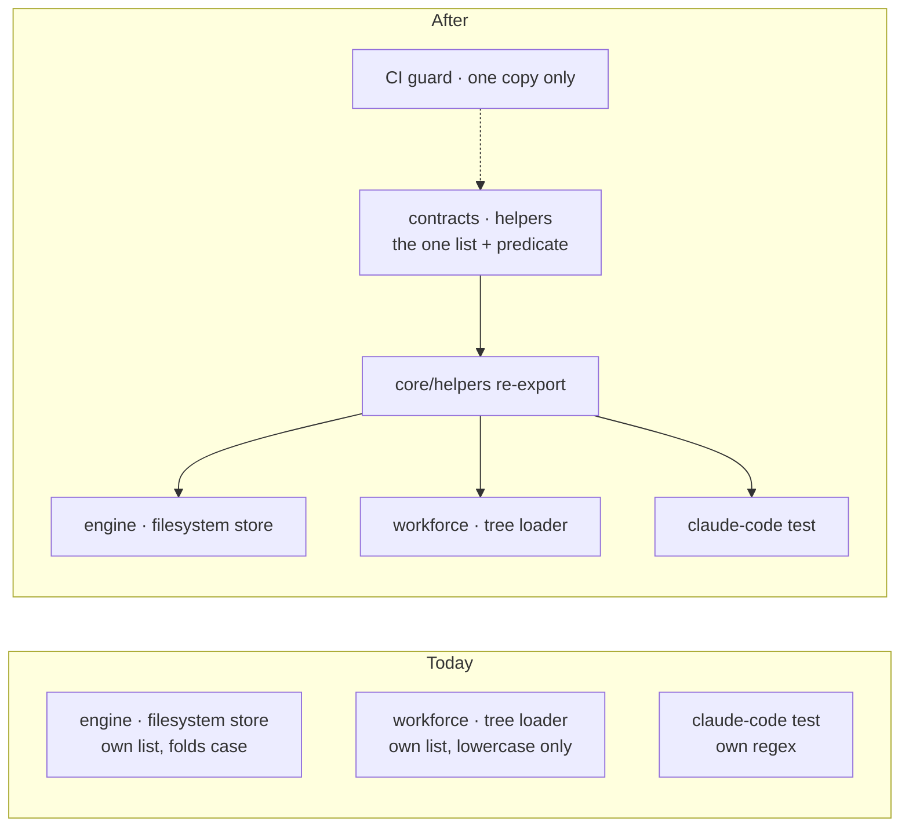

# FIX-1428 · Reserved-filename rule is enforced twice, in two packages that can't see each other, and it already drifted

**Spec** · [Decisions](DECISIONS.md) · [Rules](BUSINESS-RULES.md) · [Plan](PLAN.md) · [Docs](DOCS.md)

Improvement (refactor, behaviour-preserving) · `contracts` + `core` re-export + `engine` + `workforce`, plus one `claude-code` test · small · 1 PR · no epic · soft-related to FIX-1357 and FIX-1389

## People, before and after

| Someone who… | Today | After |
|---|---|---|
| **changes which names count as Windows devices** | Edits one of three lists (two in shipping code, one in a test) and has no signal the others exist | Edits one list. Every reader of it changes together |
| **adds a fourth place that needs the rule** | Writes another copy. Nothing stops them | CI fails and names the one list to import |
| **names a workforce folder or file `con`, `COM1`, `CON`, or `com0`** | `con` and `com1` are refused as device names, `CON` is refused as not lowercase, `com0` is accepted | Exactly the same outcome and message, name for name |
| **writes a filesystem-store key or scope id like `nul` or `Lpt9`** | Refused, case-insensitively | Exactly the same |

The drift the issue describes (`com0`/`lpt0` refused by the workforce copy) was fixed before
FIX-1357 merged: both shipping lists name the same 22 devices on `main` today, and a workforce
test pins that `com0` and `lpt0` are accepted. What still differs is the spelling (two set
names, two doc comments, one case-folding and one not) and the fact that nothing keeps them
in step. A third copy, in a `claude-code` test, was found by the census below.

## The goal, and how we'll know it's met

**There is one list of Windows reserved device names in the repository, every place that
applies the rule reads it, and a second copy cannot land without CI failing.**

| Is it the right goal? | |
|---|---|
| **The real need** | "One definition of the reserved-name list exists in the repo. Both call sites consume it. A test fails if a second copy of the list is reintroduced." (the issue's desired outcome) |
| **Smaller, and rejected** | Fix the two lists by hand and add a comment pointing each at the other. It is what the code has today, and it is how the drift happened |
| **Bigger, and not this issue's** | One path-segment validator for both packages. The two `validateSegment` functions enforce different rules for different reasons; the fence forbids merging them, and renaming one is a follow-up |
| **Not done if** | A copy survives in a test or a script the guard does not scan · the guard has never been seen to fail · any name gets a different outcome or message than it does today |

**No goal check applies:** nothing a person runs changes, so there is no real path to drive.
What proves the goal instead is the repository guard: it scans every tracked code file, allows
exactly the one list, and is shown to **fail on a planted third copy** before it counts
([PLAN → V4](PLAN.md#checks)). Equivalence is proved by the existing engine and workforce
suites passing unchanged, plus two characterization tests written and green *before* the move
([PLAN → V1, V2](PLAN.md#checks)).

## What changes



Three independently kept lists become one, in the zero-dependency package every consumer is
already allowed to reach. The CI guard is what keeps it one.

```diff
 // packages/workforce/src/loader/segments.ts  (shape only)
-const DOS_DEVICE_SEGMENTS = new Set(["con", "prn", "aux", "nul", ...com1-9, ...lpt1-9]);
+import { isWindowsReservedName } from "@flow-state-dev/core/helpers";
 …
-  if (DOS_DEVICE_SEGMENTS.has(segment)) { throw … }
   if (!SEGMENT_PATTERN.test(segment)) { throw … }
+  if (isWindowsReservedName(segment)) { throw …same message… }
```

Workforce's device check moves below its lowercase check. That is what keeps `CON` getting
today's lowercase message now that the shared predicate folds case
([BR-6](BUSINESS-RULES.md#workforce-loader)).

## What stays as it is

- Both `validateSegment` functions, their names, their other rules, and every error message.
- The package boundaries. `workforce` still cannot import `engine`; no new package.
- Which names are refused: the same 22, whole-name, `com0`/`lpt0` allowed.

## Sign off

**[The goal](#the-goal-and-how-well-know-its-met), at that size:** one list, all three readers
on it, and a guard seen to fail on a planted copy. If wrong: the rule drifts again, caught by
whoever hits it on a Windows checkout.

No decision here needs you. The one open wall the architect left, where the list lives, is an
engineering call the fence delegates ([D1](DECISIONS.md#d1)): `@flow-state-dev/contracts`,
because nothing else zero-dependency already owns platform path facts.

**Open: none.** Reasoning: [DECISIONS.md](DECISIONS.md). Cases: [BUSINESS-RULES.md](BUSINESS-RULES.md).
