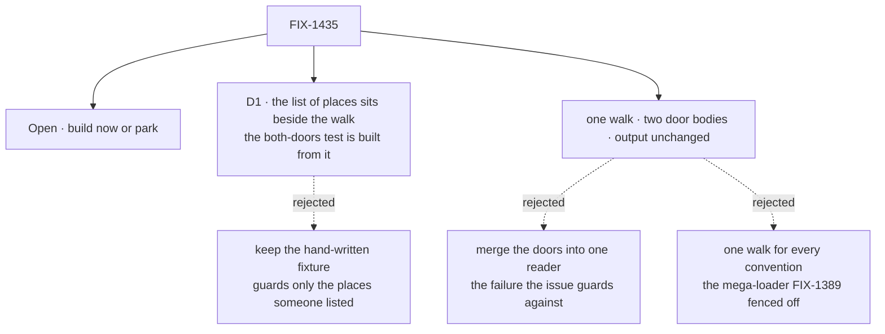

# FIX-1435 · Decisions

[Spec](SPEC.md) · **Decisions** · [Rules](BUSINESS-RULES.md) · [Plan](PLAN.md) · [Docs](DOCS.md) · [Evolution](EVOLUTION.md)

One decision and one open fork are the sign-off surface. The FSD Architect's fence sets the
class: one walk, two door bodies; the doors are not merged; no general slot reader; the
`typescriptExtension` dedupe rides along.

## The tree

Solid edges are what you're signing. The walk shape itself is the fence's, not a new call.

## Open · Build this now, or park it until a fifth place is on the table?

It comes down to whether the walk's shape waits on the fifth place. It doesn't.

- **The fork.** Do the hoist now as a standalone refactor, or leave it at P4 and do it as the
  first step of whatever adds a fifth `resources/` place, as Jake recommended on the issue.
- **Plain terms.** The drift that would bite today's four places is already caught by a test. What
  is left bites only the day someone adds a fifth place. Nothing schedules one.
- **The trade-off.** Now costs one small PR and review time on something no customer feels. Later
  costs nothing until the fifth place, and then the person adding it pays for both jobs at once.
- **My recommendation: build now.** Jake's case for waiting was that the walk's shape depends on
  the fifth place. The spec's shape doesn't: the walk hands each door a place, and a new place is
  one more visit, not a new hook. The copies have also grown since his comment. There are now
  three copies of the TypeScript rule, and he didn't count the list of places as a copy.
- **What would change my mind.** A fifth place scheduled within a cycle or two. Then fold this into
  that work and close this issue.
- **If wrong.** One small internal PR of churn, reshaped when the fifth place lands. Nothing
  public changes, so it's cheap to undo.
- **Either way, the TypeScript-rule dedupe ships.** It is behaviour-free and doesn't depend on the
  walk: with this PR if built now, as its own tiny PR if parked.

## D1 · The list of places moves beside the walk, and the both-doors test builds its tree from it

| | |
|---|---|
| **Instead of** | Hoisting the walk and keeping the both-doors test's hand-written five-path fixture, with the `fsdev gen` list staying in Door B |
| **Because** | Jake's third experiment passed 74/74 with the doors disagreeing, because the fixture only held the places someone wrote down. One walk stops the doors disagreeing. Only a test built from the list stops the list going stale. Tenet 5: one fact, one place |
| **Locks in** | The list becomes something the tests depend on, not just what `fsdev gen` prints. Whoever adds a place edits the walk and the list together, in one file. Each place the walk yields carries its pattern, and a second test walks a saturated tree and checks the yields against the list both ways. So a place added to the walk but not the list fails too, as long as its folder names are ones the fixture builds (BR-4b) |

It comes down to the fifth place: a hand-written fixture never tests it unless someone remembers to.

**What would change my mind:** a way for the walk to list its places without a tree to walk,
without driving the walk from data. That would be the general slot reader the fence rules out.

## Decided, not asked

- **E1 · The walk yields places, not slot folders** — a folder that may hold slots, with its path,
  team, worker and ref minter. Each door opens its own slot there, so Door A's `references/` and
  Door B's same-name check are untouched.
- **E2 · Each door keeps its own order and wording.** Door A lists workers in directory order and
  Door B sorts them. Door A names a refused worker folder by name, Door B by full path. Unifying
  either changes output. The walk takes the door's order and hands it each refusal's facts; the
  exact form is the implementer's.
- **E3 · The walk stays unexported.** Door B imports the module directly. No public API, no
  changeset, no docs.
- **E4 · `walkTeams` is unchanged.** The resources walk is built on it ([Evolution](EVOLUTION.md)).
- **E5 · One TypeScript-extension rule.** The issue counted two copies. `discover-seat-blocks.ts`
  has since added a third, and all three go.
- **E6 · The characterization test lands first**, on its own commit, green on both sides.

## Considered and dropped

| Alternative | Why not |
|---|---|
| One reader over `.md` and `.ts` | The issue's own Out, and the fence |
| Drive the walk from the list, as data | That is the general slot reader. Per-level wording and org's special open don't fit a table |
| Sort workers, or name refused workers one way, in both doors | Changes one door's output. That needs its own issue |
| Absorb the packages pair | Same duplication, different convention, fenced out. [Follow-up](PLAN.md#follow-ups) |

## Settled

- **Today's four places are already guarded against drift in either direction.** CONFIRMED by
  Jake's first two experiments on the issue: removing either door's org-worker descent turns the
  differential test red. **A fifth place is not guarded.** CONFIRMED by his third: 74/74 green
  while the doors disagreed. D1 exists because of the third.

## How it got here

- **Draft** — framed as the last copied thing between the two doors. One walk yields places and
  both doors keep their bodies, order and wording. The list of places moves beside the walk and
  feeds the both-doors test, per Jake's condition. Small, one PR. Whether to build now is put to
  the owner, because his issue comment recommended parking it.
- **Review round 1** — a review showed D1 closed only half the hole: a place added to the walk but
  not the list stayed green, and BR-4 claimed both halves. D1 now adds a saturated-tree check, with
  each yielded place carrying its pattern, so drift fails in both directions (BR-4, BR-4b). Its
  limit, a brand-new folder name, is stated. The goal now says the walk and its list are *checked
  against each other*, not that the place is written once. The Open fork now says the
  TypeScript-rule dedupe ships either way.
