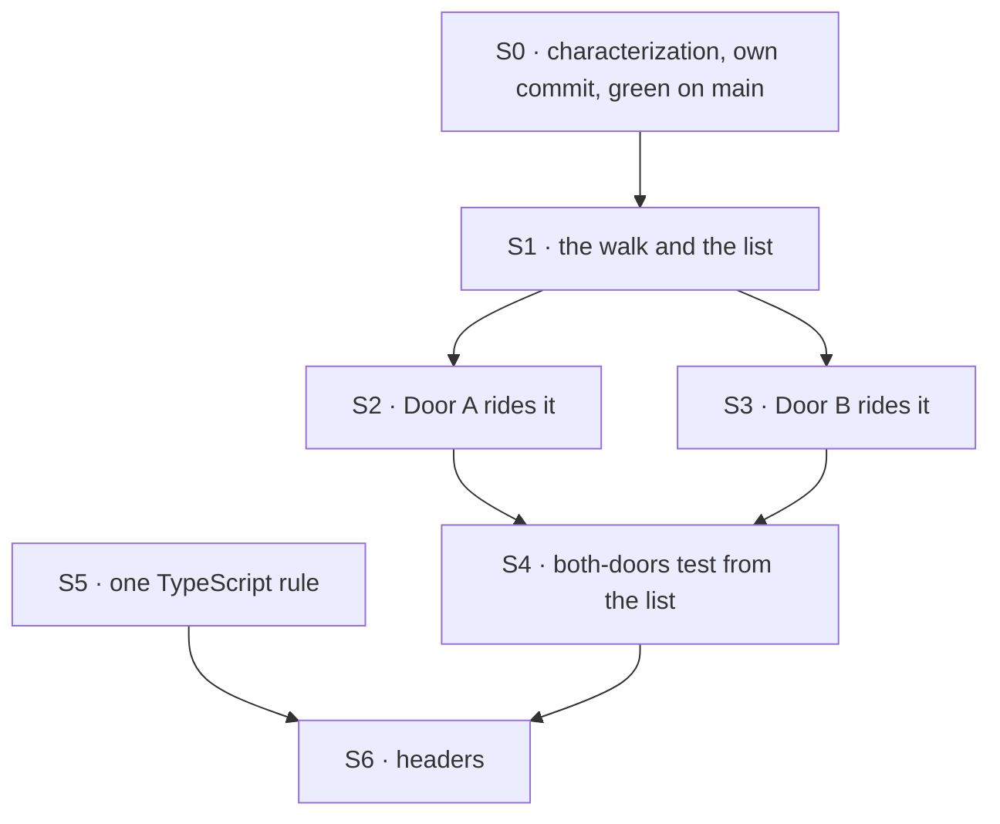

# FIX-1435 · Plan

[Spec](SPEC.md) · [Decisions](DECISIONS.md) · [Rules](BUSINESS-RULES.md) · **Plan** · [Docs](DOCS.md) · [Evolution](EVOLUTION.md)

Written for the implementing agent. IDs cross-reference [BUSINESS-RULES.md](BUSINESS-RULES.md)
(BR-n) and [DECISIONS.md](DECISIONS.md) (D-n, E-n). `tdd`, in the refactor sense: pin, then move.
One PR. All paths are under `packages/workforce/`.

## Surfaces

| ID | Role | Change | Rules |
|---|---|---|---|
| S0 | New characterization test | Pin both doors' **complete** output over one tree: two or more workers under `org/` and under a team, docs and modules at all four places, a symlinked worker folder at each level, a symlinked team, a symlinked `workers/` level, a symlinked slot. Door A: `documents` in order, and `errors` as path, kind and message. Order among sibling worker folders is asserted against `fs.readdir` of that level, not a literal. Door B: `modules` and `problems`, exact | BR-6 to BR-10 |
| S1 | New loader module: the resources walk | Owns the descent: open `org/` structurally, yield the org place, descend org workers, then for each team from `walkTeams` yield the team place and descend its workers. Each place carries its dir, root-relative path, team id, worker name, whether it's a worker's own, its ref minter (from `mintResourceRef`), and **its pattern** as it would appear on the list (for example `teams/*/workers/*/resources`). Structural refusals go to the door's reporter. Worker-level order and refusal facts come from the door (E2). Also owns **the list of places** (today's `RESOURCE_SLOT_PATTERNS` in Door B), next to the walk | BR-1 BR-3 BR-5 BR-8 BR-9 BR-13 |
| S2 | `loader/read-resources-directory.ts` (Door A) | `readDocumentSlot` iterates S1's places and calls its `readSlot` per place. **Remove** its private `walkWorkers`, its org open and its team loop | BR-6 BR-8 BR-9 BR-11 |
| S3 | `codegen/discover-resource-modules.ts` (Door B) | `discoverResourceModules` iterates S1's places, sorted workers, and calls its `readSlot`. **Remove** its private `walkWorkers`, its org open and its team loop. **Move** the list of places to S1; `discover.ts` reads it from there | BR-7 BR-9 BR-12 BR-13 |
| S4 | Both-doors test (`test/codegen-resource-modules.test.ts`, "mints the same refs…") | **Replace** the hand-written five-path fixture: build the tree from S1's list of places, two names per `*`, plus decoy `resources/` folders at non-places. Assert Door A and Door B each return exactly one ref per expanded place, the two ref sets are equal, and nothing comes from a decoy. **Add a saturated-tree test:** a tree with a `resources/` folder in every folder, down to one level below the deepest place, built from the convention's folder names (`org`, `teams`, `workers`, `channels`, and the other slot names) with fixture names for `*`. Assert the set of patterns the walk yields over it equals the list. The BR-3 decoys are most of this fixture | BR-2 BR-3 BR-4 BR-4b |
| S5 | TypeScript-extension rule | One definition in `codegen/`. **Remove** the copies in `discover.ts`, `discover-resource-modules.ts` and `discover-seat-blocks.ts` | BR-14 |
| S6 | File headers and doc comments (BP-007, BP-034) | Update where the walk now lives: Door A's header ("one walk, two slots" still holds, and now also "one walk, two doors"), Door B's header, `resource-convention.ts`'s header, the loader index header's list of shared pieces, and `walkTeams`'s comment. Its "the walk stops here" becomes "the resources walk continues from here" | — |

## Sequence



S0 is committed before any source change. S5 is independent and can go anywhere before S6.

## Checks

| ID | Runs after | Passes when |
|---|---|---|
| V0 | S0 | Green on the commit that adds it, before S1 exists |
| V1 | S2, S3 | V0 still green. `pnpm --filter @flow-state-dev/workforce test` green. `git diff <S0 commit>..HEAD -- packages/workforce/test` touches only S4's test body. No other assertion is edited (BR-6 to BR-12) |
| V2 | S4 | Both tests pass. **Controls, run and shown in the PR:** (a) drop one visit from S1's walk and keep its place on the list: the both-doors test fails naming the missing slot (BR-4). (b) Add a visit to S1's walk at a level the saturated fixture builds, such as `teams/*/channels/*/resources`, and leave the list alone: the saturated-tree test fails naming the extra pattern (BR-4b). Restore both |
| V3 | S4 | **Jake's experiment, re-run and shown in the PR:** add `org/squads/*/` as a place in S1's module only, with a throwaway minter and a squad fixture folder. Both doors return the squad's refs and their sets are equal. On `main`, the same edit to one door passed 74/74 while the doors disagreed. Then revert |
| V4 | S2, S3 | `rg -n "WORKERS_LEVEL" src/loader/read-resources-directory.ts src/codegen/discover-resource-modules.ts` prints no descent: neither door opens `workers/` itself |
| V5 | S5 | `rg -n "TYPESCRIPT_EXTENSIONS\s*=" src` prints exactly one line |
| V6 | S6 | `pnpm --filter @flow-state-dev/workforce typecheck` and `pnpm --filter @flow-state-dev/fsdev test` green. `fsdev gen` is the codegen's consumer |

No goal check applies, because this is a refactor ([SPEC](SPEC.md#the-goal-and-how-well-know-its-met)).
V0/V1 prove nothing changed, and V2/V3 prove the one place. The spec's counts (four places, two
doors, three TypeScript-rule copies) are re-derivable with the `rg` in V4/V5, so there's no
separate checker.

## Pinned names

None. The issue's `walkResourceSlots(root, hooks)` is a fine name, not a pin. Everything is yours
to name.

## Guardrails

| Rule | Because |
|---|---|
| No door's output changes, including order and message wording | The desk is behaviour-preserving. A change found mid-build is a blocker to raise, not a fix to fold in |
| The walk knows nothing about files: no `.md`, no `.ts`, no slot contents | What a door does inside a folder is the door's (the issue's Out). A walk that reads files is the merged reader |
| The walk takes no option other than worker order and refusal facts | Every extra knob is a step toward the mega-loader the fence names. If a third seems needed, stop and surface it |
| The list of places and the walk sit in one module | "A change in one file" is the goal. Two files is two edits again |
| Both doors descend only through the walk | A door that keeps a private descent for one level is the drift this removes (V4) |
| `walkTeams` is untouched | Five other walks (teams, workers, channels, packages, package blocks) depend on it and its contract (E4) |

## Docs

[DOCS.md](DOCS.md): no reader-facing impact. Nothing to publish.

## Sketch · pseudocode, illustrative, react to the shape

```
the walk (one module, beside the list of places):
    open the root
    open org structurally → refusal to reporter
    if org opened:
        yield place(org, mint: org-level)
        for each worker folder under org/workers, in the door's order:
            refused? → reporter(the facts); continue
            yield place(worker, mint: org-worker, own: yes)
    for each team from walkTeams(reporter):
        yield place(team, mint: team-level)
        for each worker folder under the team's workers/, same as above

door A: for each place → read its slot (resources or references) → documents / errors
door B: for each place → read resources + peek references → modules / problems; sort
```

**POC:** none. The shape is a lift of two near-identical functions, already read side by side.

## At implement time

- Re-read both doors on fresh `main`. A sibling may have touched either door, or added a place,
  which would change S0's tree.
- Check whether a fourth codegen door has copied the TypeScript rule since. S5 covers all copies.
- The FIX-1389 predecessor claims in [Evolution](EVOLUTION.md) are checked against `walkTeams`'s
  current comment, not against memory.

## Follow-ups

- **The packages pair.** `read-packages-directory.ts` and `discover-package-blocks.ts` copy one
  team → worker descent over `packages/`. Same class, different convention, and fenced out here.
  Flag for `improve-codebase-architecture`, and don't file it from this spec.
- **Door B's team-level refusals name only the team id**, while its worker-level ones name the
  full path. It's inconsistent inside one flat list. Preserved here (E2). It's a wording issue
  for its own ticket, if anyone wants it.

## Notes from review

Recorded verbatim for the implementer to weigh against real code. Not folded into the design.

- **Cursor, on S0 (PLAN.md):** "S0 is the heaviest step relative to a pure hoist. The trade-off is fair given E2 (order + refusal wording must not change), but the plan does not name the new test file path. Worth stating explicitly and, if you want a smaller diff at implement time, scoping S0 to gaps existing suites would not catch—without editing any current assertion (V1 already guards that)."
- **Cursor, review body:** "`read-resources-directory.ts` today says org open stays local for channels; after S1, replace that narrative in S6 so nobody re-inlines org open in Door A per stale header text."
- **Cursor, review body:** "V2/V3 as manual PR demonstrations are process-heavy; fine for a one-off refactor proof, but they will not live in CI unless you add an optional control test later."
- **Cursor, on D1 (DECISIONS.md):** "Consider a one-line **sync matrix** in SPEC or PLAN (walk / list / fsdev gen / test) so readers do not infer from the goal paragraph that all four stay in lockstep automatically."
- **Second-look review, finding 3:** "Order plus a refusal reporter makes the walk a callback-driven loop. A shape that keeps it knob-free is a generator that yields discriminated events: `place { dir, path, teamId, workerName, atWorkerRoot, mint }` or `refusal { kind, entryPath, workerName, error }`. Each door maps a refusal to its own wording and shape. Door A builds `{path, error, kind}`. Door B builds a string. Worker order is the one real difference. Door B could collect the places under a parent and sort them. Door A keeps the stream order."
- **Second-look review, architecture:** "Parameterize the slot folder name, `resources` or `packages`, at the yield site (finding 3's event stream makes this natural) and don't hard-code `RESOURCES_SLOT` in the walk. The follow-up then becomes \"call the walk with a different slot name\"." (Spec note: the packages pair stays fenced out here, and a slot-name option is a knob under the Guardrails. Weigh it against the "no option other than order and refusal facts" rule.)
- **Second-look review:** "**Door A iterates `readdir` order.** Its `documents` order is machine-dependent today, and S0 pins it against `fs.readdir`. That is honest, but the characterization test is only as stable as that filesystem. Door B sorts. Unifying is out of scope (E2), but it is worth a one-line follow-up mention next to the wording inconsistency already listed."
- **Second-look review:** "**Comment density.** Both `walkWorkers` bodies carry long rationale comments, for example the \"no name is special, including `resources`\" block. They should move with the code into the walk once, not be duplicated or dropped. S6 covers headers, not these."
