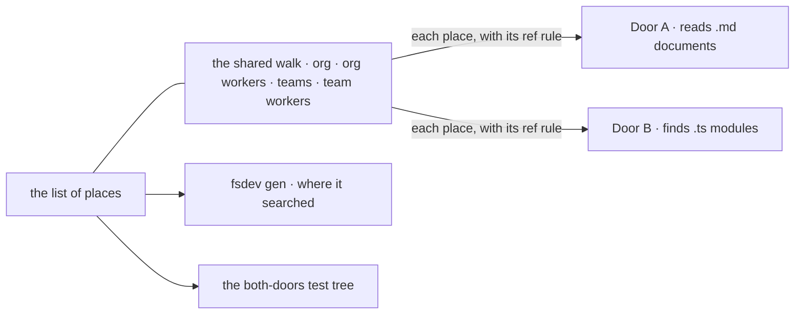

# FIX-1435 · Both resources doors carry their own copy of the slot-descent walk, so a fifth resources/ seat means changing two walks

**Spec** · [Decisions](DECISIONS.md) · [Rules](BUSINESS-RULES.md) · [Plan](PLAN.md) · [Docs](DOCS.md) · [Evolution](EVOLUTION.md)

Improvement · behaviour-preserving refactor · `@flow-state-dev/workforce` only · small · 1 PR ·
no epic · P4 · continues [FIX-1389](https://linear.app/fixpoint-labs/issue/FIX-1389) (Done)

## People, before and after

| Someone who… | Today | After |
|---|---|---|
| **adds a fifth place a `resources/` folder may sit** | Edits two walks and a list of places. Missing one means the Markdown file is found and its TypeScript sibling isn't, with the suite green (Jake's experiment: 74/74 while the doors disagreed) | Edits one walk, with the list beside it. Both doors ride that walk |
| **writes the test for that new place** | Updates a hand-written fixture, or the place is never checked | Gets it free: the test builds its tree from the list |
| **keeps documents and modules in the same `resources/` folder** | Both are found, under the same refs | Unchanged. Same records, same order, same refusals, word for word |
| **runs `fsdev gen` over a tree with a bad worker folder** | Gets the refusal naming the folder's full path | Unchanged, byte for byte |
| **touches TypeScript detection in `fsdev gen`** | Finds the `.ts`/`.tsx` rule copied into three files | Finds it in one |

Nobody downstream sees a difference. This makes the next place cheap and safe to add, without
adding one.

## The goal, and how we'll know it's met

**Where a `resources/` folder may sit is written once. Both doors, the list `fsdev gen` prints,
and the both-doors test all come from that one place, and nothing either door returns today
changes.**

| Is it the right goal? | |
|---|---|
| **The real need** | "One walk owns the descent topology. Both doors ride it and supply only what genuinely differs … adding a place a `resources/` slot may live is a change in one file, and a test can assert the two doors visit the same set of slots" ([the issue](https://linear.app/fixpoint-labs/issue/FIX-1435)). Plus Jake's condition: if picked up standalone, the differential test must derive its places from the shared walk, "otherwise the extraction lands without closing the one hole that is actually open" |
| **Smaller, and rejected** | Hoist the walk and leave the five-path fixture and the `fsdev gen` list hand-written. Both doors agree by construction, but the list still drifts, and the test still guards only the places someone remembered to write down |
| **Bigger, and not this issue's** | One walk for every convention (`packages/`, `blocks/`, channels, skills). The fence rules it out. The packages pair has the same duplication and is a follow-up |
| **Not done if** | Either door's output changed anywhere, including order or message wording · an existing assertion was edited to go green · the both-doors test still lists places by hand · a door still descends `workers/` on its own |
| **The honest limit** | "One file" covers *where to look*. A new place that adds a name to the ref, like a squad id, also changes the ref rule. That rule is already shared and lives in one other file |

**No goal check applies:** this is a refactor, and nothing a user runs behaves differently. What
proves it instead has two halves:

- **Nothing changed.** A characterization test pins both doors' complete output over a tree with
  several workers per level and every structural refusal. It lands first and is green on the
  commit before the refactor and on every commit after. The existing suites pass with no
  assertion edited ([PLAN → Checks](PLAN.md#checks)).
- **One place.** The both-doors test builds its tree from the list of places. **Control that must
  fail:** drop one visit from the walk and leave its place on the list. The test fails naming the
  missing slot. Then the PR re-runs Jake's experiment: add a place to the walk module only. Both
  doors now find it, where on `main` the same edit to one door passed while the doors disagreed.

## What changes

Left is today: the descent drawn twice, with the list of places as a third copy. Right is after:
one walk, one list, and the two doors reduced to what they read inside each folder.

No public surface changes, so there is no diff a person would type.

The walk hands each door a place and its ref rule. What a door does inside the folder, how it
reports, and its worker order stay the door's own.

## What stays as it is

- **Two readers, two outputs.** Markdown documents and TypeScript modules stay separate doors.
  Only where they look is shared.
- The ref rule, the symlink rule, `walkTeams`, every refusal's wording, Door A's `references/`
  reading, and Door B's same-name check.
- Every other door and reader.

## Sign off

**[The goal](#the-goal-and-how-well-know-its-met), at that size:** one list of places, read by
both doors, `fsdev gen` and the test, with both doors' output unchanged. If wrong: we pay for a
refactor that still leaves the next placement needing two edits, or one that quietly changed
what an app loads.

1. **[D1](DECISIONS.md#d1) · The list of places moves beside the walk, and the both-doors test
   builds its tree from it.** If wrong: the test still guards only the places someone wrote down,
   and the hole Jake's experiment found stays open.

**Open: build this now, or park it until a fifth place is on the table?** The full ask is in
[DECISIONS.md → Open](DECISIONS.md#open). This is the one to weigh: Jake recommended parking it on
the issue, and the desk picked it up anyway.
