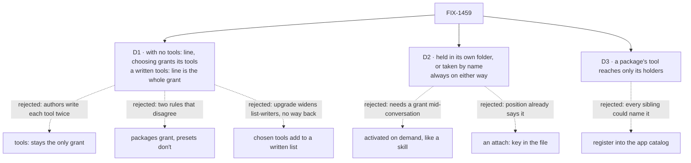

# FIX-1459 · Decisions

[Spec](SPEC.md) · **Decisions** · [Rules](BUSINESS-RULES.md) · [Plan](PLAN.md) · [Docs](DOCS.md) · [Evolution](EVOLUTION.md)

Three calls. [D1](#d1) is the one to weigh: it reverses a rule the ticket was written with, on the
strength of a later call by the product owner, and it changes what existing workers can call.
[D2](#d2) narrows the ratified format's second mode. [D3](#d3) is the guarantee the ratify
already argued for, stated as a promise.

## The tree

Solid edges are what you're signing. Dashed edges lost, and the label says why.

## D1 · With no `tools:` line, choosing something grants its tools; a written `tools:` line is the whole grant

| | |
|---|---|
| **Instead of** | The ticket's rule: *attaching a package never widens what a seat may call; a package tool the seat doesn't list in `tools:` fails loudly at load*. Today that is also how capability presets work: picking one gives a worker its text and none of its tools |
| **Because** | On 2026-09-19 the owner locked the opposite for presets ([FIX-1464](https://linear.app/fixpoint-labs/issue/FIX-1464)): picking a preset *implies* its tools, `tools: []` still means nothing. That ticket lists this one as a clash it hasn't resolved. Shipping packages on the old rule would teach a rule the owner has already retired, and would leave two authoring stories that disagree, which FIX-1464 forbids by name. So this spec builds FIX-1464's rule once, for both. Its open question, what an **omitted** `tools:` means, is answered here: the tools of everything the worker chose. A **written** `tools:` line keeps meaning exactly what it lists, `tools: []` included. Adding chosen tools to a written list was the first draft, and review showed its cost: a worker that picks a preset and lists two catalog tools would gain the preset's tools on upgrade, with no line that keeps its old reach, because `tools: []` also drops the two it listed. Only what the worker's own file chose counts: presets the kind switches on by default still grant nothing, and chosen tools don't travel to a delegate |
| **Locks in** | A worker with no `tools:` line reaches what it holds and picks; one with a line reaches that line. A worker that writes a list and holds a package names the package's blocks in the list to call them. **Existing workers that pick a tool-bearing preset and write no `tools:` line gain its tools** on upgrade; they had no tools before, so `tools: []` restores their old reach exactly. This ships with a changelog line and that migration note |

**What would change my mind:** the owner choosing *list it too* on the decision card. Then the
ticket's original rule stands, presets are untouched, FIX-1464 stays open, and PR-A is dropped from
the plan. Nothing else in this set moves.

## D2 · A worker holds a package by having it in its folder, or takes one from a library by name; always on either way

| | |
|---|---|
| **Instead of** | The ratified format's second mode as the POC built it: a library *offers* a package and the model *activates* it mid-conversation, like a skill. And the ratified `attach: [seat, library]` key |
| **Because** | Activating mid-conversation means a tool appearing mid-conversation, and nothing in the framework grants a tool after a worker starts. Building that is a runtime grant path, which is the second door every predecessor refused. Skills already cover "instructions only when relevant". And where the folder sits already says who it is for (the tree's rule: path is scope), so an `attach:` key would be a second place to say it that can disagree with the first |
| **Locks in** | Every package a worker holds costs its text on every turn. An on-demand mode stays possible later: it is a new way to hold one, not a change to the file |

## D3 · A package's tool reaches only the workers that hold it

| | |
|---|---|
| **Instead of** | Registering a package's blocks in the app's tool catalog, which is what a TypeScript capability does today |
| **Because** | The catalog is app-wide. A package held by one worker would become a name every worker of the kind could list. The ratify made this call, and it is the reason a package is worth more than a capability for handing something to one worker |
| **Locks in** | Two workers that want the same package's tool both hold the package, from their own folders or from a shared library. A package's block name must not collide with anything else the worker can call; a collision is refused, not shadowed |

## Decided, not asked

- **The text is read when the app starts; the code is found by `fsdev gen`.** Same split as
  `WORKER.md` and `blocks/` today. It is also the owner's authorship constraint made concrete:
  reading `PACKAGE.md` takes the file's text, so a package stored as a resource later is a new
  caller of that reader. The tool half has no run-time route and is recorded as a known gap.
- **Instructions reach the worker the way its team's instructions do**, in what the hire step hands
  the worker, not as a generated capability preset. Same observable result; a preset would have to be
  installed on the whole kind and switched off for every other worker. See [Evolution](EVOLUTION.md).
- **Every block in a package's `blocks/` is a tool of that package.** No list in the frontmatter to
  keep in step with the folder.
- **Frontmatter is `description:` only**, required, as every other convention file. Any other key
  is refused by name.
- **No documents, no `resources/` or `references/` inside a package**: refused if present. Owner ruling.
- **Package names follow the tree's segment rules**; the name is the folder's.

## Considered and dropped

| Alternative | Why not |
|---|---|
| Compile to a capability preset, as ratified | Works, but the preset lives on the kind and reaches every worker unless switched off per worker. The hire step already carries per-worker instructions |
| Reuse `SKILL.md` for packages | The ratify's variant A: a skill cannot carry a tool's code and has no always-on mode |
| Hold this ticket until FIX-1464 ships on its own | Two tickets changing the same grant rule in sequence, with a window where they disagree. The rule is small; the format is the bigger half |
| A pluggable "package source" so resource-stored packages work now | Nobody asked for it yet, and it buys nothing for the tool half, which is the hard half |

## Open

- **D1** is on a decision card with the owner. The draft follows the recommendation.

## How it got here

- **Review, round 1** — Codex showed that adding chosen tools to a *written* list widens
  list-writers on upgrade with no way back; D1 now leaves a written list literal. Controls,
  per-turn collisions and the *list it too* fallback were tightened with it.
- **Draft** — framed as an authoring surface over machinery that already ships, per the ratify;
  folded FIX-1464's grant rule in because the two clash by name; narrowed the library mode to
  take-by-name; two PRs, the grant rule first.
