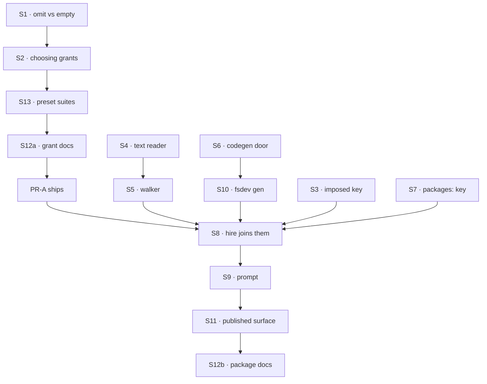

# FIX-1459 · Plan

[Spec](SPEC.md) · [Decisions](DECISIONS.md) · [Rules](BUSINESS-RULES.md) · **Plan** · [Docs](DOCS.md) · [Evolution](EVOLUTION.md)

Written for the implementing agent. IDs cross-reference [BUSINESS-RULES.md](BUSINESS-RULES.md)
(BR-n) and [DECISIONS.md](DECISIONS.md) (D-n). `tdd`. Two PRs: **PR-A** the grant rule, **PR-B**
the format. If the owner rules *list it too* on D1, PR-A is dropped and PR-B grants nothing (see
*At implement time*).

## Surfaces

| ID | Package · role | Change | Rules |
|---|---|---|---|
| S1 | `workforce` · the hire step's `tools:` split, and the kind's `tools:` setting | Record whether the worker **wrote** `tools: []` **before** the hire splits `tools:` into own-folder blocks and catalog names (that split can leave an empty catalog list for a worker that listed only its own blocks). Pass the answer on as an imposed withhold flag; never infer it from the list after the split or after the schema default | BR-2 BR-3 BR-5 BR-8 |
| S2 | `workforce` · the agent kind's per-turn tools slot | Add the tools of every preset the worker's file **picked**, read from its raw selection (not only the presets the per-turn resolver still delivers, which skips presets already on for the kind). Function-valued preset tools join per turn. Nothing is added when S1's withhold flag is set. The kind's mint-time check refuses a picked preset's static tool whose name collides with the worker's other tools | BR-3 BR-4 BR-6 BR-7 BR-21 BR-29 BR-31 |
| S3 | `workforce` · the hired worker's settings contract | One more imposed key, beside the team's instructions, own skills and own tools: the worker's **packages**, each with its text and its blocks. Its own key, not `seatTools`, whose documented meaning is what the worker listed. Refused if a file declares it. Documented for custom kinds: reading it is optional, as for the other imposed keys | BR-15 BR-32 |
| S4 | `workforce` · the package text reader | A pure reader: `PACKAGE.md` text in, `{ description, body }` out, or a named refusal. Takes a string, never a path | BR-16 BR-17 BR-28 |
| S5 | `workforce` · the package walker at start | Walks `packages/` at org, team and worker level with the shared structural primitives; calls S4 per file; refuses the shapes in BR-18, BR-20, BR-24, BR-25 | BR-9 BR-10 BR-18 BR-20 BR-24 BR-25 |
| S6 | `workforce` · codegen, a fourth code door | Finds `packages/<name>/blocks/*.ts` at the three levels without opening modules; renders a `packageBlocks` map keyed by the package's address. Reuses the seat-blocks door's refusals | BR-22 BR-27 |
| S7 | `workforce` · `WORKER.md` | New key `packages:` (list of names). Resolved at the hire against the worker's team library, then the org's | BR-10 BR-11 BR-12 BR-13 |
| S8 | `workforce` · the hire step | Joins S5's text and S6's blocks per worker: held (own folder) plus taken (`packages:`). Puts both on S3's key. Refuses a package block colliding with the worker's own or team blocks, its catalog names or another held package, and the store rule | BR-9 BR-13 BR-14 BR-19 BR-21 BR-23 BR-26 |
| S9 | `workforce` · the built-in agent kind | Renders S3's text after the team's and the worker's own instructions; adds S3's blocks to the tools slot unless S1's flag is set. Delegation's seat fence keeps reading the worker's listed names only | BR-1 BR-2 BR-15 BR-30 |
| S10 | `fsdev` · `gen` | Passes `packageBlocks` through; `--check` covers it | BR-27 |
| S11 | Tests · `published-tree-surface.test.ts` | Rows for `packages/<name>/PACKAGE.md` and `packages/<name>/blocks/<block>.ts` at each level; `PACKAGE.md` joins the fixed leaves; `packages` joins the reserved segments | — |
| S12a | Docs, PR-A | The grant edits in [DOCS.md](DOCS.md), both architecture docs, and the agent kind's module comments; `minor` changeset naming BR-4's upgrade change | — |
| S12b | Docs, PR-B | The rest of [DOCS.md](DOCS.md) and the README section; `minor` changeset | — |
| S13 | Tests · the preset suites | Update any check asserting that an omitted `tools:` plus a picked tool-bearing preset calls nothing (FIX-1388 BR-16's old reading). Show each one red against S2 first, then change it; checks written with `tools: []` stay untouched | BR-4 BR-5 |

**Removed:** the sentence in the kind's module comment and in the docs that `tools:` is the only
grant, and `catalogToolsFromUses`' role as the *only* route a preset's tool reaches a worker (the
catalog fill stays; for a preset on by default it is how a worker still names that tool explicitly).

## Sequence



### PR plan

| id | deliverables | depends_on |
|---|---|---|
| PR-A | S1, S2, S13, S12a | — |
| PR-B | S3–S11, S12b | PR-A |

S4–S7 do not depend on PR-A and may be built in parallel with it; only S8 needs PR-A's grant.

## Checks

| ID | Runs after | Passes when |
|---|---|---|
| V1 | S1 | Omitted and `[]` are told apart after the schema, on a file record and on a stored roster row (BR-8) |
| V2 | S2 | BR-3 (including a worker that lists only its own blocks), BR-4, BR-6, BR-29, BR-31 green; BR-5, BR-7 green with the existing suites **unmodified**. Negative control: drop S1's flag and read the post-split list instead, and the own-blocks case of BR-3 goes red |
| V3 | S4 | Each refusal in BR-16/BR-17 red before green; S4 called with a string only (BR-28) |
| V4 | S5, S6 | BR-18, BR-20, BR-22, BR-24, BR-25, BR-27, each red first. The symlink matrix gains package rows |
| V5 | S8, S9 | BR-1, BR-2, BR-9–BR-15, BR-19, BR-21, BR-23, BR-26, BR-30, BR-32. BR-14 asserts the sibling **after** proving the holder really got the package, so it cannot pass vacuously |
| V6 | S11 | The published-surface suite's totality check passes with the new rows, and fails with one row removed |
| VG | S9 | Goal, real model: `goals/workforce-packages/a-held-package-reaches-one-worker/run.mts`. A worker holding a package follows its instruction and calls its tool; a sibling of the same kind holding nothing does neither; the holder with `tools: []` gets the text and no call. Control: move the package to the sibling's folder, and the legs swap |
| V7 | all | `pnpm --filter @flow-state-dev/workforce test`, `typecheck`, and the four existing grant-gate suites run unmodified except S13's named changes |

## Pinned names

| Where | Name | Why pinned |
|---|---|---|
| File | `PACKAGE.md` | Ratified. An author types it |
| Folder | `packages/` at org, team, worker level | An author types it; path is scope |
| `WORKER.md` key | `packages:` | An author types it |
| Frontmatter | `description:`, and nothing else | Same as every convention file |

Everything else, including the generated map's export name and S3's key, is yours to name.

## Guardrails

| Rule | Because |
|---|---|
| One place decides the withhold: the hire step, from what the file wrote, before any split. The hire grants what it can see (package blocks); the kind grants what only it can see (its presets' tools); both read the one flag | Two layers reading `tools:` two ways is how a withhold gets lost, which is the first thing the validator found (tenet 5) |
| S4 takes text and knows nothing about disk | The owner's authorship constraint: a resource-stored package later is a new caller, not a rewrite |
| Package blocks never reach the app catalog | D3; a catalog entry is nameable by every worker of the kind |
| Every refusal is collected and names worker and file | Every other reader in the tree does it; an author fixes all of them in one run |
| An omitted `tools:` is never rewritten to `[]` anywhere on the path, including stored rows (BP-030) | The two mean opposite things after D1 |
| Test the off state: a worker with no package and no preset, byte for byte (BP-035) | BR-7 is the promise to every existing app |
| Assert on the worker actually built, not on the map passed in | The framework re-merges declarations; a check on the input has passed while the built worker disagreed before |

## Docs

Reconcile [DOCS.md](DOCS.md) against shipped behaviour after V5 and VG pass, dispatch
`docs-writer` then `docs-editor` for the prose, and publish in the PR that ships each half.

## Sketch · pseudocode, illustrative, react to the shape

```
at start (loader):   for each packages/NAME/PACKAGE.md at org, team, worker level:
                         text ← read the file
                         manifest ← readPackage(text)            ← no path inside
at build (fsdev gen):  packageBlocks[address][block] ← each packages/NAME/blocks/*.ts
at the hire, per worker:
    held  ← packages in its own folder
    taken ← each name in packages:, nearest library first, else refuse
    for each package in held ∪ taken:
        settings.packageInstructions += manifest.body
        registry += packageBlocks[address]                       ← collisions refused
        chosenTools += names of those blocks
    chosenTools += static tools of selected presets
    grant ← (tools was written as []) ? nothing : tools ∪ chosenTools
```

**POC:** none new. The ratify's probes (`origin/spec/FIX-1394-matrix:spec-poc/FIX-1394-probes/`)
showed a package compiled onto shipped machinery reaches one worker and not its sibling, on the
real path. Its reader read from a path and hand-parsed frontmatter; this plan does neither.

## At implement time

- **D1's card.** If the owner picks *list it too*: drop PR-A and S1/S2, and S8 instead
  refuses a package block the worker's `tools:` doesn't name, with the line to add. BR-1, BR-3,
  BR-4, BR-6 invert; everything else stands.
- **FIX-1435** may have hoisted the shared slot walk. If so, S5 and S6 use it rather than adding a
  fifth copy.
- **Stored roster rows** (`roster/rows.ts`) keep `settings` as declared. Confirm an omitted
  `tools:` survives a round trip before relying on V1.
- Compare [Evolution](EVOLUTION.md)'s predecessor claims with current code; approved intent
  alone does not establish shipped behaviour.

## Follow-ups

- Four copies of the worker-slot descent and three of the TypeScript-extension list across the
  loader and codegen doors; this adds a fifth caller. `improve-codebase-architecture`, with FIX-1435.
- The four Markdown convention readers each carry a private copy of the same frontmatter parse;
  S4 would be a fifth. Worth one shared parser, not in this scope.
- An on-demand package mode (D2) and resource-stored packages: file when someone asks.
