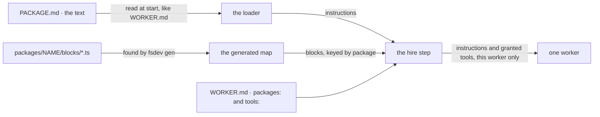

# FIX-1459 · Ship PACKAGE.md: instructions and a tool, handed to a worker as one folder

**Spec** · [Decisions](DECISIONS.md) · [Rules](BUSINESS-RULES.md) · [Plan](PLAN.md) · [Docs](DOCS.md) · [Evolution](EVOLUTION.md)

Feature · `workforce` + `fsdev` · large · 2 PRs · no epic (related to the W4 epic,
[FIX-1407](https://linear.app/fixpoint-labs/issue/FIX-1407), which ratified the format)

## Five people, before and after

| Someone who… | Today | After |
|---|---|---|
| **wants to hand a worker "how to do refunds" plus the refund tool** | Asks an engineer to write a TypeScript capability, install it on the kind, and add a preset for that one worker | Drops a `packages/refunds/` folder holding a `PACKAGE.md` and one block into that worker's folder. Next start, the worker has both |
| **keeps a package the whole team might use** | Has nowhere to put it. A capability is app code, and a skill cannot carry a tool | Puts the folder in the team's `packages/`. A worker takes it with one line, `packages: [refunds]`, and one that doesn't never sees it |
| **picks a tool-bearing capability preset for a worker** | Writes the preset's name, then writes its tools a second time under `tools:`. If the app switched the preset off by default, an engineer also has to add each tool to the kind's catalog first. Miss either and the worker gets the text and none of the tools | Writes the preset's name. The tools come with it, as they come with a package |
| **wants a worker that can call nothing** | Writes `tools: []` | Writes `tools: []`, and it still calls nothing, whatever it holds or picks |
| **makes a mistake in a package** | n/a | Is refused at start, with the worker and the file named: an unknown key, a block name another tool already uses, a package the worker names that no library in its reach offers |

A package is two things an engineer already knows how to wire, instructions and a callable block,
with a Markdown file in place of the wiring. The owner's reason to build it is the next step:
eventually anyone gets a package written for them by a model, stored as a resource rather than a
file. This spec ships the file, and keeps the reading of a package's text separate from finding it
on disk so that step is a new caller, not a rewrite.

## What changes

![Two panels, same vocabulary. Today a refunds worker names a capability preset and then lists the same tools again under tools, and every bundle of instructions plus tools is TypeScript an engineer writes in app code outside the tree. After, the worker folder holds packages/refunds with a PACKAGE.md and one block, a team packages folder offers escalation which the worker takes with packages: [escalation], the duplicated tools line is gone, and tools: [] is shown as the one line that withholds everything](figures/what-changes.svg)

Read it by what the worker's file has to say. Today it says everything twice, and the half that
matters lives outside the tree. After, where the folder sits and one name in `packages:` are all it
says, and `tools: []` is still the one line that takes everything away.

**A worker holding its own package, and taking one from its team:**

```diff
  workforce/teams/support/
+   packages/
+     escalation/PACKAGE.md            ← offered to every worker on the team; taken by name
+     escalation/blocks/page-oncall.ts
    workers/refunds-clerk/
      WORKER.md
+     packages/
+       refunds/PACKAGE.md             ← held by this worker, always on
+       refunds/blocks/issue-refund.ts
```

```diff
  ---
  description: Handles refund requests
+ packages: [escalation]
  capabilities: { billing: [lookups] }
- tools: [lookup-invoice, lookup-customer, issue-refund]
  ---
```

```diff
+ ---
+ description: How we issue refunds, and the tool that does it
+ ---
+ Refund only against an invoice you looked up in this conversation.
+ Over $500, page on-call with the invoice id before calling issue-refund.
```

## How a package reaches the worker



The text and the code travel separately because they are found differently: Markdown is read
when the app starts, code is found by the build step. The hire step is the one place they meet,
and the only place a tool is granted.

## Package or skill?

![One question decides it: does the guidance need a tool the worker can't already call? No means a skill, yes means a package. Five rows compare them. A skill is SKILL.md plus reference files, arrives when something activates it, uses the tools the worker already has, is held by every worker in a team or org folder, and is copied to the worker and refreshed. A package is PACKAGE.md plus blocks, is in the prompt every turn, brings its tools and grants them unless tools: [] is written, reaches only a worker that names it from a shared folder, and is read from the file at start](figures/package-or-skill.svg)

The tool is the whole difference. A skill can already be always on, through the worker's `active:`
list, but it can never bring a tool. That is why a shared folder treats them differently: a skill
in a team folder costs nothing until it activates, while a package would hand its tools to every
worker on the team, so a worker has to name it.

## What stays as it is

- Skills, `WORKER.md`, `TEAM.md` and TypeScript capabilities. Nothing moves onto the new format.
- The app's tool catalog. A package's block is never nameable by a worker that doesn't hold it.
- Documents. A package carries none; a document is org-wide by design, and a worker's reach over
  documents is its `resources:` line.
- A worker that writes `tools: []` calls nothing, as today.
- A tool a worker chose does not travel to a worker it delegates to, the same as a block in its own
  folder today.
- A worker kind you write yourself receives a held package's text and blocks in the settings the
  hire hands it, and decides what to do with them. Everything above is the built-in kind's promise.

## Sign off

1. **[D1](DECISIONS.md#d1) · Choosing something grants its tools: a package a worker holds, and a
   capability preset it picks. Only `tools: []` withholds.** If wrong: a worker gains a tool
   nobody wrote next to its name, and existing workers that pick a tool-bearing preset without
   listing its tools start calling them.
2. **[D2](DECISIONS.md#d2) · A worker holds a package by having it in its own folder, or takes one
   from its team or org library by name. Either way it is always on.** If wrong: packages that
   should load only when relevant cost every turn their text, until an on-demand mode ships.
3. **[D3](DECISIONS.md#d3) · A package's tool reaches only the workers that hold it.** If wrong:
   two workers of one kind can't share a package's tool without both holding the package.

**Open: [D1](DECISIONS.md#d1) is with you** as a decision card in the project thread. The draft
follows its recommendation. Number 1 is the one to weigh. What was rejected is in
[DECISIONS.md](DECISIONS.md), the cases in [BUSINESS-RULES.md](BUSINESS-RULES.md).
