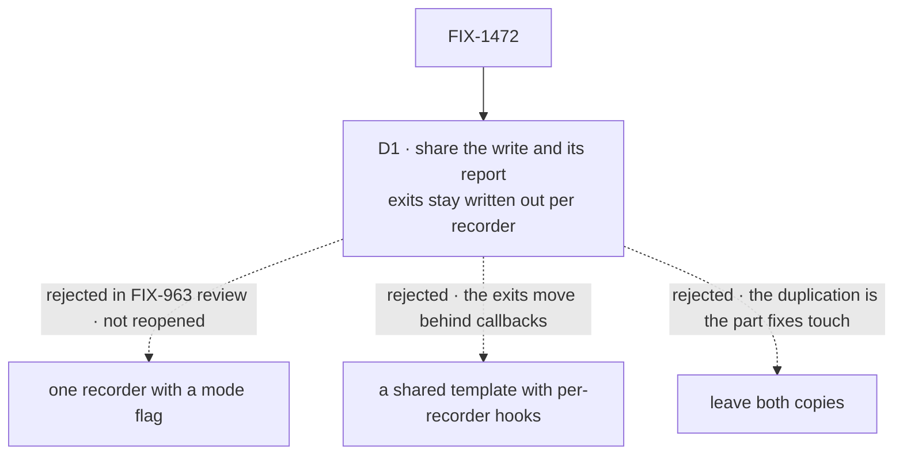

# FIX-1472 · Decisions

[Spec](SPEC.md) · **Decisions** · [Rules](BUSINESS-RULES.md) · [Plan](PLAN.md) · [Docs](DOCS.md)

One decision is the sign-off surface. Everything else here is context for it.

## The tree

Solid edges are what you're signing. Dashed edges lost, and the label says why.

## D1 · The shared part is the write and its report; each recorder keeps its own exits written out in its body

| | |
|---|---|
| **Instead of** | A shared template that runs the whole recorder and asks each one, through hooks, what to do at each exit |
| **Because** | The two recorders' exits are opposite rules, not variations. On a write that saved nothing, the success recorder must leave its lease running and its claim set for the rescue that follows; the error recorder stops renewal because nothing follows it. A report that could not be delivered is fatal everywhere; a recorder failure defers except at the hand-off gate. Behind a hook or a switch, those rules stop being visible where they run, which is the objection that sank the mode flag twice in FIX-963's review (tenet 6: readability is an output; a reviewer checks an exit by seeing it where it runs) |
| **Locks in** | A few lines of exit bookkeeping (stop renewal, clear the claim) stay in both recorders, in their different orders, on purpose. A future third recorder writes its own exits too. The shared steps can never be told which exit to take, so nobody can later add a mode to them without reopening this card |

It comes down to reading where a recorder exits: the template moves every exit behind a callback.

**What would change my mind:** the exits converging. If both recorders came to stop renewal and
clear the claim at the same points for the same outcomes, a shared exit step would stop hiding a
difference and start removing one.

## Decided, not asked

- **Reading the issue's wording.** It says "the two recorders keep their containment behaviour:
  one is fatal immediately everywhere, the other defers … except at the hand-off gate". In the
  code those two rules belong to the two failure classes (a report that couldn't be delivered, and
  a recorder failure), and both are enforced in the error recorder's guards. This spec keeps both
  guards as two separate statements, and keeps every per-recorder exit too, so either reading of
  the sentence is honoured.
- **The shared steps live beside the recorders and are not exported.** No public surface moves;
  a new module would be a second place to look for one file's logic.
- **The report's `recorder` label ("complete" or "fail") is passed to the shared step.** It names
  what failed in the persisted entry. It decides no control flow.
- **The raise-or-defer choice stays the existing wiring option**, set by the composition site.
  It is not a new flag, and this issue doesn't touch it.
- **No `EVOLUTION.md`.** FIX-963's design is retained whole; this depends on it and amends none
  of it.
- **Anything that looks wrong while pinning the matrix is filed, not fixed here.** A behaviour
  change inside a refactor is exactly what the matrix exists to rule out.

## Considered and dropped

| Alternative | Why not |
|---|---|
| One recorder with a mode flag | Rejected twice in FIX-963's review by two reviewers, and ruled out by the architect's fence for this issue. It hides two propagation rules behind a flag. Not reopened here |
| A shared template with per-recorder hooks | D1's losing column. Removes the last duplicated lines at the cost of moving every exit out of sight |
| Leave both copies | The simplest option. What is still duplicated is small (the baseline, write, classify sequence and the report-then-raise tail), but it is precisely the part a correctness fix to write-correlation touches, so it is where drift would land |
| Share one predicate for the two rescue guards | Merges the "fatal everywhere" and "defers except at the gate" rules into one function with a site argument. That is the flag, one level down |

**Open: none.**

## How it got here

- **Draft** — framed as finishing FIX-963's extraction: share the baseline, write, classify,
  release sequence and the report-then-raise tail as two steps; keep every exit and both
  containment guards explicit per recorder; prove equivalence with a characterization matrix
  pinned on `main` before the move. One PR.
