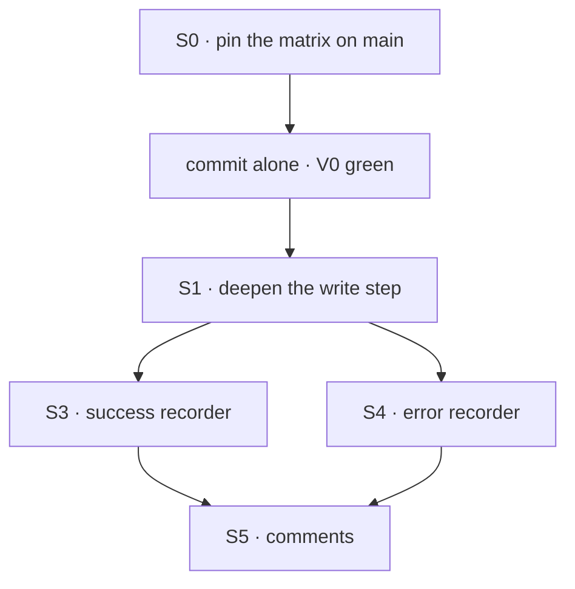

# FIX-1472 · Plan

[Spec](SPEC.md) · [Decisions](DECISIONS.md) · [Rules](BUSINESS-RULES.md) · **Plan** · [Docs](DOCS.md)

Written for the implementing agent. IDs cross-reference [BUSINESS-RULES.md](BUSINESS-RULES.md)
(BR-n) and [DECISIONS.md](DECISIONS.md) (D-n). Discipline: characterize, then refactor (`tdd`'s
refactor step with the red state produced by planted controls). One PR, two commits minimum: the
matrix first, alone.

## Surfaces

| ID | Package · role | Change | Rules |
|---|---|---|---|
| S0 | `orchestration` · a characterization test beside the recorder tests | One test per BR row, block-level, both site kinds where the row depends on site. Reuse an existing test where it already pins the row exactly; cite it in a comment rather than duplicating it | BR-1…BR-18 |
| S1 | `orchestration` · the recorder module · **the shared write step: `classifyAndRelease`, deepened** | It takes the write as an attempt (`(write token) => Promise<void>`) instead of a token plus a caught error, mints the baseline from the row as it reads now, and owns the try/catch; classify and release are unchanged. Rethrows the write's error untouched when it saved nothing; otherwise returns the report. Its name or doc comment **says it rethrows the caller's error when nothing saved**. Absorbs the two inline baseline-and-try blocks; no new function wraps it | BR-4 BR-5 BR-6 BR-13 BR-14 BR-18 |
| S2 | same module · **the tail, not moved** | Each recorder keeps its own `reportRecorderFailure` call (already shared) followed by its own `raisesHere` branch. That branch is the recorder-failure containment rule, which defers except at the hand-off gate, and D1 keeps that rule visible where it runs. The shared step never reads the raise-or-defer setting (it may still read the wiring's run stamp for the report, as today) | BR-5 BR-14 BR-15 BR-16 |
| S3 | same module · the success recorder | Uses S1; keeps the S2 tail inline. Its no-claim and parked exits, the stop-then-clear order, and the rethrow that bypasses both stay inline in its body | BR-1…BR-6 |
| S4 | same module · the error recorder | Uses S1; keeps the S2 tail inline. The two guards (report-delivery failure; recorder failure at a raising site) stay two separate statements at the top. The `finally` renewal stop and `onError` stay inline | BR-7…BR-14 |
| S5 | same module · file header and the recorders' doc comments | Describe the split: one shared write step, exits (including the tail) per recorder, and why (D1). Remove prose that describes the old duplicated shape (BP-034). The source's existing `(BR-13)` citations at the two report sites name FIX-963's rule (a report-delivery failure is caught by nothing), not this spec's BR-13: drop them or re-point them to FIX-963, so the two numberings never coexist | — |
| — | **Removed** | The two inline baseline, write, classify blocks | — |

`releaseRow`, `readTaskQuietly`, `raisesHere` and `stopLeaseRenewal` already exist and stay.
The shared step is the existing helper deepened, not a new step beside it: a wrapper that only
calls `classifyAndRelease` would be a shallow layer.

## Sequence



## Checks

| ID | Runs after | Passes when |
|---|---|---|
| V0 | S0, on unmodified `main` source | Every BR row has a test, and all pass before any source change. The commit touches test files only |
| V1 | S5 | V0's tests and the existing suites pass: `pnpm --filter @flow-state-dev/orchestration test`, the task-board scenarios in `@flow-state-dev/integration-tests` (`task-board-recorder-failure`, `task-board-hand-off-recorder-failure`, `task-board-drain-containment`), and `pnpm typecheck`. `git diff <V0 commit>..HEAD -- '*.test.ts'` is empty |
| V2 | S5 | **The control.** Each planted deviation, applied alone to the refactored source, turns at least the named row red, then is reverted: (a) stop renewal before the success recorder's rethrow → BR-4 · (b) let `onError: "skip"` swallow a report-delivery failure → BR-7 · (c) drop the site check from the recorder-failure guard → BR-9 · (d) skip the release when the board can't tell → BR-6 (the row stays `in_progress`). Releasing on `committed` is not a usable plant: the claim fence declines that write by design, so no row or entry changes. The PR body shows each red |
| V3 | S5 | The task board's export list is identical to `main` (diff the `export` statements of the task-board index and the package entry) |
| V4 | S5 | The shared write step's parameters include no recorder kind used for control flow, no mode, no `onError`, and nothing that selects an exit or raise-or-defer; from the wiring it reads only the run stamp, as `classifyAndRelease` does today. The `recorder` label only reaches the report (D1) |

The second path (BP-035) is the point of this issue: BR-4, BR-9 and BR-13 are the paths a
refactor breaks without anyone noticing, and V2 aims at them.

## Pinned names

None. The signature is yours, and so is renaming `classifyAndRelease` if a new name says it rethrows.

## Guardrails

| Rule | Because |
|---|---|
| The shared step never stops renewal, never clears the claim, and never raises or defers | The two recorders do these in different orders (success: stop then clear; error: clear then stop in `finally`), and BR-4 must do neither. Moving them in is how the exits collapse (D1) |
| No test edited after the V0 commit | An edited test is how a behaviour change passes as a refactor |
| The success recorder's call to the write step carries a comment that it rethrows when nothing saved, and that the rethrow skips the renewal stop below (BR-4) | The most dangerous exit now leaves from inside a call. D1 keeps exits visible where they run; the comment and the step's name are what keep this one visible |
| The report-then-raise-or-defer tail stays in each recorder | It is where the recorder-failure containment rule runs. Moving it into a shared step hands that step the raise-or-defer setting, which is the exit selection D1 and V4 rule out |
| The two rescue guards stay two statements | One is fatal at every site, the other defers except at the gate. One predicate with a site argument is the flag one level down (DECISIONS → considered and dropped) |
| A row that looks wrong while pinning is pinned as it is and filed | This issue promises no behaviour change; the matrix records today, not what today should be |

## Docs

[DOCS.md](DOCS.md) states there is no reader-facing impact. Nothing to publish. S5 is code
comments only.

## Sketch · pseudocode, illustrative, react to the shape

```
the shared write step = classifyAndRelease, deepened (collection, claim, recorder label, attempt):
    token ← baseline from the row as it reads now
    try   attempt(token)
    catch err → classify against token
                saved nothing → rethrow err
                can't tell    → release the row, best effort
                return report(label, verdict, err)
    return nothing


success recorder:  [no claim? stop, return] [parked? stop, clear, return]
                   report ← write step(…complete…)   ← rethrow skips the next line
                   stop; clear
                   if report → emit it (fatal if it fails); if the site raises → throw recorder failure
error recorder:    [report-delivery failure? stop, rethrow]
                   [raising site and recorder failure? stop, rethrow]
                   try { if claim: [parked? skip write] else report ← write step(…fail…); clear }
                   finally stop
                   if report → emit it; if the site raises → throw recorder failure; return errored
                   onError
```

**POC:** none. The premise (both copies are the same sequence) is read directly off one file,
and the matrix is the check.

## At implement time

- Confirm the recorder module is unchanged since `67a3bb9b`. If it moved, re-derive the BR rows
  from the new source before pinning, and note any difference in the PR.
- If [FIX-1473](https://linear.app/fixpoint-labs/issue/FIX-1473) has landed, the integration
  harnesses moved; V1's scenario names may differ.

## Follow-ups

- [FIX-1473](https://linear.app/fixpoint-labs/issue/FIX-1473): the two recorder-failure
  integration harnesses duplicate poisoned-store setup. Tests only; separate.
