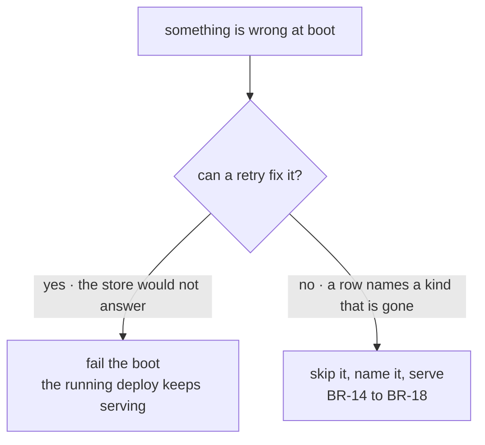

# FIX-1475 · Business rules

[Spec](SPEC.md) · [Decisions](DECISIONS.md) · **Rules** · [Plan](PLAN.md) · [Docs](DOCS.md)

The cases, written as rules. Each says what a person or the system does and what happens. The
*proved by* column is the check the plan runs; [PLAN.md → Checks](PLAN.md#checks) carries the
red state for each — what would have to be true for it to fail.

## Hiring a seat while the app runs

| # | When | Then | Proved by |
|---|---|---|---|
| BR-1 | A hire names a seat id, a kind the app carries, and settings that kind admits | One row is written at the caller's org, then the seat is registered. It answers on `<orgId>.<seatId>` from the next request onward, in this process | CI · goal check over the real HTTP route |
| BR-2 | A hire names a seat id this org already holds | Refused. No row is overwritten and no address is rebound. The refusal names the seat | CI |
| BR-3 | A hire names a kind the app does not carry | Refused before anything is written, naming the kinds it does carry | CI |
| BR-4 | A hire carries a setting the kind's schema refuses | Refused, naming the setting. No row, no registration | CI |
| BR-5 | A hire arrives with no resolved org | Refused. Org is read from the resolved principal and never from the request body (BP-031) | CI |
| BR-6 | Two hires of the same seat in the same org arrive together | Exactly one wins. The other is refused as a duplicate — never a silent overwrite, never two rows | CI · concurrent, both awaited |
| BR-7 | Two different orgs hire the same seat id | Both succeed. Two rows, two addresses, neither aware of the other | CI |
| BR-8 | A hire's address is already registered — by a file-declared seat, or by a reload | Refused before the row is written. The refusal names what holds the address | CI |

## What a redeploy does

| # | When | Then | Proved by |
|---|---|---|---|
| BR-9 | An app boots with rows for one or more orgs | Every readable row's seat is registered and answers with the settings that row carried, not the settings any file carries | Goal check: hire, restart, ask |
| BR-10 | An org has no rows | Nothing is registered for it. The file-declared seats are unaffected either way | CI |
| BR-11 | The roster read does not complete within its bound | The boot fails with an error naming the org and the store. Nothing is left half-registered | CI · a store stub that never answers |
| BR-12 | There are more orgs than the reload's cap | The boot fails, naming the count and the cap. **No prefix is loaded** — a short roster is never served as the whole one | CI |
| BR-13 | The file-declared roster fails to load | Unchanged from [FIX-1429](https://linear.app/fixpoint-labs/issue/FIX-1429): reported at boot, and a folder that cannot be read is a seat this app does not have | Existing behaviour, re-asserted |

## When the roster and the code disagree

A stored row was written by a past runtime against code that has since moved. None of these
stops the app.

| # | When | Then | Proved by |
|---|---|---|---|
| BR-14 | A row names a kind the code no longer has | The seat is skipped. The boot names the org, the seat and the missing kind. Every other seat still answers, and the address 404s | CI · goal check asserts the app still serves |
| BR-15 | A row carries settings the kind's schema now refuses | Skipped and named, on the same terms as BR-14 | CI |
| BR-16 | A row is unreadable — a missing field, a shape nothing can parse | Skipped and named. **The row is not deleted and not rewritten**; a boot never repairs data it did not understand | CI |
| BR-17 | A row's address is already held by a file-declared seat | The file-declared seat wins and the row is skipped and named. Code ships with the deploy; a row did not | CI |
| BR-18 | Any seat was skipped | The count and the list are readable from the roster surface, not only from a log line. "The roster" and "what answers" are two numbers | CI |

The split is [D2](DECISIONS.md#d2), and it is one rule read from two sides. BR-11 and BR-12 are
the left branch; BR-14 to BR-18 are the right one.

## Firing a seat

| # | When | Then | Proved by |
|---|---|---|---|
| BR-19 | A fire names a seat this org holds | The row is removed and the address stops resolving. The next request to it is a 404, and the next boot does not bring it back | CI · goal check across a restart |
| BR-20 | A fire lands while an action on that seat is running | That run finishes and its items are persisted. Nothing is cancelled and nothing is truncated | CI · fire mid-stream, assert the stream completes |
| BR-21 | A fire names a seat this org does not hold | Refused. The lookup is org-scoped, so another org's seat is not reachable by fire even by exact id | CI |
| BR-22 | A fire names a file-declared seat | Refused. Files are the authoring path; that seat is removed by editing its folder | CI |
| BR-23 | Work resolves the fired address afterwards — a resume, a scheduled dispatch, a queued job | It fails as an unknown flow, exactly as it would in a process that never hired the seat. Deliberately the same answer: a tombstone that expired differently per process would be a worse lie than a plain refusal | CI |
| BR-24 | A seat's sessions, state or resources exist when it is fired | They are untouched. Destroying them is a separate, irreversible operation and is not in this issue | CI |

## What this issue does not change

| # | When | Then | Proved by |
|---|---|---|---|
| BR-25 | Anyone lists the app's flows | Every registered instance is listed, other orgs' included, exactly as today. That gap is [FIX-1486](https://linear.app/fixpoint-labs/issue/FIX-1486)'s and is cited rather than worked around here | Existing behaviour, asserted unchanged |
| BR-26 | A seat declares a webhook provider the app did not configure | Caught at boot, as today — so a seat hired at runtime is not caught until the next boot. Named as a limit, not closed here | Asserted and documented |

## Failure taxonomy

**Fatal:** a roster read the store will not complete (BR-11), and a roster larger than the cap
(BR-12). Both stop the boot, so the deployment already serving keeps serving, and both are
retried by the platform because both are transient.

**Degrades:** every disagreement between a stored row and the code (BR-14 to BR-18). The seat
does not run, the skip is named and counted, and the app serves everything else.

**Refused, nothing changed:** every bad hire and every bad fire (BR-2 to BR-8, BR-21, BR-22).
The caller gets a named error and no partial write.

**Nothing retries silently.** The bounded roster read retries a fixed, small number of times and
then fails loudly; nothing else in this change retries at all.

## Acceptance criteria this issue owns

Hire a team over the reference app's real HTTP route against the Next-built app; restart the
app; ask a seat from that team a question and get an answer carrying the settings the hire
supplied — with one seat in the same roster naming a kind the code does not have, skipped and
named, while the rest answer. That is [ER-2](../../epics/FIX-1455/BUSINESS-RULES.md) and the
epic's proof, and it is the goal check the plan runs last.
