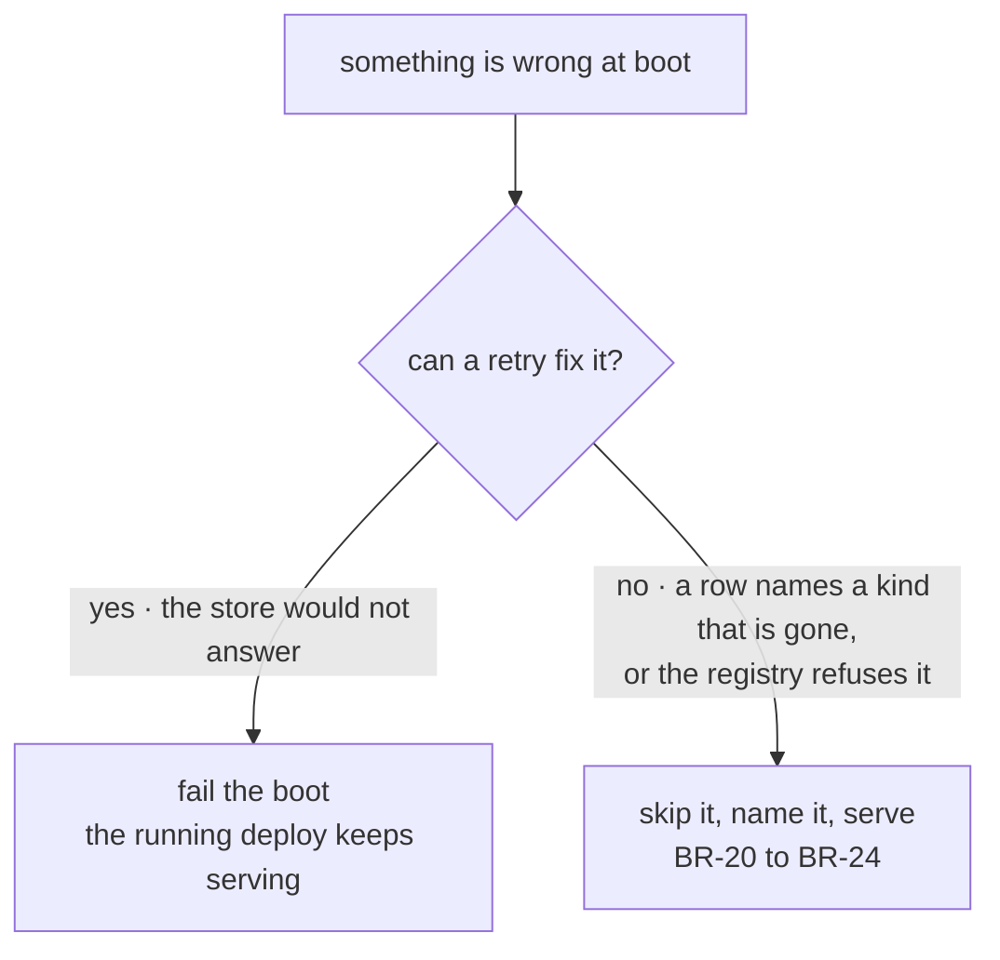

# FIX-1475 · Business rules

[Spec](SPEC.md) · [Decisions](DECISIONS.md) · **Rules** · [Plan](PLAN.md) · [Docs](DOCS.md)

The cases, written as rules. Each says what a person or the system does and what happens. The
*proved by* column is the check the plan runs; [PLAN.md → Checks](PLAN.md#checks) carries the
red state for each — what would have to be true for it to fail.

## Who may change a roster

The admin path writes durable state, so it authenticates itself rather than trusting what the
caller says about itself. The framework's stock resolver reads `userId` and `orgId` **out of the
request body**, which is fine for a demo flow and is not fine for this one.

| # | When | Then | Proved by |
|---|---|---|---|
| BR-1 | No admin credential is configured for the app | The admin flow is **not registered**. `hire` and `fire` are not reachable at any address, and no request can create one. Fail-closed | CI · boot with the credential unset, assert the address 404s |
| BR-2 | A hire or fire arrives without a valid admin credential | Refused. Nothing is read, written or registered | CI |
| BR-3 | A hire or fire carries an `orgId` in its body | **Ignored.** The org comes from the verified credential. A body naming another org changes nothing about which org is written | CI · send org `bravo` in the body under `acme`'s credential, assert `acme`'s roster changed and `bravo`'s did not |
| BR-4 | The verified credential resolves no org | Refused. There is no unscoped roster to write to | CI |

## Hiring a seat while the app runs

| # | When | Then | Proved by |
|---|---|---|---|
| BR-5 | A hire names a seat id, a kind the app carries, and settings that kind admits | One row is written at the credential's org, then the seat is registered. It answers on `<org>.<seatId>` from the next request onward, in this process | CI · goal check over the real HTTP route |
| BR-6 | A hire names a seat id this org already holds | Refused. No row is overwritten and no address is rebound. The refusal names the seat | CI |
| BR-7 | Two hires of the same seat in the same org arrive together | Exactly one wins. The other is refused as a duplicate — never a silent overwrite, never two rows | CI · concurrent, both awaited |
| BR-8 | A hire names a kind the app does not carry | Refused before anything is written, naming the kinds it does carry | CI |
| BR-9 | A hire carries a setting the kind's schema refuses | Refused, naming the setting. No row, no registration | CI |
| BR-10 | The org's id is not a legal address segment — it is empty, over-long, or contains a `.` | Refused, naming what a segment may be. Without this the address is ambiguous: org `acme` with seat `support.ada` and org `acme.support` with seat `ada` would both spell `acme.support.ada` | CI · assert both of those hires cannot coexist |
| BR-11 | Two different orgs hire the same seat id | Both succeed. Two rows, two addresses, neither aware of the other | CI |
| BR-12 | A hire's address is already registered | Refused before the row is written. The refusal names what holds the address | CI |
| BR-13 | The row is written and **registration then fails** | The row this hire created is deleted and the original failure is reported. A hire that failed leaves nothing behind | CI · force a registration failure after the write |
| BR-14 | That compensating delete also fails | Reported, and the stranded row is skipped and named at the next boot rather than failing it (BR-21). The two halves are what make a partial hire recoverable | CI |

## What a redeploy does

| # | When | Then | Proved by |
|---|---|---|---|
| BR-15 | An app boots with rows for one or more orgs | Every readable row's seat is registered and answers with the settings that row carried, not the settings any file carries | Goal check: hire, restart, ask |
| BR-16 | An org has no rows | Nothing is registered for it. The file-declared seats are unaffected either way | CI |
| BR-17 | The roster read does not complete within its bound | The boot fails with an error naming the org and the store. Nothing is left half-registered | CI · a store stub that never answers |
| BR-18 | There are more orgs than the reload's cap | The boot fails, naming the count and the cap. **No prefix is loaded** — a short roster is never served as the whole one | CI |
| BR-19 | The file-declared roster fails to load | Unchanged from [FIX-1429](https://linear.app/fixpoint-labs/issue/FIX-1429): reported at boot, and a folder that cannot be read is a seat this app does not have | Existing behaviour, re-asserted |

## When the roster and the code disagree

A stored row was written by a past runtime against code that has since moved. None of these
stops the app.

| # | When | Then | Proved by |
|---|---|---|---|
| BR-20 | A row names a kind the code no longer has | The seat is skipped. The boot names the org, the seat and the missing kind. Every other seat still answers, and the address 404s | CI · goal check asserts the app still serves |
| BR-21 | The registry **refuses** a reloaded seat — a duplicate address, a cross-flow schema conflict, anything | That one seat is skipped and named. The boot does not fail. Seats are therefore admitted **one at a time**, never as a batch whose first refusal ends the reload | CI · a roster with one refusable seat among good ones |
| BR-22 | A row carries settings the kind's schema now refuses | Skipped and named, on the same terms as BR-20 | CI |
| BR-23 | A row is unreadable — a missing field, a shape nothing can parse | Skipped and named. **The row is not deleted and not rewritten**; a boot never repairs data it did not understand | CI |
| BR-24 | Any seat was skipped | The count and the list are readable from the roster surface, not only from a log line. "The roster" and "what answers" are two numbers | CI |

The split is [D2](DECISIONS.md#d2), and it is one rule read from two sides. BR-17 and BR-18 are
the left branch; BR-20 to BR-24 are the right one. BR-21 is the branch that only works because
admission is per seat — a batch admission would put a refusable row on the left branch by
accident, which is D2 broken by mechanism rather than by intent.

## Firing a seat

| # | When | Then | Proved by |
|---|---|---|---|
| BR-25 | A fire names a seat this org holds | The row is removed and the address stops resolving **in this process**. The next request to it here is a 404, and no boot brings it back | CI · goal check across a restart |
| BR-26 | Sibling processes are serving that seat when it is fired | They keep serving it until they next start. A fire is durable immediately and process-wide only at the next boot — the same window a hire has, named in the same place (D1) | CI · two runtimes over one store |
| BR-27 | A fire lands while an action on that seat is running | That run finishes and its items are persisted. Nothing is cancelled and nothing is truncated | CI · fire mid-stream, assert the stream completes |
| BR-28 | The address a fire would release is held by an instance that did **not** come from this org's row | Nothing is unregistered. The row is removed and the mismatch is reported. BR-10's grammar is supposed to make this unreachable; the check is here because a guarantee nobody checks is how this goes wrong | CI · register a foreign instance at that address, assert it survives the fire |
| BR-29 | A fire names a seat this org does not hold | Refused. The lookup is org-scoped, so another org's seat is not reachable by fire even by exact id | CI |
| BR-30 | A fire names a file-declared seat | Refused. Files are the authoring path; that seat is removed by editing its folder | CI |
| BR-31 | Work resolves the fired address afterwards — a resume, a scheduled dispatch, a queued job | It fails as an unknown flow, exactly as it would in a process that never hired the seat. Deliberately the same answer: a tombstone that expired differently per process would be a worse lie than a plain refusal | CI |
| BR-32 | A seat's sessions, state or resources exist when it is fired | They are untouched. Destroying them is a separate, irreversible operation and is not in this issue | CI |

## What this issue does not change

| # | When | Then | Proved by |
|---|---|---|---|
| BR-33 | Anyone lists the app's flows | Every registered instance is listed, other orgs' included, exactly as today. That gap is [FIX-1486](https://linear.app/fixpoint-labs/issue/FIX-1486)'s and is cited rather than worked around here | Existing behaviour, asserted unchanged |
| BR-34 | Anyone addresses a seat another org hired | It runs, against **their own** org's data — no records cross — and the seat's authored instructions come back in the answer. An address is not a permission. Accepted, and **stated to readers** rather than left implied ([DECISIONS → Open](DECISIONS.md#open)) | Asserted, and the disclosure is checked to exist in the published page |
| BR-35 | A seat is hired at runtime | It gets **no live-inventory row**. The roster (`workforce/roster/*`) and the inventory (`inventory/seats/*`) are two contracts: the inventory never deletes a row, a roster must. This app opens no inventory today, and joining the two for browsing is [FIX-1477](https://linear.app/fixpoint-labs/issue/FIX-1477)'s | Asserted; the docs say it rather than implying parity |
| BR-36 | A seat declares a webhook provider the app did not configure | Caught at boot, as today — so a seat hired at runtime is not caught until the next boot. Named as a limit, not closed here | Asserted and documented |

## Failure taxonomy

**Fatal:** a roster read the store will not complete (BR-17), and a roster larger than the cap
(BR-18). Both stop the boot, so the deployment already serving keeps serving, and both are
retried by the platform because both are transient.

**Degrades:** every disagreement between a stored row and the code, *including an admission the
registry refuses* (BR-20 to BR-24). The seat does not run, the skip is named and counted, and
the app serves everything else.

**Refused, nothing changed:** every unauthenticated or malformed hire and fire (BR-1 to BR-4,
BR-6 to BR-12, BR-28 to BR-30). The caller gets a named error and no partial write.

**Compensated:** a registration that fails after its row was written (BR-13). The row is
deleted; if that delete also fails, the next boot skips and names it (BR-14, BR-21).

**Nothing retries silently.** The bounded roster read retries a fixed, small number of times and
then fails loudly; nothing else in this change retries at all.

## Acceptance criteria this issue owns

Hire a team over the reference app's real HTTP route against the Next-built app, with a verified
admin credential; restart the app; ask a seat from that team a question and get an answer
carrying the settings the hire supplied — with one seat in the same roster naming a kind the
code does not have, skipped and named, while the rest answer. That is
[ER-2](../../epics/FIX-1455/BUSINESS-RULES.md) and the epic's proof, and it is the goal check
the plan runs last.
