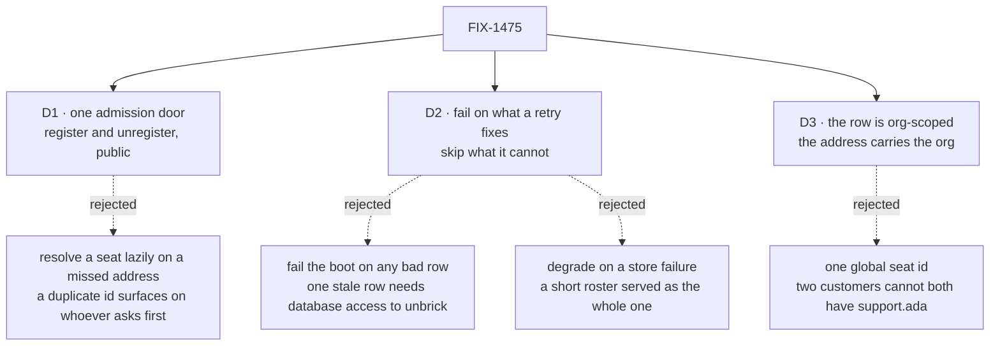

# FIX-1475 · Decisions

[Spec](SPEC.md) · **Decisions** · [Rules](BUSINESS-RULES.md) · [Plan](PLAN.md) · [Docs](DOCS.md)

What was considered, what was chosen, why, and what each choice locks in. Three decisions are
the sign-off surface. Everything else here is context for them.

## The tree

Solid edges are what you're signing. Dashed edges lost, and the label says why.

## D1 · One admission door — a public `register` / `unregister` pair that both a runtime hire and the next boot's reload go through

| | |
|---|---|
| **Instead of** | A lazy resolver that loads a seat from the store when an address misses · reaching into `getRuntime().registry`, which already works and is nobody's supported surface |
| **Because** | A flat address space needs its duplicates caught at one point in time, the same way construction catches them today. Lazy resolution catches them on whoever asks first, which is a different answer per deployment and per request order. And a second reload path that only this app understands is the thing [FIX-1429](https://linear.app/fixpoint-labs/issue/FIX-1429) and the epic both refused |
| **Locks in** | "Hired" means **hired in the process that ran the hire**, plus every process from its next boot. A deployment on more than one instance sees a new seat at different moments, and that is now a documented promise we cannot quietly tighten. It also puts a mutable registry in the public API: from here on, any code reading the registry must read it per request, and anything that caches a flow list is a bug rather than an optimisation |

The seam already behaves this way. The router resolves an address per request
(`registry.get(...)` on the action route, and the `resolveFlow` closure the runtime config
carries), and `register` validates identity and cross-flow schemas *before* it touches any
internal map — so a failed hire cannot half-land and a request either sees a seat or does not.
What is missing is not the mechanism but the contract: what a hire promises, what a fire does to
work already running, and what goes stale. That contract is the deliverable.

**What would change my mind:** a decision to run kitchen-sink on a single long-lived process
only. Then the weaker promise costs nothing, and the reload could be simpler still.

## D2 · Fail the boot on what a retry fixes; skip, name and serve what it cannot

| | |
|---|---|
| **Instead of** | Failing the boot on any unusable row · degrading past a roster the store would not hand over |
| **Because** | The two failures are not alike. A store that will not answer is **transient and inherited from the environment** — a boot that fails there is retried, and the deployment already serving keeps serving. A stored seat naming a kind the code no longer has is **permanent**: no retry fixes it, so failing the boot means an app that can never start until somebody reaches the database |
| **Locks in** | A deploy can come up with fewer seats than the roster names, so "the roster" and "what answers" are two numbers and both have to be reportable. We owe a reader the skipped count wherever the roster is shown, forever — a warning in a log is not that |

The discriminator, stated once so both halves come from one rule: **fail fast on what this
deploy got wrong; degrade on what a past deploy got wrong.** The file-declared roster is the
first kind — its files ship with the code, so a bad one is this change's mistake and it keeps
failing the boot exactly as it does today. A durable row was written by a previous runtime
against code that has since moved. Taking the whole product down for it is a hostage situation,
and the hostage is every other org's team.

The store read is **bounded** rather than merely awaited: a boot that hangs on a dead pool is
worse for a platform to handle than one that exits, because nothing ever concludes.

## D3 · The durable row is org-scoped, and a runtime-hired seat's address carries its org

| | |
|---|---|
| **Instead of** | One global seat id, with a hire refused when another org already holds it |
| **Because** | Two customers both wanting a seat called `support.ada` is the normal case, not the odd one. Refusing the second also tells them the first exists. The registry's address space is flat and has no org dimension, so the org has to be in the id or the collision has to be real |
| **Locks in** | The address form is public: somebody types it into a URL, so changing it later breaks every caller and every stored link. It is also an **address, not a permission** — see [Open](#open) — and the reference app must not read as though it were one |

The row lives where the epic requires it ([ER-8](../../epics/FIX-1455/BUSINESS-RULES.md),
[D2 of the epic](../../epics/FIX-1455/DECISIONS.md)): an org-scoped resource collection in the
Postgres the app already runs on, written from inside the hire action the way every other
collection row in this codebase is written. Nothing new persists anything.

## Decided, not asked

- **The roster is its own collection, beside the seat inventory, not a widening of it.** The
  inventory ([FIX-1405](https://linear.app/fixpoint-labs/issue/FIX-1405)) answers *what was
  registered in this org* and deliberately never deletes a row. A roster must be deletable and
  must carry enough to re-mint a seat. Two contracts, two collections; they join on the seat id.
- **The app names which orgs to reload, not the framework.** There is no org-filtered read path
  to inherit ([FIX-1486](https://linear.app/fixpoint-labs/issue/FIX-1486)), so the reload takes
  a list of orgs and kitchen-sink supplies it from the org store. A framework that guessed the
  enumeration policy would be guessing for every app.
- **The reload is bounded and refuses a prefix.** Past a named cap the boot fails rather than
  loading the first N orgs, for D2's reason: a silently short roster is the failure being
  avoided, and a cap that truncates quietly is that failure with extra steps.
- **A fire removes the row and the address. It cancels nothing and deletes nothing else.** The
  seat's sessions, state and resources stay. Destroying them is a different, irreversible
  operation with its own gate, and it is not in this issue.
- **Org comes from the resolved principal, never from the request body** (BP-031). The hire
  action is an ordinary flow action so it inherits that for free; a helper that re-injected org
  would be the invent-kill the issue names.
- **The hire writes the row before it registers.** A hire that answers is a hire that was
  written down. The other order can serve a seat that no boot will ever see again.

## Considered and dropped

| Alternative | Why not |
|---|---|
| Keep the roster in process memory and re-read the files at boot | This is today, and it is the issue. A file is not written by a runtime hire |
| A `workforce` table of our own, or a JSON file beside the app | The fifth persistence layer the epic kills ([ER-8](../../epics/FIX-1455/BUSINESS-RULES.md)). The resource collection is the mechanism this codebase already has for org-scoped rows |
| One roster blob per org instead of a row per seat | Reads the same in one query, but two hires of *different* seats then race each other for one version. Per-seat rows make concurrent hires independent and give the duplicate refusal for free, through create-if-absent |
| Re-materialise a runtime hire as a `WORKER.md` on disk | A deployed filesystem is not writable and not shared, and it would make the same seat exist twice with no precedence rule. The file convention stays the authoring path ([FIX-1467](https://linear.app/fixpoint-labs/issue/FIX-1467)'s seed-then-evolve lane is the database one) |
| Reload every org's roster from one query across scopes | The store's prefix read is per scope instance by design, and the index is on `(scope_type, scope_id)`. A cross-scope scan would be a new store verb for one caller |

## Open

**One, and it is a risk to accept rather than a fork to pick.**

**Can one customer address another customer's seat?** — Today an address is not a secret: anyone
who can authenticate to the app can send a request to any flow address it serves. A seat hired
by one customer carries the instructions that customer wrote for it. Another customer who
addresses it runs it against their *own* data — no records cross — but sees those instructions
come back in the answer.

- **The trade-off.** Closing it here means the framework grows a per-instance org check invented
  inside a feature issue, weeks before
  [FIX-1442](https://linear.app/fixpoint-labs/issue/FIX-1442) — the security pass that owns
  exactly this question — designs one properly. Leaving it means the reference app ships with a
  limit that has to be written down in the docs and not papered over.
- **Recommendation: leave it, write it down, and make sure the reference app does not read as
  though the address were a permission.** Kitchen-sink carries no org identity at all today, and
  the seat instructions it demonstrates are demonstration text. Two guesses at the same fence,
  a week apart, is how a security surface ends up with two answers.
- **What would change my mind:** anyone intending to run this app, or a copy of it, against two
  real customers' data before FIX-1442 lands. Then it stops being a documented limit and becomes
  a live exposure, and it should be closed here even at the cost of guessing the shape.
- **What being wrong costs:** one customer reads the text another wrote on a seat. Not their
  records, not their sessions. The fix is FIX-1442's and is already scheduled, so the cost of
  being wrong is embarrassment and an earlier scramble, not a rebuild.

## How it got here

- **Draft** — read [FIX-1429](https://github.com/fixpoint-labs/flow-state-dev/pull/1989)'s boot
  seam and the engine's registry, inventory and store contracts; framed the whole issue as one
  admission door with a durable row behind it rather than as a second reload path.
