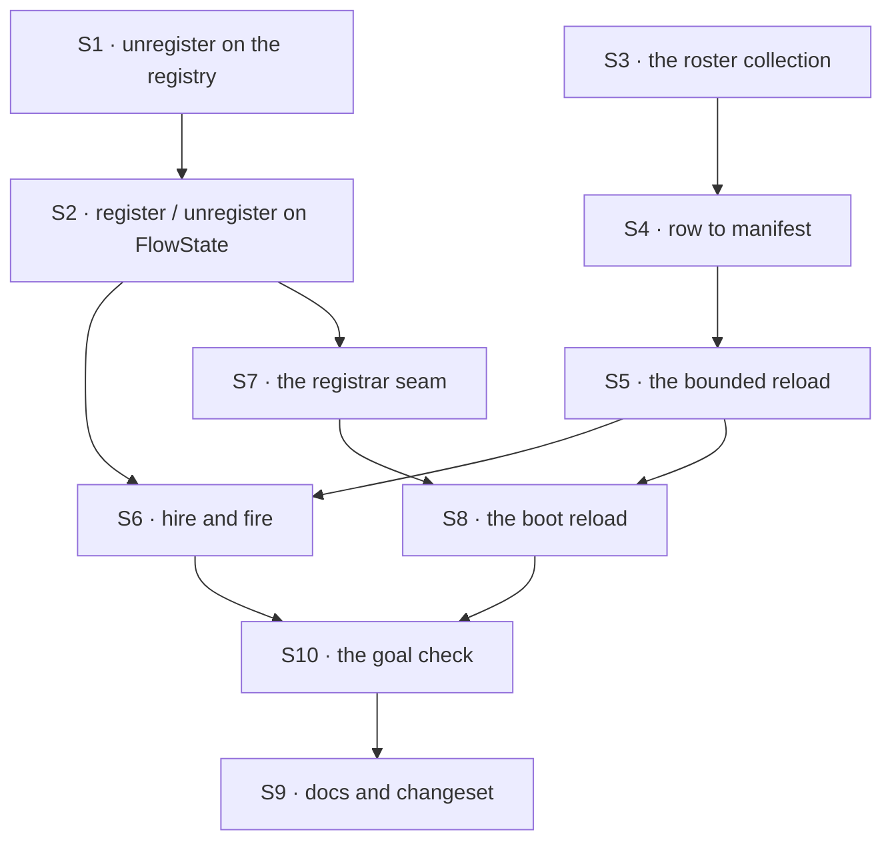

# FIX-1475 · Plan

[Spec](SPEC.md) · [Decisions](DECISIONS.md) · [Rules](BUSINESS-RULES.md) · **Plan** · [Docs](DOCS.md)

Written for the implementing agent. IDs cross-reference [BUSINESS-RULES.md](BUSINESS-RULES.md)
(BR-n) and [DECISIONS.md](DECISIONS.md) (D-n). `tdd`. **Two PRs**, and the seam is the package
boundary: PR-A ships the durable roster and the admission door with their own checks; PR-B is
the app that proves them on the real path.

**Depends on [PR #1989](https://github.com/fixpoint-labs/flow-state-dev/pull/1989)
(FIX-1429), open and approved at the time of writing.** This spec is written against its
`fsdev.config.ts` seam — an awaited hire at module scope — and against its stated refusal to
guess at a post-construction registry. Nothing in #1989 is undone; S8 is one more await on the
same file, after construction rather than before.

## Surfaces

| ID | Package · role | Change | Rules |
|---|---|---|---|
| S1 | `engine` · the flow registry | Add `unregister(id)`. Keep `register` the one admission point, and **keep the cross-flow schema participant when the last instance of a kind goes** — a kind's declared schema is a property of the kind, not of an instance | BR-8 BR-19 BR-23 |
| S2 | `engine` · `FlowState`'s public surface | `register(flows)` / `unregister(id)`, delegating to S1, with the contract as documentation: what is served when, what a fire does not touch, what goes stale. Make `meta.flowKeys` read the registry — it reads the construction options today and would start lying | BR-1 BR-19 BR-25 |
| S3 | `workforce` · the durable roster | An org-scoped resource collection at `workforce/roster/*`, `flowIsolation: false`. **Closed envelope, passthrough `settings`**: the envelope is ours, the settings bag belongs to the kind's own schema | BR-1 BR-2 BR-7 |
| S4 | `workforce` · row ↔ manifest | The one place a stored row becomes a `WorkerManifest` and back. A row it cannot read returns a reason, never a throw and never a repair | BR-9 BR-15 BR-16 |
| S5 | `workforce` · the reload | Given stores, a list of org ids, the kinds map, a cap and a bound: read each org's rows, translate, hire, and return the seats **and the skips with their reasons**. Refuses a prefix; fails on a read it cannot complete | BR-9 – BR-18 |
| S6 | kitchen-sink · `workforce-admin` flow | `hire` and `fire` actions declaring S3's collection. Org from the resolved principal. Writes the row, then registers (D1) | BR-1 – BR-8 · BR-19 – BR-24 |
| S7 | kitchen-sink · the registrar seam | A standalone proxy module holding the FlowState's `register` / `unregister`, installed by the config. Modelled on `lib/schedule-index.ts`, and for its reason: the action cannot import the config that registers the action's own flow | BR-1 BR-19 |
| S8 | kitchen-sink · `fsdev.config.ts` | After `createFlowState`: install the registrar, enumerate orgs from the org store, run S5, register what came back, report the skips. One more await at module scope, so no request arrives mid-reload | BR-9 – BR-13 BR-18 |
| S9 | Docs · changeset | [DOCS.md](DOCS.md)'s operations; `packages/engine/README.md` and `packages/workforce/README.md`; one `minor` changeset for `engine` and `workforce`. **None for kitchen-sink or goals** — both private (BP-022) | — |
| S10 | `goals/workforce-conventions/durable-hire-survives-redeploy/` | The goal check: `goal.md`, held-out `fixtures/input.json`, `run.mts` | acceptance |

**Nothing is removed.** Tenet 3 asks for the deletions; the honest answer here is none — the
file-declared path is untouched and the seat inventory keeps its job (D2's *decided, not
asked*). If the build finds a shape this duplicates, that is a finding, not a silent merge.

## Sequence



### The PR plan

| PR | Surfaces | depends_on | Why it stands alone |
|---|---|---|---|
| PR-A | S1 S2 S3 S4 S5 · package READMEs · the changeset | — | The public boundary first (BP-004). It is checkable without an app, and [FIX-1477](https://linear.app/fixpoint-labs/issue/FIX-1477) needs the roster read surface before kitchen-sink's shell exists |
| PR-B | S6 S7 S8 S10 · `apps/docs` | PR-A | The reference app and the proof. Touches `fsdev.config.ts`, which FIX-1429 also touches — see [the epic's collision table](../../epics/FIX-1455/PLAN.md) |

## Checks

Every row names **what would make it fail**. A check whose red state you cannot produce is not
evidence; produce it before trusting the green.

| ID | Runs after | Passes when | Red state — what makes it fail |
|---|---|---|---|
| V1 | S2 | Against **one** router object, held across all three steps: an address 404s, `register` makes it serve, `unregister` makes it 404 again | Make `register` a no-op, or have the router snapshot the flow list at build. Holding one router is the anti-game clause — rebuilding between steps would pass without the registry being live at all |
| V2 | S1 | A duplicate id throws and leaves the registry byte-identical; `unregister` of an unknown id is a plain `false`; after unregistering a kind's last instance, registering a *different* schema under that kind still conflicts | Drop the participant-retention line in S1 — the third assertion then passes a schema conflict through |
| V3 | S4 | A row round-trips to a manifest and back losing nothing, **including a key this version does not know** (BP-030); a row missing a required field returns a reason | Switch the envelope to strip unknown keys, or make the bad row throw |
| V4 | S5 | Over a stubbed store holding four rows — one good, one naming a missing kind, one unparseable, one colliding with a file-declared id — exactly one seat is hired and the other three come back in `skipped` with distinct reasons (BR-14 – BR-17) | Remove the kind pre-check: the bad row reaches `hireWorkforce`, which throws, and the boot dies — BR-14 inverted |
| V5 | S5 | A store that never answers makes the reload **reject** inside its bound, and no partial result is returned | Replace the bound with a bare await. Assert on the rejection *and* that it lands well inside the test's own timeout, or the check cannot tell a hang from a failure |
| V6 | S5 | More orgs than the cap rejects, naming the count and the cap, with nothing registered | Change the cap handling to slice the list: the "nothing registered" assertion fails |
| V7 | S6 | BR-2 – BR-8, each asserting afterwards that **no row changed** and **no address resolves** | For BR-2, write the row unconditionally instead of create-if-absent: the duplicate overwrites and the assertion on the original row's settings fails |
| V8 | S6 | Two hires of one seat awaited together: one resolves, one rejects, one row (BR-6) | Read-then-write without the version expectation — both resolve and the last write wins |
| V9 | S6 | A fire during a streaming action: the stream completes with its final item and the run's items are persisted (BR-20); the next request 404s (BR-19) | Make `unregister` also abort in-flight requests — the stream truncates and the first assertion fails |
| V10 | S8 | Importing the config module and making the **first** router call resolves a reloaded seat, with no extra await in the test | Make the reload fire-and-forget instead of an awaited module-scope statement: the first lookup misses |
| VG | S10 | The goal, below | Below |

### VG · the goal check, on the real path

`goals/workforce-conventions/durable-hire-survives-redeploy/run.mts`, run against the
**Next-built** app over its real HTTP route, following
[FIX-1429](https://linear.app/fixpoint-labs/issue/FIX-1429)'s runner for the parts it already
solved: refuse to start beside anything already answering on the port, spawn detached and signal
the group, require a 200 for readiness.

1. Build and start. Hire two seats over HTTP: one good, one naming a kind the app does not
   carry. Assert the good one answers and the bad one was refused (BR-3).
2. Hire a third whose settings contain a **token generated at check time**, and stop the
   process. Restart it from the same build.
3. Assert: the token-carrying seat answers and its answer contains **that token** — read from
   what the check sent, never written into the check.
4. Assert the **positive control**: the file-declared `support.ada` still answers across the
   same restart. A failure there means the probe is blind, not that durability broke, and it is
   asserted before anything else.
5. Write a row naming a kind the code does not carry directly into the store, restart, and
   assert the app **serves**, the other seats answer, that address 404s, and the boot report
   named it (BR-14, BR-18).
6. Fire the token seat, restart, assert 404 and that it is gone from the roster (BR-19).

**Its red states, all three produced before the green is trusted:**

- Revert S8's boot reload → step 3 fails (404 after restart) while step 4's control still
  passes. This is the leg that grades durability, and the control is what makes its zero mean
  something.
- Keep S8 but revert S6's row write, registering only in process → step 1 passes, step 3 fails.
  This separates *hired* from *written down*, which is the whole issue.
- Hard-code the seat's setting to a default instead of reading the row → step 3's token
  assertion fails. Without the generated token, a seat answering from a file-declared default
  would pass every other leg.

## Pinned names

| Where | Name | Why pinned |
|---|---|---|
| Address | `<orgId>.<seatId>` | Public. Somebody types it into a URL and stores the link (D3) |
| Storage | `workforce/roster/*`, org scope | Public. Rows persist; moving the prefix breaks every deployment that already hired — the same contract the seat inventory states about its own keys |
| Route | `workforce-admin` · actions `hire`, `fire` | Public. The reference app teaches these two words |
| API | `register` / `unregister` on `FlowState` | Public. D1's whole deliverable |

Everything else is yours to name.

## Guardrails

| Rule | Because |
|---|---|
| Write the row, then register (D1) | A hire that answers must be a hire that was written down. The other order serves a seat no boot will see again |
| Nothing caches the flow list (D1) | The registry is mutable from here on. A list read once and held is a bug, not an optimisation, and it will look like a working optimisation |
| The row envelope is closed; `settings` is passthrough (BP-030) | The envelope is ours to version. The settings bag belongs to the kind's schema and a future kind will add keys this version must carry through untouched |
| Org from the resolved principal, never from the body (BP-031) | Named in the issue's invent-kills, and the one place this change could quietly become a tenancy bug |
| Every skip is returned and counted, never only logged (D2) | D2's *locks in*. A log line is not a report, and BR-18 is the rule that makes the degradation honest |
| Never repair or delete a row you could not parse (BR-16) | A boot that rewrites data it did not understand destroys the evidence of why it did not |
| Run every case on the **reload** path too, not only the hire path (BP-035) | The redeploy is the second path and it is the whole promise. A suite that only hires proves nothing about a restart |
| Do not add a fire tombstone (BR-23) | It would expire differently in each process, so it would be a lie that varies by instance. A plain unknown-flow refusal is the same answer everywhere |

## Docs

Reconcile and publish [DOCS.md](DOCS.md) after VG passes — its limits and failure text are
claims about behaviour and must be checked against the run, not against this plan. PR-A carries
the package READMEs, PR-B the `apps/docs` page. One `minor` changeset covering `engine` and
`workforce`; none for kitchen-sink or goals.

## Sketch · pseudocode, illustrative, react to the shape

```
hire(seatId, flow, settings, instructions):
    org ← the resolved principal's org            (refuse without one)
    refuse if flow is not in the app's kinds
    refuse if <org>.<seatId> already resolves in the registry
    write workforce/roster/<seatId> at this org, create-if-absent   ← BR-2, BR-6 fall out
    seat ← hire one manifest built from what was just written
    register(seat)                                ← the second door

fire(seatId):
    org ← the resolved principal's org
    refuse if this org holds no such row          ← BR-21 falls out of the org-scoped read
    delete the row
    unregister(<org>.<seatId>)                    ← running work is untouched

at boot, after createFlowState, at module scope:
    orgs ← the org store's list       (refuse past the cap, do not slice)
    for each org, bounded:
        rows ← this org's workforce/roster/* prefix
        for each row: translate; skip and record a reason rather than throwing
    register everything that survived; report the skips with the count
```

**POC:** none built, and that is a call worth reading rather than an omission. The premise
worth checking is V1's — that a post-construction `register` is visible to the router with no
rebuild. It is **evidenced by source rather than assumed**: the action route resolves
`registry.get(...)` per request, the runtime config's `resolveFlow` is a closure over the same
registry object, and the only place anything enumerates the registry at init is the webhook
adapter's provider-coverage sweep. This worktree has no installed dependencies, so a spec-branch
POC would ship unrun — which is the failure this epic is trying to stop repeating. V1 is that
same experiment with a producible red state, run at implement time, before anything is built on
it. If it comes back the other way, D1's shape is wrong and the spec is re-opened, not patched.

## At implement time

- **Re-read `apps/kitchen-sink/fsdev.config.ts` at its merged state.** #1989 must have landed.
  S8 goes *after* `createFlowState`, not beside the existing awaited hire, because the stores
  only exist once the FlowState does.
- **Confirm `hireWorkforce` admits a three-segment id** (`acme.support.ada`) as a collection
  instance id. It does not validate id shape today, but confirm it rather than assume it. If it
  refuses, add an explicit address option — do not reshape the seat id to fit.
- **`meta.flowKeys` is built from the construction options.** It has no consumer in the
  packages today, which is exactly why it will be missed; make it read the registry (S2) or it
  starts lying on the first runtime hire.
- Check whether [FIX-1477](https://linear.app/fixpoint-labs/issue/FIX-1477) has landed a roster
  surface. BR-18's skipped count belongs on it rather than on a second one.
- Compare this plan against the current `packages/workforce/src/inventory/` contracts — if the
  inventory has grown a field that makes the second collection redundant, that is a spec blind
  spot to surface, not a merge to make quietly.

## Follow-ups

- **The webhook adapter validates provider coverage only at boot** (BR-26), so a seat hired at
  runtime that declares an unconfigured provider is not caught until the next restart. File it;
  it is the transport's, not this issue's.
- [FIX-1486](https://linear.app/fixpoint-labs/issue/FIX-1486) — flow listing carries no org
  identity. BR-25 depends on it staying true and cites it; nothing here works around it.
