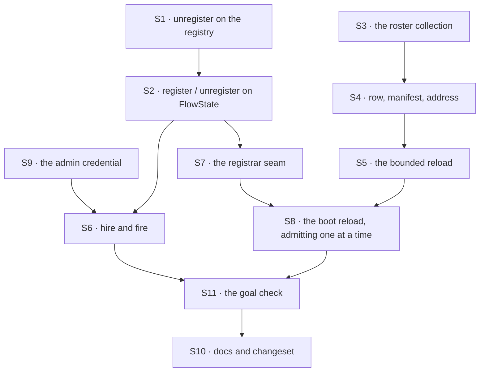

# FIX-1475 · Plan

[Spec](SPEC.md) · [Decisions](DECISIONS.md) · [Rules](BUSINESS-RULES.md) · **Plan** · [Docs](DOCS.md)

Written for the implementing agent. IDs cross-reference [BUSINESS-RULES.md](BUSINESS-RULES.md)
(BR-n) and [DECISIONS.md](DECISIONS.md) (D-n). `tdd`. **Two PRs**, and the seam is the package
boundary: PR-A ships the durable roster and the admission door with their own checks; PR-B is
the app that proves them on the real path.

**Depends on [PR #1989](https://github.com/fixpoint-labs/flow-state-dev/pull/1989)
(FIX-1429), open and approved at the time of writing.** This spec is written against its
`fsdev.config.ts` seam — an awaited hire at module scope — and against its stated refusal to
guess at a post-construction registry. Nothing in #1989 is undone; S8 is one more await on the
same file, after construction rather than before.

## Surfaces

| ID | Package · role | Change | Rules |
|---|---|---|---|
| S1 | `engine` · the flow registry | Add `unregister(id)`. Keep `register` the one admission point, and **keep the cross-flow schema participant when the last instance of a kind goes** — a kind's declared schema is a property of the kind, not of an instance | BR-12 BR-21 BR-25 BR-31 |
| S2 | `engine` · `FlowState`'s public surface | `register(flow)` — **one instance, not a batch** — and `unregister(id)`, delegating to S1, with the contract as documentation: what is served when, what a fire does not touch, what goes stale. Make `meta.flowKeys` read the registry; it reads the construction options today and would start lying | BR-5 BR-21 BR-25 BR-33 |
| S3 | `workforce` · the durable roster | An org-scoped resource collection at `workforce/roster/*`, `flowIsolation: false`. **Closed envelope, passthrough `settings`**: the envelope is ours to version, the settings bag belongs to the kind's own schema | BR-5 BR-6 BR-11 |
| S4 | `workforce` · row ↔ manifest | The one place a stored row becomes a `WorkerManifest` and back, and the one place an org and a seat id become an address. A row it cannot read returns a reason, never a throw and never a repair | BR-10 BR-15 BR-22 BR-23 |
| S5 | `workforce` · the reload | Given stores, org ids, the kinds map, a cap and a bound: read each org's rows, translate, hire, and return `{ seats, problems }`. **Store-side only — it does not admit anything**, so it needs no registry. Refuses a prefix; fails on a read it cannot complete | BR-15 – BR-20 BR-22 BR-23 |
| S6 | kitchen-sink · `workforce-admin` flow | `hire` and `fire` actions declaring S3's collection, behind **its own `authentication.resolvePrincipal`** (S9). Validates the org segment, writes the row with `create()`, registers, and **deletes its row if registration fails** | BR-3 – BR-14 · BR-25 – BR-32 |
| S7 | kitchen-sink · the registrar seam | A standalone proxy module holding the FlowState's `register` / `unregister`, installed by the config. Modelled on `lib/schedule-index.ts`, and for its reason: the action cannot import the config that registers the action's own flow | BR-5 BR-25 |
| S8 | kitchen-sink · `fsdev.config.ts` | After `createFlowState`: install the registrar, enumerate orgs from the org store, run S5, then **admit the returned seats one at a time**, folding each refusal into the same `problems` list, and report. One more await at module scope, so no request arrives mid-reload | BR-15 – BR-21 BR-24 |
| S9 | kitchen-sink · the admin credential | A verified principal resolver for `workforce-admin` alone: a credential carried on the request, checked against configuration, yielding the org. **No credential configured means the flow is not registered at all** | BR-1 – BR-4 |
| S10 | Docs · changeset | [DOCS.md](DOCS.md)'s operations; `packages/engine/README.md` and `packages/workforce/README.md`; one `minor` changeset for `engine` and `workforce`. **None for kitchen-sink or goals** — both private (BP-022) | — |
| S11 | `goals/workforce-conventions/durable-hire-survives-redeploy/` | The goal check: `goal.md`, held-out `fixtures/input.json`, `run.mts` | acceptance |

**Nothing is removed.** Tenet 3 asks for the deletions; the honest answer here is none — the
file-declared path is untouched and the seat inventory keeps its own job (BR-35). If the build
finds a shape this duplicates, that is a finding, not a silent merge.

## Reuse · do not fork parallel machinery

Five places where this has already been solved next door. Each was checked against the code
while writing this; check them again before citing one, because they move.

- **`packages/workforce/src/inventory/collections.ts`** is S3's template —
  `defineSeatInventoryCollection()` is the same shape (org scope, explicit
  `flowIsolation: false`, a closed row schema, and a paragraph on why the keys are a public
  surface). Put S3 in `packages/workforce/src/roster/`, beside `inventory/`, so the parallel is
  visible rather than argued.
- **`packages/workforce/src/inventory/open-inventory.ts`** is S5's template. It already returns
  `{ seats, channels, problems }` and leaves boot policy to its caller. S5 mirrors that
  `problems: string[]` dialect rather than inventing a third word for the same thing — which is
  also what keeps BR-24 and [FIX-1477](https://linear.app/fixpoint-labs/issue/FIX-1477) on one
  surface.
- **The duplicate refusal is `create()`, not `upsert()`.** A collection's `create(key, row)`
  throws `ResourceAlreadyExistsError` when the key exists, and `getOrCreate` documents that the
  throw is terminal and survives a concurrent creator — which is BR-6 and BR-7 for free, with no
  lock. The inventory next door writes with `upsert`, so an implementer copying that template
  gets the shape right and **loses the refusal silently**. This is the one line in this section
  that is a trap rather than a convenience.
- **BR-17's bound is `withTimeout` from `@flow-state-dev/core/helpers`**, the same helper the
  sequencer and the tool executor use. Not a bespoke race with `setTimeout`.
- **The kinds map is `apps/kitchen-sink/workforce/hire.ts`'s.** It assembles
  `{ ...kinds, agent }` from `workforce.gen.ts` plus `defineAgentWorkerFlow({ uses, catalog })`,
  and it is module-local today. Export it and have the admin flow and the reload both take it
  from there. Calling `defineAgentWorkerFlow` a second time inside the admin flow builds a
  *different* kind under the same name, so a runtime-hired seat would carry a different tool
  catalog from its file-declared neighbours for no stated reason.

## Inventory parity is out of scope, and so is the browse-side join

S3's roster is **not** written into `inventory/seats/*` (BR-35). Three reasons, in order of
weight:

1. **The two contracts disagree by design.** The inventory's own header states that nothing is
   ever deleted and a row means *was registered in this org*. A roster row must be deletable,
   because firing a seat is half of this issue. Writing both would make a fire remove one and
   leave the other, so parity would be partial by construction and a reader could not tell which
   answer was current.
2. **There is no inventory in this app to be at parity with.** `openInventory` is called nowhere
   under `apps/kitchen-sink` — not for file-declared seats either. Standing one up is a surface,
   not a line.
3. **Joining them for browsing is [FIX-1477](https://linear.app/fixpoint-labs/issue/FIX-1477)'s**,
   which owns the roster's one home in the shell (ER-7). It reads whichever surfaces exist; it
   does not need this issue to pre-merge them.

[DOCS.md](DOCS.md) says the same thing in reader-facing words. If either document is edited,
edit both — they drifted apart once already and it was caught in review, not by a check.

## Sequence



### The PR plan

| PR | Surfaces | depends_on | Why it stands alone |
|---|---|---|---|
| PR-A | S1 S2 S3 S4 S5 · package READMEs · the changeset | — | The public boundary first (BP-004). It is checkable without an app, and [FIX-1477](https://linear.app/fixpoint-labs/issue/FIX-1477) needs the roster read surface before kitchen-sink's shell exists |
| PR-B | S6 S7 S8 S9 S11 · `apps/docs` | PR-A | The reference app and the proof. Touches `fsdev.config.ts`, which FIX-1429 also touches — see [the epic's collision table](../../epics/FIX-1455/PLAN.md) |

## Checks

Every row names **what would make it fail**. A check whose red state you cannot produce is not
evidence; produce it before trusting the green.

| ID | Runs after | Passes when | Red state — what makes it fail |
|---|---|---|---|
| V1 | S2 | Against **one** router object, held across all three steps: an address 404s, `register` makes it serve, `unregister` makes it 404 again | Make `register` a no-op, or have the router snapshot the flow list at build. Holding one router is the anti-game clause — rebuilding between steps would pass without the registry being live at all |
| V2 | S1 | A duplicate id throws and leaves the registry byte-identical; `unregister` of an unknown id is a plain `false`; after unregistering a kind's last instance, registering a *different* schema under that kind still conflicts | Drop the participant-retention line in S1 — the third assertion then passes a schema conflict through |
| V3 | S4 | A row round-trips to a manifest and back losing nothing, **including a key this version does not know** (BP-030); a row missing a required field returns a reason | Switch the envelope to strip unknown keys, or make the bad row throw |
| V4 | S4 | `acme` + `support.ada` and `acme.support` + `ada` cannot both be addressed: the second is refused at the segment check (BR-10) | Drop the org-segment validation — both hires succeed and the second silently rebinds the first's address |
| V5 | S5 | Over a stubbed store holding rows — one good, one naming a missing kind, one unparseable — exactly one seat comes back and the other two are in `problems` with distinct reasons (BR-20, BR-22, BR-23) | Remove the kind pre-check: the bad row reaches `hireWorkforce`, which throws, and the boot dies — BR-20 inverted |
| V6 | S5 | A store that never answers makes the reload **reject** inside its bound, and no partial result is returned | Replace `withTimeout` with a bare await. Assert on the rejection *and* that it lands well inside the test's own timeout, or the check cannot tell a hang from a failure |
| V7 | S5 | More orgs than the cap rejects, naming the count and the cap, with nothing registered | Change the cap handling to slice the list: the "nothing registered" assertion fails |
| V8 | S8 | A roster whose **second** seat the registry refuses: the first and third are serving, the refused one is in `problems`, and the boot completed (BR-21) | Admit the batch in one call. `registerMany` admits in order and keeps the earlier ones, so the refusal ends the loop — the third seat never registers and the boot reports a failure instead of a skip. This is D2 broken by mechanism, and it is the check that catches it |
| V9 | S9 | With no credential configured the admin address 404s (BR-1); with one, a request lacking it is refused (BR-2) | Register the flow unconditionally — the first assertion fails, and the admin path is reachable on a default deployment |
| V10 | S6 S9 | Under `acme`'s credential, a hire whose **body** says `orgId: "bravo"` writes to `acme` and leaves `bravo`'s roster untouched (BR-3) | Read the org from the envelope or the body instead of the verified principal. This is the check that would have caught the defect review found: the stock resolver reads `body.orgId`, so "from the principal" is not by itself a fence |
| V11 | S6 | BR-6 – BR-12, each asserting afterwards that **no row changed** and **no address resolves** | For BR-6, write the row with `upsert` instead of `create`: the duplicate overwrites and the assertion on the original row's settings fails |
| V12 | S6 | Two hires of one seat awaited together: one resolves, one rejects, one row (BR-7) | Read-then-write instead of `create` — both resolve and the last write wins |
| V13 | S6 | A registration forced to fail after the row is written leaves **no row** and reports the registration failure, not a success (BR-13) | Remove the compensating delete: the row survives, the caller is told the hire failed, and the seat appears at the next boot — a hire that failed leaving a live seat behind |
| V14 | S6 S1 | A fire during a streaming action: the stream completes with its final item and the run's items are persisted (BR-27); the next request 404s (BR-25) | Make `unregister` also abort in-flight requests — the stream truncates and the first assertion fails |
| V15 | S6 | A fire whose address is held by an instance that did not come from this org's row removes the row and **leaves that instance registered** (BR-28) | Unregister by address alone: the foreign instance goes offline and the assertion that it still answers fails |
| V16 | S8 | Importing the config module and making the **first** router call resolves a reloaded seat, with no extra await in the test | Make the reload fire-and-forget instead of an awaited module-scope statement: the first lookup misses |
| V17 | S10 | The published page contains the cross-org disclosure (BR-34) and the sibling-process window for both hire and fire (BR-26) | Delete either paragraph. D2 and the Open both name disclosure as the mitigation, so an undelivered disclosure is an unmet decision, not a docs nit |
| VG | S11 | The goal, below | Below |

### VG · the goal check, on the real path

`goals/workforce-conventions/durable-hire-survives-redeploy/run.mts`, run against the
**Next-built** app over its real HTTP route, following
[FIX-1429](https://linear.app/fixpoint-labs/issue/FIX-1429)'s runner for the parts it already
solved: refuse to start beside anything already answering on the port, spawn detached and signal
the group, require a 200 for readiness.

1. Build and start with an admin credential configured. Hire two seats: one good, one naming a
   kind the app does not carry. Assert the good one answers and the bad one was refused (BR-8).
2. Hire a third whose settings contain a **token generated at check time**, and stop the
   process. Restart it from the same build.
3. Assert: the token-carrying seat answers and its answer contains **that token** — read from
   what the check sent, never written into the check.
4. Assert the **positive control**: the file-declared `support.ada` still answers across the
   same restart. A failure there means the probe is blind, not that durability broke, and it is
   asserted before anything else.
5. Write a row naming a kind the code does not carry directly into the store, restart, and
   assert the app **serves**, the other seats answer, that address 404s, and the boot report
   named it (BR-20, BR-24).
6. Fire the token seat, restart, assert 404 and that it is gone from the roster (BR-25).

**Its red states, all three produced before the green is trusted:**

- Revert S8's boot reload → step 3 fails (404 after restart) while step 4's control still
  passes. This is the leg that grades durability, and the control is what makes its zero mean
  something.
- Keep S8 but revert S6's row write, registering only in process → step 1 passes, step 3 fails.
  This separates *hired* from *written down*, which is the whole issue.
- Hard-code the seat's setting to a default instead of reading the row → step 3's token
  assertion fails. Without the generated token, a seat answering from a file-declared default
  would pass every other leg.

## Pinned names

| Where | Name | Why pinned |
|---|---|---|
| Address | `<org>.<seatId>`, with `<org>` validated by the loader's `validateSegment` | Public — somebody types it into a URL — and the validation is what makes the join injective (BR-10). The loader's own header already argues this: `.` is the joiner, so a dotted segment makes the minted id ambiguous |
| Storage | `workforce/roster/*`, org scope | Public. Rows persist; moving the prefix breaks every deployment that already hired — the same contract the seat inventory states about its own keys |
| Route | `workforce-admin` · actions `hire`, `fire` | Public. The reference app teaches these two words |
| API | `register(flow)` / `unregister(id)` on `FlowState` | Public. D1's whole deliverable. Singular on purpose — see the guardrail below |
| Reload result | `{ seats, problems }` | Matches `openInventory`'s dialect, so one reader learns one word |

Everything else is yours to name.

## Guardrails

| Rule | Because |
|---|---|
| `register` takes **one** flow, never a batch | `FlowRegistry.registerMany` admits in order and keeps the earlier ones when a later fails, so a batch cannot honour "a refused registration changes nothing". Rather than design atomic batch admission for a caller that does not need it, the reload admits per seat — which is also what BR-21 requires |
| The org comes from a **verified** resolver, not from the principal by default (BP-031) | The framework's stock resolver reads `userId` and `orgId` out of the request body. "From the resolved principal" is a fence only once the flow configures a resolver that verifies something |
| Write the row with `create()`, never `upsert()` or `getOrCreate()` | The refusal in BR-6 and BR-7 *is* `create()`'s already-exists throw. The inventory next door uses `upsert`, so the wrong one is one copy-paste away and it fails silently |
| Write the row, then register, then compensate (D1, BR-13) | A hire that answers must be a hire that was written down; a hire that failed must leave nothing. Both halves, or the promise is half-true |
| Nothing caches the flow list (D1) | The registry is mutable from here on. A list read once and held is a bug, not an optimisation, and it will look like a working optimisation |
| The row envelope is closed; `settings` is passthrough (BP-030) | The envelope is ours to version. The settings bag belongs to the kind's schema and a future kind will add keys this version must carry through untouched |
| Every skip is returned and counted, never only logged (D2) | D2's *locks in*. A log line is not a report, and BR-24 is the rule that makes the degradation honest |
| Never repair or delete a row you could not parse (BR-23) | A boot that rewrites data it did not understand destroys the evidence of why it did not |
| Run every case on the **reload** path too, not only the hire path (BP-035) | The redeploy is the second path and it is the whole promise. A suite that only hires proves nothing about a restart |
| Do not add a fire tombstone (BR-31) | It would expire differently in each process, so it would be a lie that varies by instance. A plain unknown-flow refusal is the same answer everywhere |

## Docs

Reconcile and publish [DOCS.md](DOCS.md) after VG passes — its limits and failure text are
claims about behaviour and must be checked against the run, not against this plan. V17 asserts
the two disclosures survive that reconciliation, because both are named as a decision's
mitigation rather than as commentary. PR-A carries the package READMEs, PR-B the `apps/docs`
page. One `minor` changeset covering `engine` and `workforce`; none for kitchen-sink or goals.

## Sketch · pseudocode, illustrative, react to the shape

```
resolvePrincipal for workforce-admin:          ← S9, and the flow is not registered without it
    verify the credential on the request
    org ← what the credential is bound to      (never the body)

hire(seatId, flow, settings, instructions):
    org ← the verified principal's org         (refuse without one)
    refuse if org is not a legal address segment            ← BR-10
    refuse if flow is not in the app's kinds
    refuse if <org>.<seatId> already resolves in the registry
    create workforce/roster/<seatId> at this org            ← throws on duplicate: BR-6, BR-7
    try:   register(hire one manifest from what was written)
    catch: delete the row just created, then report the failure   ← BR-13

fire(seatId):
    org ← the verified principal's org
    refuse if this org holds no such row                    ← BR-29
    delete the row
    unregister <org>.<seatId> ONLY if the live instance came from that row   ← BR-28

at boot, after createFlowState, at module scope:
    orgs ← the org store's list       (refuse past the cap, do not slice)
    { seats, problems } ← reload(orgs)          ← store-side only, no registry
    for each seat: try register; catch → add to problems    ← one at a time: BR-21
    report problems, with the count
```

**POC:** none built, and that is a call worth reading rather than an omission. The premise worth
checking is V1's — that a post-construction `register` is visible to the router with no rebuild.
It is **evidenced by source rather than assumed**: the action route resolves
`registry.get(...)` per request (`routes/action-routes.ts`), the runtime config's `resolveFlow`
is a closure over the same registry object (`flowstate/createFlowState.ts`), and the only place
anything enumerates the registry at init is the webhook adapter's provider-coverage sweep
(`transports/webhook/createWebhookTransportAdapter.ts`). This worktree has no installed
dependencies, so a spec-branch POC would ship unrun — which is the failure this epic is trying
to stop repeating. V1 is that same experiment with a producible red state, run at implement
time, before anything is built on it. If it comes back the other way, D1's shape is wrong and
the spec is re-opened, not patched.

## At implement time

- **Re-read `apps/kitchen-sink/fsdev.config.ts` at its merged state.** #1989 must have landed.
  S8 goes *after* `createFlowState`, not beside the existing awaited hire, because the stores
  only exist once the FlowState does.
- **Confirm `hireWorkforce` admits a three-segment id** (`acme.support.ada`) as a collection
  instance id. It does not validate id shape today, but confirm it rather than assume it. If it
  refuses, add an explicit address option — do not reshape the seat id to fit.
- **`meta.flowKeys` is built from the construction options.** It has no consumer in the
  packages today, which is exactly why it will be missed; make it read the registry (S2) or it
  starts lying on the first runtime hire.
- **S5's per-org reads run in sequence as written.** Boot latency scales with org count, and
  parallelising them changes no semantics — do it if the numbers ask for it, with the bound
  still covering the whole set rather than each read.
- Check whether [FIX-1477](https://linear.app/fixpoint-labs/issue/FIX-1477) has landed a roster
  surface. BR-24's skipped count belongs on it rather than on a second one.
- Compare this plan against the current `packages/workforce/src/inventory/` contracts — if the
  inventory has grown a field that makes the second collection redundant, that is a spec blind
  spot to surface, not a merge to make quietly.

## Notes from review

Inputs, not instructions. Adopt, adapt, or discard; you owe no justification for discarding one.

- Cursor endorsed each rejected alternative by name — lazy resolve, one blob per org, a custom
  table, `getRuntime().registry` — as "simpler on paper but weaker on semantics." Recorded so a
  later reader does not reopen them cold.
- "Parallelise S5's per-org bounded prefix reads." Carried into *At implement time* above rather
  than folded: it changes no semantics and the right moment to judge it is against real numbers.
- Codex suggested designing atomic batch admission for `registerMany`. Declined in favour of
  removing the batch form from the public surface (see the guardrail) — the only caller wanted
  per-seat admission anyway, and an atomic batch would be machinery built for nobody.

## Follow-ups

- **The webhook adapter validates provider coverage only at boot** (BR-36), so a seat hired at
  runtime that declares an unconfigured provider is not caught until the next restart. File it;
  it is the transport's, not this issue's.
- [FIX-1486](https://linear.app/fixpoint-labs/issue/FIX-1486) — flow listing carries no org
  identity. BR-33 depends on it staying true and cites it; nothing here works around it.
- **[FIX-1480](https://linear.app/fixpoint-labs/issue/FIX-1480) owns the seat-facing hire** —
  the `tools:` door a seat reaches itself — and **composes this roster** rather than standing up
  a second hire store. This issue owns the admission door, the durable org-scoped roster, and
  kitchen-sink's `workforce-admin` hire/fire as the **reference HTTP path only**: it is not the
  API Labs copies, and nothing here should be documented as though it were.
- **`fsdev run` cannot reach an org-scoped action.** It hard-codes `userId: "cli-user"` and
  supplies no `orgId` (`packages/cli/src/commands/run.ts`), so no org-requiring flow is callable
  from the CLI. Out of scope here — the examples use HTTP — but it is a real gap in the CLI for
  every org-scoped flow, not just this one.
