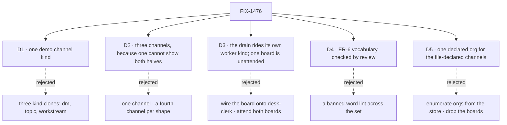

# FIX-1476 · Decisions

[Spec](SPEC.md) · **Decisions** · [Rules](BUSINESS-RULES.md) · [Plan](PLAN.md) · [Docs](DOCS.md) · [Evolution](EVOLUTION.md)

Five calls. [D1](#d1) is the one to read: it **narrows a lock the Architect set**, on evidence
the lock was written without. The other four are shape.

## D1 · One demo channel kind, not three clones

| | |
|---|---|
| **Instead of** | The ticket's fence: *one `ChannelFlow` factory with kind clones (`dm` / `topic` / `workstream`), each a real kind file, kind supplies remix slots, same body* |
| **Because** | **The framework cannot build it, and the published docs argue against it.** `defineChannelFlow` takes exactly three options — `notify`, `boards`, `inventory` — and calls `defineFlow({ kind: CHANNEL_KIND, … })`, with `CHANNEL_KIND = "channel"` (`packages/workforce/src/channel/channel-flow.ts`). There is no kind parameter, so it can only ever produce the kind called `channel`. A file at `flows/channels/dm.ts` must therefore be a hand-written `defineFlow({ kind: "dm", cardinality: "singleton", … })` with its own state schema and its own post/read graph — which is *a second ChannelFlow implementation per kind*, the epic's own invent-kill ([ER-12](../../epics/FIX-1455/BUSINESS-RULES.md)'s neighbour in [D4](../../epics/FIX-1455/DECISIONS.md#d4)). Worse, none of the three could hold a board: `channelInstances` refuses `boards:` unless `holdsBoards(factory)` is true, and that predicate tests for the `withBoards` method only `defineChannelFlow` attaches. And [channels.md](../../../apps/docs/docs/workforce/channels.md) already tells readers the opposite in as many words: *"A standup, a direct message and an announcement channel are all channels on the one built-in kind, told apart by their members and their charter, not by being different kinds."* Three clone kinds would have the reference app contradict its own published docs while breaching an invent-kill to do it |
| **Locks in** | **Exactly one** file under `flows/channels/`, and it diverges for a reason a reader can check: `digest`, whose `read` returns only the most recent lines, because a standing noticeboard's transcript grows without bound and [channels.md](../../../apps/docs/docs/workforce/channels.md) lists *"no summary pass over a long transcript"* as a thing channels do not do. It holds no board, and the spec says that is the rule rather than an omission. `dm`, `topic` and `workstream` survive as what the framework says they are — instances, told apart by members and charter ([D2](#d2)) |

**What would change my mind:** a `kind` option added to `DefineChannelFlowOptions`, or `boards:`
admitted on a hand-rolled kind. Either makes clone kinds buildable at the cost the fence assumed,
and this card is re-argued rather than re-derived. Both are framework changes and neither is in
this set.

## D2 · Three channels, because no single channel can show both halves

| | |
|---|---|
| **Instead of** | One channel carrying everything · a fourth and fifth channel, one per shape a reader might want |
| **Because** | The constraint is structural: a channel holding boards must be on the built-in kind, and the channel demonstrating `flow:` must not be. One cannot be both, so the minimum honest example is two — and the shape of the example becomes the shape of the rule. The third teaches the mistake the fence itself made: a one-member channel with **no** `flow:` line is what a DM is, and seeing it beside a channel that genuinely needed a kind is how a reader learns which is which |
| **Locks in** | `support.desk` — built-in, five members, two boards. `support.ada-dm` — built-in, one member, no `flow:`. `support.noticeboard` — `flow: digest`, no boards. A fourth channel needs a lesson none of these three carries |

## D3 · The drain rides a worker kind of its own, and one board ships unattended

| | |
|---|---|
| **Instead of** | Declaring the board on `desk-clerk`, which `ada` and `grace` both run · attending both boards and proving the warning only in a test · adding a second seat that *files* rows so the reference shows both ends |
| **Because** | A board is declared on a **kind**, and `desk-clerk` is shared, so wiring it there would make every seat on that kind drain it — which reads as ambient and is the exact thing board v1 exists to refuse. A new kind with one seat on it makes *"a seat drains a board only when it is explicitly wired to it"* legible: one seat wired, four not. And the warning is a deliverable of this issue, so the shipped tree has to produce it; a warning only a test sees is a warning nobody reads. Filing is left to the channel's own `fileTask` action, which is the door the docs teach and which `goals/channel-boards/…` already proves from a seat — a second filing seat would re-prove a green goal |
| **Locks in** | `flows/workers/followup-runner.ts` declares `channelBoard("support.desk", "followups")` as a resource and exposes its `taskBoard` drain; one seat, `support.wren`, runs it. `escalations` is drained by nobody and the warning names it at every boot; the app README is the one surface that explains why ([DOCS.md](DOCS.md) §2). The channel id and board name **are** retyped in the kind file — explicit wiring is the mechanism, and the warning is the safety net the docs already point at |

## D4 · ER-6's vocabulary is six words, and its check is review

| | |
|---|---|
| **Instead of** | A banned-word lint over the app and the packages, which would look like enforcement · leaving the rule as prose in the epic and letting each child interpret [D3](../../epics/FIX-1455/DECISIONS.md#d3) |
| **Because** | [ER-6](../../epics/FIX-1455/BUSINESS-RULES.md) already names where it is checked — *every child's spec review* — so a lint would be a second authority over a rule the epic already assigned. It would also be dishonest about its reach: the words that matter most are FIX-1477's component labels, which do not exist yet, and a check that cannot see its own subject is [BP-003](../../../docs/contributing/best-practices.md)'s *check that cannot fail*. What this issue can honestly check is the strings **it** ships, and it does |
| **Locks in** | The table in [BUSINESS-RULES.md → The words](BUSINESS-RULES.md#the-words): six terms, each with what it means and what it is not. Stated once here; every other row in the set consumes it without re-deciding it. The one mechanical check is scoped to this issue's own files and says so |

## D5 · The file-declared channels open under one declared org

| | |
|---|---|
| **Instead of** | Enumerating orgs from the store, as FIX-1475's runtime reload does · dropping `boards:` so no org is needed |
| **Because** | `openChannels` throws when a board-holding roster is given no `orgId`, because a board's rows are org-scoped storage — and kitchen-sink has no `orgId` anywhere today (verified: zero occurrences under `apps/kitchen-sink`). Something has to name one. Enumerating the store is FIX-1475's mechanism for *runtime-hired* seats and answers a different question: the file-declared tree is fixed at build, and iterating an empty store at boot would open no channels at all on a fresh clone |
| **Locks in** | One exported constant in its own `workforce/org.ts`, for `openChannels` only — a file of its own rather than a line in `hire.ts`, because [FIX-1475](../FIX-1475/PLAN.md) is editing `hire.ts` in flight and this is one less collision. It is not an authorization boundary: kitchen-sink configures no `resolvePrincipal`. It is **not ignored** on a host that does, either — the principal's org wins at creation, but every later boot compares the *stored* org against this constant and refuses the reopen by name when they differ ([BR-15](BUSINESS-RULES.md)). An adopter must set it to the org their principal resolves. FIX-1475 may later enumerate orgs beside this — this one opens files, that one reloads rows |

## Considered and dropped

- **Give a seat the board's eight task tools** (`uses: [channelBoardTaskTools(followups)]`), so a
  model works the rows. It is one line and it is the richer reference — but it needs a model to
  demonstrate anything, which makes the goal check model-dependent for a claim that is not about
  a model. Named in [DOCS.md](DOCS.md) as available and not shipped.
- **Turn the channel inventory on** (`channelInstances({ inventory: true })`). It is browse-side
  surface, FIX-1477's half of the seam, and FIX-1475 already records that this app opens no
  inventory today.
- **A `fsdev gen --check` failure as this issue's proof that the kind is generated.** `--check`
  is a *staleness* gate — it compares the committed module against what the tree renders — and CI
  already runs it over this very app (`--filter @flow-state-dev/kitchen-sink`), so a copy would
  assert nothing new. What it never reads is what the map *contains*: it passes today with
  `channelKinds = {}`. That is [V1](PLAN.md#the-checks)'s assertion, and it is red on `main` now.

## Open

### 1 · The three-clone fence — narrowed here, not by the Architect

The ticket's EM fences lock *"one `ChannelFlow` factory with kind clones (`dm` / `topic` /
`workstream`), each a real kind file"*, and the 2026-09-20 amendment reaffirmed it while
correcting `CHANNELS.md`. [D1](#d1) narrows it to one kind, on three facts on `origin/main` the
fence does not engage with. The evidence is in [D1](#d1) and is not repeated here; a `/simplify`
review has since confirmed all three against `main` independently.

**This is a narrowing, so it is flagged rather than assumed.** [ER-19](../../epics/FIX-1455/BUSINESS-RULES.md)
sends a *cross-cutting* question up; this one is inside FIX-1476's own scope, which
[D4](../../epics/FIX-1455/DECISIONS.md#d4) hands over in as many words (*"the factory's shape
[is] FIX-1476's spec, not this card"*). It is recorded here so the Architect can say the fence
meant something else, at spec review, before anything is built.

## How it got here

- **Drafted (Sep 21)** — from the merged epic spec at `specs/epics/FIX-1455/` and the shipped
  channel pair. The three-clone fence was taken as binding until `defineChannelFlow`'s signature
  was read; D1 followed from that, and D2 followed from D1 because the board half and the kind
  half then had to be different channels. D3, D4 and D5 are the calls the Architect's *open
  walls* left to the EM, decided rather than escalated under the epic's EM posture.
