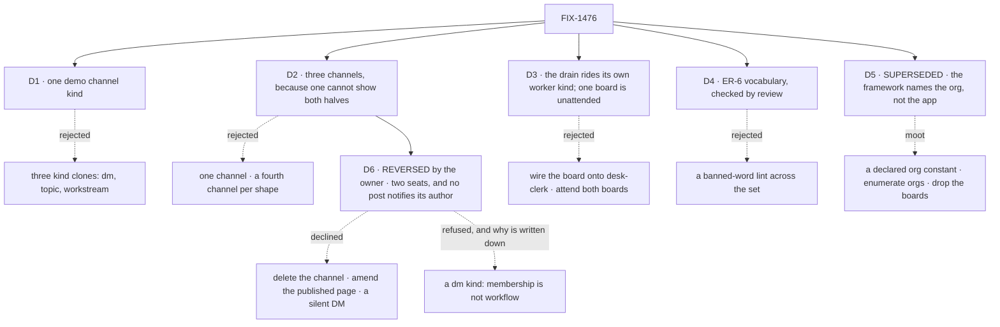

# FIX-1476 · Decisions

[Spec](SPEC.md) · **Decisions** · [Rules](BUSINESS-RULES.md) · [Plan](PLAN.md) · [Docs](DOCS.md) · [Evolution](EVOLUTION.md)

Five calls when this merged; now four live and two amendments. [D5](#d5) is **superseded** — the
question it answered stopped being the app's to answer. [D6](#d6) is a **reversal by the product
owner**, after he saw [D2](#d2)'s one-member DM built. [D1](#d1) is still the one to read: it
**narrows a lock the Architect set**, on evidence the lock was written without. The rest is shape.

## D1 · One demo channel kind, not three clones

| | |
|---|---|
| **Instead of** | The ticket's fence: *one `ChannelFlow` factory with kind clones (`dm` / `topic` / `workstream`), each a real kind file, kind supplies remix slots, same body* |
| **Because** | **The framework cannot build it, and the published docs argue against it.** `defineChannelFlow` takes exactly three options — `notify`, `boards`, `inventory` — and calls `defineFlow({ kind: CHANNEL_KIND, … })`, with `CHANNEL_KIND = "channel"` (`packages/workforce/src/channel/channel-flow.ts`). There is no kind parameter, so it can only ever produce the kind called `channel`. A file at `flows/channels/dm.ts` must therefore be a hand-written `defineFlow({ kind: "dm", cardinality: "singleton", … })` with its own state schema and its own post/read graph — which is *a second ChannelFlow implementation per kind*, the epic's own invent-kill ([ER-12](../../epics/FIX-1455/BUSINESS-RULES.md)'s neighbour in [D4](../../epics/FIX-1455/DECISIONS.md#d4)). Worse, none of the three could hold a board: `channelInstances` refuses `boards:` unless `holdsBoards(factory)` is true, and that predicate tests for the `withBoards` method only `defineChannelFlow` attaches. And [channels.md](../../../apps/docs/docs/workforce/channels.md) already tells readers the opposite in as many words: *"A standup, a direct message and an announcement channel are all channels on the one built-in kind, told apart by their members and their charter, not by being different kinds."* Three clone kinds would have the reference app contradict its own published docs while breaching an invent-kill to do it |
| **Locks in** | **Exactly one** file under `flows/channels/`, and it diverges for a reason a reader can check: `digest`, whose `read` returns only the most recent lines, because a standing noticeboard's transcript grows without bound and [channels.md](../../../apps/docs/docs/workforce/channels.md) lists *"no summary pass over a long transcript"* as a thing channels do not do. It holds no board, and the spec says that is the rule rather than an omission. `dm`, `topic` and `workstream` survive as what the framework says they are — instances, told apart by members and charter ([D2](#d2)) |

**What would change my mind:** a `kind` option added to `DefineChannelFlowOptions`, or `boards:`
admitted on a hand-rolled kind. Either makes clone kinds buildable at the cost the fence assumed,
and this card is re-argued rather than re-derived. Both are framework changes and neither is in
this set.

## D2 · Three channels, because no single channel can show both halves

| | |
|---|---|
| **Instead of** | One channel carrying everything · a fourth and fifth channel, one per shape a reader might want |
| **Because** | The constraint is structural: a channel holding boards must be on the built-in kind, and the channel demonstrating `flow:` must not be. One cannot be both, so the minimum honest example is two — and the shape of the example becomes the shape of the rule. ~~The third teaches the mistake the fence itself made: a one-member channel with **no** `flow:` line is what a DM is, and seeing it beside a channel that genuinely needed a kind is how a reader learns which is which~~ — **the third channel's lesson is reversed by [D6](#d6); the two-channel floor above is not** |
| **Locks in** | `support.desk` — built-in, five members, two boards. `support.noticeboard` — `flow: digest`, no boards. **The third channel is [D6](#d6)'s**, still built-in and still carrying no `flow:`, but a two-member DM rather than a roster of one. A fourth channel needs a lesson none of these three carries |

## D3 · The drain rides a worker kind of its own, and one board ships unattended

| | |
|---|---|
| **Instead of** | Declaring the board on `desk-clerk`, which `ada` and `grace` both run · attending both boards and proving the warning only in a test · adding a second seat that *files* rows so the reference shows both ends |
| **Because** | A board is declared on a **kind**, and `desk-clerk` is shared, so wiring it there would make every seat on that kind drain it — which reads as ambient and is the exact thing board v1 exists to refuse. A new kind with one seat on it makes *"a seat drains a board only when it is explicitly wired to it"* legible: one seat wired, four not. And the warning is a deliverable of this issue, so the shipped tree has to produce it; a warning only a test sees is a warning nobody reads. Filing is left to the channel's own `fileTask` action, which is the door the docs teach and which `goals/channel-boards/…` already proves from a seat — a second filing seat would re-prove a green goal |
| **Locks in** | `flows/workers/followup-runner.ts` declares `channelBoard("support.desk", "followups")` as a resource and exposes its `taskBoard` drain; one seat, `support.wren`, runs it. `escalations` is drained by nobody and the warning names it at every boot; the app README is the one surface that explains why ([DOCS.md](DOCS.md) §2). The channel id and board name **are** retyped in the kind file — explicit wiring is the mechanism, and the warning is the safety net the docs already point at |

## D4 · ER-6's vocabulary is six words, and its check is review

| | |
|---|---|
| **Instead of** | A banned-word lint over the app and the packages, which would look like enforcement · leaving the rule as prose in the epic and letting each child interpret [D3](../../epics/FIX-1455/DECISIONS.md#d3) |
| **Because** | [ER-6](../../epics/FIX-1455/BUSINESS-RULES.md) already names where it is checked — *every child's spec review* — so a lint would be a second authority over a rule the epic already assigned. It would also be dishonest about its reach: the words that matter most are FIX-1477's component labels, which do not exist yet, and a check that cannot see its own subject is [BP-003](../../../docs/contributing/best-practices.md)'s *check that cannot fail*. What this issue can honestly check is the strings **it** ships, and it does |
| **Locks in** | The table in [BUSINESS-RULES.md → The words](BUSINESS-RULES.md#the-words): six terms, each with what it means and what it is not. Stated once here; every other row in the set consumes it without re-deciding it. The one mechanical check is scoped to this issue's own files and says so |

## D5 · SUPERSEDED · The app names the caller; the framework names the org

**This card was a real decision when it was written and is not one now.** It asked which
organization the file-declared channels open under, because `openChannels` refused a
board-holding roster that was handed no `orgId`. FIX-1442 removed the question: organization
identity is never optional any more, so the server always has one to give and the binder no
longer accepts one. Nothing below is a change of mind — there is no longer a choice to have one
about. The measurement and the timeline are in
[EVOLUTION.md](EVOLUTION.md#after-merge).

| | |
|---|---|
| **Instead of** | *(moot)* One exported constant in `workforce/org.ts` · enumerating orgs from the store · dropping `boards:` so no org is needed. All three answer a question the framework now answers first |
| **Because** | `OpenChannelsOptions` is `{ client, userId }` — there is no `orgId` field to pass and no guard to satisfy (`packages/workforce/src/channel/channel-binder.ts:113`). The binder's own comment: *"The binder no longer takes an `orgId` at all, and never did have the authority to choose one."* A session's organization comes from the identity the server resolved for the caller, and an app that configures no `resolvePrincipal` gets the framework's `DEFAULT_ORG_ID` — *"the organization every unauthenticated single-organization deployment runs under"* (`packages/core/src/types/auth.ts:38`). A board therefore always has an address |
| **Locks in** | **No `workforce/org.ts`, and no file in the app naming an organization.** What the app does name is the **caller** — the one identity `openChannels` still takes, as `userId` — in `fsdev.config.ts` beside the open ([S6](PLAN.md#surfaces)). An adopter who adds authentication does not set a value; they open the channels as a caller whose verified identity already carries the organization they want, because a session's organization is fixed at creation and re-opening cannot move it ([BR-11](BUSINESS-RULES.md), [DOCS.md](DOCS.md) §2) |

**What this costs a reader.** The spec used to tell an adopter to control the organization by
setting a constant. It now tells them to control it by choosing the caller. Those are different
instructions and only the second one is followable — but if the *first* was what the owner
wanted the reference app to teach, that is a product call and this card is the wrong place to
settle it. Flagged rather than assumed.

## D6 · The DM is two seats, and no channel notifies a post's own author — the owner's reversal, after seeing it built

**This is not a correction. It is a decision the product owner changed after the one-member
version shipped in front of him**, on [#2007](https://github.com/fixpoint-labs/flow-state-dev/pull/2007).
He approved the one-member channel at spec review and judged the shape wrong once it existed.
Recorded as a reversal rather than folded in silently, so what was thought before stays readable.

| | |
|---|---|
| **Was** | [D2](#d2)'s third channel: `support.ada-dm`, one member, no `flow:` line. The lesson was *a direct message is not a kind of its own — it is a channel with one member* |
| **What changed his mind** | A private channel with a roster of one still fans a notification out to that one member, which is not what a DM is. In his words: *"a DM between the user and the agent can just be a session on the agent flow. A DM channel seems far too noisy. Its private and shouldn't have subscriptions, there is no point. DM channel sessions are really between two agents. Its how they communicate in a way that they preserve a transcript that is coherent."* Then, on the amendment: *"This is probably a special DM channel flow where the flow knows which DM said something, so it only notifies the other. Otherwise a normal channel flow would notify all subscribers, which would cause the sender to also be notified of their own send."* |
| **Instead of** | Deleting the channel and shipping two · amending the published [channels.md](../../../apps/docs/docs/workforce/channels.md), which still tells readers a direct message is a channel on the built-in kind. **The owner declined both**, and the published page is explicitly out of scope for this amendment. Also rejected: a **silent** DM, which is what a first reading of the reversal produced and which the requirement above replaces — silence was never what he asked for |
| **Locks in** | Two things, and only the first is about the DM. **One:** the third channel stays, on the built-in kind with no `flow:` line, with exactly two members, both of them seats. Its lesson is *two seats keeping a coherent transcript between themselves*, not *a roster of one*. **Two:** no post notifies its own author, **in any channel** ([BR-16](BUSINESS-RULES.md)) |
| **A vocabulary trap, flagged** | The owner's words say *agents*; the file says **seats**, and [the words](BUSINESS-RULES.md#the-words) put *agent* in Seat's **is-not** column. So the charter and every `description:` must say members or seats — writing *"two agents"* into a `CHANNEL.md` fails [V10](PLAN.md#the-checks) by rule. The reversal is his; the word is ours, and [D4](#d4) already decided it |
| **Not decided here** | **The channel's new folder name (and therefore its id), and which second seat joins `support.ada`.** The old id `support.ada-dm` is carried below as `support.<dm>` wherever a rule names it. Both are the implementing agent's, in flight now — every `support.<dm>` in this spec set is a placeholder to be replaced with the shipped id, not a name to build to |

**Why the rule is general, and not the DM rule it looks like.** *"Notify the other one"* is what a
two-member channel wants; *"do not notify the poster"* is what **every** channel wants, and the
second produces the first for free. `desk` has five members and notifies all five of their own
posts today — the same defect, just less obvious with a wider roster. Writing the DM-shaped rule
would have left that in place and made the DM look like a special case, which is precisely the
conclusion the next paragraph exists to refuse.

**There is no DM kind, and the owner's own words point at one — so this is written down.** The
reversal reads *"probably a special DM channel flow where the flow knows which DM said
something."* It does not need one, and the reason is [D2](#d2)'s own test applied to a new fact
rather than waived: **a kind earns its file when the *workflow* diverges, not when the membership
does.** A DM differs from a standup by who is in it. The asymmetry he identified — the sender
should not hear about their own send — is not a DM property at all; it is general, and once it is
fixed generally there is nothing left for a `dm` kind to do. So [D1](#d1) holds (exactly one file
under `flows/channels/`, and it is `digest`) and [D2](#d2) holds. **A reader who arrives here from
the reversal wondering where the DM kind is should read this paragraph, not go looking for the
file.** Building one would reverse D1, which is the card the whole spec was narrowed around.

**How the exclusion is made, and what the framework hands the block.** The fan-out runs once per
declared member and hands the app's notify block a `member` — *"The declared member this delivery
is addressed to"* — alongside `postId`, `body`, `principal` and an optional `author`
(`channelNotifyInputSchema`, `packages/workforce/src/channel/channel-flow.ts:523-531`). The
addressee and the poster are therefore both in the same payload, so the comparison is one the
**app's own** block makes (`workforce/channel-notify.ts`, [S5](PLAN.md#surfaces)). No
`packages/workforce` change, no new option, nothing [D1](#d1) forbids. The fan-out is still
*dispatched* per member — that is declared on the factory and is not per-instance — and what the
app decides is which of those deliveries turns into a notification.

## Which identity the skip compares — **decided: `author`**

**The skip compares the post's `author` against the delivery's `member`.** That was not the first
answer. The first answer was *compare the verified `principal`, never the caller's claim* — right
as a principle, and the same one [BP-031](../../../docs/contributing/best-practices.md) states —
and it was reversed on a fact, not on a preference. The fact is kept here rather than deleted,
because a reader who remembers the `principal` reasoning will otherwise read this card as the
rule being quietly weakened.

**Why `principal` cannot carry it.** A channel session is bound to **one** user. The transcript
line's `principal` is server-derived (`ctx.session.identity.userId ?? ctx.session.identity.id`,
`channel-flow.ts:216`), the fan-out carries that same value into every delivery
(`principal: line.principal`, `:991`), and the file's own header says what follows (`:16-21`):

> a session is bound to ONE user, so the server-derived `principal` on every line of a given
> channel is the SAME value. The `author` label is caller-supplied, stored with
> `authorVerified: false`, and **is the only thing distinguishing participants**.

So `principal` does not identify a *member*; it identifies the *channel*. Concretely, in this
app: `desk` declares `members: [support.ada, support.grace, support.iris, support.otto,
support.wren]`, and every delivery's `principal` is `kitchen-sink`, the caller the config opens
channels as ([S6](PLAN.md#surfaces)). `member === principal` is therefore **never true**, for any
member, in any channel. A skip written on it excludes nobody, every poster is still notified, and
[V13](PLAN.md#the-checks)'s first half fails by construction — the rule would be unimplementable
rather than merely unverified.

**So `author` is the decision, on four things.**

1. **It is the framework's own participant discriminator, by design.** `authorVerified: false` is
   the floor **stating its trust model**, not an oversight this app is exploiting — the field is
   spelled out on every stored line precisely *"so a reader of a stored line cannot mistake the
   `author` field for a proven one"* (`:58-62`). Building on the only field that distinguishes
   participants is using the floor as written.
2. **The gap is bounded, and these are its exact edges.** A caller naming another **declared**
   member withholds *that member's notification for that one post*. It cannot forge a delivery,
   reach a non-member, or alter the transcript's `principal`. What bounds it is the post block's
   own refusal — `author-not-a-member` (`:205`), *"a validity check against the declared roster,
   not authentication"* — so a claim can only ever name somebody already in the channel.
3. **[BP-031](../../../docs/contributing/best-practices.md) does not forbid it, and this is worth
   saying out loud.** BP-031 governs **auth and routing decisions** made from caller-controllable
   input. A notification skip grants no access, reaches no new recipient, and changes no durable
   record — the transcript keeps the post and its server-derived `principal` either way. It
   decides who is *told*, not who *may*. A reader arriving from the `principal` argument should
   read this as a rule applied to its actual subject, not as one relaxed.
4. **The real fix stays named.** Verified per-member identity in `packages/workforce` would let
   the skip compare a proven value and would close the gap in (2) properly. It is a framework
   change, so [D1](#d1) and [PLAN.md → Guardrails](PLAN.md#guardrails) put it **out of scope
   here**; it is filed separately rather than folded in. **If it lands, this card is re-argued
   rather than re-derived** — the property in [BR-16](BUSINESS-RULES.md) does not change, only
   the field it compares.

[BR-16](BUSINESS-RULES.md) states the property and [V13](PLAN.md#the-checks) grades the
observable outcome, so neither has to move when (4) happens.

## Considered and dropped

- **Give a seat the board's eight task tools** (`uses: [channelBoardTaskTools(followups)]`), so a
  model works the rows. It is one line and it is the richer reference — but it needs a model to
  demonstrate anything, which makes the goal check model-dependent for a claim that is not about
  a model. Named in [DOCS.md](DOCS.md) as available and not shipped.
- **Turn the channel inventory on** (`channelInstances({ inventory: true })`). It is browse-side
  surface, FIX-1477's half of the seam, and FIX-1475 already records that this app opens no
  inventory today.
- **A `fsdev gen --check` failure as this issue's proof that the kind is generated.** `--check`
  is a *staleness* gate — it compares the committed module against what the tree renders — and CI
  already runs it over this very app (`--filter @flow-state-dev/kitchen-sink`), so a copy would
  assert nothing new. What it never reads is what the map *contains*: it passes today with
  `channelKinds = {}`. That is [V1](PLAN.md#the-checks)'s assertion, and it is red on `main` now.

## Open

### 1 · The three-clone fence — narrowed here, not by the Architect

The ticket's EM fences lock *"one `ChannelFlow` factory with kind clones (`dm` / `topic` /
`workstream`), each a real kind file"*, and the 2026-09-20 amendment reaffirmed it while
correcting `CHANNELS.md`. [D1](#d1) narrows it to one kind, on three facts on `origin/main` the
fence does not engage with. The evidence is in [D1](#d1) and is not repeated here; a `/simplify`
review has since confirmed all three against `main` independently.

**This is a narrowing, so it is flagged rather than assumed.** [ER-19](../../epics/FIX-1455/BUSINESS-RULES.md)
sends a *cross-cutting* question up; this one is inside FIX-1476's own scope, which
[D4](../../epics/FIX-1455/DECISIONS.md#d4) hands over in as many words (*"the factory's shape
[is] FIX-1476's spec, not this card"*). It is recorded here so the Architect can say the fence
meant something else, at spec review, before anything is built.

## How it got here

- **Drafted (Sep 21)** — from the merged epic spec at `specs/epics/FIX-1455/` and the shipped
  channel pair. The three-clone fence was taken as binding until `defineChannelFlow`'s signature
  was read; D1 followed from that, and D2 followed from D1 because the board half and the kind
  half then had to be different channels. D3, D4 and D5 are the calls the Architect's *open
  walls* left to the EM, decided rather than escalated under the epic's EM posture.
- **Amended (Sep 21, after merge)** — on a follow-up PR from fresh `main`, per
  [orchestration.md](../../../docs/contributing/orchestration.md) → *Merging and amending a
  spec*. Two different things in one amendment, and they should not be read as one: [D5](#d5)
  is a **fact catching up with the code** — FIX-1442 landed two hours after this spec was
  drafted and removed the precondition D5 existed to satisfy, so the card has no subject left.
  [D6](#d6) is a **product decision reversed by the owner** after implementation made the shape
  visible. The first needed no judgement; the second is entirely judgement, and it is his.
