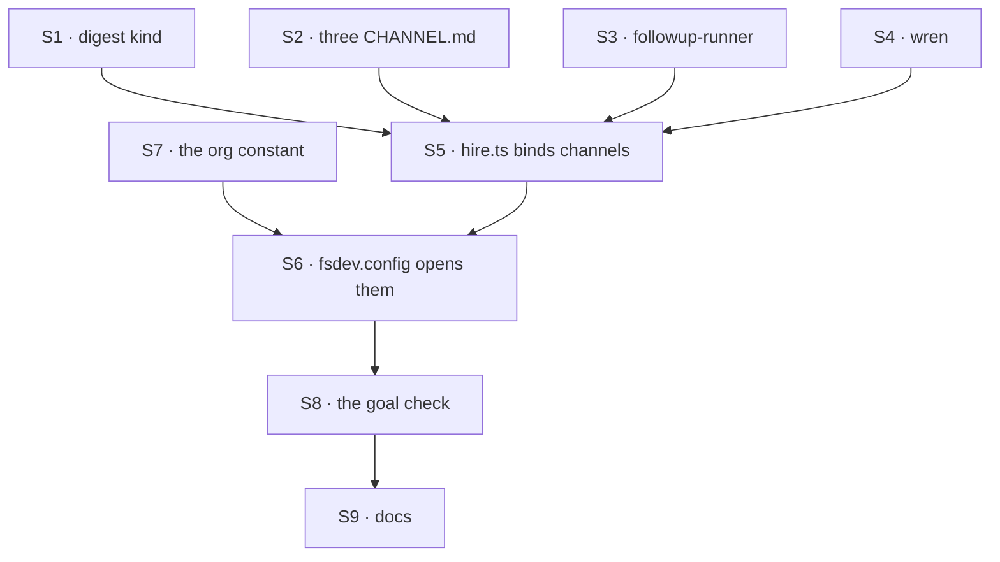

# FIX-1476 · Plan

[Spec](SPEC.md) · [Decisions](DECISIONS.md) · [Rules](BUSINESS-RULES.md) · **Plan** · [Docs](DOCS.md) · [Evolution](EVOLUTION.md)

One PR. No package changes — every call already ships. The work is a tree, two wiring edits, one
deletion and one goal check.

## What is true on `main` today

Re-derive these before building; they are the claims the spec rests on, each with the command
that produced it (run from the repo root, on `origin/main`).

| Claim | Command | Result |
|---|---|---|
| `CHANNELS.md` does not exist | `git grep -l "CHANNELS\.md" -- . \| grep -v ^specs/ \| wc -l` | `0` |
| The app registers no channel kind of its own | `grep -n channelKinds apps/kitchen-sink/workforce/workforce.gen.ts` | `export const channelKinds = {};` |
| Nothing in the app binds channels | `grep -rn "channelInstances\|openChannels\|readChannelsDirectory\|channelBoardIds\|channelBoard(" apps/ --include=*.ts --include=*.tsx \| grep -v node_modules \| wc -l` | `0` |
| The app has no org | `grep -rn "orgId" apps/kitchen-sink --include=*.ts --include=*.tsx \| grep -v node_modules` | no matches |
| `defineChannelFlow` cannot name its kind | read `DefineChannelFlowOptions` and the `defineFlow({ kind: CHANNEL_KIND })` call | three options (`notify`, `boards`, `inventory`); kind is literal |
| Board mechanics are already proven | `goals/channel-boards/it-runs-a-row-a-file-declared-board-holds/goal.md` | PASS, 2026-09-19, with a `by-name` control |
| `fsdev gen --check` is a **staleness** gate over this one app | `.github/workflows/ci.yml` → *Generated workforce module is current* | `pnpm --filter @flow-state-dev/kitchen-sink run fsdev gen --check`. It compares the committed module against what the tree renders. It never reads what the map *contains*, and it passes today with `channelKinds = {}` |
| A session's state schema is **not enforced at open** | `packages/engine/src/routes/session-routes.ts`, the `stateSchema.safeParse` branch | On a parse failure the route keeps the caller's raw state and creates the session anyway — *"validation happens at action-execution time, not session-create time"*. And a plain `z.object` strips an undeclared key and *succeeds*, so usually there is no failure to fall back from |
| Re-opening **compares** the supplied org against the stored one | `packages/workforce/src/channel/channel-binder.ts`, the `session.orgId !== orgId` branch | Refused by name, because a session's org is fixed at creation. The value passed to `openChannels` is not ignored on the second boot |

## Surfaces

| # | Where | What | Rules |
|---|---|---|---|
| S1 | `workforce/flows/channels/digest.ts` | The one custom channel kind. `defineFlow({ kind: "digest", cardinality: "singleton" })`, state schema admitting `members` / `instructions` / `transcript`, `post` appending a line, `read` returning the **most recent lines only**. No boards, no fan-out. Template: `customKind` in `packages/workforce/test/channel-binder.test.ts` | BR-1 BR-4 BR-5 |
| S2 | `workforce/teams/support/channels/{desk,ada-dm,noticeboard}/CHANNEL.md` | Three instances. `desk`: five members, `boards: [followups, escalations]`. `ada-dm`: one member, no `flow:`. `noticeboard`: `flow: digest`. Each charter says in one line which lesson it carries | BR-3 BR-4 BR-6 |
| S3 | `workforce/flows/workers/followup-runner.ts` | A worker kind (`cardinality: "collection"`, `configSchema: workerConfigSchema()`) declaring `channelBoard("support.desk", "followups")` under `resources: { [followups.id]: followups }` and exposing a `taskBoard({ collection: followups, workers: { … } })` drain as an action. Its worker body leaves an effect **outside the board** — the board's own report is generated on the path under test, so it cannot be its own evidence. That effect must be something a real followup runner would do (an org-scoped note written through the framework's storage reads well, and V7 already reaches `resourceState`); it must **not** be a filesystem write. This block ships in the reference app, where [AGENTS.md](../../../AGENTS.md)'s *Examples must be realistic* applies — `goals/channel-boards/…` keeps its outbox file inside the goal's own throwaway handler for exactly that reason | BR-7 BR-8 BR-9 |
| S4 | `workforce/teams/support/workers/wren/WORKER.md` | The one seat on S3. `flow: followup-runner` | BR-8 BR-10 |
| S5 | `workforce/channel-notify.ts` + `workforce/hire.ts` | The notify handler moves here out of the deleted `flows/channel/flow.ts` (top level of `workforce/`, which the generator does not walk). `hire.ts` gains `readChannelsDirectory`, builds `channelInstances(channels, { kinds: { ...channelKinds, channel: defineChannelFlow({ notify }) } })`, passes `channelBoards: channelBoardIds(channels)` to `hireWorkforce`, and returns the channels alongside the seats | BR-2 BR-10 |
| S6 | `fsdev.config.ts` | Spread the channel instances into `flows`; **delete** the `@/flows/channel/flow` import and the file. After `createFlowState`, build a `createSessionClient` over a fetcher that calls `flowstate.getRouter()`, and `await openChannels(…)` at module scope beside the existing awaited hire | BR-4 BR-11 BR-13 |
| S7 | `workforce/org.ts` | One exported constant, the org the file-declared channels open under ([D5](DECISIONS.md#d5)) | BR-11 |
| S8 | `goals/workforce-conventions/a-channel-holds-the-work-a-seat-drains/` | `goal.md` + `run.mts`, run against the **app's own tree** rather than fixtures. Legs and controls below | BR-1 – BR-10 |
| S9 | Docs | [DOCS.md](DOCS.md)'s operations: the app README's channels section, and one paragraph in `apps/docs/docs/workforce/channels.md`. **No changeset** — kitchen-sink and goals are private and no published package changes ([BP-022](../../../docs/contributing/best-practices.md)) | — |

S1–S4 and S7 are independent files and can land together. S5 is the join; nothing observable
happens until S6.

## The checks

**This table is canonical.** Every row names the state that makes it go red, and
[BUSINESS-RULES.md](BUSINESS-RULES.md) states the business case and points here rather than
repeating the red state. A check whose red state is *"change the assertion"* is not on this list,
and neither is one whose red state the framework cannot produce.

| # | Surface | Green | Red |
|---|---|---|---|
| V1 | S1 S5 | The committed `workforce.gen.ts` exposes `channelKinds` with exactly one key — `digest`, imported from `./flows/channels/digest` | **Red right now, before any work: the map is `{}`.** This asserts the map's *content*. Staleness — that the committed module matches what the tree renders — is already CI's `fsdev gen --check` over this same app, and `--check` never reads what the map contains, so the two do not overlap |
| V2 | S5 S6 | Neither file names a channel kind; the map is spread from the generated module | Hand-write `digest` into `hire.ts`. Every behavioural leg still passes and this one fails |
| V3 | S2 S6 | `support.noticeboard`'s session comes back on `flowKind: "digest"`; `support.ada-dm`'s on `"channel"` | Drop the `flow: digest` line — the noticeboard opens on the built-in |
| V4 | S1 S6 | The noticeboard's session state, read back over the route, carries all three keys the binder writes — `members`, `instructions`, `transcript` | Drop `transcript` from `digest`'s `stateSchema`: the key is **silently stripped** and the session comes back without it. Create does *not* refuse — the route falls back to the caller's raw state on a parse failure, and a `z.object` strips an unknown key and succeeds. An earlier form of this leg asserted that refusal, which the framework cannot produce |
| V5 | S2 | `support.desk`'s `read` returns `["followups", "escalations"]`, whole-array equal, with the names read off the manifest rather than typed | Return every board in the process, or the minted ids — not array-equal |
| V6 | S2 S3 | No file under `apps/kitchen-sink/workforce/` contains `support.desk.followups` | Use the minted id as the resource key instead of `followups.id`. The drain still works; the leg fails |
| V7 | S3 S4 S6 | A row filed on `followups` through the channel's `fileTask` is claimed by `wren`'s drain, the worker's own effect is visible outside the board, and the row is `completed` in `readBoard` **and** in `resourceState.get("org", ORG, "support.desk.followups/<id>")` | `GOAL_CONTROL=by-name`: point the runner at `channelBoard("support.other", "followups")`. Everything compiles, every id is well-formed, the row stays `pending` and no effect appears. Must fail at this leg, not at V6 |
| V8 | S3 | A row filed on `escalations` is still `pending` after the drain runs | Add `escalations` to the runner's resources — it is claimed, and the subset claim is gone |
| V9 | S5 S6 | Exactly one unattended-board warning across the boot, naming `escalations` | Wire `escalations` (count 0) or drop the runner's declaration (count 2, naming `followups`) |
| V10 | S2 | No `description:`, charter, board name or channel id under `workforce/` uses a word from [the *is not* column](BUSINESS-RULES.md#the-words) | Write `description: The support bot's noticeboard.` |
| V11 | S6 | Importing the config module and making the first router call finds the channels open, with no extra await in the test | Make `openChannels` fire-and-forget instead of an awaited module-scope statement — the first read misses |
| V12 | S9 | The published paragraph says a custom kind cannot hold a board and re-opening is not a migration | Delete either sentence. Both are framework behaviour a copier will otherwise meet as a surprise |

## Pins

Names the spec fixes on purpose. Everything else — helper shapes, error wording, test structure
— is the implementer's.

| Thing | Pinned to | Because |
|---|---|---|
| The custom kind | `digest`, at `flows/channels/digest.ts` | The basename **is** the registered kind name, and `flow: digest` in a `CHANNEL.md` must match it. It may not be named `channel`, which would shadow the binder's seed |
| Channel ids | `support.desk`, `support.ada-dm`, `support.noticeboard` | An id is minted from the folders and is retyped in S3's `channelBoard` call. Renaming a folder re-keys its boards and orphans rows |
| Board names | `followups` (attended), `escalations` (not) | The warning's message names them, and the goal reads them off the tree |
| Worker kind / seat | `followup-runner` / `support.wren` | The kind's own `kind:` must equal the basename or `hireWorkforce` refuses the seat by name |
| Storage | `support.desk.followups`, org scope | Minted, never written. Moving a channel folder moves the key and leaves rows behind |

## Guardrails

- **Do not add a `kind` option to `defineChannelFlow`, and do not widen `ChannelKind`.** The
  package is out of scope. If the work seems to need it, that is [D1](DECISIONS.md#d1) being
  wrong — raise it, do not build it. *Because* a framework widen bought for a demo is the shape
  [ER-9](../../epics/FIX-1455/BUSINESS-RULES.md) exists to refuse.
- **Ship no rail, navigator or channel-list UI.** Not one component, not a kitchen-sink-only one.
  *Because* [D8](../../epics/FIX-1455/DECISIONS.md#d8) gives every rendering surface to FIX-1477,
  and splitting it is what put the two issues in a completion cycle once already.
- **No worker-facing admin verb** — no create, delete, invite, join or leave, in a tool catalog or
  anywhere else. *Because* [ER-16](../../epics/FIX-1455/BUSINESS-RULES.md); FIX-1415 is parked.
- **Do not re-prove board mechanics.** `goals/channel-boards/…` is green and covers mint → file →
  drain → completed. S8's legs are the warning, the subset, the generated kind and the app's own
  tree. *Because* a second copy of a passing check is cost with no evidence.
- **Call `openChannels` on every boot, unguarded.** *Because* it is idempotent by contract and
  `boards:` is the one declaration re-opening carries; a first-boot guard silently strands a board
  added later.
- **Leave `escalations` unattended.** *Because* the warning is a deliverable ([D3](DECISIONS.md#d3)),
  and a reviewer reading the tree as incomplete is the expected reaction the charter answers.

## Where this touches a sibling

`apps/kitchen-sink/fsdev.config.ts` and `workforce/hire.ts` are both edited by
[FIX-1475](../FIX-1475/PLAN.md) (its S8 installs a registrar and a reload after
`createFlowState`; its PR-B carries the collision already noted against FIX-1429). The two do
not overlap in scope — FIX-1475 admits **seats** after construction, this admits **channel
sessions** — but they are the same two files and the same module-scope await block. Whoever lands
second rebases; neither changes the other's statements.

## Before you start

- **Re-read `apps/kitchen-sink/fsdev.config.ts` and `workforce/hire.ts` at their merged state.**
  FIX-1429 (#1989) and possibly FIX-1475 will have moved them.
- **Drive S8 through `goals/lib/driver.mts`'s `runHarness`, with `apps/kitchen-sink` as the
  app** — a checked-in `harness.mts` copied into the app root and run there, so the app's `@/*`
  aliases and its `node_modules` both resolve and top-level await works. `capabilities-come-from-files-alone`
  and `suspension/completes-via-the-resume-endpoint` are the two worked examples. Prefer it over
  copying `goals/channel-boards/…/run.mts`'s hand-rolled session client, which predates the
  driver. **One expectation to set explicitly in `goal.md`:** importing the app's real
  `fsdev.config` is the right app-tree proof and it is a heavy boot, so this goal is slower than
  a fixture goal and `goal:all` should expect that.
- **Read `goals/channel-boards/it-runs-a-row-a-file-declared-board-holds/run.mts` for its legs,
  not its harness.** It already has the read-from-storage and effect-outside-the-board shapes and
  the `by-name` control. Note where its outbox file lives — in a throwaway handler defined in the
  goal itself, never in a shipped block (S3).
- **Read `packages/workforce/test/channel-binder.test.ts`'s `customKind`** before writing S1. It
  is the minimum shape a hand-rolled channel kind has to carry.

## Notes from review

Round 1 (`/simplify` + Codex). Direction endorsed; D1's narrowing independently confirmed against
`main`, so it is settled. One line each.

**Folded**

- **V1 vs the dropped `gen --check` bullet** — resolved toward V1, re-aimed: `--check` is CI's
  *staleness* gate over this app, V1 asserts the map's **content**, which `--check` never reads
  and which is red on `main` today. The old V1 was a copy, and its "red today" claim was false.
- **V4 could not fail** — create never refuses on a state-schema mismatch and the goal never ran
  the kind's actions; the real failure is a key **silently stripped**, which V4 and BR-5 now assert.
- **The shipped worker wrote a file for the harness** — removed; S3 now requires a real effect,
  because this block ships in the app people copy ([AGENTS.md](../../../AGENTS.md), *Examples must
  be realistic*).
- **"Ignored" was wrong about the org constant** — it is compared on every later boot and a
  mismatch refuses the reopen; corrected in `DOCS.md` §2 and [D5](DECISIONS.md#d5), pinned as BR-15.
- **"Two legs" undersold the goal** — `SPEC.md` and `EVOLUTION.md` now state two *behaviours* plus
  the structural legs; `PLAN.md` was already honest.
- **BR-\* mirrored V-\*** — the V table is canonical and owns every red state; BR rows carry the
  business when/then and name their check. BR-3 and BR-11–BR-15 keep their own, since no V covers them.
- **D1's evidence three times** — full argument stays in [D1](DECISIONS.md#d1); §Open and
  `EVOLUTION.md` link to it.
- **S8's harness** — use `goals/lib/driver.mts`'s `runHarness` with `apps/kitchen-sink` as cwd
  (verified against two existing goals), not `channel-boards/run.mts`'s hand-rolled client; the
  heavy-boot expectation is stated in *Before you start* and belongs in `goal.md`.

**Declined**

- **Drop `ada-dm`** — it carries the one lesson the other two cannot, and it is the mistake the
  fence itself made ([D2](DECISIONS.md#d2)).
- **Fold `org.ts` into `hire.ts`** — kept, now argued: FIX-1475 is editing `hire.ts` in flight.
- **ER-6 as a pointer to the epic** — kept here; the epic's ownership table assigns it to this
  issue and [D4](DECISIONS.md#d4) decides it. Said once.
- **The `escalations` narrative four times** — *partially folded*: only the README was a full
  explanation and it is now named canonical ([DOCS.md](DOCS.md) §3), with D3's meta-sentence cut.
  The other three are one line each and load-bearing where they sit; cutting them removes content,
  not duplication.
