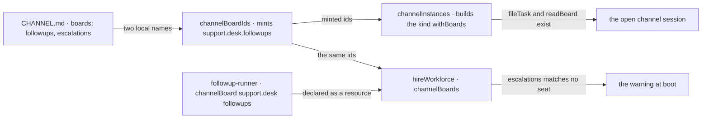

# FIX-1476 · Channels in the reference app — a kind on disk, boards in a file, one seat that drains them

**Spec** · [Decisions](DECISIONS.md) · [Rules](BUSINESS-RULES.md) · [Plan](PLAN.md) · [Docs](DOCS.md) · [Evolution](EVOLUTION.md)

Feature · kitchen-sink + one goal check · medium · 1 PR · epic
[FIX-1455](https://linear.app/fixpoint-labs/issue/FIX-1455) ·
[epic spec](../../epics/FIX-1455/SPEC.md)

> **Amended after merge (2026-09-21).** Two different things, and they should be read separately.
> **Corrections:** three premises about the framework are no longer true, one prescribed check
> does the opposite of what it claims, and one call ([D5](DECISIONS.md#d5)) stopped being a call
> at all because the framework now answers it. Nothing there was re-decided — the world moved and
> the spec is catching up. **One reversal:** the product owner changed his mind about the DM
> channel after seeing it built ([D6](DECISIONS.md#d6)). What moved, with the command behind each:
> [EVOLUTION.md → What changed after this spec merged](EVOLUTION.md#after-merge).

## Five people, before and after

| Someone who… | Today | After |
|---|---|---|
| **copies the app to give a team somewhere to talk** | Finds the channel kind registered and not one channel open. There is no file to copy | Finds three `CHANNEL.md` files under the team and copies the one shaped like what they want |
| **wants the work to outlive the channel** | Has the `boards:` line documented, and no worked example of it anywhere | Sees two board names in a channel's frontmatter, and a seat that runs the rows on one |
| **wires a seat to a board** | Guesses. Wiring is explicit on purpose, so there is nothing to copy | Copies four lines: `channelBoard`, the resource entry, `taskBoard`, the drain action |
| **forgets to wire the second board** | Rows sit `pending` and the app says nothing, because nothing hands hire the roster's board ids | Is told at boot which board nobody watches. The app ships that way so the message is visible |
| **thinks a DM needs its own kind** | Has one sentence in the docs saying it does not | Sees a two-member channel with no `flow:` line, notifying nobody, beside a channel that genuinely needed a kind ([D6](DECISIONS.md#d6)) |

The reference app is where a reader decides what a Workforce app *is*, and today it says a
workforce is four seats: `channelKinds` is `{}`, no file under `apps/` calls `channelInstances`,
`openChannels`, `readChannelsDirectory` or `channelBoardIds`, and the one channel instance it
registers has no consumer. The commands behind those counts are in
[PLAN.md](PLAN.md#what-is-true-on-main-today).

## What changes

![Two trees side by side, same vocabulary. Today the kitchen-sink workforce folder holds one worker kind, one block and a support team of four worker folders; there is no channels folder anywhere, the generated channelKinds map is empty, and a hand-registered channel instance sits outside the workforce tree holding no board. After, a channels folder under flows holds one kind file that the generated map now names, the support team gains a channels folder with three channel folders each holding a CHANNEL.md — one of them declaring two board names — a second worker kind declares one of those boards as a resource, a fifth worker folder runs it, and the instance outside the tree is gone because the binder builds the kind from the roster instead](figures/what-changes.svg)

Read it by what crosses the `workforce/` boundary. Today the one channel instance is built
**outside** the tree, which is why it can never hold a board: only `channelInstances` builds a
kind holding the ledgers a roster minted, and nothing calls it.

## How a board name in a file reaches the seat that runs the row



The seat and the channel never pass each other a reference; both name the same ledger. The one
nobody names is what the warning is for.

## What it looks like on disk

```diff
  apps/kitchen-sink/workforce/
    flows/
      workers/
        desk-clerk.ts
+       followup-runner.ts          ← declares one board and drains it
+     channels/
+       digest.ts                   ← the one custom channel kind
    teams/support/
+     channels/
+       desk/CHANNEL.md             ← built-in kind · boards: [followups, escalations]
+       <dm>/CHANNEL.md             ← built-in kind · two members · notifies nobody · no boards
+       noticeboard/CHANNEL.md      ← flow: digest · no boards
      workers/
+       wren/WORKER.md              ← flow: followup-runner
```

`followups` and `escalations` are plain local names. Nothing in the tree writes
`support.desk.followups`; the framework mints it from where the folder sits.

## What stays as it is

- **The framework.** No package changes, no new API. Every call already ships and is published in
  [channels.md](../../../apps/docs/docs/workforce/channels.md).
- **Board mechanics as a proof.** `goals/channel-boards/it-runs-a-row-a-file-declared-board-holds`
  already proves mint → file → drain → completed, and PASSes, so this issue does not re-prove it.
  Its own check adds the two **behaviours** that goal cannot reach — the unattended-board
  **warning** and the **subset** drain — and then proves the app's tree is actually wired: the
  generated kind map, each channel's kind, the board names, the minted id, the boot, and the
  vocabulary. Fifteen legs, in [PLAN.md → The checks](PLAN.md#the-checks) — twelve as first
  written, plus [V11](PLAN.md#why-v11-is-two-legs) split in two because the property could not be
  graded behaviourally without grading a race, plus two for the DM ([D6](DECISIONS.md#d6)).
- **Runtime channel administration.** No create, delete or invite verb
  ([ER-16](../../epics/FIX-1455/BUSINESS-RULES.md)); FIX-1415 stays parked.
- **Rail and navigator UI.** None ships here. The convention is rendered *through* FIX-1477's one
  navigator ([D8](../../epics/FIX-1455/DECISIONS.md#d8)); the seam is ER-7's.
- **The four existing seats.** `ada`, `grace`, `iris` and `otto` keep their files and their kinds.

## Sign off

1. **[D1](DECISIONS.md#d1) · One demo channel kind, not three clones.** The ticket asks for `dm`
   / `topic` / `workstream` as three kind files sharing one factory. The framework cannot build
   that — `defineChannelFlow` hard-codes its kind, so each clone is a hand-written channel graph,
   and none of the three could hold a board. **If wrong:** the reference teaches one escape hatch
   where readers wanted three shapes, and `dm` / `topic` / `workstream` survive only as instance
   names. Adding a second kind later is cheap; the three named ones are what we decline.
2. **[D3](DECISIONS.md#d3) · One board ships deliberately unattended.** The warning is a
   deliverable, so something has to trigger it. **If wrong:** a reader copies a tree with a
   known-incomplete wiring in it and misses the line saying it is on purpose.
3. **[D6](DECISIONS.md#d6) · The DM has two members and notifies neither.** *Your reversal, not a
   new ask* — recorded here so the spec and the code say the same thing. **If wrong:** the
   reference teaches that a DM is a silent channel between two seats when what you wanted was a
   seat and a person, and the shape spreads to whatever FIX-1477 renders.
4. **[D4](DECISIONS.md#d4) · ER-6's vocabulary is Seat, Kind, Agent, Channel, Board, Team — and
   its check is review, not a mechanism.** Every other child consumes this. **If wrong:** a word
   we did not fence spreads across four children, and renaming it after FIX-1477 publishes
   components costs an API change.

**Open: one, and it is the fence in sign-off 1** — the three-clone lock was written before anyone
read `defineChannelFlow`'s signature, so this spec **narrows a lock** rather than filling a gap.
The evidence and what would reopen it: [DECISIONS.md → Open](DECISIONS.md#open). The reasoning
and what lost: [DECISIONS.md](DECISIONS.md). The cases:
[BUSINESS-RULES.md](BUSINESS-RULES.md). The lineage: [EVOLUTION.md](EVOLUTION.md).
