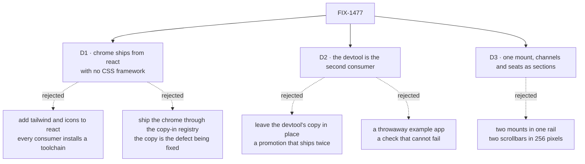

# FIX-1477 · Decisions

[Spec](SPEC.md) · **Decisions** · [Rules](BUSINESS-RULES.md) · [Plan](PLAN.md) · [Docs](DOCS.md) · [Evolution](EVOLUTION.md)

What was considered, what was chosen, and what each choice locks in. Three decisions are the
sign-off surface, and one fork is still yours. The epic already settled that there is **one**
navigator and that its depth comes from the flow's cardinality
([D8](../../epics/FIX-1455/DECISIONS.md#d8)); none of that is reopened here.

## The tree

Solid edges are what you are signing. Dashed edges lost, and the label says why.

## D1 · The chrome ships from `@flow-state-dev/react` and drags in no CSS framework; the one cardinality-aware query ships from `@flow-state-dev/client`

| | |
|---|---|
| **Instead of** | Adding a styling toolchain and an icon set to `react` so the developer tool's styled navigator could move across intact · shipping the Workforce chrome through the copy-in component registry, which is where generic item rendering lives · leaving the query in `react`, where the developer tool cannot reach it without adopting React machinery it does not use today |
| **Because** | `react` has three dependencies, all our own, and marks itself free of side effects; its existing components render plain, unstyled controls and delegate the polished version to the registry. A package three others depend on cannot start installing a CSS toolchain into every app that takes it. And the copy-in registry is the *wrong shelf for this*: a registry item is copied into the consumer, and a copy that can drift is the defect this issue exists to close. The cardinality branch is not React at all — one line of query construction, and `client` is the one place both hosts already reach |
| **Locks in** | A published component API themed through CSS custom properties and filled through slots, not through class names. Consumers outside this repo will hold it ([ER-24](../../epics/FIX-1455/BUSINESS-RULES.md)), so changing the slot shape later is a breaking change for them. It also means the reference app's own look is *its* CSS, not something a reader gets for free — they import behaviour and supply skin |

**What would change my mind:** evidence that we intend to publish `@flow-state-dev/ui` as a real
package rather than a copy-in registry. Then the Workforce chrome has a natural styled home and
D1 becomes a split across two published packages instead of a slot API in one.

## D2 · Our own developer tool becomes the second consumer, and its copy of the drill-down is deleted

| | |
|---|---|
| **Instead of** | Publishing the navigator and leaving `packages/devtool`'s navigator folder running beside it · standing up a small example app whose only job is to import the package once |
| **Because** | A promotion that leaves the original running is a copy, which [ER-9](../../epics/FIX-1455/BUSINESS-RULES.md) forbids. The epic's completion gate asks for "one consumer that is not the reference app, **or** the import surface demonstrably able to be" — and that second half is a check that cannot fail, the defect class this epic has hit five times. The developer tool is a real consumer, in a different styling world, that already contains the code being moved |
| **Locks in** | `devtool` takes a dependency on `@flow-state-dev/react`, which it does not have today. The navigator's API has to satisfy two differently-skinned hosts **before** it ships, which is the only thing that stops it being shaped for the reference app alone. The developer tool's own affordances — copy the instance id, start a session, refresh, list the flow's actions — become slots rather than reasons to keep a fork |

![Two hosts sit above one shared component. The developer tool supplies its own row chrome — a copy-id button, a new-session button, the actions list — and the reference app supplies its own; both draw their rows through one navigator shipped from the react package, which owns the grouping by kind, the cardinality branch, the fetch-on-leaf-expand rule and the shared selection. Below that, the client package owns the one session-list query that sends an instance id for a collection kind and a kind for a singleton. The developer tool's own navigator folder is deleted, which is what makes this a promotion rather than a second copy](figures/promotion.svg)

Look at what is *above* the shared box and what is inside it. Everything above is skin, and the
two hosts disagree about all of it. Everything inside is behaviour, and they cannot afford to
disagree about any of it.

**What would change my mind:** a reader outside this repo adopting the components before the
developer tool could. That is a better consumer than ours, and it would let the developer tool's
migration become a follow-up instead of a gate.

## D3 · One navigator, mounted once, with channels and seats as two sections inside it

| | |
|---|---|
| **Instead of** | Mounting the same component twice in the rail with different kind filters — which the epic explicitly permits and leaves to this issue |
| **Because** | Two mounts is two scroll containers inside a 256px rail, and a scroll-within-a-scroll is the exact failure the epic's own narrow-width mind-changer turns on. One mount also gives one keyboard order, one selection, and one read of the flow list rather than two that have to be talked out of racing. The sections are a label and a kind filter; nothing else distinguishes them |
| **Locks in** | Section grouping is the component's job, so a third concern later is another section rather than a third mount. It also means the rail cannot give channels and seats independent scroll positions — if that turns out to matter at a hundred seats, it is a change to the component, not a change to the app |

## Decided, not asked

- **The component is called `FlowNavigator`.** The epic left the name to this issue. It browses
  flows — kinds, instances, sessions — and its second host browses flows that are not a
  workforce at all, so a Workforce-flavoured name would be wrong there on day one.
- **Every example filters on `channel` and `agent`, the kinds the framework actually ships.**
  `defineChannelFlow` takes no kind parameter and builds `kind: "channel"`, so an example naming
  two channel kinds teaches something that one factory cannot produce. **Which channel kind names
  a deployment ends up with is [FIX-1476](https://linear.app/fixpoint-labs/issue/FIX-1476)'s
  call, not this issue's** — and it does not reach the component either way, because a section's
  `kinds` is a value. A different answer there is a different array, never a second component.
- **Nothing takes the freed control row.** The six controls above the prompt go with the modes
  and thinking styles they drove. A reference app that refills the row it just emptied has not
  shed anything.
- **Board columns reuse the existing task statuses** — no new vocabulary minted for a UI phase
  ([ER-11](../../epics/FIX-1455/BUSINESS-RULES.md), [BR-21](BUSINESS-RULES.md)).
- **The five drifted registry copies are reconciled, not left** ([BR-14](BUSINESS-RULES.md)). All
  five are components the rebuilt shell renders. Two more files share a registry filename without
  being registry items; they belong to the patterns shed and are left to
  [FIX-1478](https://linear.app/fixpoint-labs/issue/FIX-1478).
- **An ownerless session row is never guessed into an instance** (BP-030). Where such a row is
  reachable at all is narrower than it first looks — [BR-12](BUSINESS-RULES.md) states it.
- **The background-work panel stays where it is, and the gap is commented up** rather than
  bucketed here — [D5](../../epics/FIX-1455/DECISIONS.md#d5)'s two destinations do not cover a
  region that is resource-backed but is neither Workforce chrome nor item rendering, and answering
  an epic-level question locally is a second authority ([ER-19](../../epics/FIX-1455/BUSINESS-RULES.md)).

## Considered and dropped

| Alternative | Why not |
|---|---|
| A third package, `@flow-state-dev/workforce-ui`, so the chrome can be as styled as it likes | The epic's invent-kill, and it would be reached for exactly the reason the epic predicted — because styling was inconvenient somewhere else |
| A `depth` or `levels` prop, "just for the reference app" | Forbidden by [ER-9](../../epics/FIX-1455/BUSINESS-RULES.md): the first kind whose cardinality changes makes the app wrong and silent ([BR-3](BUSINESS-RULES.md)) |
| A third-party tree component | Adds a dependency whose semantics do not match, and removes none of the real work — the grouping, the lazy fetch and the shared selection are all still ours |
| Pre-fetching every instance's sessions so the rail feels instant | One request per seat the moment a roster is more than a handful — the one performance shape this component can get badly wrong ([BR-7](BUSINESS-RULES.md)) |
| Rendering roster detail — load, boards, persona — in the rail, since it is already listing seats | Breaches [D7](../../epics/FIX-1455/DECISIONS.md#d7) by name. The rail is navigation into the roster; the roster's one home is the panel |

## Open · one, and it is a business call

### The rail's seat list would be published to anybody: ship it, or hold it?

**Plain terms.** The app asks the server "what flows do you have?" to build the left rail. That
question is answered to anyone who asks it — no account, no password, and the route is classified
*exempt* from authorization on purpose, as "public flow metadata". Today the answer is dull: a
chat flow and a few demo workers. Once the durable-hire work in this same epic lands, every team
somebody hires becomes an entry in that answer, and each entry's name **contains the organization
it was hired for**. So a stranger — or a customer of ours looking at their own copy — could read
a list naming every organization on that deployment and who they hired.

**What holding the rows does not buy — say this first, because it is the part that gets
misread.** The rail is a teaching surface, not a fence. The endpoint is answered to anyone who
asks it directly, whatever any screen chooses to draw, so not drawing the rows changes **nothing**
about the exposure. The fence is
[FIX-1486](https://linear.app/fixpoint-labs/issue/FIX-1486), and its own locked line is exactly
this case: *flow listing's kinds may remain a global registry of shapes; what must be org-scoped
are the instances and sessions consumers browse*. A hired seat is a registered **instance** whose
id carries its org, so durable hire is what walks the registry across that line.

**This is an amendment to the epic, not an exit it already left open.** Two things could read as
pre-authorising it and neither does. [D7](../../epics/FIX-1455/DECISIONS.md#d7)'s channels-only
fallback exists, but its trigger is *"a rendered narrow-width pass showing the rail cannot hold
the channels half and the seats half together"* — a layout finding, not this one. And what the
epic analysed is the **session** listing: D8 verifies `handleListSessions` filters by flow, user
and tenant, and records the exposure as *between organizations inside a single tenant*. It never
looked at the flow list's authorization. That is what this spec found and
[FIX-1475](https://linear.app/fixpoint-labs/issue/FIX-1475)'s PR-B has since reproduced by
execution: `list_flows` is `{ kind: "exempt" }` (`packages/engine/src/routes/route-auth.ts`), so
the list is answered with **no credential at all** — strictly wider than what was signed off. So
the choice is between shipping what D7 ratified and amending it knowingly.

**The trade-off.** Listing seats in the rail is the picture the epic painted and the thing a
reader clones. Holding it back means the rail ships with channels only for a few weeks, and you
find your team in the roster panel on the right, which is already in the layout and is already
scoped to your organization.

**My recommendation: hold the seat rows until the flow list can be scoped — and do not mistake
that for containment.** It costs no new decision inside this issue, no new component and no new
prop — the navigator still ships, still derives its depth, still hosts the channels half, and the
seat section switches on the day the list carries an organization. What it buys is narrow and
worth having anyway: the reference app stops **teaching** the exposure, in a file people copy,
and stops making it convenient. What it does not buy is a closed hole. If the exposure itself is the concern rather
than the lesson, FIX-1486's priority is the lever, not this issue's scope.

**What would change my mind:** if we ship or recommend a gate in front of that endpoint in real
deployments, so the list is not in fact public. Then the exposure is between organizations on one
deployment rather than to the world, and it becomes a documented limit like any other. It would
also change if FIX-1486 lands inside this epic's window — then there is nothing to hold.

**Cost of being wrong: asymmetric, which is why I lean hard.** If I am wrong to hold it, the rail
looks thinner than the figure for a few weeks and switching it on is one small change. If I am
wrong to ship it, we have put an unauthenticated directory of customer names on screen in the app
every reader clones — and taught, by example, that browsing it is the normal thing to do. The
hole is open either way; the difference is whether we ship the app that walks people to it.

## How it got here

- **Draft** — read the epic's D5, D7 and D8 as given; verified the cardinality branch, the
  registry copy mechanism, and the flow-list route against `origin/main` before writing any of
  it down.
- **Draft** — the org fork was not in the brief. It came out of reading the route table: the
  flow-list route is listed as exempt from management authorization, which is wider than the
  session-level limit the epic recorded.
- **Review, round 1** — the fork's framing was wrong, its recommendation was not: it leaned on
  D7's fallback, whose trigger is a layout finding. Holding the rows is now stated as an
  amendment. Three engineering gaps folded the same round — `react` carries a third copy of the
  cardinality branch, it has no transport seam at all, and the roster has no read path from this
  app ([PLAN.md → Blocked on](PLAN.md#blocked-on)).
