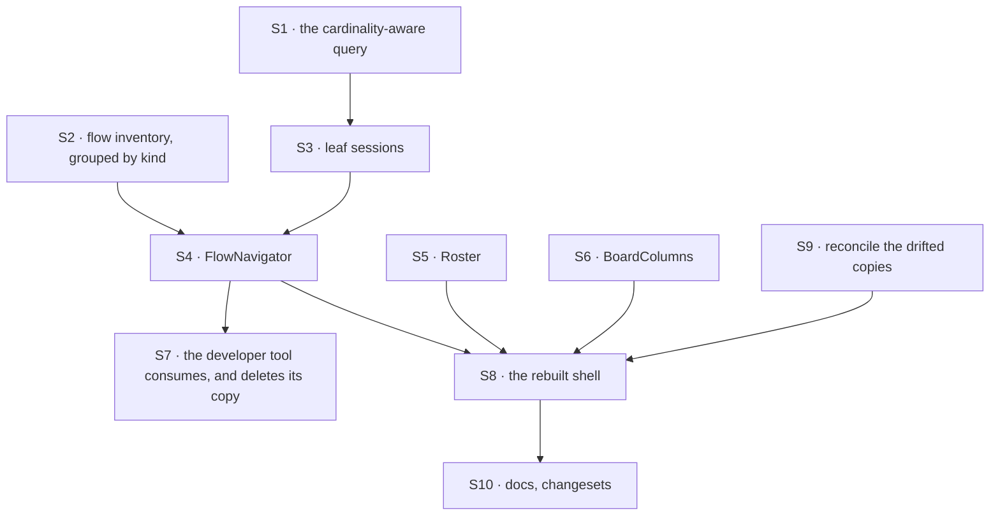

# FIX-1477 · Plan

[Spec](SPEC.md) · [Decisions](DECISIONS.md) · [Rules](BUSINESS-RULES.md) · **Plan** · [Docs](DOCS.md) · [Evolution](EVOLUTION.md)

Written for the implementing agent. IDs cross-reference [BUSINESS-RULES.md](BUSINESS-RULES.md)
(BR-n) and [DECISIONS.md](DECISIONS.md) (D-n). `tdd`. **Three PRs**, seamed at the package
boundary: PR-A is the public surface and is checkable with no app at all; PR-B and PR-C are the
two consumers and are independent of each other.

## Surfaces

| ID | Package · role | Change | Rules |
|---|---|---|---|
| S1 | `client` · the session-list query | One exported helper turning a flow entry into `ListSessionsOptions`: an instance id for `cardinality: "collection"`, a kind for `"singleton"`. **The only place that branch is written** — the developer tool's copy in `use-sessions.ts` goes away against it | BR-1 BR-2 BR-12 |
| S2 | `react` · the flow inventory | One read of the flow list per host, grouped by `kind`. The grouping level is the new work: today's list is flat over instances | BR-5 BR-6 BR-10 |
| S3 | `react` · leaf sessions | The session list for **one leaf**, gated on that leaf being open, with a fence that discards a response whose leaf has since closed or changed. Model it on the developer tool's existing read fence rather than inventing a second one | BR-7 – BR-12 |
| S4 | `react` · `FlowNavigator` | Sections (label + kind filter), kind rows, derived depth, expand state, one selection, row content through slots. **No CSS framework, no icon package** — theming is CSS custom properties, chrome is slots (D1) | BR-1 – BR-11 BR-16 BR-17 BR-24 BR-27 |
| S5 | `react` · `Roster` | Reads the durable roster collection [FIX-1475](https://linear.app/fixpoint-labs/issue/FIX-1475) ships, including its skipped-seat problems list. Organization scoping is the collection's, not the component's | BR-19 BR-20 |
| S6 | `react` · `BoardColumns` | Reads one board's ledger, grouped by the **existing** task statuses. The empty column states the likely cause rather than spinning | BR-21 BR-22 |
| S7 | `devtool` · consume, and **remove** | Take a dependency on `@flow-state-dev/react`. Render S4 with the tool's own skin and its affordances as slots. **Delete** `src/react/components/navigator/` and `src/react/hooks/use-sessions.ts` | BR-15 BR-17 |
| S8 | kitchen-sink · the shell | `app/page.tsx`: the rail becomes one `FlowNavigator` with a Channels and a Seats section; the right panel becomes standing `BoardColumns` + `Roster` and **loses its build-mode conditional**; the narrow-width order is wired. **Remove** `components/session-sidebar.tsx` | BR-13 BR-18 BR-25 – BR-28 |
| S9 | kitchen-sink · the drifted copies | Reconcile the **five** registry-installed files that no longer match their source: `conversation.tsx`, `message.tsx`, `chat-assistant.tsx`, `task-plan.tsx`, `task-plan-state.ts`. Each is either pushed back into the registry or reverted to it — never left forked | BR-14 |
| S10 | Docs · changeset | [DOCS.md](DOCS.md)'s operations; `packages/react/README.md`; `apps/kitchen-sink/README.md`. One `minor` changeset for `client` and `react` (new exports) and one `patch` for `devtool` (a new dependency, no API change). **None for kitchen-sink** — private (BP-022) |  |

**What is removed, and what is not mine to remove.** S7 and S8 carry the deletions (tenet 3):
the developer tool's navigator folder and its session hook, and the app's session sidebar. The
**six-control strip and the four modes are [FIX-1478](https://linear.app/fixpoint-labs/issue/FIX-1478)'s**
— this issue owns only what takes the freed row, and the answer is nothing (D3's neighbour in
*decided, not asked*). The **background-work panel stays where it is**; it is the one region D5's
two buckets do not cleanly cover, and that is commented up rather than settled here
([Follow-ups](#follow-ups)).

## Sequence



## PR plan

| PR | Surfaces | depends_on | Why this seam |
|---|---|---|---|
| PR-A | S1 S2 S3 S4 S5 S6 · `packages/react/README.md` · the changesets | — | The public boundary first (BP-004). It is checkable with no app running, and both consumers need it before either can start |
| PR-B | S7 | PR-A | The reusability proof ([ER-24](../../epics/FIX-1455/BUSINESS-RULES.md)). Deliberately **not** behind PR-C: it needs nothing from FIX-1475 or FIX-1476, so the epic's gate stops depending on two siblings landing |
| PR-C | S8 S9 · kitchen-sink README · [DOCS.md](DOCS.md) | PR-A | The shell. Needs real collections to render, so it is the one that waits on siblings |

**PR-C's outside waits.** `Roster` needs FIX-1475's roster collection; `BoardColumns` needs
FIX-1476's channel kinds and boards. PR-A is checkable against fixtures before either lands.
PR-B needs neither, which is the point of the split.

## Checks

Every row names what would make it fail. A check with no producible red state proves nothing.

| ID | Runs after | Passes when | Would fail if — the red state |
|---|---|---|---|
| V1 | S1 | A collection entry yields an instance-id filter **and no kind filter**; a singleton yields a kind filter **and no instance filter** | Return both keys, or the same key for both. Asserting the *absence* of the other key is the anti-game clause — a helper that sends both would pass a presence-only test and then silently over-filter |
| V2 | S2 | Two instances of one collection kind produce **one** kind row with two children | Run the same assertion against today's flat list (`packages/devtool/.../flow-list.tsx`, whose own header says "two copies of one kind are two rows here"). It fails. That is the red state, and it is available before a line is written |
| V3 | S3 S4 | Expanding a kind holding 40 instances makes **zero** session-list calls; expanding one instance makes exactly one | Move the fetch to the kind row: the counter reads 40. This is the epic's named foot-gun and the level that can fan out did not exist before this issue |
| V4 | S3 | Open leaf A, open leaf B, resolve A's response last → B's rows render and A's are discarded | Drop the fence: A's rows land under B. Resolve the two promises out of order in the test, or it cannot fail |
| V5 | S4 | The component's published props are exactly the allowed set — no depth, no levels, no per-kind override, no `orgId` (BR-3, BR-24) | Add any one of them. Written as an **allow-list over the whole prop set**, not a denylist of three names, so a fourth spelling fails too |
| V6 | S4 S8 | Rendered at 256px with every kind and every instance expanded, three indent levels are distinguishable and the rail has exactly **one** scroll container | Mount twice instead of once: two scroll containers. Assert on the expand-all state — a collapsed rail proves nothing here, which is the whole point of D7's mind-changer |
| V7 | S7 | The developer tool renders the shipped navigator, with its own affordances, and `src/react/components/navigator/` does not exist | Keep one file: the existence assertion fails. **Assert the rendered DOM too**, not only the deletion — a deleted folder and a hand-rolled replacement elsewhere would pass a file check |
| V8 | S9 | Every target the component registry's manifest declares is byte-identical to its source, and **at least 25 files were compared** | **Red today: 5 of 25 differ.** The count assertion is the anti-game clause — deleting a row from the manifest would otherwise make the check pass by un-shipping the component |
| V9 | S8 | No component the shell's three regions define reads flow, session, roster or board data except through a package export (BR-13) | **Red today**: the session sidebar imports session types from `@flow-state-dev/client` directly. Scoped to the regions [ER-7](../../epics/FIX-1455/BUSINESS-RULES.md) assigns this issue — rail, stream, panel — not to every file in the app |
| V10 | S4 S8 | Rendered at three widths: boards yield first, the rail second, the stream never (BR-25 – BR-28) | Reorder the breakpoints: the stream collapses below `sm` and the check catches it. Assert at all three widths, not two |
| VG | S8 | **Playwright, against the Next-built app** (`apps/kitchen-sink/e2e/`): the rail lists the kinds; a singleton channel kind opens straight into its conversations; a seat kind opens into seats and then into one seat's conversations; and the **network log shows no session-list request on the kind expand** | Pre-fetch everything: the DOM assertions still pass and the network assertion fails. The network half is what makes this a goal check rather than a screenshot |

**No model runs in any of this**, so no `goals/` check applies: every claim is about what a
browser does with data the server already has. VG is the real-path check, in a suite that already
drives the built app.

## Pinned names · the only four

| Where | Name | Why pinned |
|---|---|---|
| `react` export | `FlowNavigator` | Public, and the epic left it to this issue. It browses *flows*, and its second host browses flows that are not a workforce |
| `react` export | `Roster` | Public. The epic's documentation draft already promises it |
| `react` export | `BoardColumns` | Public. Same |
| Section prop | `sections`, each `{ label, kinds }` | Public, and it is the sanctioned shape of D8's "two filters are fine" — a label and a kind filter, never a depth |

Everything else — hook names, slot names, file layout, the CSS custom property names — is yours.

## Guardrails

| Rule | Because |
|---|---|
| Fetch sessions on **leaf** expand only, never on a kind expand | The kind level is new above what the developer tool has, so the level that can fan out did not previously exist. A per-row sweep before the list is the same shape wearing a different name |
| `react` gains no dependency that is not already one of ours | D1's whole content. A styling toolchain in `react` is installed by every app that takes the package, including the ones that render no workforce at all |
| Write the query branch once, in `client` | The developer tool can reach `client` today and `react` only after PR-B. Two copies of `{flowId}` versus `{flowKind}` is the same defect this issue exists to remove (tenet 5) |
| Reuse the developer tool's read fence, and never attribute an ownerless session to an instance (BP-030) | The fence already solves V4's out-of-order case, for the reason V4 exists — two rows of one kind. Guessing an owner puts one copy's history under another, which is the same bug from the other end |
| Assert the absence of props, not only the presence of behaviour (BP-003) | A test that only checks three levels render passes just as well with a `depth` prop bolted on beside it |
| The shell's regions change; the stream's *contents* do not | S9 reconciles a fork; it does not redesign a renderer |

## Docs

[DOCS.md](DOCS.md) carries the proposed prose. Publish it with **PR-C**, reconciled against what
the components actually do — not with PR-A, which ships no user-visible app. The shared overview
section the epic drafted waits on FIX-1475 too; whichever of the two lands second links the
other's page rather than repeating it ([ER-25](../../epics/FIX-1455/BUSINESS-RULES.md)).

## Sketch · pseudocode, illustrative, react to the shape

```
navigator(sections):
    entries ← the flow list, read once for this host
    for each section:
        kinds ← entries whose kind is in section.kinds, grouped by kind
        for each kind group:
            draw a kind row                              ← no fetch here, ever (V3)
            if the row is open:
                if this kind is a collection:
                    for each instance: draw an instance row
                        if THAT row is open: leafSessions(instance)   ← a leaf
                else:
                    leafSessions(the kind itself)                     ← also a leaf

leafSessions(leaf):
    options ← client.sessionQueryFor(leaf)      ← S1: instance id, or kind
    guard the response on the leaf still being the open one (V4)
```

**POC:** none built. The two premises a POC would test — that the cardinality branch is one field
and that the drill-down already works — are already shipped and running in the developer tool,
so the evidence is the code rather than an experiment. The genuinely new level, grouping rows
under their kind, is cheaper to build with V2 red in front of it than to sketch.

## At implement time

Re-check these against the repo before building; each of them moves.

- **Has FIX-1475 landed?** `S5` reads the roster collection it ships, at `workforce/roster/*`.
  Its plan says PR-A ships that read surface first, precisely so this issue does not wait for the
  whole thing. Read its `problems` dialect rather than inventing a third word for a skipped seat.
- **Has FIX-1476 landed, and which kind names did it settle on?** `S6` needs its channel kinds
  and the board names on `CHANNEL.md`. A board's ledger id is `<channelId>.<boardName>`, minted
  by the workforce package — do not re-derive that join in the UI. Put whatever kind names it
  settled into S8's Channels section; until then the section names `channel`, the one the
  framework ships. **FIX-1476 hands over convention and data and no rail UI at all** — not the
  navigator, not a channel-only list, not a temporary one. If a `ChannelList` appears anywhere,
  the seam has been breached.
- **Do not plan or make edits in `apps/kitchen-sink/fsdev.config.ts` or `workforce/hire.ts`.**
  They are contested between FIX-1475 (in implementation) and FIX-1476. No surface in this plan
  needs them; if one appears to, that is a finding to raise rather than an edit to make.
- **Has FIX-1478's collapse trigger fired?** If the patterns shed folded into this issue, the
  control strip and the four modes become S8's, and `apps/kitchen-sink/e2e/mode-switching.spec.ts`
  goes with them. If it did not, leave both alone and read its keep-notes.
- **Has the Open fork been answered?** If the answer is *hold*, S8's Seats section is not mounted
  and the rail is Channels only; nothing else in the plan changes. If it is *ship*, S8 mounts
  both sections and [DOCS.md](DOCS.md) gains the limits paragraph the epic drafted.
- **`@flow-state-dev/ui`** is a copy-in registry, not a published package, and it is `private`.
  If that changed, D1's *what would change my mind* has fired and the split wants re-reading.

## Follow-ups

- **The background-work panel has no bucket.** It is resource-backed (it reads a conversation's
  child sessions through package hooks) but it is not Workforce chrome and it is not item
  rendering, so [D5](../../epics/FIX-1455/DECISIONS.md#d5)'s two destinations do not cover it.
  Left where it is, with its e2e test intact. Commented **up** to the epic under
  [ER-19](../../epics/FIX-1455/BUSINESS-RULES.md) rather than answered here.
- **Two files share a registry filename without being registry items** —
  `routed-specialists.tsx` and `evented-actors.tsx` exist in both trees and appear in no manifest
  entry. They belong to the patterns shed; flagged for FIX-1478, not touched here.
