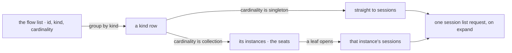

# FIX-1477 · UI package split — the rebuilt shell, imported rather than copied

**Spec** · [Decisions](DECISIONS.md) · [Rules](BUSINESS-RULES.md) · [Plan](PLAN.md) · [Docs](DOCS.md) · [Evolution](EVOLUTION.md)

Feature · `client` + `react` + `devtool` + kitchen-sink · large · 5 PRs · epic
[FIX-1455](https://linear.app/fixpoint-labs/issue/FIX-1455) ·
[epic spec](../../epics/FIX-1455/SPEC.md)

## Five people, before and after

| Someone who… | Today | After |
|---|---|---|
| **builds a Workforce UI outside the reference app** | Copies the reference app's files and owns the copy forever. There is nothing to import | Installs one package and imports the navigator, the roster and a channel's board columns |
| **opens the reference app to see a workforce** | Finds a chat app. No channel, no seat and no board appears anywhere on screen | Finds the team in the left rail, its boards and roster on the right, and a channel's turns in the middle |
| **browses a channel kind, then a seat kind** | n/a | Opens a channel kind and lands in its conversations. Opens a seat kind and lands in its seats, then in one seat's conversations. Nothing in the app said how deep to go |
| **already ships our developer tool** | Maintains a second copy of that same drill-down, in a second styling world | Renders the one shipped component in its own skin. A fix lands in both places at once |
| **has a hundred seats under one kind** | n/a | Opening the kind lists a hundred names and asks the server nothing more. One conversation list is fetched, when one seat is opened |

Nobody can copy an app by importing it. Today the only way to build a Workforce screen is to
clone the reference app's files, which means every reader forks the chrome on day one and
diverges from it on day two. That is not hypothetical: of the twenty-five component files the
reference app already installed from our own component registry, **five have drifted from the
source they came from** — and every one of the five is a component the rebuilt shell renders.

## What changes

![The same three shell regions twice, aligned column for column. Today the rail holds a session list written in the app, the centre holds the turn stream rendered by files copied into the app with five of twenty-five copies drifted from their source, a six-control strip sits above the prompt, and the right panel holds artifacts only in build mode — every region is app-local. After, the rail holds one navigator imported from the react package, the centre keeps the same turn stream with its copies reconciled to one source of record, the control strip is gone, and the right panel holds boards and the roster imported from the react package and no longer conditional on a mode](figures/where-it-ships-from.svg)

Read the tag under each region, not the region. The columns barely move; what changes is where
each one's code comes from. The centre is the exception, and deliberately so — the turn stream
is the one thing the app already gets right, so it keeps its shape and only stops being a fork.

**The rail, as somebody writes it:**

```diff
- import { SessionSidebar } from "@/components/session-sidebar";
+ import { FlowNavigator } from "@flow-state-dev/react";

- <SessionSidebar sessions={sessions} onSelect={…} />
+ <FlowNavigator
+   sections={[{ label: "Channels", kinds: ["channel"] },
+              { label: "Seats",    kinds: ["agent"] }]}
+   onSelectSession={…}
+ />
```

A section is a label and a set of kind names. `channel` is the one channel kind the framework
ships today, and `agent` is the seat kind; an app that declares a channel kind of its own adds
that name to the same list, which is a value, not a second component. You never say how deep a
kind goes — that is read off the flow ([D3](DECISIONS.md#d3), and
[D8](../../epics/FIX-1455/DECISIONS.md#d8) above it), so the Channels section is two levels and
the Seats section is three without either saying so.

**And the right panel, which stops being a build-mode feature:**

```diff
+ import { Roster, BoardColumns } from "@flow-state-dev/react";
```

## How the rail gets its depth



Both paths end at the same fetch, and only a **leaf** triggers it, which is what keeps a roster
of a hundred seats from becoming a hundred requests.

## What stays as it is

- **The turn stream and every item renderer.** This issue reconciles the app's drifted copies
  with their source; it does not redesign what they draw. Generic conversation and item rendering
  keeps coming from the component registry, where
  [D5](../../epics/FIX-1455/DECISIONS.md#d5) routes it, and no Workforce chrome moves in beside it.
- **Who supplies the data.** The durable roster is
  [FIX-1475](https://linear.app/fixpoint-labs/issue/FIX-1475)'s; the channels and boards are
  [FIX-1476](https://linear.app/fixpoint-labs/issue/FIX-1476)'s. This issue renders them and
  widens neither.
- **The yielding order under narrow widths.** Fixed at the epic ([ER-7](../../epics/FIX-1455/BUSINESS-RULES.md)),
  consumed here: boards yield first, the rail second, the stream never.

## Sign off

1. **[D1](DECISIONS.md#d1) · The Workforce chrome ships from `@flow-state-dev/react` carrying no
   CSS framework, and the one cardinality-aware query ships from `@flow-state-dev/client`.** If
   wrong: either a package three others depend on starts pulling a styling toolchain into every
   app that installs it, or the chrome needs a fourth package to live in and the epic's
   invent-kill is breached to make the demo look right.
2. **[D2](DECISIONS.md#d2) · Our own developer tool becomes the second consumer, and its copy of
   the drill-down is deleted.** If wrong: we publish a component shaped for exactly one app and
   call it reusable, which is the claim the whole epic rests on. This is the one to weigh — it
   is also the largest single cost in the issue.
3. **[D3](DECISIONS.md#d3) · One navigator, mounted once, with the channels and the seats as two
   sections inside it.** If wrong: a 256px rail holding two lists that scroll independently, and
   the second component-per-concern the epic exists to prevent, arrived by layout instead of by
   argument.
4. **[D4](DECISIONS.md#d4) · A hired roster and a channel board are ordinary in-organization
   data, so the roster and board panels read them directly.** Answered already — a member of an
   organization may see what that organization holds, unless it is scoped to one user. If wrong:
   we put a team's roster and every row of its work in front of everyone in that organization,
   and narrowing it later means taking a shipped panel away.

**Open: one, and it is yours.** The rail's seat rows would come from a list the server answers to
anyone who asks it — no credential — and after durable hire lands that list names every
organization's seats. Whether the reference app puts that on screen on day one is a business
call, and it is a call about what we **teach**, not a fence: the list is public whatever any
screen draws, and closing it is [FIX-1486](https://linear.app/fixpoint-labs/issue/FIX-1486)'s.
**Holding the rows amends the epic** — D7 ratified shipping them, having analysed the session
listing rather than this route — so it is a decision to take knowingly, not a fallback to
invoke.
The full ask: [DECISIONS.md → Open](DECISIONS.md#open). The reasoning and what lost:
[DECISIONS.md](DECISIONS.md). The cases: [BUSINESS-RULES.md](BUSINESS-RULES.md).
