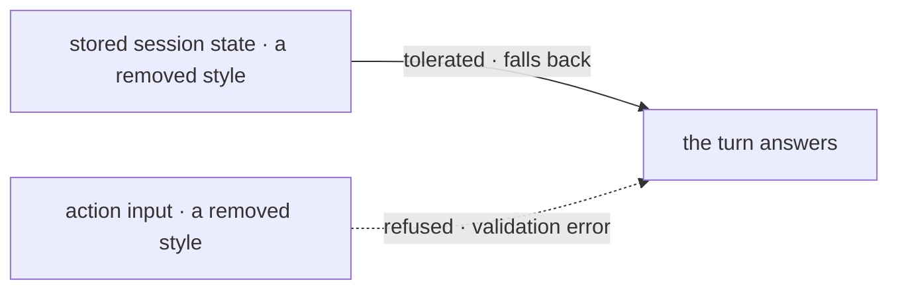

# FIX-1478 · Business rules

[Spec](SPEC.md) · [Decisions](DECISIONS.md) · **Rules** · [Plan](PLAN.md) · [Docs](DOCS.md) · [Evolution](EVOLUTION.md)

The cases, written as rules. Each says what a person or the system does and what happens. The
*proved by* column is the check the plan runs. A human reviews this page; the plan turns it into
work.

## Choosing how work gets done

| # | When | Then | Proved by |
|---|---|---|---|
| BR-1 | A person opens the menu above the prompt | Three entries: automatic resolution, the direct answer, and the durable hand-off. None of the four removed entries appears | CI · component test on the rendered option list |
| BR-2 | A person picks the durable hand-off entry | Exactly today's behaviour: the turn files the work to a team and returns, and the result appears on a later turn | Existing suite, unchanged |
| BR-3 | A person picks automatic resolution | It resolves to one of the surviving styles. It can never resolve to a removed one, by keyword or by classifier | CI · the resolver's output type admits only surviving styles |
| BR-4 | A message contains a word that used to steer to a removed style — *orchestrate*, *delegate*, *shared workspace* | No special routing. It resolves like any other message | CI |

## Sessions and callers that predate the change

This is the group that breaks quietly if it is got wrong, because the app persists the selected
style on session state and a stored value outlives the code that produced it.

| # | When | Then | Proved by |
|---|---|---|---|
| BR-5 | A session stored before this change carries a removed style on its state, and the person sends another message | The turn answers, using the direct-answer style. It does **not** throw, and it does not leave the session unusable (BP-030) | CI · hydrate a session with each removed value and run a turn |
| BR-6 | That same session is reloaded in the browser | The menu shows a valid selection, not a blank control or a stale label naming a style that no longer exists | CI · component test |
| BR-7 | A caller sends a removed style on the action input directly | Rejected by the action's input schema with a validation error naming the accepted values. Caller-controllable input never reaches routing unvalidated (BP-031). This is deliberately *not* BR-5's fallback: an input is a live claim, a stored value is history | CI |
| BR-8 | Any caller sends a surviving style, or none at all | Byte-for-byte today's behaviour | CI |

Two doors, two answers, and the difference is the whole of BR-5 against BR-7. History is
tolerated; a live claim is refused.

## What must not move

| # | When | Then | Proved by |
|---|---|---|---|
| BR-9 | The response-quality annotation is switched on and an answer scores above the threshold | The same annotation, with the same fields, as before this change | Existing suite, unchanged |
| BR-10 | The app is built and its dependencies resolved | The coordination-patterns package is still declared and still used — by the response audit alone | CI · build, plus a check that exactly one source file imports it |
| BR-11 | Anything in the repository still imports a removed module, prompt file or export | The build fails. Nothing is left orphaned or half-removed (tenet 3) | CI · typecheck and an orphan sweep |
| BR-12 | A reader follows the published response-auditor page to its reference-app example | The example still matches the file it describes | Docs check at implement time |

## Failure taxonomy

Nothing here retries and nothing degrades silently. There is exactly one tolerated path — a stored
style that no longer exists (BR-5), which falls back to the direct answer and records nothing to
the person, because a person who last used a removed style has no action to take. Everything else
is fatal at build or validation time on purpose: an orphaned import fails the build, and an invalid
action input fails the request. A reference app that half-removes something teaches the leftover.

## Acceptance criteria this issue owns

A person opening the reference app is offered exactly one way to get work done by several agents,
and it is the one that uses seats and boards. A person returning to a session that used a removed
style is answered rather than stranded. And the one surface that keeps the coordination-patterns
dependency carries, in the pull request, a written reason a reader can disagree with.
