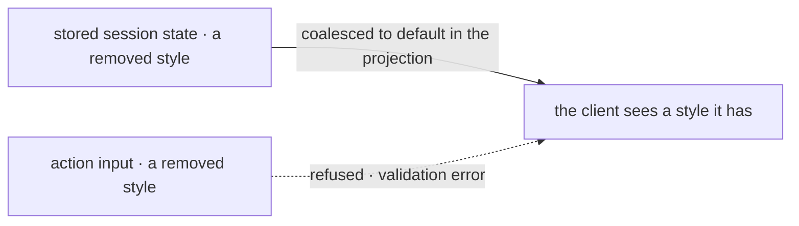

# FIX-1478 · Business rules

[Spec](SPEC.md) · [Decisions](DECISIONS.md) · **Rules** · [Plan](PLAN.md) · [Docs](DOCS.md) · [Evolution](EVOLUTION.md)

The cases, written as rules. Each says what a person or the system does and what happens. The
*proved by* column is the check the plan runs. A human reviews this page; the plan turns it into
work.

## Choosing how work gets done

| # | When | Then | Proved by |
|---|---|---|---|
| BR-1 | A person opens the menu above the prompt | **Two** entries: the direct answer and the durable hand-off. None of the six removed entries appears — the five pattern-backed routes and `Auto` ([D4](DECISIONS.md#d4)) | CI · unit test asserting on the exported `STYLE_OPTIONS` list. **Not a rendered-component test**: kitchen-sink has no React Testing Library, no jsdom and no `.test.tsx` file, so a test claiming to render the dropdown would have to stand up a harness this issue has no reason to introduce |
| BR-2 | A person picks the durable hand-off entry | Exactly today's behaviour: the turn files the work to a durable board, a child session picks it up, and the result appears on a later turn | Existing suite, unchanged |
| BR-3 | A message arrives with no style named on the input | It is answered directly. There is no classification step, no keyword scan and no model call spent on choosing | CI · the `run` action on a message containing former steering words (*orchestrate*, *delegate*, *shared workspace*, *debate*) reaches the direct-answer path, and the classifier block no longer exists to be called |
| BR-4 | Anything in the repository still refers to the intent classifier, a keyword list or a removed style's category | The build fails, or the orphan sweep names it | CI · typecheck and the sweep in [V5](PLAN.md) |

## Sessions and callers that predate the change

This is the group that breaks quietly if it is got wrong, because the app persists the selected
style on session state and a stored value outlives the code that produced it.

**First, what the review established about where that value is actually read**, because the
draft's rules were written against a path that does not exist. Three facts, each verified:

1. **Nothing parses session state on hydration.** `createExecutionContext` adopts the stored
   record with a bare cast — `sessionRef.current.state as TSessionState` — and the flow's
   `stateSchema` is never applied to it. A stored value naming a style that no longer exists
   therefore cannot throw, before or after this change.
2. **Routing never sees the stored value.** `resolveThinkingStyle` runs on every turn, and
   `thinkingStyleInputSchema` defaults to `default`, so the first branch fires and overwrites
   session state with the caller's input *before* the router reads it. After
   [D4](DECISIONS.md#d4) removes `auto`, that branch is the only branch.
3. **The menu does not read it either.** `app/page.tsx` holds the selector's value in
   `useState<ThinkingStyle>("default")`. It is client state seeded with a constant, not hydrated
   from the session record.

So the old BR-5 ("does not throw") and BR-6 ("the menu shows a valid selection") were both checks
with no red state. The one surface that genuinely observes the raw stored value is the
`modeStatus` client-data projection in `flows/chat-agent/flow.ts`, which reads
`ctx.state.thinkingStyle` unparsed and ships it to the browser on hydration. The rules below are
written against that.

| # | When | Then | Proved by |
|---|---|---|---|
| BR-5 | A session stored before this change carries a removed style, and its `modeStatus` projection is read | The projection reports `default`, not the dead style name. A value the client has no option for never leaves the server (BP-030) | CI · seed a session record with each removed value, read the projection, assert `default`. **Red state:** drop the coalesce and the projection returns `supervisor` |
| BR-6 | That same session is reloaded in the browser | Nothing renders a style that no longer exists, and nothing renders blank. The selector opens on the direct answer, as it does for a new session | CI · unit test over the projection (BR-5) plus `getStyleOption`'s fallback for an unknown value |
| BR-7 | A caller sends a removed style on the action input directly | Rejected by the action's input schema with a validation error naming the accepted values. Caller-controllable input never reaches routing unvalidated (BP-031). This is deliberately *not* BR-5's coalesce: an input is a live claim, a stored value is history | CI |
| BR-8 | Any caller sends a surviving style, or none at all | Byte-for-byte today's behaviour | CI |

Two doors, two answers, and the difference is the whole of BR-5 against BR-7. History is
tolerated; a live claim is refused.

**BR-5 has a precedent in the same file — use it, do not invent a third mechanism.**
`shared/schemas.ts` already dual-reads a persisted enum: `persistedSelectedModelSchema` wraps
`z.preprocess` around `coalesceKitchenSinkModel` so a stale stored model id is folded to a valid
one before enum validation, while writes still go through the strict `selectedModelSchema`. That
is exactly BR-5 against BR-7, already shipped, already the shape BP-030 asks for, and already
tested — `test/user-selected-model.test.ts` and `test/side-chain-report-key-legacy.test.ts`.

## What must not move

| # | When | Then | Proved by |
|---|---|---|---|
| BR-9 | The response-quality annotation is switched on and an answer scores above the threshold | The same annotation, with the same fields, as before this change | Existing suite, unchanged |
| BR-10 | The app is built and its dependencies resolved | The coordination-patterns package is still declared and still used — by the response audit alone | CI · build, plus a check that exactly one source file **imports** it. The check must be anchored to an import statement, not to the package name: `components/flow-state/task-plan-state.ts` mentions `@flow-state-dev/patterns` in a doc comment, so a bare name search returns two files after a correct implementation and reads as failure ([V5](PLAN.md)) |
| BR-11 | Anything in the repository still imports a removed module, prompt file or export, or still exports a helper only a removed surface used | The build fails, or the sweep names it. Nothing is left orphaned or half-removed (tenet 3) | CI · typecheck plus a named orphan sweep. Typecheck alone catches none of the known cases: an exported-but-unused function, a registered prompt filter, an unread interface field and a stale doc reference are all well-typed ([S8](PLAN.md)) |
| BR-12 | A reader follows the published response-auditor page to its reference-app example | The example still matches the file it describes | Docs check at implement time |
| BR-13 | A person scrolls back to a turn produced by a removed route, before this change | It renders as it did. The container and board-item renderers — `routed-specialists.tsx`, `debate.tsx`, `task-plan.tsx` — are session history, not part of the import sweep, and they stay ([D4](DECISIONS.md#d4)) | CI · typecheck, and the sweep's allow-list names them so a later pass does not collect them |
| BR-14 | That same past turn would once have carried a style badge | No badge, rather than a wrong one. `lib/item-inference.ts` still recognises the old containers and board items, and every value it returns would now fall through to the default option and label the turn as something it was not | CI · the module and both its call sites are gone ([S7](PLAN.md)) |

## Failure taxonomy

Nothing here retries and nothing degrades silently. There is exactly one tolerated path — a stored
style that no longer exists (BR-5), which is coalesced in the projection and records nothing to
the person, because a person who last used a removed style has no action to take. Everything else
is fatal at build or validation time on purpose: an orphaned import fails the build, and an invalid
action input fails the request. A reference app that half-removes something teaches the leftover.

## Acceptance criteria this issue owns

A person opening the reference app is offered one way to get work done that outlives the turn, and
no second way that only looks like it. A person returning to a session that used a removed style
is answered rather than stranded, and a person scrolling back through one sees their old turns
drawn as before, unlabelled rather than mislabelled. And the one surface that keeps the
coordination-patterns dependency carries, in the pull request, a written reason a reader can
disagree with.
