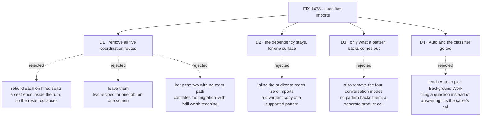

# FIX-1478 · Decisions

[Spec](SPEC.md) · **Decisions** · [Rules](BUSINESS-RULES.md) · [Plan](PLAN.md) · [Docs](DOCS.md) · [Evolution](EVOLUTION.md)

What was considered, what was chosen, why, and what each choice locks in. Three decisions are the
sign-off surface. Everything else here is context for them.

## The tree

Solid edges are what you're signing. Dashed edges lost, and the label says why.

## D1 · All five coordination routes are removed from the reference app, not rebuilt on seats

| | |
|---|---|
| **Instead of** | Rebuilding each one on hired seats so the demos survive · leaving all five where they are and calling the audit done · keeping the two routes a team cannot do today and shedding only the three it can |
| **Because** | A seat is addressed by its own request and outlives the turn; a pattern's worker is a block inside one sequencer and dies with the reply. Making a seat fit that slot ends it inside the turn — the exact collapse the epic exists to show is wrong. Leaving them is the other failure: the app would keep offering, on one screen, two ways to get work done by several agents, using the word *worker* for both. **That argument is about the screen, and it does not depend on a team equivalent existing.** Whether a team can also do the job decides what we may claim — a migration or a deletion — not whether the reference app should keep teaching it |
| **Locks in** | The reference app stops demonstrating in-request composition. A reader who wants it has the published pattern documentation, which carries its own runnable examples, and the cross-pattern benchmark app. Getting that demo back later means finding it a home that is not the workforce reference — which is a decision someone has to make again, not a file someone restores |

**Two of the five leave with nothing offered in their place**, and the spec says so rather than
implying a migration. `evented-actors` has no team equivalent: nothing in Workforce or
orchestration watches topics, re-emits, or cascades one participant's output into another's
trigger. `moderated-debate` has none either: a channel carries members, a charter and a durable
transcript, but no moderator, no rounds and no verdict. The other three — `supervisor`,
`routed-specialists` and `plan-and-execute` — map onto one mechanism a team really has, set out
in [EVOLUTION.md](EVOLUTION.md).

The rejected third option is the tempting one, so it is worth naming why it loses. *Keep the two
with no team path* reads the epic's [D6](../../epics/FIX-1455/DECISIONS.md#d6) as: no path means
a keep-note. But D6's keep-note exists to stop the dependency being dropped while something still
needs it, and what makes a surface need it is [D2](#d2)'s test — a job the app legitimately does
inside one request. The response audit passes that test; a debate demo does not. Reading "no
migration available" as "therefore keep it on screen" would leave the app teaching two in-turn
multi-agent recipes beside the roster, which is the defect this issue exists to remove.

Read the two lanes' widths, not the boxes. The upper lane begins and ends with one reply; the lower
one runs off both edges. That difference is the decision — a reader watching the screen sees the
answer arrive at a different time, so no substitution here is invisible. This is why the four are
removed rather than ported.

## D2 · The coordination-patterns dependency stays, scoped to one surface, with a written reason

| | |
|---|---|
| **Instead of** | Hand-inlining the response auditor's threshold-and-surface logic into the app so the import count reaches zero |
| **Because** | One surface — the response-quality audit — has no team path at all. No seat, board or channel audits an answer, and hiring a seat per response is the half-seat wrapper this pass is told not to invent. The issue's own acceptance shape says the dependency drops only when zero keep-notes remain. Copying a supported, published pattern into the app to win a dependency count buys a number and costs a copy that will drift |
| **Locks in** | The issue's headline outcome — *drop the dependency* — is deliberately not reached, so anyone measuring this work by that sentence will read it as unfinished unless the keep-note is read with it. The keep-note becomes the thing a future audit re-tests; the import count stops being the measure. If a team path for response auditing ever ships, this is the one surface to revisit |

## D3 · Only what a coordination pattern backs comes out

| | |
|---|---|
| **Instead of** | Also removing the four conversation modes, which the epic's picture sweeps into this pass |
| **Because** | The modes steer prompts and involve no coordination pattern; nothing about them competes with the roster. The epic's plan is the precise authority — this issue *removes what patterns backed* — while its figure groups by screen region, which is coarser than the code. Removing the modes would be a separate call about the app's conversation surface, and making it here would be scope this issue was not gated on |
| **Locks in** | The control row survives this issue with three menu entries rather than empty. Anyone who expected the modes gone files that separately. Whether the row exists at all remains FIX-1477's, unchanged |

## D4 · `Auto` is removed, and the intent classifier with it

| | |
|---|---|
| **Instead of** | Shrinking the keyword lists and classifier categories to the survivors and keeping the entry · adding `background-work` as a classifier category so Auto has two outcomes to choose between |
| **Because** | Every keyword list and every classifier category except `default` belongs to a route being removed, and `background-work` is deliberately excluded from classification — filing a question instead of answering it is the caller's call, which the code says in as many words. So after the shed, Auto resolves to `Default` on every input it can ever receive, having first paid for a model call to get there. That is two menu entries doing one job at different prices: the same defect this issue removes, arrived at by subtraction. The second alternative fixes the degeneracy by overturning a deliberate product decision from a different issue, to save a control nobody asked to keep |
| **Locks in** | The menu is two entries: `Default` and `Background Work`. The app loses its only worked example of `utility.intentClassifier` — nothing else in kitchen-sink uses it — so classifier-based routing is undemonstrated here until someone gives it a surface with a real choice in it. `thinkingStyleInputSchema` stops being a superset of the resolved set; the two become the same enum, which removes the input/resolved split [S3](PLAN.md) was written around |

The style badge goes with it. `lib/item-inference.ts` exists to tell which of six routes produced
a turn; with two left, and one of them announcing itself in its own reply, it has nothing to
distinguish. Leaving it would be worse than removing it: on a thread from before this change it
still recognises the old containers and board items, and every value it returns then falls
through `getStyleOption`'s default and renders as the wrong label. **The renderers those old
items need are not part of this** — `routed-specialists.tsx`, `debate.tsx` and `task-plan.tsx`
stay, because session history has to keep drawing.

## Decided, not asked

- **The keyword lists and classifier categories go with `classify.ts` itself** ([D4](#d4)), rather
  than being shrunk to the survivors.
- **Prompt files loaded only by the removed surfaces go with them.** Orphaned prompt text in a
  reference app is a worked example of something that no longer exists.
- **Tests for removed routes are deleted, not skipped.** A skipped test is a claim nobody checks.
- **The durable hand-off entry keeps its place in the menu.** It is the recipe this clears room for.
- **The response audit's behaviour is untouched** — same trigger, threshold and annotation. This
  issue changes where a dependency is used, never what a person sees from it.

## Considered and dropped

| Alternative | Why not |
|---|---|
| Fire the epic's collapse trigger: fold the remainder into FIX-1477 and close this issue | The trigger's condition is *fewer than three* routes with an honest team path. The recount found **three** — `supervisor`, `routed-specialists` and `plan-and-execute`. Three is not fewer than three, so it does not fire, but the margin is one route rather than two and the [Evolution](EVOLUTION.md) row says on what the count turns. Firing it anyway would bury a deletion inside a feature PR — the failure mode the epic named when it kept this row separate |
| Rename the surfaces so the vocabulary stops colliding | The collision is the lifetime, not the label. A renamed in-turn supervisor still answers in the turn and still is not the roster |
| Move the four demos into `examples/` rather than deleting them | `examples/` is for small copy-pasteable demos. These are several hundred lines wired into a flow's router, capabilities and prompt files, and the published pattern docs already carry runnable examples for each |
| Keep one coordination surface as a token demonstration | One is the same defect as five, at lower value: the screen still offers a second recipe for the same job, and the one kept would be arbitrary |

## Open / settled

**Open: none.**

**Settled in review round 1 — the team-path count.** The draft claimed four of five surfaces had
an honest Workforce path. Re-derived against the code, three of five *routes* do. What the two
failing claims actually rested on:

| Claim as drafted | What the code says |
|---|---|
| `evented-actors` → "a seat wakes on a row filed to the named board it drains" | True of per-seat drain, and not a description of this route. Nothing in `packages/workforce` or `packages/orchestration` matches `reEmit`, `watch`, `watchPattern` or `stigmerg`. The route's job — topic-matched subscriptions, cascading fan-out, a synthesizer over the chain — has no team mechanism |
| `moderated-debate` → "two seats and a moderator in a channel" | A channel has `flow`, `description`, `members`, `boards`, `instructions`, and that list is closed. No hit for `moderat`, `round` or `turn-tak` in the workforce package or its published pages. Two seats in a channel is real; the moderator, the rounds and the verdict are not |

**Settled in the same round — Background Work is not a Workforce hand-off.**
`pipelines/background-work.ts` builds an orchestration `taskBoard` whose one worker is a
`dispatcher` into a child session; it calls nothing from `@flow-state-dev/workforce` and
addresses no hired seat. The published overview is explicit — *"a board worker is a block that
claims tasks. A task's `assignee` never names a hired worker"*, and *"Workforce does not staff a
task board."* Everywhere this spec set called it a hand-off *to a team* or *to seats*, it now
says what it is: the turn files the work to a durable board and a child session that outlive the
reply. The comparison it was doing — the one honest durable recipe on the screen — survives that
correction intact, because what makes it the honest one is the **lifetime**, not who runs it.

Neither was argued twice, so neither needed a POC. The premise that *was* load-bearing and did
hold: exactly five files import the package, re-derived in round 1 (see [PLAN.md → At implement
time](PLAN.md) for the anchored sweep).

## How it got here

- **Draft** — audited all five imports against the epic's fence, surface by surface; found four
  with an honest team path and one without.
- **Review round 1** — re-derived the four. Three hold; two do not (the table above), and the
  count is by route rather than by file. The collapse trigger still does not fire, by one route
  instead of by two. Three checks that could not fail were replaced, `Auto` was found degenerate
  after the shed and removed ([D4](#d4)), and Background Work was re-described against the code
  and the published documentation.
