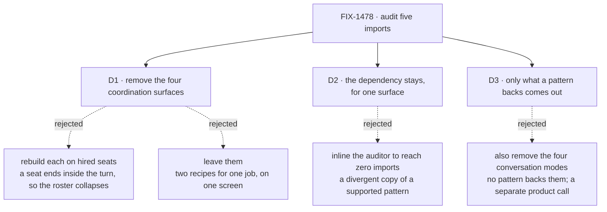

# FIX-1478 · Decisions

[Spec](SPEC.md) · **Decisions** · [Rules](BUSINESS-RULES.md) · [Plan](PLAN.md) · [Docs](DOCS.md) · [Evolution](EVOLUTION.md)

What was considered, what was chosen, why, and what each choice locks in. Three decisions are the
sign-off surface. Everything else here is context for them.

## The tree

Solid edges are what you're signing. Dashed edges lost, and the label says why.

## D1 · The four coordination surfaces are removed from the reference app, not rebuilt on seats

| | |
|---|---|
| **Instead of** | Rebuilding each one on hired seats so the demos survive · leaving all five where they are and calling the audit done |
| **Because** | A seat is addressed by its own request and outlives the turn; a pattern's worker is a block inside one sequencer and dies with the reply. Making a seat fit that slot ends it inside the turn — the exact collapse the epic exists to show is wrong. Leaving them is the other failure: the app would keep offering, on one screen, two ways to get work done by several agents, using the word *worker* for both |
| **Locks in** | The reference app stops demonstrating in-request composition. A reader who wants it has the published pattern documentation, which carries its own runnable examples, and the cross-pattern benchmark app. Getting that demo back later means finding it a home that is not the workforce reference — which is a decision someone has to make again, not a file someone restores |

Read the two lanes' widths, not the boxes. The upper lane begins and ends with one reply; the lower
one runs off both edges. That difference is the decision — a reader watching the screen sees the
answer arrive at a different time, so no substitution here is invisible. This is why the four are
removed rather than ported.

## D2 · The coordination-patterns dependency stays, scoped to one surface, with a written reason

| | |
|---|---|
| **Instead of** | Hand-inlining the response auditor's threshold-and-surface logic into the app so the import count reaches zero |
| **Because** | One surface — the response-quality audit — has no team path at all. No seat, board or channel audits an answer, and hiring a seat per response is the half-seat wrapper this pass is told not to invent. The issue's own acceptance shape says the dependency drops only when zero keep-notes remain. Copying a supported, published pattern into the app to win a dependency count buys a number and costs a copy that will drift |
| **Locks in** | The issue's headline outcome — *drop the dependency* — is deliberately not reached, so anyone measuring this work by that sentence will read it as unfinished unless the keep-note is read with it. The keep-note becomes the thing a future audit re-tests; the import count stops being the measure. If a team path for response auditing ever ships, this is the one surface to revisit |

## D3 · Only what a coordination pattern backs comes out

| | |
|---|---|
| **Instead of** | Also removing the four conversation modes, which the epic's picture sweeps into this pass |
| **Because** | The modes steer prompts and involve no coordination pattern; nothing about them competes with the roster. The epic's plan is the precise authority — this issue *removes what patterns backed* — while its figure groups by screen region, which is coarser than the code. Removing the modes would be a separate call about the app's conversation surface, and making it here would be scope this issue was not gated on |
| **Locks in** | The control row survives this issue with three menu entries rather than empty. Anyone who expected the modes gone files that separately. Whether the row exists at all remains FIX-1477's, unchanged |

## Decided, not asked

- **The automatic style resolver keeps only the styles that survive.** A keyword list naming a
  removed style would resolve a request to nothing.
- **Prompt files loaded only by the removed surfaces go with them.** Orphaned prompt text in a
  reference app is a worked example of something that no longer exists.
- **Tests for removed routes are deleted, not skipped.** A skipped test is a claim nobody checks.
- **The durable hand-off entry keeps its place in the menu.** It is the recipe this clears room for.
- **The response audit's behaviour is untouched** — same trigger, threshold and annotation. This
  issue changes where a dependency is used, never what a person sees from it.

## Considered and dropped

| Alternative | Why not |
|---|---|
| Fire the epic's collapse trigger: fold the remainder into FIX-1477 and close this issue | The trigger's condition is *fewer than three* surfaces with an honest team path. The audit found four. Firing it anyway would bury a deletion inside a feature PR — the failure mode the epic named when it kept this row separate |
| Rename the surfaces so the vocabulary stops colliding | The collision is the lifetime, not the label. A renamed in-turn supervisor still answers in the turn and still is not the roster |
| Move the four demos into `examples/` rather than deleting them | `examples/` is for small copy-pasteable demos. These are several hundred lines wired into a flow's router, capabilities and prompt files, and the published pattern docs already carry runnable examples for each |
| Keep one coordination surface as a token demonstration | One is the same defect as five, at lower value: the screen still offers a second recipe for the same job, and the one kept would be arbitrary |

## Open / settled

**Open: none.** No claim here was argued twice, and no premise needed a POC: the two facts the
design rests on — that hiring returns flow instances while pattern factories take block
definitions, and that exactly five files import the package — were both read directly off the
repository and are recorded in [PLAN.md → At implement time](PLAN.md).

## How it got here

- **Draft** — audited all five imports against the epic's fence, surface by surface; found four
  with an honest team path and one without, which settles the epic's collapse trigger as *not
  fired* and puts the dependency on the keep branch of its parent decision.
