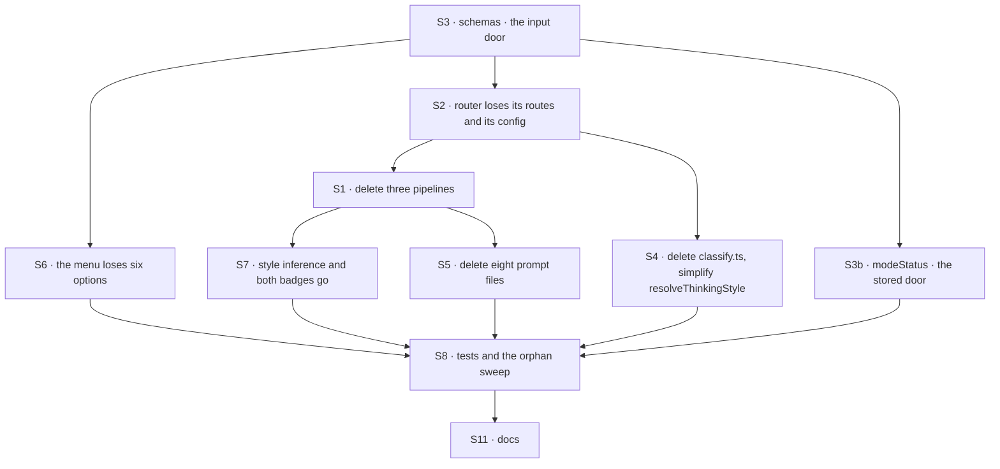

# FIX-1478 · Plan

[Spec](SPEC.md) · [Decisions](DECISIONS.md) · [Rules](BUSINESS-RULES.md) · **Plan** · [Docs](DOCS.md) · [Evolution](EVOLUTION.md)

Written for the implementing agent. IDs cross-reference [BUSINESS-RULES.md](BUSINESS-RULES.md)
(BR-n) and [DECISIONS.md](DECISIONS.md) (D-n). `tdd` — the removal is large and mostly mechanical,
so the two rules that are *not* mechanical (BR-5, BR-7) get their checks written first. One PR.

## Surfaces

All paths are under `apps/kitchen-sink/`.

| ID | Package · role | Change | Rules |
|---|---|---|---|
| S1 | `flows/chat-agent/run/thinking-styles/pipelines/` | **Remove** `supervisor.ts`, `routed-specialists.ts`, `evented-actors.ts`. `background-work.ts` stays untouched (D1). `config.ts` shrinks — see S2 | BR-2 BR-11 |
| S2 | `flows/chat-agent/run/thinking-styles/create-router.ts` · `pipelines/config.ts` · `thinking-styles/index.ts` | **Remove** both coordination-pattern imports, the two inlined pipeline builders, their router routes and their `execute` cases. Then **follow the config down**: `createBackgroundWorkPipeline` destructures only `modelId`, and `defaultPipeline` is the already-built `assistantGenerator`, so `context`, `uses`, `workerUses`, `workerContext`, `history` and `instructions` become dead on `PipelineConfig`, on `ThinkingStyleRouterConfig`, and at the `index.ts` call site that supplies them. Typecheck flags none of it. The `default:` case already falls through to the direct answer — keep that | BR-8 BR-11 |
| S3 | `flows/chat-agent/shared/schemas.ts` | Shrink `RESOLVED_THINKING_STYLES` to `background-work` and `default`, and drop `auto` from the input list (D4) — the input and resolved enums become the same set, so the superset split goes. **This is the BR-7 door.** No hydration migration is needed here: nothing parses session state on load ([BUSINESS-RULES](BUSINESS-RULES.md) → *Sessions and callers that predate the change*). The tolerance BR-5 needs belongs in S3b, not here | BR-7 BR-8 |
| S3b | `flows/chat-agent/flow.ts` · the `modeStatus` derived client-data projection | **This is the BR-5 door**, and the only one. It reads `ctx.state.thinkingStyle` unparsed and ships it to the browser. Coalesce a value outside the surviving set to `default` before it leaves the server. Follow `persistedSelectedModelSchema` in `shared/schemas.ts` — same file, same problem, already shipped (BP-030) | BR-5 BR-6 |
| S4 | `flows/chat-agent/run/thinking-styles/classify.ts` | **Delete the file**, with the keyword lists, the `intentClassifier` block, `applyClassifiedStyle` and `autoClassifyStyle` (D4). Then simplify `resolveThinkingStyle` in `run/steps.ts`: with no `auto`, its second `tapIf` goes and the first is unconditional | BR-3 BR-4 |
| S5 | `flows/chat-agent/run/thinking-styles/prompts/` | **Remove** the eight prompt files the removed pipelines loaded (the three `bb-*`, the four `rb-*`, and the supervisor worker prompt). Verified: `background-work.ts` carries its prompt inline and loads none of them | BR-11 |
| S6 | `components/thinking-style-selector.tsx` | **Remove six options** — the five pattern-backed routes and `auto` — leaving `default` and `background-work`. Keep `getStyleOption`'s fallback to the first entry; with `auto` gone that first entry is `Default`, which is what BR-6 wants | BR-1 BR-6 |
| S7 | `lib/item-inference.ts` · `components/chat-agent/message.tsx` · `components/client-data-bar.tsx` | **Remove the module and both call sites** (D4). `message.tsx` loses `StyleBadge` and its `useMemo`; `client-data-bar.tsx` loses the style badge, which is dead regardless — it renders only when `thinkingStyleMode === "auto"`, and after S3 no such value exists. **Do not touch the renderers**: `components/flow-state/routed-specialists.tsx`, `debate.tsx` and `task-plan.tsx` draw old turns and stay (BR-13) | BR-11 BR-13 BR-14 |
| S8 | `test/` · orphan sweep | **Remove** `supervisor-prompt.test.ts`; strip removed-style cases from `thinking-router.test.ts`, `flow.test.ts`, `user-selected-model.test.ts`. Delete, never skip. Then sweep the named orphans in *Orphans typecheck will not find*, below | BR-11 |
| S9 | `package.json` | **No change.** The coordination-patterns dependency stays (D2). The keep-note goes in the PR description, not here — do not add a comment to the manifest, which is JSON and has nowhere to put one | BR-10 |
| S10 | `flows/chat-agent/run/bias-check.ts` | **No change**, deliberately. The one keep | BR-9 BR-10 BR-12 |
| S11 | Docs | `README.md`'s subsystem line and opening paragraph, and the mock list in `apps/docs/docs/testing/end-to-end-tests.md`, per [DOCS.md](DOCS.md). No changeset: `apps/kitchen-sink` is a private app, so BP-022 does not apply — state that in the PR | — |

## Sequence

Start at S3: the schemas fix what a style *is*, and everything downstream is deletion that the
type checker then drives. The two doors are no longer both in S3 — S3 refuses a live claim, S3b
tolerates a stored one, and they are in different files because that is where the two values are
actually read. S9 and S10 are the deliberate no-ops and appear in no edge.

## Orphans typecheck will not find

Each of these is well-typed after the shed and still dead. S8 is not done until every row is
resolved.

| Orphan | Why typecheck misses it |
|---|---|
| `shared/prompt-filters.ts` — `supervisorWorkerView`, `normalizeDeps`, `NormalizedDep`, `SupervisorWorkerView`, and both entries in the exported `promptFilters` map | Exported and registered on the prompt loader. Their only consumers were `supervisor-worker.prompt.md` (S5) and `supervisor-prompt.test.ts` (S8). Decide whether the file survives at all, or only its registration point |
| `shared/prompts.ts` — the header's worked example `{{ input.deps \| normalizeDeps }}` | A doc comment |
| `apps/kitchen-sink/CLAUDE.md` — cites `supervisorWorkerView` as *the* reference example for the prompt-filter convention, twice | Markdown. It will point at a deleted symbol and teach the next contributor a pattern with no instance |
| `ThinkingStyleRouterConfig` / `PipelineConfig` — `workerUses`, `workerContext`, `context`, `uses`, `history`, `instructions` (S2) | Unread interface fields, and `index.ts` still passes values for them |
| `lib/e2e-mock-script.ts` — `thinkingStyleClassifierMock`, and its `"thinking-style-classifier"` registration in `test/mock-flowstate.ts` | A mock for a block that no longer exists. Well-typed, registered under a string key, and it fails nothing when the block it stands in for is deleted |
| `components/flow-state/task-plan-state.ts:136` — the doc comment naming `@flow-state-dev/patterns` | A comment, and the reason V5's sweep must be anchored to an import |

## Checks

| ID | Runs after | Passes when |
|---|---|---|
| V1 | S3 | BR-7: each removed value on the action input is refused with a validation error naming the accepted set. BR-8: a surviving value and an absent value behave as today |
| V2 | S3b | **BR-5, written first and red first.** Seed a session record whose stored `thinkingStyle` names each removed style, read the `modeStatus` projection, assert it reports `default`. **Red state: delete the coalesce and it reports `supervisor`.** Aim it at the projection, not at a turn — a turn overwrites the stored value before anything reads it, so a turn-level check passes before S3b exists and proves nothing |
| V3 | S2, S4 | BR-3, BR-4: a message carrying former steering words is answered directly, and no classifier call is made. Assert on the absence of the classifier block, not only on the reply |
| V4 | S6 | BR-1: `STYLE_OPTIONS` holds exactly `default` and `background-work`, in that order. BR-6: `getStyleOption` on a removed value returns the `Default` entry. Unit tests over the exported values — there is no component-test harness in this app and this issue does not add one |
| V5 | S1, S5, S7, S8 | BR-11: typecheck, the *Orphans typecheck will not find* table above, and the import sweep: `grep -rn "from ['\"]@flow-state-dev/patterns" apps/kitchen-sink --include=*.ts --include=*.tsx` returns exactly one file, `bias-check.ts`. **Anchor it to `from`** — the bare package name also matches a doc comment in `task-plan-state.ts`, so an unanchored sweep returns two files after a correct implementation and reads as failure |
| V6 | S10 | BR-9: the response-audit suite passes untouched. **BR-10 is the decision check for D2** — the dependency still resolves and the app builds |
| VG | S8 | Goal, real path: `fsdev run` the chat-agent's `run` action on each surviving style end to end, and a third time against a session seeded with a removed style. All answer. One goal check, because the deliverable is a deletion and the risk is what the deletion strands |

## Pinned names · none

No public surface changes. Labels, enum shapes and whether `item-inference` survives are yours.
Only *which* five options leave and *which* one import stays is fixed.

## Guardrails

| Rule | Because |
|---|---|
| A stored style is tolerated; a caller-sent one is refused (BP-030, BP-031) | Two different files, two different reads. Follow `persistedSelectedModelSchema` for the tolerant half rather than inventing a third mechanism |
| Every check must have a red state you can produce | Three of the draft's checks could not fail — V2, V4's rendered-component test and V5's unanchored grep. Before writing a check, say what would make it go red, and try it |
| Delete the whole thread, not the import (tenet 3) | Prompt files, tests, keyword lists and the style-inference helper are all part of the surface. A reference app that half-removes something teaches the leftover |
| Do not touch `bias-check.ts`, and do not inline what it imports (D2) | The keep only works if it stays the supported pattern. A local copy to win a dependency count is what this issue refuses |
| Do not touch the four conversation modes (D3) | They are not pattern-backed. The epic's figure groups them here; its plan does not, and the plan is the precise authority |
| Nothing is added to replace what leaves | What takes the freed control row is FIX-1477's call. An empty row is the correct hand-off state |
| Do not wrap a seat to preserve a demo | The epic's named invent-kill, and [D1](DECISIONS.md#d1)'s figure is why |

## Docs

Reconcile and publish [DOCS.md](DOCS.md) after V5 passes — the subsystem line cannot be written
truthfully until the orphan sweep says what actually left. Verify BR-12 in the same pass: the
published response-auditor page shows this app's adapter, and that snippet must still match.

## Sketch · none · POC · none

Nothing to sketch: a deletion plus one line of schema tolerance. No POC was needed — both
premises were read off the repository, not assumed: the import inventory (S1–S5, S10) and the
type boundary in [D1](DECISIONS.md#d1)'s figure. Both are re-derived below, not trusted.

## At implement time

Re-derive these three before building. Each was true when this was written and each can move.

1. **The import inventory.** Re-run the anchored sweep in V5. Verified in review round 1: six
   import statements across five source files — `pipelines/supervisor.ts`,
   `pipelines/routed-specialists.ts`, `pipelines/evented-actors.ts`, `create-router.ts` (two, for
   `plan-and-execute` and `debate`) and `run/bias-check.ts`. A sixth source file appearing means
   a surface this audit never judged, and it needs its own verdict before deletion.
2. **Where the stored style is read.** Verified in review round 1: the engine adopts session
   state with a bare cast and never applies the flow's `stateSchema` to it, and
   `resolveThinkingStyle` overwrites the stored value on every turn before the router reads it.
   The `modeStatus` projection is the only surface that observes it raw. If a sibling has since
   added a parse on hydration, S3b is no longer the only door and BR-5 needs a second check.
3. **FIX-1477's control-row work.** If the row or menu is already gone, S6 and parts of S7 are
   done; take its result rather than re-deciding, per the epic's coordination seam. **Not gated
   on the navigation amendment** held over FIX-1476/FIX-1477: that concerns rail navigation, and
   nothing here touches it.

## Follow-ups

- **Classifier-based routing is no longer demonstrated anywhere in the app.** `classify.ts` held
  the only `utility.intentClassifier` in kitchen-sink, and D4 removes it. Giving it a surface with
  a real choice in it is a separate product call, not this issue's. One line in the PR, not a
  ticket yet.
- **With two entries left, the menu itself is a candidate.** A dropdown offering a binary is a
  control row FIX-1477 may want to spend differently. Note it; do not act on it here.
