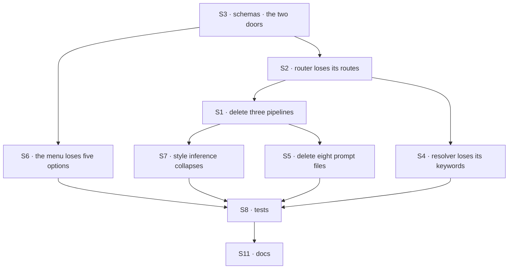

# FIX-1478 · Plan

[Spec](SPEC.md) · [Decisions](DECISIONS.md) · [Rules](BUSINESS-RULES.md) · **Plan** · [Docs](DOCS.md) · [Evolution](EVOLUTION.md)

Written for the implementing agent. IDs cross-reference [BUSINESS-RULES.md](BUSINESS-RULES.md)
(BR-n) and [DECISIONS.md](DECISIONS.md) (D-n). `tdd` — the removal is large and mostly mechanical,
so the two rules that are *not* mechanical (BR-5, BR-7) get their checks written first. One PR.

## Surfaces

All paths are under `apps/kitchen-sink/`.

| ID | Package · role | Change | Rules |
|---|---|---|---|
| S1 | `flows/chat-agent/run/thinking-styles/pipelines/` | **Remove** `supervisor.ts`, `routed-specialists.ts`, `evented-actors.ts`. `background-work.ts` and `config.ts` stay untouched (D1) | BR-2 BR-11 |
| S2 | `flows/chat-agent/run/thinking-styles/create-router.ts` | **Remove** both coordination-pattern imports, the two inlined pipeline builders, their router routes and their `execute` cases. The `default:` case already falls through to the direct answer — keep that; it is what BR-5 leans on | BR-5 BR-8 BR-11 |
| S3 | `flows/chat-agent/shared/schemas.ts` | Shrink the resolved-style and caller-input lists to the survivors. **This is the BR-7 door.** The session-state schema reads the resolved enum, so it must become tolerant of a stored removed value without widening what a caller may send (D1, BP-030 + BP-031) | BR-5 BR-7 BR-8 |
| S4 | `flows/chat-agent/run/thinking-styles/classify.ts` | **Remove** the keyword lists and classifier categories for removed styles; the resolver may now only produce survivors | BR-3 BR-4 |
| S5 | `flows/chat-agent/run/thinking-styles/prompts/` | **Remove** the eight prompt files the removed pipelines loaded (the three `bb-*`, the four `rb-*`, and the supervisor worker prompt). Verified: `background-work.ts` carries its prompt inline and loads none of them | BR-11 |
| S6 | `components/thinking-style-selector.tsx` | **Remove** the five removed options. Its existing fallback to the first option is what satisfies BR-6 — confirm, don't rebuild | BR-1 BR-6 |
| S7 | `lib/item-inference.ts` · role: infer which style ran, from the item stream | Collapses with its inputs. Two consumers read it (the message component, the page's resolved-style badge). **Prefer removing it with its call sites** if the survivors are distinguishable without it (tenet 3) | BR-11 |
| S8 | `test/` | **Remove** `supervisor-prompt.test.ts`; strip removed-style cases from `thinking-router.test.ts`, `flow.test.ts`, `user-selected-model.test.ts`. Delete, never skip | BR-11 |
| S9 | `package.json` | **No change.** The coordination-patterns dependency stays (D2). The keep-note goes in the PR description, not here | BR-10 |
| S10 | `flows/chat-agent/run/bias-check.ts` | **No change**, deliberately. The one keep | BR-9 BR-10 BR-12 |
| S11 | Docs | `README.md`'s subsystem line, per [DOCS.md](DOCS.md). No changeset: `apps/kitchen-sink` is a private app, so BP-022 does not apply — state that in the PR | — |

## Sequence

Start at S3: the schemas fix what a style *is*, and everything downstream is deletion that the
type checker then drives. S9 and S10 are the two deliberate no-ops and appear in no edge.

## Checks

| ID | Runs after | Passes when |
|---|---|---|
| V1 | S3 | BR-7: each removed value on the action input is refused with a validation error naming the accepted set. BR-8: a surviving value and an absent value behave as today |
| V2 | S3 | **BR-5, written first and red first.** Hydrate a session whose stored state names each removed style, run a turn: it answers via the direct path and the session stays usable. This is the one path no compiler catches |
| V3 | S2, S4 | BR-3, BR-4: the resolver's output admits only survivors; a formerly-steering word routes like any other message |
| V4 | S6 | BR-1, BR-6: three options rendered; a stale stored value shows a valid selection |
| V5 | S1, S5, S7, S8 | BR-11: typecheck and an orphan sweep — no import, prompt file or export left behind. `grep -r "@flow-state-dev/patterns" apps/kitchen-sink --include=*.ts --include=*.tsx` returns exactly one file, `bias-check.ts` |
| V6 | S10 | BR-9: the response-audit suite passes untouched. **BR-10 is the decision check for D2** — the dependency still resolves and the app builds |
| VG | S8 | Goal, real path: `fsdev run` the chat-agent's `run` action on a surviving style end to end, and a second time against a session seeded with a removed style. Both answer. One goal check, because the deliverable is a deletion and the risk is what the deletion strands |

## Pinned names · none

No public surface changes. Labels, enum shapes and whether `item-inference` survives are yours.
Only *which* five options leave and *which* one import stays is fixed.

## Guardrails

| Rule | Because |
|---|---|
| A stored style is tolerated; a caller-sent one is refused (BP-030, BP-031) | BR-5 bricks real sessions if got wrong. The router's existing `default:` fall-through is the mechanism — confirm it, don't replace it |
| Delete the whole thread, not the import (tenet 3) | Prompt files, tests, keyword lists and the style-inference helper are all part of the surface. A reference app that half-removes something teaches the leftover |
| Do not touch `bias-check.ts`, and do not inline what it imports (D2) | The keep only works if it stays the supported pattern. A local copy to win a dependency count is what this issue refuses |
| Do not touch the four conversation modes (D3) | They are not pattern-backed. The epic's figure groups them here; its plan does not, and the plan is the precise authority |
| Nothing is added to replace what leaves | What takes the freed control row is FIX-1477's call. An empty row is the correct hand-off state |
| Do not wrap a seat to preserve a demo | The epic's named invent-kill, and [D1](DECISIONS.md#d1)'s figure is why |

## Docs

Reconcile and publish [DOCS.md](DOCS.md) after V5 passes — the subsystem line cannot be written
truthfully until the orphan sweep says what actually left. Verify BR-12 in the same pass: the
published response-auditor page shows this app's adapter, and that snippet must still match.

## Sketch · none · POC · none

Nothing to sketch: a deletion plus one line of schema tolerance. No POC was needed — both
premises were read off the repository, not assumed: the import inventory (S1–S5, S10) and the
type boundary in [D1](DECISIONS.md#d1)'s figure. Both are re-derived below, not trusted.

## At implement time

Re-derive these three before building. Each was true when this was written and each can move.

1. **The import inventory.** Re-run the sweep in V5. It returned exactly six hits when this was
   written — the five source files and the `package.json` entry. A sixth source file appearing
   means a surface this audit never judged, and it needs its own verdict before deletion.
2. **The session-state schema's strictness.** The resolved-style enum is read by the
   session-state schema, which is why BR-5 is real work rather than free. If a sibling has since
   made that read tolerant, V2 still runs — it just goes green earlier.
3. **FIX-1477's control-row work.** If the row or menu is already gone, S6 and parts of S7 are
   done; take its result rather than re-deciding, per the epic's coordination seam. **Not gated
   on the navigation amendment** held over FIX-1476/FIX-1477: that concerns rail navigation, and
   nothing here touches it.

## Follow-ups

- If `item-inference.ts` survives S7 in reduced form, it is a candidate for removal once
  FIX-1477 settles what the control row shows. One line in the PR, not a ticket yet.
