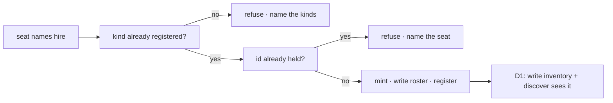

# FIX-1480 · Business rules

[Spec](SPEC.md) · [Decisions](DECISIONS.md) · **Rules** · [Plan](PLAN.md) · [Docs](DOCS.md) · [Evolution](EVOLUTION.md)

**Explore / not-ship.** These are the cases a ship ticket would have to prove. They are not acceptance for this PR. Each *proved by* is the check that ship would run.

## Who may hire

| # | When | Then | Proved by |
|---|---|---|---|
| BR-1 | A seat's `tools:` does not name `hire` | The model cannot call hire. The capability being installed on the kind is not enough | Ship CI · seat with empty `tools:`, assert the tool is absent |
| BR-2 | A seat names `hire` and its kind installed the capability | The model can call hire | Ship CI |
| BR-3 | A hire arrives with an `orgId` in the tool input | **Ignored.** The org comes from the verified principal. A body naming another org changes nothing about which roster is written | Ship CI · BR-3 of [FIX-1475](../FIX-1475/BUSINESS-RULES.md) restated on the tool |

## What hire may name

| # | When | Then | Proved by |
|---|---|---|---|
| BR-4 | A hire names a kind the app registered, and settings that kind admits | One roster row is written, the seat is registered, and — if [D1](DECISIONS.md#d1) is ratified — one inventory seat row is written. The seat answers on `<org>.<seatId>` | Ship CI |
| BR-5 | A hire names a kind the app did not register | Refused before anything is written, naming the kinds it does carry | POC check 2 · ship CI |
| BR-6 | A hire names a kind the optional allowlist does not include | Refused the same way, naming the allowlist | Ship CI |
| BR-7 | A hire tries to define a new kind — source, a graph, a kind id that is not in the map | There is no field for that. Extra keys refuse | Ship CI |
| BR-8 | A hire names a seat id this org already holds | Refused. No row is overwritten. The refusal names the seat | POC check 3 · ship CI |
| BR-9 | Two hires of the same seat in the same org arrive together | Exactly one wins. The other is the roster `create()` refusal | Ship CI · [FIX-1475 BR-7](../FIX-1475/BUSINESS-RULES.md) |

## What the rest of the team sees

| # | When | Then | Proved by |
|---|---|---|---|
| BR-10 | [D1](DECISIONS.md#d1) ratified, and a hire succeeded | The same `discover` door that lists file-declared seats lists this one, with a purpose taken from its instructions or description | Ship CI · the POC's control inverted |
| BR-11 | [D1](DECISIONS.md#d1) declined | Docs say runtime seats are on the roster and not on `discover`. No kitchen-sink-only browse is added to paper over it | Docs review |
| BR-12 | A fire succeeds | The roster row is gone. The address stops resolving in this process. The inventory row, if one was written, stays | Ship CI |

## What hire does not do

| # | When | Then | Proved by |
|---|---|---|---|
| BR-13 | A hire succeeds | No session is created. The return is `{ seatId, address }` | Ship CI |
| BR-14 | Channel boards exist and the new seat does not declare them | Hire still succeeds. The result carries the same unattended-board warning the mint already prints. No board is attached | Ship CI |
| BR-15 | A seat is busy | Hire does not mint a copy of it. There is no "grab a free seat" | Absence · no such tool |

The first three boxes are already true of host hire. The last box is D1. The fence that is not on this diagram is BR-1: without `tools: [hire]`, the model never reaches the first box.
