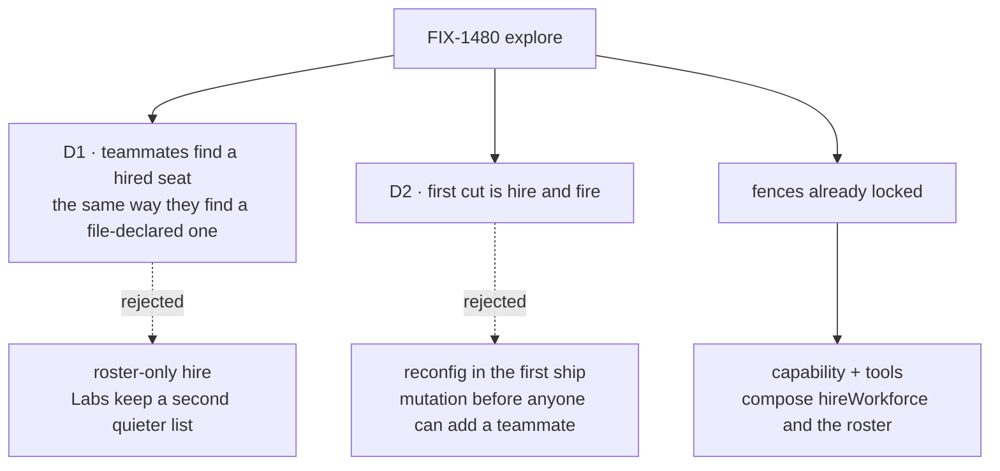

# FIX-1480 · Decisions

[Spec](SPEC.md) · **Decisions** · [Rules](BUSINESS-RULES.md) · [Plan](PLAN.md) · [Docs](DOCS.md) · [Evolution](EVOLUTION.md)

**Explore / not-ship.** Two cards are the ratification surface. Everything under *Recommended, still open* is a pick, not a lock. Architect fences already in the Linear issue are restated under *Fences, not asked* so they are not re-litigated as if they were new.

## The tree

Solid edges are what you're ratifying. Dashed edges lost, and the label says why.

## D1 · After a hire, teammates find the new seat the same way they find file-declared ones

| | |
|---|---|
| **Instead of** | Writing only the durable roster and leaving lookup as "files ∩ inventory", which is what ships today |
| **Because** | The lookup a Lab already uses projects a seat only when **both** a declaration and an inventory row exist. A runtime hire writes neither a file nor an inventory row. The POC ran that join: a roster-only seat is invisible. Teaching "hire" while "who is here?" stays blind is how managers invent a private list |
| **Locks in, if ratified** | A ship ticket must write `inventory/seats/<seatId>` on hire, and must treat the durable roster row as the declared half for a seat that has no file. Fire still deletes the roster row. The inventory row stays — that collection never deletes, and that contract is not this ticket's to reopen. Discover's liveness for a runtime seat becomes "roster row still there" |

The inventory is append-only on purpose: a row means *was registered in this org*, not *still hired*. That is why the roster, not the inventory, is what fire removes. Joining roster ∪ files against inventory is the smallest change that keeps both contracts.

**What would change my mind:** a decision that Labs will query the durable roster directly, and that "discover" is allowed to mean something different for runtime seats than for file-declared ones. Then D1 is false, and we document two lookups. I would still write the inventory row so a Lab that only reads inventory is not lying; I would not change discover's declared half.

**What being wrong costs:** every manager-queue / DevForce path that expands a roster mid-run plans against a ghost, or against a kitchen-sink-only browse API — both invent-kills in the issue.

## D2 · First cut is hire and fire only

| | |
|---|---|
| **Instead of** | Shipping `reconfig` (change settings on a live seat) in the same cut |
| **Because** | Hire is mint-a-row. Reconfig is mutate-a-row. They share a noun and almost no mechanism. Putting both in the first ship turns the review into a configuration-editor debate, and nobody gets the teammate |
| **Locks in, if ratified** | Ship tickets name `hire` and `fire`. `reconfig` is a later issue, if anyone still wants it after hire exists. Fire matches the host admin verb, not `retire` |

Fire already exists on the host path and already means "remove the roster row and the address; cancel nothing." Reusing the word keeps one story. `retire` would be a second word for the same act.

**What would change my mind:** a Lab that cannot use hire at all unless it can also change instructions on a seat it just minted, in the same turn, without a new id. I have not seen that Lab.

**What being wrong costs:** a month of mutation-vs-mint before the first manager can add a person.

## Fences, not asked

These are already locked on the issue. Restated so a reviewer does not "open" them.

- **Capability via `uses`, not Hire / Role / Agent / Team as a new type.** Door B: the **kind** installs; the **seat** selects presets and names tools. Seats never install.
- **Hire mints a seat of a registered kind plus `WorkerConfig` data.** No new flow kind, no eval'd TypeScript, no hot registration from the tool.
- **Catalog tools, behind `tools:`.** Empty `tools:` stays empty. Not `controlTools` — those bypass the fence, which is how `discover` works and how hire must not.
- **Compose `hireWorkforce` + the durable roster + `register` / `unregister`.** Same id twice refuses. Custom / dotted seat ids need collection kinds. No second hire store.
- **Org from the principal, never from the body.** Hire is org-scoped durable state.
- **Sibling of channel-admin, not a merge.** Not a W4 first-cut child. Not a kitchen-sink-only API.
- **No pool / idle-picker.** Auto-scale stays undecided.
- **No ambient board drain.** A new seat does not see every board.

## Recommended, still open

Picks for Architect + Cycle Manager. Not locked by this explore.

### Who may hire

**Pick:** a kind that installed the capability, and a seat that named `hire` in `tools:`. That is the whole grant. An optional factory allowlist of **kinds that may be hired** (subset of the registered map) is a wiring choice, not a Role.

A tighter "only these seat ids may hire" list can wait until a Lab hits a seat that has the tool and should not.

### Team versus org

**Pick:** the roster stays org-scoped, as [FIX-1475 D3](../FIX-1475/DECISIONS.md#d3) already locked. A team is the prefix of the seat id (`eng.ada`), not a second store. Hiring "onto a team" is choosing that prefix.

### Board wiring after hire

**Pick:** hire does not attach boards. The tool returns any `warnUnattendedBoards` text the mint already prints, so a manager sees "this board has nobody draining it." Wiring stays an explicit `channelBoard` / `taskBoard` on the kind or a later channel-admin act.

### Return shape

**Pick:** `{ seatId, address }`. No session id. A seat is not a session; the first dispatch creates one. Returning a session id would invent a session at hire time so the manager has something to stare at.

### Auto-scale

**Leave undecided.** Busy → another copy is not hire.

## Considered and dropped

- **A Hire / Role / Agent type.** The noun is important and still not a type. Capability is the Door B shape we already have for "a kind may do this."
- **Dispatching the kitchen-sink admin action from the seat.** That is a kitchen-sink-only API. The factory closes over `register` / `unregister` and the kinds map — the same seams the admin flow already uses — so a Lab can wire it.
- **Putting hire on `createWorkforceCapability` as another control.** That capability's door is a control *because* composing it means "you may ask what is around you." Hire is a grant a seat must name. Different fence, different factory.
- **Writing only the roster and teaching Labs a new browse.** Second lookup. Invent-kill.

## How it got here

Architect via Jake, 2026-09-20: path 1 = instances of existing kinds; kind invention is a later ticket. Durable hire and the roster already shipped ([FIX-1475](../FIX-1475/SPEC.md)). This explore is the seat-facing tool on that spine. The POC did not change the design; it showed the lookup hole D1 is about.
