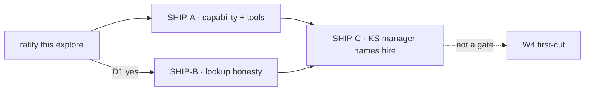

# FIX-1480 · Plan

[Spec](SPEC.md) · [Decisions](DECISIONS.md) · [Rules](BUSINESS-RULES.md) · **Plan** · [Docs](DOCS.md) · [Evolution](EVOLUTION.md)

**Explore / not-ship.** There is no implementing agent for this PR. This page is the proposed ship-ticket split for Cycle Manager after ratification. Do not implement seat-hire from this document.

## POC

`specs/issues/FIX-1480/poc/seat-hire-compose/` — characterization of the current spine, plus a Door B sketch that is not imported by production.

```bash
pnpm exec tsx specs/issues/FIX-1480/poc/seat-hire-compose/check.mts
```

The question it answers: *does a runtime hire already show up where Labs look, or is that a hole we have to close?* It showed the hole — twelve assertions, including the control that D1's join would list the seat. The sketch is catalog tools on the existing mint, not a new type. Nothing in the run moved the design.

Experimental evidence retained with the spec, not production code.

## Proposed ship tickets

Do **not** file these from this PR. Titles only, for Cycle Manager.

| # | Proposed title | What it is | Soft-after |
|---|---|---|---|
| SHIP-A | Seat-hire capability — hire and fire as catalog tools on the existing mint | `createSeatHireCapability` in `@flow-state-dev/workforce`. Kind `uses` it. Seat names `hire` / `fire` in `tools:`. Factory closes over the kinds map and `register` / `unregister`. Writes `workforce/roster/*` with `create()`. Same refusals as host hire | Durable hire already shipped ([FIX-1475](../FIX-1475/SPEC.md)) |
| SHIP-B | Runtime hire is visible on the same lookup Labs already use | On hire, write `inventory/seats/<seatId>`. Discover's declared half is files ∪ durable roster. Fire still deletes only the roster row | SHIP-A, or the same PR if [D1](DECISIONS.md#d1) is ratified as load-bearing for "hire" |
| SHIP-C | Kitchen-sink: one manager seat names hire | A file-declared manager with `tools: [hire]`. Prove a teammate appears on `discover` after the tool runs. Teach path, not the API | SHIP-A + SHIP-B · [FIX-1429](https://linear.app/fixpoint-labs/issue/FIX-1429) boot/serve |

**Not proposed, on purpose**

- Reconfig / mutate settings on a live seat — [D2](DECISIONS.md#d2)
- Auto-scale, pool, idle-picker
- Merge with [FIX-1415](https://linear.app/fixpoint-labs/issue/FIX-1415)
- Kind invention / graph customize — [FIX-1465](https://linear.app/fixpoint-labs/issue/FIX-1465)
- A W4 first-cut child
- A kitchen-sink-only hire API



## Surfaces a ship would touch

Not this PR. Pins for whoever specs SHIP-A.

| Pin | Why it is pinned |
|---|---|
| Factory name `createSeatHireCapability` | Sibling of `createWorkforceCapability`. A second name on that function would mix a control door with a grant |
| Catalog `tools`, never `controlTools` | [FIX-1393](https://linear.app/fixpoint-labs/issue/FIX-1393). Hire is a grant |
| `hireWorkforce` + `hiredSeatManifest` + `toHiredSeatRow` + `defineHiredRosterCollection().create()` + `register` | The spine. Do not mint a second way |
| Org from `ctx.org`, never from tool input | [FIX-1442](https://linear.app/fixpoint-labs/issue/FIX-1442) · BP-031 |
| Return `{ seatId, address }` | Recommended return shape |
| One seat per call | Host admin already refuses a batch for the same reason |

## Guardrails

- **Do not import the POC.** Retention is evidence, not a shortcut around `tdd`.
- **Do not add a Hire type, a Role type, or a second roster collection.** Because the issue's invent-kills are the product.
- **Do not put hire on `createWorkforceCapability`.** Because that door is a control, and hire must die when `tools:` is empty.
- **Do not teach the file convention as the only mint.** Because that is the hole this ticket exists to close.
- **Do not stuff this into W4 first-cut.** Because related-not-child is already the sequencing.

## Checks a ship would run

The POC is characterization, not CI. Ship CI is where BR-1 through BR-15 become red/green. `tdd` on SHIP-A: a seat with empty `tools:` cannot hire (red), then the capability + named tool makes it possible (green), then unknown kind / duplicate id / other-org body refuse.

## Notes from review

*(empty — explore has not been reviewed)*
