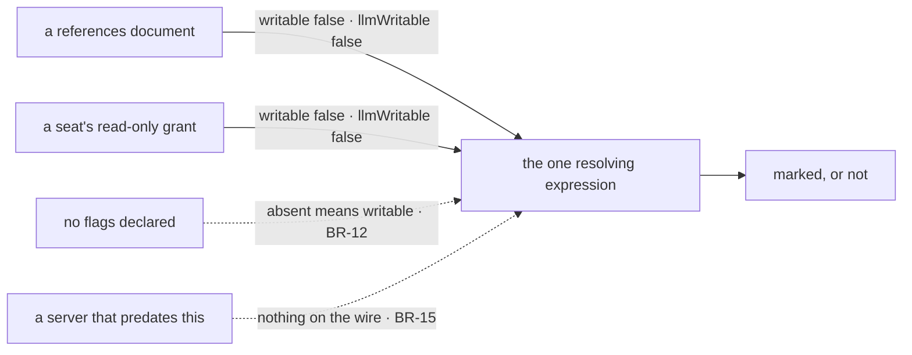

# FIX-1481 · Business rules

[Spec](SPEC.md) · [Decisions](DECISIONS.md) · **Rules** · [Plan](PLAN.md) · [Docs](DOCS.md)

The cases, written as rules. Each says what a person or the system does and what happens. The
*proved by* column is the check the plan runs. A human reviews this page; the plan turns it into
work. Row numbers are the epic's ER-Devtool checklist
([rows 4, 6 and 5](../../epics/FIX-1457/BUSINESS-RULES.md#er-devtool)).

## The reason on a task row · checklist row 4

| # | When | Then | Proved by |
|---|---|---|---|
| BR-1 | A task is parked with a reason | The reason is legible on the row itself, with no expander opened | CI · rendering check |
| BR-2 | A task is parked and no reason was given | The row shows an explicit nothing, not an empty cell that reads as "no reason exists" | CI |
| BR-3 | A task is parked with no reason **after** an earlier attempt wrote one | The earlier text is still on the row, because the park did not clear it. Known and named: the field is rendered as the row carries it, and the clearing is an orchestration defect filed as a follow-up, not papered over in the view | CI · asserted as the current behaviour so the fix flips this row |
| BR-4 | A task failed, was retried, and is back at `pending` carrying the failure text | It is shown. The column is what the row currently says about itself, not a parked-only field | CI |
| BR-5 | A task was unparked with a new reason | The new text replaces the old, because the unpark wrote it | CI |
| BR-6 | A reason is long, or contains markup, or is one unbroken token | It is still readable on the row, the table still looks like a table, and the full text is still in the expander. How that is achieved is the implementer's | CI · plus the VG sentence, which is the real bar |
| BR-7 | Any task row is opened in the JSON expander | Unchanged, byte for byte. The expander is still the complete view | CI |
| BR-8 | A board has no parked rows at all | The board renders as it does today. No empty column apologising for itself | CI |

The subtlety is BR-3 and BR-4 together. `feedback` is written by three verbs — the park, the
retry, and the unpark — so it is not a parked-only field, and a column that pretended otherwise
would suppress BR-4 and misreport BR-3. The rules say what each status actually carries.

## The read-only mark in the resources tree · checklist row 6

| # | When | Then | Proved by |
|---|---|---|---|
| BR-9 | A document is sealed on both doors (`writable: false`, `llmWritable: false`) | Marked read-only, visibly distinct from a writable neighbour at a glance | CI · goal check |
| BR-10 | A document came from a `references/` folder | Marked read-only — because of its flags, not its folder | CI |
| BR-11 | A seat holds a read-only grant on an ordinary mutable document | Marked read-only. Same mark, same reason, different producer | CI |
| BR-12 | A document declares neither flag | **Not** marked. Absent means writable, which is the framework's default | CI · the flag left out entirely, not set to `true` |
| BR-13 | A document is writable by code but closed to the model (`llmWritable: false`, `writable` unset) | Not marked read-only — it is not. The two flags are both present in the row's detail for a reader who needs the distinction | CI |
| BR-14 | A collection is sealed | The mark sits on the collection, whose config carries the flags. Its items are not marked one by one | CI |
| BR-15 | The DevTool is pointed at a server that predates this change and sends neither flag | No mark anywhere, and no error. Absent is absent, not false | CI · the second path (BP-035), run against a snapshot with the fields removed |
| BR-16 | The tree renders any document at all | The scope badge it shows today is unchanged and still present | CI |
| BR-17 | A reader asks what the mark means | It means the same thing the agent's own resource manifest means by "you may read" — the same two flags, resolved the same way | CI · one expression, asserted against the manifest's |

Four arrivals, one gate, and a line on the right that is the whole rule set: above it is marked,
below it is not. The two on the left of the gate are the two ways a document becomes sealed, and
they come out as one mark. The two below the line are BR-12 and BR-15. The mermaid is the same
four paths by name.

## What neither row may do

| # | When | Then | Proved by |
|---|---|---|---|
| BR-18 | Either row ships | `TaskStatus` has gained no value, and no *Waiting on you* status or column exists. *Waiting on you* stays a reading over parked-plus-reason ([ER-2](../../epics/FIX-1457/BUSINESS-RULES.md), [ER-8](../../epics/FIX-1457/BUSINESS-RULES.md)) | CI · asserted on the exported status union, so a later widening fails here |
| BR-19 | Either row ships | The debug surface's gate, origin allow-list and fail-closed default are unchanged, and no resource gained a `client` config to widen who can read it | CI · the existing debug-gate suite, unmodified |

## Failure taxonomy

Nothing is fatal and nothing retries. A missing reason degrades to an explicit nothing (BR-2);
missing flags degrade to no mark (BR-12, BR-15). The only outcome worse than silence is a wrong
mark, which is why absent is never read as closed and why the resolving expression has one
definition (BR-17).

## Acceptance criteria this issue owns

Against a DevTool showing a board with a parked row and a tree holding one sealed and one writable
document: a person who has not read this spec can say why the row is parked and which document an
agent may write, with no expander opened and no debug flag set beyond what `fsdev dev` already
sets. That is the goal check the plan runs last.

**Not owned here.** The org-level inventory row ([D2](DECISIONS.md#d2)) has no acceptance
criterion, deliberately. Nor does whether a seat reads as a seat, or whether channel membership
has a view — both unverified, both named in [SPEC.md](SPEC.md) → "What we still have not seen".
