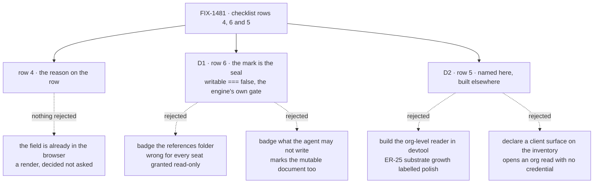

# FIX-1481 · Decisions

[Spec](SPEC.md) · **Decisions** · [Rules](BUSINESS-RULES.md) · [Plan](PLAN.md) · [Docs](DOCS.md)

What was considered, what was chosen, why, and what each choice locks in. Two decisions are the
sign-off surface; nothing is open. Everything else here is context for them. The issue covers
ER-Devtool checklist **rows 4, 6 and 5**
([epic rules](../../epics/FIX-1457/BUSINESS-RULES.md#er-devtool)), and uses the epic's numbering
throughout.

## The tree

Solid edges are what you're signing. Dashed edges lost, and the label says why.

## D1 · The read-only mark is the **seal** — `writable === false`, the one condition the engine itself refuses a write on. `llmWritable` travels beside it and is shown, but is not the mark

| | |
|---|---|
| **Instead of** | Marking anything loaded out of a `references/` folder; one resolved `readOnly` boolean from the server; or marking whatever the agent's resource manifest declines to offer a write tool for |
| **Because** | The seal has **two** producers and one meaning. A `references/` document is sealed by convention, a seat granted `ro` on an ordinary document is sealed by the grant, and both land on `writable: false` — which is exactly what `packages/engine/src/context/resource-registry.ts:936` and `:1977` throw `resource_read_only` on. A folder-derived badge is right about the first producer and silent about the second, and the silent one is the more dangerous: the reader is looking at something that *is* mutable for somebody else. `llmWritable` is a different question — whether the model is offered a write tool — and it is **opt-in**, so most ordinary mutable resources leave it unset. Badging on it would mark the mutable half of the very distinction this row exists to show |
| **Locks in** | Two permission fields on a wire shape every DevTool build then reads, and the mark tied to the runtime's write gate rather than to any one reader's policy. The tree's predicate is its own — `writable === false`, nothing shared with and nothing asserted equal to the agent-facing manifest. The cheap failure runs the other way: an absent `writable` means *writable*, and a reader that treats absent as closed marks a document anybody can edit |

**What would change my mind:** evidence that a seat-level `ro` grant is not something anybody
actually writes. Then the seal has one producer, the folder tells you everything, and a badge on
`references/` is strictly cheaper than widening a wire shape.

## D2 · Checklist row 5, the org-level inventory, is named in this spec and built elsewhere

| | |
|---|---|
| **Instead of** | Building an org-level inventory reader in the DevTool, or opening the non-debug door by declaring a client surface on the inventory collections |
| **Because** | Three things are missing and only one is DevTool's. **Nothing opens an inventory** — no application calls `openInventory`, so there are no rows for any door to serve. **The non-debug door cannot see them** — the manifest route skips every resource without a `client` config and the inventory collections declare none; adding one opens an org-scoped read on a session whose org is caller-supplied where no principal resolver is configured (`packages/engine/src/routes/session-routes.ts`), the BP-031 hole [FIX-1475](https://linear.app/fixpoint-labs/issue/FIX-1475) closed on the write side. **And no reader exists to inherit it** — building one here is the substrate growth [ER-25](../../epics/FIX-1457/BUSINESS-RULES.md) names, a read surface plus an authorization model arriving under the label *polish*, so it is raised up rather than answered locally ([ER-17](../../epics/FIX-1457/BUSINESS-RULES.md#er-17)) |
| **Locks in** | The checklist carries one unproven row until org identity reaches the listing surfaces and a reader ships. Whoever wants it green owns un-blocking it, and this issue will not have made that cheaper. Rows 4 and 6 are built so neither waits on any of it |

**The successor is [FIX-1502](https://linear.app/fixpoint-labs/issue/FIX-1502), blocked on
[FIX-1486](https://linear.app/fixpoint-labs/issue/FIX-1486)** — not
[FIX-1477](https://linear.app/fixpoint-labs/issue/FIX-1477). An earlier draft of this card said
FIX-1477 PR-C owned the reader, and that was wrong: **the two read different collections.**
FIX-1477's `Roster` reads the durable hired roster, `workforce/roster/*`
(`packages/workforce/src/roster/collections.ts`, shipped by FIX-1475, on `main`). Row 5 names the
live inventory, `inventory/seats/*` · `inventory/channels/*` · `inventory/members/*`
(`packages/workforce/src/inventory/collections.ts`). Different collections, different questions —
*which seats were hired and persisted* against *which seats and channels are open right now*. The
paths are cited so the next reader cannot re-merge them.

## Decided, not asked

- **Row 4 is a render, and the column's name is the implementer's.** `feedback` is already on the
  DevTool's own mirror of `Task`, so nothing new reaches the browser. The spec pins that the
  reason is legible without expanding the row; whether the header reads `Reason` is a word.
- **The reason shows for whatever status carries it, not only `parked`.** Three verbs write the
  field, and `fail` leaves it on a row that has gone back to `pending`. Hiding it there would
  suppress a true explanation to keep a column's name tidy.
- **The flags are added, not renamed** — the names the framework already uses (BP-034).
- **A server that sends neither flag gets no mark.** Absent is not false (BP-030).
- **The debug gate is untouched.** Making a field visible is not a reason to widen who can see
  the surface.

## Considered and dropped

| Alternative | Why not |
|---|---|
| A `references/` badge in the tree | Simpler, and wrong for every document a seat holds under a read-only grant — the ones a reader most needs to be right about |
| One resolved `readOnly` boolean on the wire | Cheapest wire shape, and it erases open-to-code / closed-to-the-model with no way back to it |
| The reason in the expander, pre-expanded for parked rows | Keeps the row narrow, and keeps the fact one interaction away, which is the bar the collaboration proof sets |
| Declare `client: { state: { read: true } }` on the inventory collections | Opens the non-debug door in one line, and with it an org-scoped read addressed by a caller-supplied org where no resolver is configured. A one-line change that reopens a closed hole is not cheap |
| Build the inventory reader here and let [FIX-1502](https://linear.app/fixpoint-labs/issue/FIX-1502) adopt it | Two readers for one fact, and this would be the weaker one — built before org identity reaches the listing surfaces, so scoped to whatever session happened to be open |
| Make the mark `!mayWrite`, reusing the agent manifest's predicate so the two cannot disagree | Sound reasoning, wrong result, and the run is why it is recorded rather than re-proposed. `llmWritable` is opt-in, so `!mayWrite` marks every ordinary mutable document — including the `resources/` document row 6 exists to distinguish from a reference. The two predicates answer different questions: *may the agent write* against *can this be written at all* |
| Fix `awaitReview` so a park with no reason clears the previous one | A real defect, and a behaviour change to a shipped orchestration API unrelated to the DevTool. Filed as a follow-up ([PLAN.md → Follow-ups](PLAN.md#follow-ups)) |

## Raised to the epic, not decided here — row 6 has no subject yet

Nothing in the repository declares a sealed document: no team declares one under `references/`,
and no worker holds a read-only grant. So row 6's mark will be proved by automated checks and will
have nothing to appear on when a person looks at the live hire.

This read like a fork — *does this issue add the missing document?* — and the epic has already
answered it. [ER-3](../../epics/FIX-1457/BUSINESS-RULES.md) was rewritten so the proof runs against
whatever live hire the DevForce path stands up, and no longer requires the reference app;
[ER-24](../../epics/FIX-1457/BUSINESS-RULES.md#er-24) forbids reaching into the reference app for
it. So the document comes from the hired tree the proof runs against, and this issue adds none.

What is left is a **dependency on the ER-DevForce producer**: the tree it hires from needs one
sealed document, or row 6 cannot be exercised live however correct the code is. Raised on the epic
per [ER-17](../../epics/FIX-1457/BUSINESS-RULES.md#er-17) rather than answered locally, and carried
in [PLAN.md → At implement time](PLAN.md#at-implement-time) so it is checked before the goal runs.

**Open: none.**

## How it got here

- **Draft** — framed as three checklist rows with three different causes rather than one DevTool
  gap; rows 4 and 6 built as independent deliverables; row 5 named and sequenced out, on evidence
  that its blocker is a credential question rather than an ordering one. The factual base was
  re-derived by running the real handlers before drafting, which is what turned "read-only is
  unrendered" into "the seal has two producers and neither reaches the browser".
