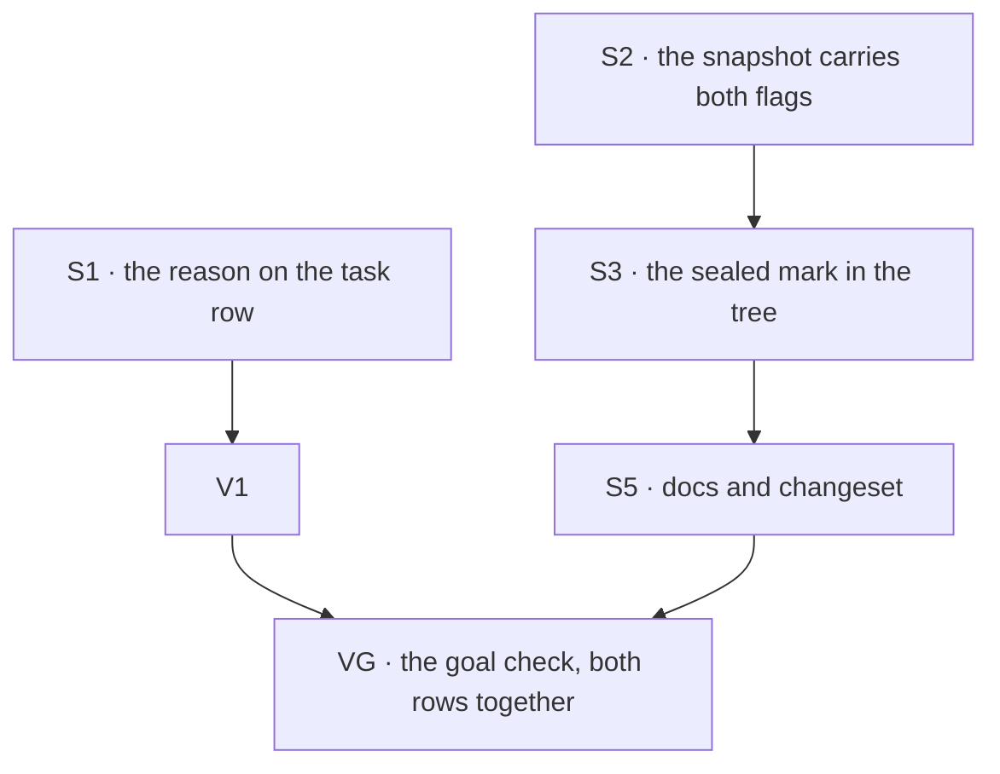

# FIX-1481 · Plan

[Spec](SPEC.md) · [Decisions](DECISIONS.md) · [Rules](BUSINESS-RULES.md) · **Plan** · [Docs](DOCS.md)

Written for the implementing agent. IDs cross-reference [BUSINESS-RULES.md](BUSINESS-RULES.md)
(BR-n) and [DECISIONS.md](DECISIONS.md) (D-n). `tdd`. Two PRs, and they are independent of each
other: the seam is that PR-A touches no wire shape and PR-B touches no task board.

## Surfaces

| ID | Package · role | Change | Rules |
|---|---|---|---|
| S1 | `devtool` · the task row in the board view | Render the reason the row already carries. The field is on DevTool's own `Task` mirror already, so nothing new crosses the wire. Show it for whatever status carries it, not only `parked` | BR-1 – BR-8 |
| S2 | `client` + `engine` · the debug resource entry and the snapshot that builds it | Carry the two permission flags. **Omit them when the config omits them** — a `false` written where the author wrote nothing is the one way to get BR-12 backwards | BR-12 BR-15 |
| S3 | `devtool` · the resources tree | One mark beside the existing scope badge, on `writable === false` and nothing else (D1). Both flags stay in the row's detail, so the model-gate question is answerable without the mark pretending to answer it | BR-9 – BR-14 BR-16 BR-17 |
| S5 | Docs | [DOCS.md](DOCS.md)'s operations, plus a `.changeset/*.md` naming **`@flow-state-dev/devtool`** and whichever of `client` / `engine` change shape. `patch` or `minor` only, pre-1.0 | — |

**Nothing is removed, and `packages/core` is not touched.** The expander, the scope badge, the
debug gate and its 403 path all stay (tenet 3 asks for the removals; the honest answer here is
none). The agent-facing manifest and its own write predicate are **not** in scope: the tree's mark
answers a different question and shares no code with it (D1).

## Sequence

### PR plan

| PR | Surfaces | depends_on | Why it is its own PR |
|---|---|---|---|
| PR-A | S1 | — | The whole of row 4, one package, no wire change. It ships the day it is written and is hostage to nothing |
| PR-B | S2 S3 S5 | — | Row 6 crosses `client`, `engine` and `devtool` and changes a wire shape, so it carries the public-boundary work (BP-004) and the second-path checks |

`VG` runs once both have merged: it is the acceptance criterion and needs both rows on screen.

## Checks

| ID | Runs after | Passes when |
|---|---|---|
| V1 | S1 | BR-1 – BR-8. BR-3 is asserted as **today's** behaviour, so the follow-up that fixes the stale reason flips this check rather than passing silently |
| V2 | S2 | The entry carries both flags when the config declares them and **carries neither key** when it does not (BR-12). Built from a real flow through the real snapshot, not a fixture |
| V3 | S3 | BR-9 – BR-14, BR-16, BR-17, over all four flag combinations. Both producers of the seal get the mark, asserted separately (BR-10, BR-11). **The case that must go red if the predicate drifts is BR-13** — a document closed to the model and open to code carries no mark |
| V5 | S3 | The second path (BP-035): a snapshot with both keys deleted renders no mark and throws nothing (BR-15) |
| V6 | S1 + S3 | BR-18, BR-19: the status union is unchanged and the existing debug-gate suite passes unmodified. The epic's two named kills, asserted rather than promised |
| VG | S1 + S5 | Goal, on the real path: `fsdev dev` against a flow with a parked task carrying a reason and a tree holding one sealed and one writable document. A person reading the screen can say why the row is parked and which document is writable, with no expander opened. `goals/devtool-workforce-visibility/the-checklist-rows/goal.md` |

**VG has one external dependency, and there is no fallback.** ER-3 requires a real hire — "never a
fixture, a mock or a hand-built harness standing in for one" — and ER-Devtool adds "no code
written only to make the inspection possible". A purpose-built flow for VG is exactly that code,
so an earlier draft's fallback was a violation of the rule the proof exists to satisfy, and it is
cut rather than softened.

**VG needs a live hired Workforce whose tree declares at least one sealed document** — a
`references/` file or a `ro:` grant. No tree in this repository has one, and this issue does not
add one ([DECISIONS.md](DECISIONS.md#the-subject)). The path that stands a real hire up is the
ER-DevForce producer, [FIX-1496](https://linear.app/fixpoint-labs/issue/FIX-1496). One dependency,
covering both rows.

**This does not block FIX-1481.** Both code PRs and every check above — V1, V2, V3, V5, V6 — run
and merge without it. Only the final checklist run waits.

## Pinned names

| Where | Name | Why pinned |
|---|---|---|
| The debug resource entry | `writable`, `llmWritable` | The names the framework already uses on the resource config. A third spelling for the same two facts is how a reader stops trusting either (BP-034) |

Everything else is yours, including the column's header, which the spec deliberately leaves open.

## Guardrails

| Rule | Because |
|---|---|
| An absent flag means writable; never coerce it to `false` in either direction (BP-030) | BR-12. A wrong mark is worse than no mark, and backwards puts a read-only badge on something anybody can edit |
| The mark reads `writable` and nothing else; it is never approximated from the model gate (D1) | `llmWritable` is opt-in, so a mark derived from it brands most of the tree read-only and stops distinguishing anything. BR-13 is the case that catches it |
| Every producer of the seal goes through the same field (tenet 5, D1) | A folder-derived mark is right about one producer and silent about the other, and the silent one is the more dangerous |
| The view renders what the row carries; it neither invents a reason nor suppresses one (tenet 1) | BR-3 and BR-4 are both cases where the true value is surprising. Smoothing either hides a real defect and makes the board lie |
| Do not widen the debug gate, its origin allow-list or its fail-closed default | BR-19. Making a field visible to whoever can already reach the surface is not a reason to change who can reach it |
| Do not add a `client` config to the inventory or reference collections to "just make row 5 work" | BP-031, and [D2](DECISIONS.md#d2) has the reasoning. One line, and a closed hole reopened |

## Docs

Reconcile and publish [DOCS.md](DOCS.md) with PR-B, after V3 and V5 pass. Its destination
operations own the changed prose; this plan only sequences publication. No new page.

## The POC

`poc/what-the-tree-can-say/` on this branch, cited from the spec PR. Run it with
`pnpm exec tsx specs/issues/FIX-1481/poc/what-the-tree-can-say/run.mts`.

It re-derived the spec's factual base through the real modules and handlers, with a control run on
each check. **Three results, and one changed the design.** Row 4's premise held. Row 6's premise
did *not* hold as stated — the seal has two producers, not one, which is where
[D1](DECISIONS.md#d1) came from. Row 5's premise was understated. The README has each with its
evidence; the spec does not restate them.

**It asserts nothing about the view, on purpose.** An earlier draft checked the row's seven column
headers and the absence of `feedback` in the rendering module — assertions built to go red the
moment `V1` passes. Retained checks have a lifecycle rule and [FIX-817's
`V7`](../FIX-817/PLAN.md) is the precedent: a totality check earns retention when its expectation
can be *updated* and still assert something. "Seven columns" updates to "eight columns", which is
what `V1` already checks, so keeping it duplicates CI inside a spec artifact. The two survivors —
the `feedback` writer set and the stale-park behaviour — do not move when a view changes, so they
stay and remain the executable guard under BR-3, BR-4 and BR-18. The dropped facts are `file:line`
cites in the README.

## At implement time

- **Has [FIX-1502](https://linear.app/fixpoint-labs/issue/FIX-1502) landed?** It is row 5's
  successor and is blocked on [FIX-1486](https://linear.app/fixpoint-labs/issue/FIX-1486). Do not
  start row 5 here regardless, and do not fold its scope into these PRs.
- **Is the `ro`-grant seal still `writable: false`?** `seat-resources.ts` mints it in one place.
  If that moved or gained a third gate, S3's predicate and V3's second case move with it.
- **Has the engine's write gate moved?** The mark's predicate is the one at
  `resource-registry.ts:936` and `:1977`. If that changed, follow it — the mark tracks what the
  runtime refuses, not what any reader's policy says.

## Follow-ups

- **A park with no reason does not clear an earlier one.** `awaitReview` writes `feedback` only
  when given one, so a row parked after a failed attempt shows the failure text as if it were the
  park's reason. A real defect, in orchestration rather than the DevTool, and a behaviour change
  to a shipped API. File it; BR-3 is written so the fix flips a check.
- **Row 5's successor is [FIX-1502](https://linear.app/fixpoint-labs/issue/FIX-1502), blocked on
  [FIX-1486](https://linear.app/fixpoint-labs/issue/FIX-1486)** — org identity reaching the flow
  and session listing surfaces. That is what row 5 waits on; see [D2](DECISIONS.md#d2) for why it
  is not FIX-1477.
- **Channel membership has no DevTool view at all.** Named in the issue, unverified against a live
  hire. If a live look confirms it matters, it wants its own row, not a widening of this one.
