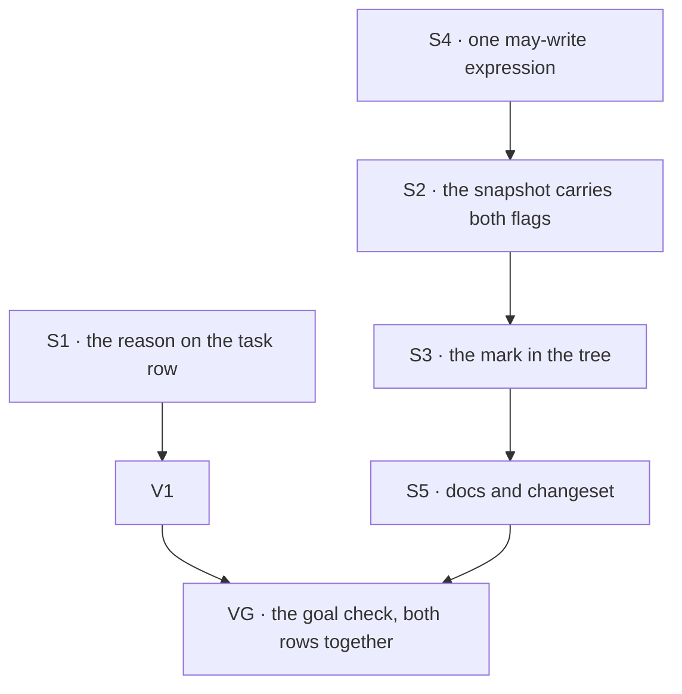

# FIX-1481 · Plan

[Spec](SPEC.md) · [Decisions](DECISIONS.md) · [Rules](BUSINESS-RULES.md) · **Plan** · [Docs](DOCS.md)

Written for the implementing agent. IDs cross-reference [BUSINESS-RULES.md](BUSINESS-RULES.md)
(BR-n) and [DECISIONS.md](DECISIONS.md) (D-n). `tdd`. Two PRs, and they are independent of each
other: the seam is that PR-A touches no wire shape and PR-B touches no task board.

## Surfaces

| ID | Package · role | Change | Rules |
|---|---|---|---|
| S1 | `devtool` · the task row in the board view | Render the reason the row already carries. The field is on DevTool's own `Task` mirror already, so nothing new crosses the wire. Show it for whatever status carries it, not only `parked` | BR-1 – BR-8 |
| S2 | `client` + `engine` · the debug resource entry and the snapshot that builds it | Carry the two permission flags. **Omit them when the config omits them** — a `false` written where the author wrote nothing is the one way to get BR-12 backwards | BR-12 BR-15 |
| S3 | `devtool` · the resources tree | One mark beside the existing scope badge, from the resolved pair. The raw pair stays in the row's detail for the half-open case | BR-9 – BR-14 BR-16 |
| S4 | `core` · one exported `mayWrite` helper | Lift the predicate currently inline in `manifest/resources-source.ts` → `contractOf` into one exported helper, and have both `contractOf` and the tree call it. **Not a fork:** `@flow-state-dev/devtool` already depends on `@flow-state-dev/core`, so this needs no new dependency and crosses no package boundary. Build it first — it is what makes D1 one definition rather than two | BR-17 |
| S5 | Docs | [DOCS.md](DOCS.md)'s operations, plus one `patch` changeset for `client` and `engine`. `devtool` ships pre-built assets; check whether it needs one | — |

**Nothing is removed.** The expander, the scope badge, the debug gate and its 403 path all stay
(tenet 3 asks for the removals; the honest answer here is none, and adding beside an existing
surface rather than replacing it is the point).

## Sequence

### PR plan

| PR | Surfaces | depends_on | Why it is its own PR |
|---|---|---|---|
| PR-A | S1 | — | The whole of row 4, one package, no wire change. It ships the day it is written and is hostage to nothing |
| PR-B | S4 S2 S3 S5 | — | Row 6 crosses three packages and changes a wire shape, so it carries the public-boundary work (BP-004) and the second-path checks |

`VG` runs once both have merged: it is the acceptance criterion and needs both rows on screen.

## Checks

| ID | Runs after | Passes when |
|---|---|---|
| V1 | S1 | BR-1 – BR-8. BR-3 is asserted as **today's** behaviour, so the follow-up that fixes the stale reason flips this check rather than passing silently |
| V2 | S2 | The entry carries both flags when the config declares them and **carries neither key** when it does not (BR-12). Built from a real flow through the real snapshot, not a fixture |
| V3 | S3 | BR-9 – BR-14, BR-16. Both producers of the seal — a `references/` document and a seat's `ro` grant — get the mark, asserted separately (BR-10, BR-11) |
| V4 | S4 | BR-17: `mayWrite` is the only definition, exercised across all four flag combinations, and `contractOf` is one of its callers rather than a second copy |
| V5 | S3 | The second path (BP-035): a snapshot with both keys deleted renders no mark and throws nothing (BR-15) |
| V6 | S1 + S3 | BR-18, BR-19: the status union is unchanged and the existing debug-gate suite passes unmodified. The epic's two named kills, asserted rather than promised |
| VG | S1 + S5 | Goal, on the real path: `fsdev dev` against a flow with a parked task carrying a reason and a tree holding one sealed and one writable document. A person reading the screen can say why the row is parked and which document is writable, with no expander opened. `goals/devtool-workforce-visibility/the-checklist-rows/goal.md` |

**VG's subject may not exist yet.** Nothing in the repository declares a sealed document, and this
issue does not add one ([DECISIONS.md → row 6 has no subject yet](DECISIONS.md#the-subject)). VG
therefore runs against a flow built for the goal unless the live hire the proof uses supplies one
— and says which it was, rather than implying the row was exercised live when it was not.

## Pinned names

| Where | Name | Why pinned |
|---|---|---|
| The debug resource entry | `writable`, `llmWritable` | The names the framework already uses on the resource config. A third spelling for the same two facts is how a reader stops trusting either (BP-034) |

Everything else is yours, including the column's header, which the spec deliberately leaves open.

## Guardrails

| Rule | Because |
|---|---|
| An absent flag means writable; never coerce it to `false` in either direction (BP-030) | BR-12. A wrong mark is worse than no mark, and backwards puts a read-only badge on something anybody can edit |
| `mayWrite` has one definition and both readers call it (tenet 5, D1) | The day two copies disagree, the DevTool tells a developer something different from what the agent was told about the same document |
| Every producer of the seal goes through the same pair (tenet 5, D1) | A folder-derived mark is right about one producer and silent about the other, and the silent one is the more dangerous |
| The view renders what the row carries; it neither invents a reason nor suppresses one (tenet 1) | BR-3 and BR-4 are both cases where the true value is surprising. Smoothing either hides a real defect and makes the board lie |
| Do not widen the debug gate, its origin allow-list or its fail-closed default | BR-19. Making a field visible to whoever can already reach the surface is not a reason to change who can reach it |
| Do not add a `client` config to the inventory or reference collections to "just make row 5 work" | BP-031, and [D2](DECISIONS.md#d2) has the reasoning. One line, and a closed hole reopened |

## Docs

Reconcile and publish [DOCS.md](DOCS.md) with PR-B, after V3 and V5 pass. Its destination
operations own the changed prose; this plan only sequences publication. No new page.

## The POC

`poc/what-the-tree-can-say/` on this branch, cited from the spec PR. Run it with
`pnpm exec tsx specs/issues/FIX-1481/poc/what-the-tree-can-say/run.mts`.

It re-derived the spec's factual base through the real modules and handlers, with a control run on
each check. **Three results, and one changed the design.** Row 4's premise held. Row 6's premise
did *not* hold as stated — the seal has two producers, not one, which is where
[D1](DECISIONS.md#d1) came from. Row 5's premise was understated. The README has each with its
evidence; the spec does not restate them.

**It asserts nothing about the view, on purpose.** An earlier draft checked the row's seven column
headers and the absence of `feedback` in the rendering module — assertions built to go red the
moment `V1` passes. Retained checks have a lifecycle rule and [FIX-817's
`V7`](../FIX-817/PLAN.md) is the precedent: a totality check earns retention when its expectation
can be *updated* and still assert something. "Seven columns" updates to "eight columns", which is
what `V1` already checks, so keeping it duplicates CI inside a spec artifact. The two survivors —
the `feedback` writer set and the stale-park behaviour — do not move when a view changes, so they
stay and remain the executable guard under BR-3, BR-4 and BR-18. The dropped facts are `file:line`
cites in the README.

## At implement time

- **Has [FIX-1477](https://linear.app/fixpoint-labs/issue/FIX-1477) PR-C landed?** If its reader
  now exists, [D2](DECISIONS.md#d2)'s deferral has a successor to point at. Do not start row 5
  here regardless.
- **Is the `ro`-grant seal still two fields?** `seat-resources.ts` mints it in one place. If that
  became a helper or a third flag, S4's expression and V3's second case move with it.
- **Does the resource manifest still resolve may-write as it does today?** S4 is written against
  that expression; if it moved, follow it rather than forking from it.
- **Does the hired tree the proof runs against declare a sealed document?** If not, VG has nothing
  to show a person for row 6. It is the ER-DevForce producer's tree to supply, raised on the epic
  rather than fixed here ([DECISIONS.md](DECISIONS.md#the-subject)) — check before running VG.

## Follow-ups

- **A park with no reason does not clear an earlier one.** `awaitReview` writes `feedback` only
  when given one, so a row parked after a failed attempt shows the failure text as if it were the
  park's reason. A real defect, in orchestration rather than the DevTool, and a behaviour change
  to a shipped API. File it; BR-3 is written so the fix flips a check.
- **Row 5 waits on a credential question, not on a schedule.** FIX-1477's plan records `Roster` as
  unbuildable until somebody decides whether the reading surface carries its own principal
  resolver. That fork is what row 5 is actually blocked on.
- **Channel membership has no DevTool view at all.** Named in the issue, unverified against a live
  hire. If a live look confirms it matters, it wants its own row, not a widening of this one.
