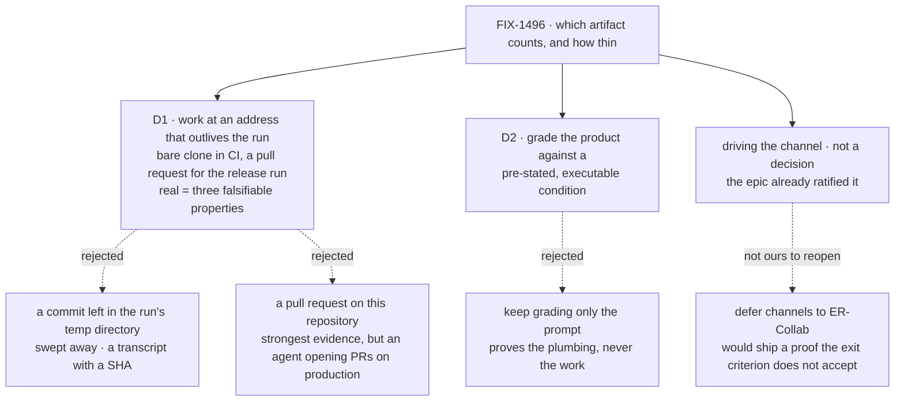

# FIX-1496 · Decisions

[Spec](SPEC.md) · **Decisions** · [Rules](BUSINESS-RULES.md) · [Plan](PLAN.md) · [Docs](DOCS.md)

What was considered, what was chosen, why, and what each locks in. **Two** decisions are the
sign-off surface; everything else here is context for them.

## The tree

Solid edges are what you are signing. Dashed edges lost, and the label says why. The third node
is **not** a fork: driving the channel is the epic's wording, recorded under
[Decided, not asked](#decided-not-asked).

## D1 · The artifact is work left at an address that outlives the run — a pushed bare clone on the one automated leg, a pull request for the release run — and "real" is three falsifiable properties rather than a judgement call

| | |
|---|---|
| **Instead of** | Leaving the commit in the run's own temporary directory, as today; or opening the pull request against `flow-state-dev` itself |
| **Because** | ER-DevForce contrasts a real artifact with *a transcript*. What makes something more than a transcript is that it is still there, at an address, once the run is over — so the automated leg pushes to a **bare clone at a declared path** rather than leaving a commit in a directory the machine will sweep. The release run points that same path at a real remote and opens a pull request, because a title, a body and a diff a person accepts or rejects is what the launch claim is actually about |
| **Locks in** | The **release** run costs a credential, a network call and a throwaway repository, once — CI costs none of them, which is what the one-leg trim bought. And we have committed to a definition of *real work* that the next Lab proof has to keep meeting: a later artifact that cannot satisfy the three properties does not get to call itself real by analogy |

**The three properties, each with its falsifier.** This is what makes *"would a person accept
this as real work?"* checkable instead of a matter of taste:

| Property | Falsified by |
|---|---|
| **It outlives the run at an address a third party resolves** | The goal's process has exited and its temporary directories are gone; fetching the address returns nothing |
| **The Lab did not author it** | Any graded token of the artifact's content is also found in the lab's own code, its fixtures, or the prompt — the held-out discipline, inverted onto the product |
| **It satisfies a condition the requester stated before the run, executed** | The condition is run in the produced tree and does not pass; or the condition would have passed before the run, which makes it no evidence at all |

**What would change my mind — and half of it already has.** The original card said that if
*"exists outside the run"* means outside the **process** rather than outside the **machine**,
then a bare repository at a declared path is cheaper and needs no credential. Review round 1
took exactly that for the automated leg, which is why CI now needs no token: the cheap reading
won everywhere it could.

What is still open is the other half: **whether the release proof also settles for the bare
clone.** If the owner reads a durable local address as enough evidence for a launch claim, the
pull-request leg drops entirely and this decision reduces to the three properties with no remote
at all. I would not recommend it — a person outside the run cannot open a path on somebody's
disk, and that is the audience the whole proof exists for — but it is a one-line change to make,
and nothing is built against it.

## D2 · The proof grades what the run produced, against an acceptance condition the brief states first and a machine executes

| | |
|---|---|
| **Instead of** | Keeping the existing rule that only the prompt is graded and the product never is |
| **Because** | The existing rule is right about what it guards — a model writes a plausible file without reading anything, so the file is no evidence a document was *read*. But ER-DevForce asks for a **work product**, and nothing that refuses to look at the product can prove one. The way out is not to grade the file's contents by eye; it is to grade it against a condition the *requester* wrote down before the run and a machine can execute |
| **Locks in** | The feature brief stops being flavour text and becomes a contract. Every future DevForce brief owes an executable done-condition **naming the behaviour it wants**, and a Lab task that cannot state one cannot be proved this way — which is a real limit on what this proof shape can cover |

Both gradings stay, because they answer different questions. *Did the seat's own files reach the
run?* is the prompt's job and is unchanged. *Did the run produce work someone asked for?* is the
condition's job and is new.

**The condition has to be specific, independent and unreachable, or it proves nothing.** Three
properties, each learned from a way the weak version fails:

- **Specific.** *"The repository's tests pass"* is satisfied by any unrelated passing test, and
  by a vacuous test sitting beside a broken `greet`. The condition names the module path, the
  function, and the behaviour for both a non-empty and an empty name.
- **Independent.** It is the requester's check, not the run's. A run that writes its own test and
  passes it has graded its own homework.
- **Unreachable from the run.** It is applied from outside the checkout, after the run, so the
  agent cannot edit, delete or satisfy it by rewriting it.

Without all three, `ignores-the-brief` ([BR-4](BUSINESS-RULES.md), V5) — the control whose whole
job is proving irrelevant work gets rejected — **cannot fail**, and a control that cannot fail is
decoration. The base-ref half still holds and still matters: the same check run against the base
ref fails because `src/greeting.js` does not exist there.

## Decided, not asked

- **The row is filed in answer to a post on the feature channel, not by
  calling the EM seat's action directly — and this is not a fork.**
  [ER-DevForce](../../epics/FIX-1457/BUSINESS-RULES.md#er-devforce) is worded *"One DevForce path
  completes and produces a real artifact … **with seats and channels used honestly rather than
  stubbed past**,"* and the epic's [people table and set table](../../epics/FIX-1457/SPEC.md)
  repeat the phrase twice more. Channels are inside the ratified exit criterion, not an
  embellishment on it, so deferring them would ship a proof that does not prove what the
  criterion says. Today the channel is a Markdown file the loader walks and nothing opens —
  honest by the letter, empty in fact — and the post-reaches-a-seat path is already proven in two
  sibling labs on the same primitive, so closing it costs composition, not invention. **Not ours
  to reopen locally** ([ER-17](../../epics/FIX-1457/BUSINESS-RULES.md#er-17)).
  **Sequencing, not a fork:** ER-Collab's producer **exists** —
  [FIX-1497](https://linear.app/fixpoint-labs/issue/FIX-1497), Backlog and not started when this
  was written; **Done since 2026-09-22** ([#2065](https://github.com/fixpoint-labs/flow-state-dev/pull/2065)).
  If it lands the channel leg first, this proof **reuses** it rather than re-building it. *(When
  this was written the merged epic spec still recorded ER-Collab and ER-DevForce as having **no
  producer**. The epic amendment [#2033](https://github.com/fixpoint-labs/flow-state-dev/pull/2033)
  named both producers; current status is in the epic's set table.)*
- **One automated gate, not two.** The temp-repository leg is the **only** leg CI runs; the
  credentialed pull-request leg is documented and named in the verdict as the **human release
  run**. That keeps [BR-14](BUSINESS-RULES.md) and [BR-15](BUSINESS-RULES.md) honest — the claim
  a run makes is still tied to the leg it ran — without carrying two lab code paths forever.

- **This is a delta on `goals/devforce-lab/`, not a new Lab tree.** Roughly four fifths of the
  path is built and passing; the issue's own fence says compose
  ([ER-11](../../epics/FIX-1457/BUSINESS-RULES.md), [ER-25](../../epics/FIX-1457/BUSINESS-RULES.md)).
- **The new proof is a third sibling goal**, not an edit to either existing check. They carry
  claims and verdict logs that are still true; rewriting one to mean something else would
  invalidate evidence for no gain.
- **The board stays declared in code.** Moving it onto the channel's `boards:` frontmatter would
  mint a second board and change which one the cross-flow claim gate compares against. The
  interim tax is already labelled as one; paying it for one more proof is cheaper than the risk.
- **No package under `packages/` changes.** Everything the proof needs — the channel primitives,
  the harness manager, the `gh` completion probe — already ships.
- **Stores go on disk for the new proof only.** ER-3 asks for durable across the run; the
  model-free gate is a contract check and has no such requirement.
- **Running the never-run commit sibling is not this issue.** It is good hygiene and it is over
  the *thinnest path, then stop* fence, so it is filed separately
  ([FIX-1501](https://linear.app/fixpoint-labs/issue/FIX-1501), related, not blocking) rather
  than carried here.

## Considered and dropped

| Alternative | Why not |
|---|---|
| **A commit in a durable local bare repository** | Cheapest, needs no credential — and fails the first property. An artifact only the producing machine can reach is the same defect as the temp directory, arriving more slowly |
| **A pull request against `flow-state-dev` itself** | The strongest possible evidence: a human would merge it or not. Also an agent opening pull requests on the production repository, on a schedule nobody asked for, and a proof whose runtime includes a human review round |
| **Extend `it-commits-from-the-seats-own-file` instead of adding a sibling** | Thinner by one file, and it rewrites a check whose stated claim is deliberately *a commit, not a pull request*. Its verdict log would then describe a check that no longer exists |
| **Grade the artifact by reading its contents for tokens** | The failure the existing goal exists to refuse. A model that never read the brief can still emit a token it was told to emit |
| **Move the board onto the channel's `boards:` declaration** | Removes the interim tax and is the authored shape FIX-1385 settled — and changes the board the hand-off gates against. A substrate-shaped change wearing a polish label is exactly [ER-25](../../epics/FIX-1457/BUSINESS-RULES.md) |
| **Wait for [FIX-1440](https://linear.app/fixpoint-labs/issue/FIX-1440) to land first** | Checked, not assumed: the lab reads dispatch parentage only as provenance, which FIX-1440's own owner amendment keeps, and reads nothing from the browsable child-session surface it removes. Re-derived by `poc/gap-check/`, green on 2026-09-22 and deleted at S8 |

## Settled

- **FIX-1440 does not fence this work** — re-derived by
  `poc/gap-check/` (green 2026-09-22, deleted at S8), claim 5: nothing under `goals/devforce-lab/`
  reads the browsable child-session surface FIX-1440 removes, and the one parentage read is the
  provenance form the owner amendment explicitly retains. FIX-1440 is `Spec Approved`, not
  shipped; that remains true and remains irrelevant here.
  **The conclusion is unchanged; the evidence behind it was not sound until review round 1.** The
  original pattern spelled `childSessions` with a lower-case c and so could not match
  `listChildSessions`, the canonical client method and the exact call the claim was about — the
  check could not have caught the case it was asked to check. Found by reproduction. The pattern
  now covers the canonical name, the case is a planted control, and the re-run is green. Anyone
  who took this as verified before 2026-09-22 was taking it on a check that could not fail.
- **The gap table is four rows, not more** — re-derivable by running
  `poc/gap-check/` before its S8 deletion, which asserted all twelve facts the spec rested on,
  including a totality assertion over every TypeScript file in the lab. Dated runs and the
  planted red states lived in its README, which the S8 deletion took with it (PLAN.md → the sunset rule).

## How it got here

- **Draft** — framed as *the proof is written and has never been run*, after finding
  `it-commits-from-the-seats-own-file` complete, type-checked and logged `NOT RUN`; the approach
  is a four-gap delta on the existing lab rather than a new DevForce path, and the artifact
  question the Architect left open is answered as a pull request with three falsifiable
  properties.
- **Review round 1** — scope trimmed, direction unchanged. The channel leg stopped being a
  sign-off decision and became a recorded constraint, because the epic's ratified ER-DevForce
  wording already carries it. The two artifact legs collapsed to **one automated gate** plus a
  documented human release run. Running the neighbouring commit check left the plan for
  [FIX-1501](https://linear.app/fixpoint-labs/issue/FIX-1501).
